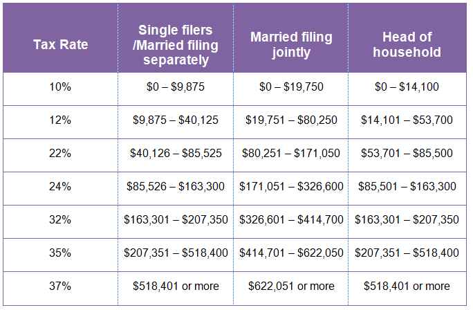

## Table of Contents

## What is Forex trading and how does it work?

Forex trading, short for foreign exchange trading, is the buying and selling of different currencies on the global market. It's like a big marketplace where people, banks, and businesses trade one currency for another. The goal is often to make a profit from the changes in the value of one currency compared to another. For example, if you think the US dollar will get stronger against the Euro, you might buy dollars with Euros, and then sell the dollars later for more Euros if the exchange rate changes in your favor.

The forex market works 24 hours a day, five days a week, because there's always some part of the world where banks and markets are open. This means you can trade at any time during the week. The prices of currencies are always moving, affected by things like news, economic reports, and even big events like elections. Traders use special platforms to see these price changes and make their trades. They can also use tools like charts and indicators to help them decide when to buy or sell. It's important for traders to understand these factors and manage their risks carefully, because the forex market can be unpredictable and losses can happen.

## Why is Forex trading taxed?

Forex trading is taxed because it's a way for people to make money, and governments want to collect some of that money as tax. When you make a profit from trading currencies, it's seen as income, just like money you earn from a job. So, you have to pay taxes on those profits. The exact amount of tax you pay can depend on where you live and how much you earn from trading.

Different countries have different rules about how to tax forex trading. Some places treat it like regular income, while others might see it as a capital gain, which can be taxed differently. It's important for traders to know the tax laws in their country so they can report their earnings correctly and pay the right amount of tax. If they don't, they could get in trouble with the tax authorities.

## What types of taxes apply to Forex trading profits?

When you make money from Forex trading, you might have to pay two main types of taxes: income tax and capital gains tax. Income tax is what you pay on the money you earn, like from a job. If you're trading a lot and making a good profit, the government might see that as your job, so you'd pay income tax on those profits. The amount you pay depends on how much you earn and the tax rules in your country.

Capital gains tax is another type of tax you might have to pay. This one is for the profit you make when you sell something for more than you paid for it. In Forex trading, if you buy a currency and then sell it for more, that extra money is a capital gain. Some countries treat Forex profits as capital gains and tax them at a different rate than regular income. It's important to know which type of tax applies to you so you can pay the right amount and not get in trouble with the tax people.

In some places, there might be other taxes or fees, like transaction taxes on each trade you make. It all depends on the country's tax laws. Always check with a tax professional or look up the tax rules in your country to make sure you're doing everything right.

## How are Forex trading gains classified for tax purposes?

Forex trading gains are usually classified as either income or capital gains for tax purposes. If you trade a lot and make a lot of money from it, the tax people might see it as your job. So, the money you make from Forex trading would be treated like your salary, and you would pay income tax on it. The amount of tax you pay depends on how much you earn and the tax rules where you live.

On the other hand, if you don't trade as often and you hold onto currencies for a while before selling them, your profits might be seen as capital gains. This means you bought something and sold it for more money later. Some countries tax capital gains differently than regular income, sometimes at a lower rate. It's important to know which type applies to you because it affects how much tax you have to pay.

In some places, there might be other taxes or fees too, like a small tax on each trade you make. It all depends on the country's tax laws. Always check with a tax professional or look up the tax rules in your country to make sure you're doing everything right and not getting in trouble with the tax people.

## What is the difference between short-term and long-term capital gains in Forex trading?

In Forex trading, short-term capital gains are profits you make from trades that you hold for a short time, usually less than a year. If you buy a currency and then sell it quickly for a profit, that's a short-term gain. Many countries tax these gains at the same rate as your regular income, which can be higher than the tax on long-term gains. This is because the government sees short-term trading as more like a job.

Long-term capital gains are profits from trades you hold for a longer time, often more than a year. If you buy a currency and keep it for a while before selling it at a profit, that's a long-term gain. Some countries give you a break on taxes for long-term gains, charging a lower rate than for short-term gains. This is to encourage people to invest for the long term. But remember, the exact rules can be different depending on where you live, so it's good to check with a tax expert or look up the tax laws in your country.

## How do I report Forex trading income on my tax return?

To report Forex trading income on your tax return, you need to keep good records of all your trades. Write down when you bought and sold currencies, how much you spent, and how much you made. This will help you figure out if you made a profit or a loss. If you made money, you need to report it on your tax return. Depending on where you live, you might report it as income or as capital gains. You can usually find a section on your tax form for reporting this kind of income.

Once you know if your Forex trading gains are income or capital gains, fill out the right part of your tax return. If it's income, you'll add it to your total earnings for the year. If it's a capital gain, you might need to fill out a special section of the form that asks about buying and selling assets. Make sure to follow the instructions on your tax form carefully. If you're not sure how to do it, you can ask a tax professional for help. They can make sure you're doing everything right and not missing anything important.

## What are the tax implications of trading Forex through different types of accounts (e.g., individual, joint, IRA)?

When you trade Forex through an individual account, you report the profits as your own income or capital gains on your personal tax return. If you make money, you have to pay taxes on it, just like you would with a job. The tax rate depends on whether your gains are short-term or long-term, and the rules in your country. If you lose money, you might be able to use those losses to reduce your taxes. It's important to keep good records of all your trades so you can report everything correctly.

Trading Forex through a joint account means you and the other person share the profits and losses. You'll need to figure out how to split the income or gains for tax purposes. Usually, you report your share on your own tax return. If you use a joint account with your spouse, you might be able to file a joint tax return, which can sometimes help with taxes. Always check the tax laws in your country to make sure you're doing it right.

Using an Individual Retirement Account (IRA) to trade Forex can have different tax implications. If it's a traditional IRA, you won't pay taxes on the profits right away, but you will when you take the money out later. If it's a Roth IRA, you've already paid taxes on the money you put in, so you won't owe taxes on the profits when you withdraw them, as long as you follow the rules. Remember, there are special rules about what you can do with an IRA, so make sure you understand them before you start trading Forex in one.

## Can Forex trading losses be used to offset other income, and if so, how?

Yes, you can use Forex trading losses to help lower your taxes on other income, but there are rules you need to follow. If you lose money trading Forex, you can use those losses to reduce your taxable income. This means you might pay less tax on the money you earn from your job or other investments. But you have to be careful to report everything correctly on your tax return. You can't just use any loss; it has to be a real loss from trading, and you need to keep good records to prove it.

The way you use Forex losses to offset other income can depend on whether your losses are from short-term or long-term trades. If your losses are from short-term trades, you can usually use them to reduce your regular income for the year. This can be really helpful because it might lower the amount of tax you owe. If your losses are from long-term trades, you might use them to offset long-term capital gains first, and if there's anything left over, you can use it to reduce your regular income. Always check with a tax professional or look up the tax laws in your country to make sure you're doing everything right.

## What are the tax considerations for Forex traders operating as a business versus a hobby?

If you trade Forex as a business, the tax rules are different than if you do it as a hobby. When it's a business, you can deduct a lot of expenses from your taxes. This means you can subtract things like the cost of trading software, internet bills, and even part of your home if you use it as an office. All these deductions can lower the amount of tax you have to pay on your trading profits. But to be treated as a business, you need to show that you're trying to make a profit and that you're doing it regularly. If the tax people think you're not really trying to make money, they might say you're just doing it as a hobby.

If Forex trading is seen as a hobby, you can't deduct as many expenses. You might only be able to deduct losses up to the amount of money you made from trading. This means if you lost $1,000 but only made $500, you can only deduct $500 from your taxes. Also, you have to report any money you make from your hobby as income, but you can't take as many deductions as you could if it were a business. It's important to keep good records and maybe talk to a tax professional to make sure you're doing everything right, because the rules can be tricky.

## How do international tax laws affect Forex traders who trade across different countries?

When you trade Forex across different countries, you have to think about the tax laws in each place. If you live in one country but trade in another, you might have to pay taxes in both places. This is called double taxation, and it can be a big problem. Some countries have special agreements called tax treaties that help avoid this. These treaties can lower the amount of tax you have to pay or make sure you only pay in one country. It's important to know about these treaties and how they work so you don't pay more tax than you need to.

Also, different countries have different rules about what counts as income or capital gains from Forex trading. For example, one country might see your profits as regular income and tax them at a high rate, while another might see them as capital gains and tax them at a lower rate. You need to keep good records of all your trades and know the tax laws in each country where you're trading. Talking to a tax expert who knows about international tax laws can really help. They can make sure you're following all the rules and paying the right amount of tax.

## What are the tax implications of using leverage and margin in Forex trading?

When you use leverage and margin in Forex trading, you're borrowing money to make bigger trades. This can help you make more money if things go well, but it can also make your losses bigger if things go badly. The tax people look at the profits you make from these trades the same way they look at profits from any other trades. If you make money, you have to pay taxes on it. The amount of tax you pay depends on whether your gains are short-term or long-term, and the tax rules in your country. If you lose money, you might be able to use those losses to lower your taxes on other income.

Using leverage and margin doesn't change the basic tax rules, but it can make your tax situation more complicated. You need to keep good records of all your trades, including how much you borrowed and how much you made or lost. If you're not careful, you might end up paying more tax than you need to, or you might miss out on deductions you could take. It's a good idea to talk to a tax professional who knows about Forex trading and can help you figure out how to report everything correctly on your tax return.

## How can Forex traders optimize their tax strategies to minimize their tax liability?

Forex traders can minimize their tax liability by keeping good records of all their trades. This means writing down when they bought and sold currencies, how much they spent, and how much they made. By doing this, they can accurately report their profits and losses on their tax return. If they make a loss, they might be able to use it to lower the tax they owe on other income. It's also important for traders to know if their trading is seen as a business or a hobby by the tax people. If it's a business, they can deduct more expenses like trading software, internet costs, and even part of their home if they use it as an office.

Another way to optimize tax strategies is to understand the difference between short-term and long-term capital gains. Short-term gains are usually taxed at a higher rate than long-term gains. So, if traders hold onto their trades for more than a year, they might pay less tax on their profits. Also, if they trade across different countries, they should learn about tax treaties that can help them avoid paying taxes twice. Talking to a tax professional can really help. They can explain the tax laws in different countries and help traders set up a plan to pay the least amount of tax possible while still following the rules.

## What are the Basics of Forex Trading Taxes?

Forex trading gains and losses are subject to specific tax treatments that vary based on the trade's nature and the account where the trading occurs. In the United States, individual forex traders must navigate the complexities of tax reporting to ensure compliance.

Primarily, annual gains and losses from [forex](/wiki/forex-system) trading can be reported on Schedule D of the IRS Form 1040. This form is typically used for reporting capital gains and losses, especially when trading activities resemble investments rather than a business enterprise.

Traders must understand the distinction between IRC Section 1256 contracts and IRC Section 988 contracts to determine their appropriate tax obligations.

**IRC Section 1256 Contracts:**
Section 1256 primarily applies to certain types of futures contracts and options on futures. It provides a 60/40 tax treatment, dividing gains or losses such that 60% are treated as long-term capital gains and 40% as short-term capital gains. This division can offer favorable tax benefits, particularly since long-term capital gains often incur a lower tax rate than short-term capital gains or ordinary income. The applicable tax formula:

$$
\text{Tax Liability} = 0.6 \times \text{Gains} \times \text{Long-term Rate} + 0.4 \times \text{Gains} \times \text{Short-term Rate}
$$

**IRC Section 988 Contracts:**
Section 988 governs the taxation of foreign currency transactions that are not explicitly covered by Section 1256. It treats gains and losses as ordinary income, which generally does not benefit from the reduced tax rates applicable to capital gains. This treatment influences how forex trading profits are recognized for tax purposes. The ordinary income tax rate is typically based on the trader's personal tax bracket, making this approach more straightforward but potentially less advantageous than Section 1256 classification.

Understanding these distinctions is crucial for forex traders. Section 988 contracts often involve straightforward currency trades, while Section 1256 may be invoked if a trader engaged in more structured transactions resembling futures contracts. Proper categorization ensures the most favorable tax treatment is sought, optimizing the trader's financial outcome.

## References & Further Reading

[1]: ["IRS Publication 550: Investment Income and Expenses."](https://www.irs.gov/publications/p550) Internal Revenue Service.

[2]: ["Tax Treatment of Foreign Currency Transactions"](https://www.thetaxadviser.com/issues/2009/nov/treatmentofforeigncurrencyoptiongains.html) by Michael Kitces.

[3]: ["Forex Taxation Basics"](https://www.investopedia.com/articles/forex/09/forex-taxation-basics.asp) on Investopedia.

[4]: Dedekind, K. (2020). ["Taxation of Currency Transactions: Article XIII and the OECD Model Convention."](https://www.oecd-ilibrary.org/taxation/model-tax-convention-on-income-and-on-capital-full-version_9a5b369e-en) British Tax Review, 2019(2), 227–247.

[5]: Rosenberg, M. (2014). ["Currency Trading and Tax Treatment of Forex Transactions"](https://sciencenotes.org/active-and-passive-transport-overview-and-differences/) The New York Times.