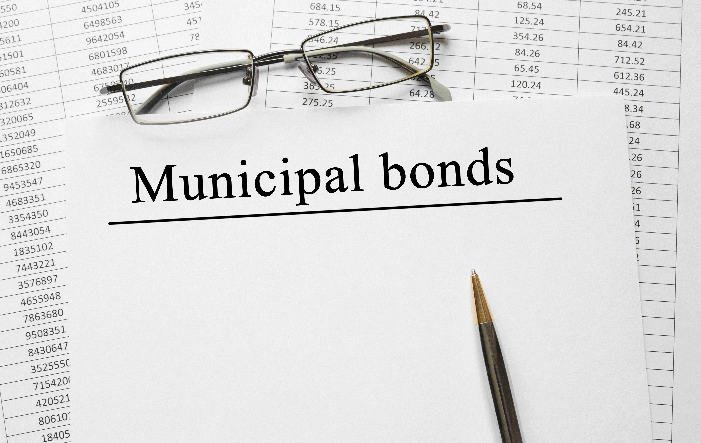

## Table of Contents

## What are municipal bonds?

Municipal bonds, often called "munis," are loans that people give to local governments or their agencies. When you buy a municipal bond, you are lending money to a city, town, or state. In return, they promise to pay you back the money you lent them, plus some extra money called interest, over a certain period of time. These bonds are used by local governments to pay for big projects like building schools, roads, or hospitals.

One good thing about municipal bonds is that the interest you earn is often not taxed by the federal government, and sometimes not by the state government either. This can make them a good choice for people who want to earn money without paying a lot of taxes. However, like any investment, there is some risk. If the local government has money problems and can't pay back the bond, you might lose your investment. So, it's important to look at the financial health of the government before buying a municipal bond.

## Why do investors buy municipal bonds?

Investors buy municipal bonds mainly because they want to earn money without paying a lot of taxes. The interest you get from these bonds is often not taxed by the federal government, and sometimes not by the state government either. This means you can keep more of the money you earn. For people in high tax brackets, this can be a big advantage because they can save a lot on taxes compared to other kinds of investments.

Another reason investors like municipal bonds is that they are generally seen as safe investments. Local governments usually pay back their bonds because they have the power to collect taxes to do so. This makes municipal bonds less risky than some other investments like stocks. However, it's still important to check how financially healthy the local government is before buying a bond, because if they run into money problems, they might not be able to pay you back.

## How are municipal bonds taxed at the federal level?

The interest you earn from municipal bonds is usually not taxed by the federal government. This means if you get $100 in interest from a municipal bond, you don't have to pay federal taxes on that $100. This is a big reason why people like to invest in municipal bonds, especially if they are in a high tax bracket.

However, there are some exceptions. If you earn interest from certain types of municipal bonds, called "private activity bonds," you might have to pay federal taxes on that interest if your income is above a certain level. Also, if you sell a municipal bond for more than you paid for it, you might have to pay federal taxes on the profit you made from the sale.

## Are there any exceptions to the federal tax exemption of municipal bonds?

Most of the time, the interest you earn from municipal bonds is not taxed by the federal government. This means you get to keep all the interest money without having to give any of it to the IRS. This is a big reason why people like to buy these bonds, especially if they are in a high tax bracket.

However, there are some exceptions. If you earn interest from certain types of municipal bonds called "private activity bonds," you might have to pay federal taxes on that interest if your income is above a certain level. Also, if you sell a municipal bond for more than you paid for it, you might have to pay federal taxes on the profit you made from the sale. So, it's important to know which kind of municipal bond you are buying and to understand the tax rules that apply to it.

## How are municipal bonds taxed at the state level?

The way municipal bonds are taxed at the state level can be different depending on where you live and where the bond comes from. If you buy a bond from the state you live in, the interest you earn is often not taxed by that state. This is called a "state tax exemption." So, if you live in California and buy a bond from California, you usually don't have to pay California state taxes on the interest.

However, if you buy a bond from a different state, you might have to pay state taxes on the interest. For example, if you live in New York but buy a bond from Florida, you might have to pay New York state taxes on the interest you earn. Each state has its own rules, so it's a good idea to check the tax laws of your state before you buy a bond from another state.

## What is the difference between general obligation and revenue bonds in terms of taxation?

General obligation bonds and revenue bonds are two types of municipal bonds, but they are taxed the same way at the federal level. The interest you earn from both types of bonds is usually not taxed by the federal government. This means you get to keep all the interest money without having to pay federal taxes on it. However, if you earn interest from certain types of private activity bonds, which can be either general obligation or revenue bonds, you might have to pay federal taxes on that interest if your income is above a certain level. Also, if you sell either type of bond for more than you paid for it, you might have to pay federal taxes on the profit you made from the sale.

At the state level, the taxation of general obligation and revenue bonds is also similar. If you buy a bond from the state you live in, the interest you earn is often not taxed by that state. This is true for both general obligation and revenue bonds. However, if you buy a bond from a different state, you might have to pay state taxes on the interest. This rule applies to both types of bonds as well. Each state has its own rules, so it's a good idea to check the tax laws of your state before you buy a bond from another state.

## Can the interest from municipal bonds be subject to the alternative minimum tax (AMT)?

The interest from some municipal bonds can be subject to the alternative minimum tax (AMT). This happens with certain types of bonds called private activity bonds. If you earn interest from these bonds, and your income is high enough, you might have to include that interest when calculating your AMT. The AMT is a different way of calculating your taxes that makes sure people with a lot of certain types of income still pay at least some tax.

Not all municipal bonds are affected by the AMT, though. If you buy a general obligation bond or a public purpose bond, the interest from those bonds is usually not subject to the AMT. So, it's important to know what kind of municipal bond you are buying. If you want to avoid the AMT, you should look for bonds that are specifically labeled as "AMT-free" or "non-AMT."

## How do tax-exempt municipal bonds affect an investor's tax return?

When you invest in tax-exempt municipal bonds, the interest you earn from them usually doesn't get taxed by the federal government. This means you get to keep all the interest money without having to pay any federal taxes on it. This can be a big help for people who are in high tax brackets because it lets them keep more of their earnings. But, if you sell the bond for more than you paid for it, you might have to pay taxes on the profit you made from the sale. Also, if you earn interest from certain types of bonds called private activity bonds, and your income is high enough, you might have to include that interest when calculating the alternative minimum tax (AMT).

At the state level, the tax treatment can be different depending on where you live and where the bond comes from. If you buy a bond from the state you live in, the interest you earn is often not taxed by that state. But, if you buy a bond from a different state, you might have to pay state taxes on the interest. So, it's important to know the tax laws of your state before you buy a bond from another state. Understanding how these bonds are taxed can help you make better choices about your investments and how they will affect your tax return.

## What are the tax implications of buying municipal bonds in the secondary market?

When you buy municipal bonds in the secondary market, the tax implications are pretty much the same as when you buy them new. The interest you earn from these bonds is usually not taxed by the federal government. This means you get to keep all the interest money without having to pay federal taxes on it. This is a big reason why people like to invest in municipal bonds, especially if they are in a high tax bracket. However, if you earn interest from certain types of bonds called private activity bonds, and your income is high enough, you might have to include that interest when calculating the alternative minimum tax (AMT).

At the state level, the tax treatment can vary depending on where you live and where the bond comes from. If you buy a bond from the state you live in, the interest you earn is often not taxed by that state. But, if you buy a bond from a different state, you might have to pay state taxes on the interest. So, it's important to know the tax laws of your state before you buy a bond from another state. Also, if you sell a municipal bond in the secondary market for more than you paid for it, you might have to pay federal taxes on the profit you made from the sale.

## How do changes in tax laws impact the taxation of municipal bonds?

Changes in tax laws can affect how much tax you have to pay on the interest you earn from municipal bonds. If the government decides to change the rules about what kinds of income are taxed, it might mean that the interest from some municipal bonds is no longer tax-free. For example, if a new law says that the interest from private activity bonds has to be taxed, then people who own those bonds might have to start paying taxes on the interest they earn. Also, if the tax rates go up or down, it can change how much money people save by investing in tax-exempt bonds.

Another way tax law changes can impact municipal bonds is through the alternative minimum tax (AMT). If the rules for the AMT change, it might mean that more people have to pay this tax on the interest from certain types of municipal bonds. For example, if the income level at which the AMT applies goes down, more people might have to include the interest from private activity bonds in their AMT calculations. This can make these bonds less attractive to investors because they might end up paying more in taxes than they expected.

## What strategies can investors use to optimize the tax benefits of municipal bonds?

Investors can optimize the tax benefits of municipal bonds by focusing on bonds that are fully tax-exempt at both the federal and state levels. This means buying bonds issued by their own state, as the interest from these bonds is often not taxed by the state government. For example, if you live in California, buying California municipal bonds can help you avoid both federal and state taxes on the interest you earn. Additionally, investors should look for bonds labeled as "AMT-free" or "non-AMT," which means the interest won't be subject to the alternative minimum tax. This is important for people with high incomes who might otherwise have to pay the AMT on certain types of municipal bonds.

Another strategy is to consider the tax bracket you are in. If you are in a high tax bracket, the tax savings from municipal bonds can be more valuable to you. The tax-exempt status of the interest can help you keep more of your earnings, making these bonds a smart choice. Also, it's a good idea to hold onto your municipal bonds until they mature rather than selling them in the secondary market. If you sell a bond for more than you paid for it, you might have to pay taxes on the profit. By keeping the bond until it matures, you can avoid this capital gains tax and fully enjoy the tax benefits of the interest.

## How do international investors handle the taxation of U.S. municipal bonds?

International investors who buy U.S. municipal bonds have to think about different tax rules. The interest they earn from these bonds is usually not taxed by the U.S. federal government. This is good because it means they can keep all the interest money without paying U.S. federal taxes on it. But, they might have to pay taxes on the interest in their own country. Each country has its own tax laws, so it's important for international investors to check what the rules are in their home country before buying U.S. municipal bonds.

Also, if international investors sell their U.S. municipal bonds for more money than they paid for them, they might have to pay taxes on the profit. This is called capital gains tax. The rules for capital gains tax can be different in their home country compared to the U.S. So, it's a good idea for them to talk to a tax advisor who knows about both U.S. and their home country's tax laws. This can help them understand all the taxes they might have to pay and make smart choices about their investments.

## What is the taxation of municipal bonds?

Municipal bonds are a popular investment vehicle due to their federal tax-exempt status on interest earned. However, they are not entirely free from tax implications, especially concerning capital gains taxation, the 'De Minimis' tax rule, and specific cases involving the Alternative Minimum Tax (AMT).

### Capital Gains Taxation

When investors sell municipal bonds for more than their purchase price, they incur capital gains. These gains are subjected to federal capital gains taxes, which vary based on the holding period—short-term capital gains are taxed at higher ordinary income rates, while long-term gains benefit from reduced rates. It's essential for investors to maintain meticulous records of purchase and sale transactions to correctly calculate gain or loss.

### The 'De Minimis' Tax Rule

The 'De Minimis' rule impacts how discounts on municipal bonds are taxed. This rule applies when bonds are purchased at a discount in the secondary market. The rule stipulates a threshold, calculated as 0.25% of the face value of the bond times the number of years to maturity. If the market discount at purchase is less than this threshold, the gain at sale is taxed as a capital gain. If it exceeds this de minimis threshold, the entire discount is taxed as ordinary income upon sale or maturity. Calculating the threshold involves:

$$
\text{De Minimis Threshold} = 0.0025 \times \text{Face Value} \times \text{Years to Maturity}
$$

### Taxation on Discounted Bonds

Municipal bonds purchased at a market discount, where the purchase price is lower than the bond’s adjusted issue price, [carry](/wiki/carry-trading) tax implications when sold or redeemed. Discounts that fall within the de minimis threshold are treated as capital gains, while those outside are considered ordinary income, affecting an investor's overall tax liability.

### Alternative Minimum Tax (AMT) Implications

Certain municipal bonds, specifically Private Activity Bonds (PABs), may be subject to the AMT. Although PABs offer federal tax-exempt interest, this interest must be added back into income when calculating AMT. Investors subject to AMT could face higher tax rates, affecting the tax efficiency of their municipal bond investments. The AMT represents a parallel tax system designed to ensure higher-income earners pay a minimum amount of tax, considering several preference items and income additions.

Understanding these tax considerations is critical for investors aiming to optimize municipal bond portfolios effectively. Aligning investment strategies with tax regulations ensures compliance and enhances the after-tax return on investments in municipal bonds.

## References & Further Reading

[1]: Schwert, G. W. (2020). ["Efficient Bond Markets: Payment Uncertain and Diverse Tax Treatment"](https://www.sciencedirect.com/science/article/pii/S1574010203010240). Handbook of the Economics of Corporate Finance.

[2]: Fabozzi, F. J., & Pollack, A. (2012). ["Municipal Bond Markets and the Municipal Securities Rulemaking Board (MSRB)"](https://books.google.com/books/about/Bond_Markets_Analysis_and_Strategies_ten.html?id=bQpNEAAAQBAJ). Municipal Bonds: The Comprehensive Review of Tax Exempt Securities and Public Project Financing.

[3]: ["Advances in Financial Machine Learning"](https://www.amazon.com/Advances-Financial-Machine-Learning-Marcos/dp/1119482089) by Marcos Lopez de Prado

[4]: Poterba, J. M., & Reuben, K. S. (1995). ["The Effect of State Fiscal Conditions on the Pricing of State Bond Risk"](https://www.semanticscholar.org/paper/State-Fiscal-Institutions-and-the-U.S.-Municipal-Poterba-Rueben/0a2fabc82ed3b2e2667b5a7c216dcff165257964). Journal of Urban Economics.

[5]: ["Quantitative Trading: How to Build Your Own Algorithmic Trading Business"](https://www.amazon.com/Quantitative-Trading-Build-Algorithmic-Business/dp/1119800064) by Ernest P. Chan

[6]: Campbell, J. Y., & Viceira, L. M. (2002). ["Strategic Asset Allocation: Portfolio Choice for Long-Term Investors"](https://academic.oup.com/book/6093). Oxford University Press.

[7]: ["Machine Learning for Algorithmic Trading"](https://github.com/stefan-jansen/machine-learning-for-trading) by Stefan Jansen

[8]: ["Evidence-Based Technical Analysis: Applying the Scientific Method and Statistical Inference to Trading Signals"](https://www.amazon.com/Evidence-Based-Technical-Analysis-Scientific-Statistical/dp/0470008741) by David Aronson