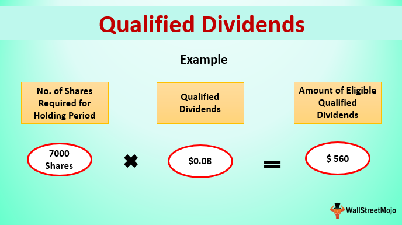

## Table of Contents

## What is a dividend?

A dividend is money that a company pays to its shareholders. It's like a reward for owning part of the company. When a company makes a profit, it can choose to share some of that profit with its shareholders in the form of dividends.

Dividends are usually paid out regularly, like every three months or once a year. The amount you get depends on how many shares you own. If you own more shares, you get more money. Companies don't have to pay dividends, but many do because it makes shareholders happy and can make the company's stock more attractive to investors.

## What is the difference between qualified and ordinary dividends?

Qualified dividends and ordinary dividends are both payments that companies make to their shareholders, but they are taxed differently. Ordinary dividends are taxed at your regular income tax rate, which can be as high as the rate for your highest income bracket. This means if you earn a lot of money, you might pay a lot in taxes on ordinary dividends.

Qualified dividends, on the other hand, are taxed at a lower rate, similar to the tax rate for long-term capital gains. To be considered qualified, the dividends must meet certain requirements, like being paid by a U.S. company or a qualified foreign corporation and the shareholder must have held the stock for a specific period of time. Because of this lower tax rate, qualified dividends can save you money on taxes compared to ordinary dividends.

## How are ordinary dividends taxed?

Ordinary dividends are taxed as regular income. This means they are added to your other income, like your salary or wages, and then taxed at your normal income tax rate. If you earn a lot of money, you might be in a high tax bracket, so you could end up paying a lot in taxes on your ordinary dividends.

The tax rate for ordinary dividends can go up to 37% for people in the highest income bracket. This is different from qualified dividends, which have a lower tax rate. It's important to know the difference because it can affect how much money you keep after taxes.

## What are the criteria for a dividend to be considered qualified?

For a dividend to be considered qualified, it must meet certain rules. First, the dividend must be paid by a U.S. company or a qualified foreign corporation. A qualified foreign corporation is one that is based in a country that has a tax treaty with the U.S. or is easily traded on a major U.S. stock exchange. Second, the shareholder must have held the stock for a certain amount of time. This is called the holding period. The shareholder must have owned the stock for more than 60 days during the 121-day period that starts 60 days before the ex-dividend date.

The ex-dividend date is important because it's the first day the stock trades without the dividend. If you buy the stock on or after this date, you won't get the next dividend payment. The holding period rule makes sure that people don't just buy the stock right before the dividend is paid and then sell it right after, just to get the lower tax rate. If a dividend meets all these rules, it can be taxed at the lower rate for qualified dividends, which can save you money on taxes.

## How are qualified dividends taxed?

Qualified dividends are taxed at a lower rate than ordinary dividends. This lower rate is the same as the rate for long-term capital gains. For most people, this means they pay less in taxes on qualified dividends than they would on ordinary dividends or their regular income.

The tax rate for qualified dividends depends on your income. If you're in the lowest tax brackets, you might not pay any tax on your qualified dividends. If you earn more, you could pay 15% or even 20% on them. This is still usually less than what you'd pay on ordinary dividends, which can be taxed at rates up to 37%.

## What is the tax rate for qualified dividends in 2023?

In 2023, the tax rate for qualified dividends depends on your income. If your income is low, you might not have to pay any tax on your qualified dividends. This is true if you're in the 10% or 15% tax brackets for your regular income. If you earn more money, you'll pay a 15% tax on your qualified dividends. This applies if you're in the 22%, 24%, 32%, or 35% tax brackets for your regular income.

If you earn a lot of money and are in the highest tax bracket, which is 37% for your regular income, you'll pay a 20% tax on your qualified dividends. These rates are much lower than the rates for ordinary dividends, which can be as high as 37%. So, if your dividends are qualified, you can save a lot on taxes.

## Can you explain the tax implications of reinvesting dividends?

When you reinvest dividends, you use the money you get from dividends to buy more shares of the same company instead of taking the cash. This is a good way to grow your investment over time. But, even if you reinvest your dividends, you still have to pay taxes on them. If the dividends are ordinary dividends, they are taxed at your regular income tax rate. If they are qualified dividends, they are taxed at the lower rate for long-term capital gains.

The tax you owe on reinvested dividends is based on the type of dividend and your income. You need to report these dividends on your tax return, even though you didn't get the money in cash. The value of the new shares you bought with the reinvested dividends is added to the cost basis of your investment. This can affect how much tax you pay when you sell the shares later. So, while reinvesting dividends can help your investment grow, it's important to remember that you still have to pay taxes on them each year.

## How do tax brackets affect the taxation of dividends?

Tax brackets are like different levels of income that decide how much tax you pay. When you get dividends, the tax you pay on them depends on which tax bracket you are in. If your dividends are ordinary dividends, they are added to your other income, like your salary. Then, you pay tax on all of that income based on your tax bracket. If you are in a high tax bracket, you might pay a lot of tax on your ordinary dividends, up to 37%.

If your dividends are qualified dividends, they are taxed at a lower rate, which is the same as the rate for long-term capital gains. The tax rate for qualified dividends also depends on your tax bracket, but it's always less than the rate for ordinary dividends. If you are in the lowest tax brackets, you might not pay any tax on your qualified dividends. If you earn more, you could pay 15% or 20% on them. So, knowing your tax bracket is important because it helps you understand how much tax you will pay on your dividends.

## What forms do I need to report dividend income on my tax return?

To report dividend income on your tax return, you need to use Form 1040, which is the main form for your personal income tax. On this form, you'll report all your income, including dividends. You'll also need to use Schedule B, which is an attachment to Form 1040. Schedule B is where you list all your dividend income in detail. If you received more than $1,500 in dividends, you must fill out Schedule B.

The company that paid you the dividends will send you a Form 1099-DIV. This form shows how much money you got in dividends and whether they are ordinary or qualified dividends. You'll use the information from the 1099-DIV to fill out Schedule B. Make sure to keep these forms because you might need them if the IRS has questions about your tax return.

## Are there any strategies to minimize taxes on dividend income?

One way to minimize taxes on dividend income is to focus on qualified dividends. Since qualified dividends are taxed at a lower rate than ordinary dividends, you can save money by investing in companies that pay qualified dividends. To make sure your dividends are qualified, you need to hold the stock for more than 60 days during the 121-day period that starts 60 days before the ex-dividend date. By doing this, you can take advantage of the lower tax rates, which can be as low as 0% if you're in the lowest tax brackets.

Another strategy is to hold your dividend-paying investments in tax-advantaged accounts like an IRA or a 401(k). In these accounts, you don't have to pay taxes on your dividends each year. Instead, you pay taxes when you take the money out of the account, usually when you retire. This can help your investments grow faster because you're not losing money to taxes every year. Just remember that the rules for these accounts can be different, so it's a good idea to talk to a financial advisor to make sure you're using them in the best way possible.

## How does the Net Investment Income Tax affect dividend taxation?

The Net Investment Income Tax (NIIT) is an extra tax that some people have to pay on their investment income, including dividends. If you earn more than a certain amount of money, you might have to pay this tax. For the year 2023, if you're single and your income is over $200,000, or if you're married filing jointly and your income is over $250,000, you'll have to pay the NIIT. The tax rate is 3.8% of your net investment income, which includes your dividends.

This extra tax can make the total tax you pay on your dividends higher. If you get ordinary dividends, you'll pay your regular income tax rate, which can be up to 37%, plus the 3.8% NIIT if your income is high enough. If you get qualified dividends, you'll pay the lower rate for long-term capital gains, which can be 0%, 15%, or 20%, plus the 3.8% NIIT if your income is high enough. So, if you're in a high tax bracket and have to pay the NIIT, it's even more important to try to get qualified dividends to save on taxes.

## What are the international considerations for taxing dividends received from foreign corporations?

When you get dividends from foreign corporations, the tax rules can be different and more complicated than for dividends from U.S. companies. Many countries have tax treaties with the U.S. that can affect how much tax you pay on these dividends. These treaties can help lower the tax rate or even stop you from paying taxes twice on the same income. If the foreign company is in a country with a tax treaty, your dividends might be considered qualified dividends, which means they are taxed at a lower rate. But, you still need to meet the holding period rule to get this lower tax rate.

If the foreign company is not in a country with a tax treaty, you might have to pay a higher tax rate on your dividends. Also, you might have to pay taxes in both the foreign country and the U.S., which is called double taxation. To avoid this, you can usually claim a foreign tax credit on your U.S. tax return. This credit lets you subtract the taxes you paid to the foreign country from the taxes you owe in the U.S. It's a good idea to talk to a tax professional to make sure you're following all the rules and getting all the tax breaks you can.

## References & Further Reading

[1]: [IRS Publication 550: Investment Income and Expenses](https://www.irs.gov/publications/p550)

[2]: [IRS Publication 564: Mutual Fund Distributions](https://www.irs.gov/pub/irs-prior/p564--2009.pdf)

[3]: ["Algorithmic Trading: Winning Strategies and Their Rationale"](https://www.wiley.com/en-us/Algorithmic+Trading%3A+Winning+Strategies+and+Their+Rationale-p-9781118460146) by Ernest P. Chan

[4]: ["The Tax-Efficient Wealth: Strategies to Optimize Your After-Tax Investment Returns"](https://www.nerdwallet.com/article/investing/tax-efficient-investing) by Maximilian Hamm

[5]: ["Advances in Financial Machine Learning"](https://www.amazon.com/Advances-Financial-Machine-Learning-Marcos/dp/1119482089) by Marcos Lopez de Prado

[6]: ["Machine Learning for Algorithmic Trading"](https://github.com/PacktPublishing/Machine-Learning-for-Algorithmic-Trading-Second-Edition) by Stefan Jansen