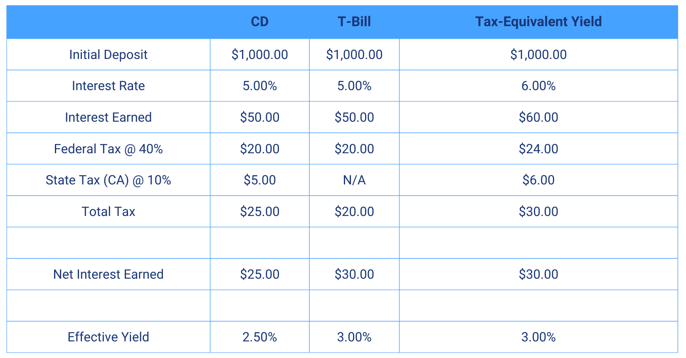

## Table of Contents

## What are Treasury Bills?

Treasury Bills, often called T-Bills, are short-term loans that people and institutions give to the government. They are a type of government security that lasts for one year or less. When you buy a T-Bill, you are lending money to the government, and in return, the government promises to pay you back the full amount you lent, plus a bit of extra money, when the T-Bill matures. They are considered very safe because they are backed by the government.

T-Bills are sold at a discount, which means you buy them for less than their face value. For example, you might buy a $1,000 T-Bill for $950. When the T-Bill matures, you get the full $1,000 back. The difference between what you paid and what you get back is your interest. This makes T-Bills a popular choice for people and businesses looking for a safe place to park their money for a short time.

## How are Treasury Bills taxed?

When you earn money from Treasury Bills, you have to pay taxes on it. The interest you get from T-Bills is taxed by the federal government. This means you'll need to report this interest on your federal tax return and pay taxes on it. However, the good news is that this interest is not taxed by state or local governments. So, you won't have to worry about state or local taxes on your T-Bill earnings.

If you sell your T-Bill before it matures, you might have to pay taxes on any profit you make from the sale. This profit is called capital gain. If you hold the T-Bill for less than a year before selling it, the capital gain is taxed as ordinary income. This means it's taxed at the same rate as your other income. If you're not sure about how much tax you owe, it's a good idea to talk to a tax professional who can help you figure it out.

## What is the difference between interest income and capital gains from Treasury Bills?

Interest income from Treasury Bills is the extra money you get when the T-Bill matures. When you buy a T-Bill, you pay less than its face value. For example, you might pay $950 for a $1,000 T-Bill. When it matures, you get the full $1,000 back. The $50 difference is your interest income. This interest is taxed by the federal government but not by state or local governments.

Capital gains from Treasury Bills happen if you sell your T-Bill before it matures and make a profit. For instance, if you bought a T-Bill for $950 and sold it later for $975, you would have a capital gain of $25. If you hold the T-Bill for less than a year before selling, this gain is taxed as ordinary income, just like your regular income. Capital gains are different from interest income because they depend on the market value of the T-Bill when you sell it, not just the difference between the purchase price and the face value.

## Are Treasury Bills subject to state and local taxes?

No, Treasury Bills are not subject to state and local taxes. When you earn interest from a T-Bill, you only have to pay federal taxes on that interest. This means you don't have to worry about paying any extra money to your state or local government for the interest you make.

If you sell your T-Bill before it matures and make a profit, that profit is called a capital gain. These capital gains are also not taxed by state or local governments. However, if you hold the T-Bill for less than a year before selling it, the capital gain is taxed as regular income by the federal government.

## How does the taxation of Treasury Bills compare to other fixed-income investments?

Treasury Bills are special because they are only taxed by the federal government, not by state or local governments. This means when you get interest from a T-Bill, you don't have to pay extra money to your state or local government. This is different from many other fixed-income investments like corporate bonds or municipal bonds. For example, interest from corporate bonds is taxed by federal, state, and local governments. This can make T-Bills a more attractive choice if you want to avoid state and local taxes on your investment income.

Municipal bonds, on the other hand, are often not taxed by the federal government if they are from the state where you live. This can make them a good choice if you want to avoid federal taxes. But if you live in a different state from where the bond is issued, you might have to pay taxes on the interest. So, the choice between T-Bills and other fixed-income investments depends on where you live and what taxes you want to avoid.

## What are the tax implications of buying and selling Treasury Bills before maturity?

When you buy a Treasury Bill and hold it until it matures, you earn interest. This interest is taxed by the federal government, but you don't have to pay state or local taxes on it. So, if you get $50 in interest from a T-Bill, you'll report that on your federal tax return and pay federal taxes on it, but you won't owe anything to your state or local government.

If you decide to sell your T-Bill before it matures, you might make a profit or a loss. This profit is called a capital gain, and it's taxed by the federal government as regular income if you held the T-Bill for less than a year. For example, if you bought a T-Bill for $950 and sold it for $975, you'd have a $25 capital gain. You'd pay federal taxes on this gain, but again, you wouldn't owe any state or local taxes. If you sell at a loss, you might be able to use that loss to reduce your taxable income on your federal tax return.

## How can the tax on Treasury Bills be reported on federal tax returns?

When you earn interest from a Treasury Bill, you need to report it on your federal tax return. This interest is usually reported on a form called the 1099-INT, which you get from the Treasury Department. You'll add the amount of interest you earned to the total interest income on your tax return. This is usually on line 2 of Form 1040. Remember, you only need to worry about federal taxes for this interest, not state or local taxes.

If you sell your Treasury Bill before it matures and make a profit, that profit is called a capital gain. You report this capital gain on Schedule D of your federal tax return. If you held the T-Bill for less than a year, the gain is taxed as ordinary income, which you report on line 7 of Form 1040. If you sold the T-Bill at a loss, you can use that loss to reduce your taxable income, which you also report on Schedule D. Just like the interest, you don't have to pay state or local taxes on these gains or losses.

## What are the tax considerations for holding Treasury Bills in a tax-deferred account?

When you hold Treasury Bills in a tax-deferred account like an IRA or a 401(k), you don't have to pay taxes on the interest they earn until you take the money out of the account. This can be a big advantage because it lets your investment grow without being reduced by taxes each year. So, if you get $50 in interest from a T-Bill in your IRA, you won't pay any taxes on that $50 until you withdraw it from your IRA.

When you do take money out of your tax-deferred account, you'll have to pay federal taxes on the total amount you withdraw, including the interest from your T-Bills. This means you'll pay taxes on the money you put in, plus any growth, including interest from the T-Bills. But remember, just like when you hold T-Bills outside of a tax-deferred account, you won't owe any state or local taxes on the interest from the T-Bills, even when you withdraw the money.

## How do changes in tax laws affect the taxation of Treasury Bills?

Changes in tax laws can affect how much tax you pay on the interest from Treasury Bills. If the federal government decides to change the tax rates, the amount of tax you owe on your T-Bill interest could go up or down. For example, if tax rates increase, you'll pay more tax on the interest you earn. If tax rates decrease, you'll pay less. These changes only affect federal taxes because T-Bill interest is not taxed by state or local governments.

Sometimes, new tax laws can also change how you report your T-Bill interest on your tax return. If the government introduces new forms or changes the way you report income, you'll need to follow these new rules. It's a good idea to stay updated on any tax law changes or talk to a tax professional to make sure you're doing everything right.

## What strategies can be used to minimize the tax liability on Treasury Bills?

One way to minimize the tax liability on Treasury Bills is to hold them in a tax-deferred account like an IRA or a 401(k). When you do this, you don't have to pay taxes on the interest the T-Bills earn until you take the money out of the account. This lets your investment grow without being reduced by taxes each year. So, if you're planning to hold T-Bills for a long time, putting them in a tax-deferred account can save you money on taxes.

Another strategy is to carefully time when you buy and sell your T-Bills. If you sell your T-Bills before they mature and make a profit, that profit is taxed as ordinary income if you held them for less than a year. By holding onto your T-Bills for at least a year before selling, you might be able to take advantage of lower long-term capital gains tax rates, although this is less common with T-Bills because they usually mature in less than a year. It's also important to keep up with any changes in tax laws, as these can affect how much tax you owe on your T-Bill interest.

## How does inflation impact the real after-tax return on Treasury Bills?

Inflation can reduce the real after-tax return you get from Treasury Bills. When you buy a T-Bill, you earn interest, but after you pay federal taxes on that interest, the amount you keep is less. If inflation is high, the value of the money you have left after taxes goes down. For example, if you earn $50 in interest but inflation is 3%, the real value of that $50 is less than it would be if there were no inflation. This means the money you get from your T-Bill might not be worth as much as you thought.

To understand this better, think of it this way: if inflation is higher than the interest rate on your T-Bill, you could end up with less buying power than when you started, even after you get your interest. For instance, if your T-Bill earns 2% interest and inflation is 3%, the real value of your money goes down by 1% after taxes. Keeping an eye on inflation rates can help you decide if T-Bills are a good investment for you, especially if you're worried about the real value of your returns after taxes.

## What are the international tax implications for non-residents investing in U.S. Treasury Bills?

If you are a non-resident and you invest in U.S. Treasury Bills, you have to think about how taxes work in both your country and the U.S. In the U.S., non-residents don't have to pay federal taxes on the interest they earn from T-Bills. This means you can keep all the interest you make without paying U.S. taxes on it. But, you might have to pay taxes on that interest in your own country, depending on your country's tax laws. It's a good idea to check with a tax advisor in your country to know for sure.

However, if you sell your T-Bills before they mature and make a profit, that profit could be taxed in your home country. The rules for capital gains can be different from country to country. Some countries might tax the profit you make from selling T-Bills, while others might not. Also, if there's a tax treaty between your country and the U.S., it might affect how you're taxed. Talking to a tax professional who knows about international tax laws can help you understand all of this and make smart choices about your investments.

## What are Treasury Bills (T-Bills) and how do they work?

Treasury Bills, commonly referred to as T-Bills, are short-term debt instruments issued by the U.S. Department of the Treasury. They are considered one of the safest investment options, primarily because they are backed by the full faith and credit of the U.S. government. T-Bills have maturities that range from a few weeks up to one year, making them ideal for investors seeking a short-term, secure investment vehicle.

Unlike other securities, T-Bills do not offer explicit interest payments. Instead, they are sold at a discount from their face or par value, and the investor receives the full face value upon maturity. The difference between the purchase price and the maturity value represents the investor's return, effectively functioning as the interest earned on the investment. This mechanism can be expressed using the following formula to calculate the yield on a T-Bill:

$$
\text{Yield} = \frac{\text{Face Value} - \text{Purchase Price}}{\text{Purchase Price}} \times \frac{365}{\text{Days to Maturity}}
$$

T-Bills are frequently utilized as a benchmark for the "risk-free" rate in financial analyses. This is because they are seen as having virtually no credit risk, given the U.S. government's backing and their short maturity periods that limit exposure to [interest rate](/wiki/interest-rate-trading-strategies) fluctuations. The risk-free rate is a critical component in various financial models, including the Capital Asset Pricing Model (CAPM), used to determine an investment's expected return.

In summary, T-Bills provide a secure investment option with predictable returns and serve as a key financial benchmark. They are especially attractive to investors looking for a reliable, short-term investment with minimal risk exposure.

## What are the tax advantages of T-Bills?

Treasury Bills (T-Bills) offer notable tax advantages that enhance their appeal, particularly in states with high income taxes. One of the most significant benefits is their exemption from state and local taxes. This exemption can result in considerable tax savings for investors residing in states where income taxes are substantial. In contrast, other common investment vehicles like Certificates of Deposit (CDs) are subject to both state and federal taxes on their returns, making T-Bills a more tax-efficient choice.

To assess the true benefit of T-Bills from a tax perspective, investors can calculate the after-tax yield. This measure allows investors to compare the effective return on T-Bills to that of other taxable investments like CDs. The formula to determine the after-tax yield of an investment is:

$$
\text{After-tax yield} = \text{Yield} \times (1 - \text{Tax rate})
$$

For T-Bills, as state taxes are not applicable, the calculation primarily considers federal taxes. This results in a higher after-tax yield compared to fully taxable investments.

Python code can be utilized to automate the calculation of after-tax yields and facilitate comparison across different investment options:

```python
def after_tax_yield(yield_rate, federal_tax_rate, state_tax_rate=0):
    return yield_rate * (1 - federal_tax_rate - state_tax_rate)

# Example: Calculate after-tax yield for a T-Bill and a CD
t_bill_yield = 0.02  # 2% yield for T-Bill
cd_yield = 0.025    # 2.5% yield for CD
federal_tax_rate = 0.24  # 24%
state_tax_rate = 0.05    # 5%

t_bill_after_tax = after_tax_yield(t_bill_yield, federal_tax_rate)
cd_after_tax = after_tax_yield(cd_yield, federal_tax_rate, state_tax_rate)

print(f"After-tax yield for T-Bill: {t_bill_after_tax:.4f}")
print(f"After-tax yield for CD: {cd_after_tax:.4f}")
```

This script will output the after-tax yields for both a T-Bill and a CD, allowing investors to directly compare and select the most advantageous option. The inherent tax efficiencies of T-Bills make them particularly attractive for those seeking stable returns with minimal tax implications.

## References & Further Reading

[1]: Goldstein, M., & Hotchkiss, E. (2020). ["The US Treasury Market: Overview, Trading Techniques, and Innovations"](https://econpapers.repec.org/RePEc:eee:jfinec:v:135:y:2020:i:1:p:16-40). Corporate Finance Institute.

[2]: Galen, B. (2013). ["Tips on Selecting the Right Treasury Securities"](https://quizlet.com/31392586/business-comm-ch-14-flash-cards/). Investopedia.

[3]: ["The Basics of Algorithmic Trading"](https://www.investopedia.com/articles/active-trading/101014/basics-algorithmic-trading-concepts-and-examples.asp) by Investopedia.

[4]: Fabozzi, F. J., & Mann, S. V. (2005). ["The Handbook of Fixed Income Securities"](https://www.mhebooklibrary.com/doi/book/10.1036/9781260473902?contentTab=true). McGraw-Hill Education.

[5]: McMillan, L. G. (2018). ["Options as a Strategic Investment"](https://www.optionstrategist.com/products/options-strategic-investment-5th-edition). FT Press.