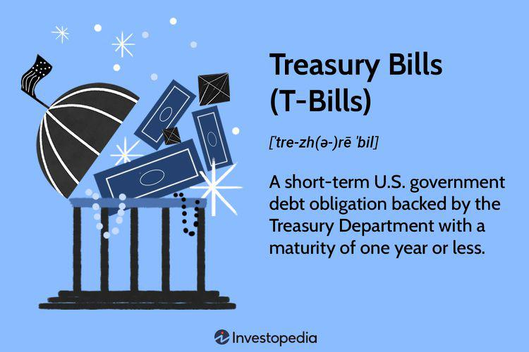

The investment landscape is diverse, offering numerous options for investors seeking minimal risk with stable returns. Among these options, Treasury Bills (T-Bills) stand out due to their strong government backing and their short-term nature, typically offering maturities ranging from a few weeks to one year. T-Bills are highly regarded as secure investment vehicles and are often used as a benchmark for the 'risk-free' rate in financial analysis.

In this article, we explore the specifics of T-Bill taxation, comparing their taxation advantages with other investment instruments. T-Bills are subject to federal taxes; however, they are exempt from state and local taxes, which can enhance their appeal in states with higher income taxes. Additionally, the potential for tax-efficiency compared to investments like Certificates of Deposit (CDs) forms a crucial part of their attractiveness.



Another fascinating angle to consider is the deployment of algorithmic trading in optimizing T-Bill investments. Algorithmic trading systems can analyze market data and execute trading strategies, potentially maximizing returns from T-Bills by efficiently handling large trade volumes and capitalizing on short-term market movements. This technological advancement provides investors an edge in managing their T-Bill portfolios more effectively.

In summary, this article addresses the intricacies and benefits of T-Bills as a low-risk investment choice with favorable tax treatment and explores the innovative approach of algorithmic trading to increase the efficiency and potential gains from T-Bill investments.

## Table of Contents

## Understanding Treasury Bills (T-Bills)

Treasury Bills, commonly referred to as T-Bills, are short-term debt instruments issued by the U.S. Department of the Treasury. They are considered one of the safest investment options, primarily because they are backed by the full faith and credit of the U.S. government. T-Bills have maturities that range from a few weeks up to one year, making them ideal for investors seeking a short-term, secure investment vehicle.

Unlike other securities, T-Bills do not offer explicit interest payments. Instead, they are sold at a discount from their face or par value, and the investor receives the full face value upon maturity. The difference between the purchase price and the maturity value represents the investor's return, effectively functioning as the interest earned on the investment. This mechanism can be expressed using the following formula to calculate the yield on a T-Bill:

$$
\text{Yield} = \frac{\text{Face Value} - \text{Purchase Price}}{\text{Purchase Price}} \times \frac{365}{\text{Days to Maturity}}
$$

T-Bills are frequently utilized as a benchmark for the "risk-free" rate in financial analyses. This is because they are seen as having virtually no credit risk, given the U.S. government's backing and their short maturity periods that limit exposure to [interest rate](/wiki/interest-rate-trading-strategies) fluctuations. The risk-free rate is a critical component in various financial models, including the Capital Asset Pricing Model (CAPM), used to determine an investment's expected return.

In summary, T-Bills provide a secure investment option with predictable returns and serve as a key financial benchmark. They are especially attractive to investors looking for a reliable, short-term investment with minimal risk exposure.

## How Are T-Bills Taxed?

Treasury Bills (T-Bills), being short-term debt obligations issued by the U.S. Treasury Department, are considered one of the safest investment vehicles available. However, investors must understand the taxation aspects associated with these instruments to manage their portfolios effectively.

Firstly, it is important to note that the interest income derived from T-Bills is subject to federal income tax but is notably exempt from state and local taxes. This characteristic makes T-Bills an attractive investment option for individuals residing in states with high tax rates. The federal tax treatment requires that any interest income received from T-Bills be reported annually on Form 1099-INT, which the Treasury provides to investors and the Internal Revenue Service (IRS).

When it comes to taxation, it is essential to discern how T-Bills generate interest income. Since T-Bills are sold at a discount and redeem at their face value, the interest earned is the difference between the purchase price and the maturity value. This interest income needs to be incorporated into the investor's federal tax return for the year it is received, regardless of when the T-Bill matures.

In instances where T-Bills are sold before they reach maturity, the tax implications depend on the holding period and the resulting profit. If an investor sells T-Bills and realizes a profit, the nature of the tax depends on how long the T-Bills were held. Profits from T-Bills sold after bein held for more than one year are generally taxed as capital gains, which often enjoy favorable tax rates compared to ordinary income. On the contrary, if T-Bills are sold within a year of purchase, any profit is taxed as ordinary income. This distinction is pivotal as it affects the investor's overall tax liability and net return.

Investors wanting to model the tax impact on their investment returns from T-Bills can use the following Python snippet to calculate the after-tax yield:

```python
def calculate_after_tax_yield(face_value, purchase_price, federal_tax_rate):
    interest_income = face_value - purchase_price
    after_tax_income = interest_income * (1 - federal_tax_rate)
    yield_tax_adjusted = (after_tax_income / purchase_price) * 100
    return yield_tax_adjusted

# Example usage
face_value = 1000  # maturity value of the T-Bill
purchase_price = 950  # price paid for the T-Bill
federal_tax_rate = 0.24  # federal tax rate, e.g., 24%

print("After-tax yield: {:.2f}%".format(calculate_after_tax_yield(face_value, purchase_price, federal_tax_rate)))
```

This tool helps in comparing the profitability of T-Bills against other investments by factoring in the tax implications unique to each. Understanding both the federal taxation protocol and potential capital gains tax is crucial for optimizing returns on T-Bills.

## T-Bill Tax Advantages

Treasury Bills (T-Bills) offer notable tax advantages that enhance their appeal, particularly in states with high income taxes. One of the most significant benefits is their exemption from state and local taxes. This exemption can result in considerable tax savings for investors residing in states where income taxes are substantial. In contrast, other common investment vehicles like Certificates of Deposit (CDs) are subject to both state and federal taxes on their returns, making T-Bills a more tax-efficient choice.

To assess the true benefit of T-Bills from a tax perspective, investors can calculate the after-tax yield. This measure allows investors to compare the effective return on T-Bills to that of other taxable investments like CDs. The formula to determine the after-tax yield of an investment is:

$$
\text{After-tax yield} = \text{Yield} \times (1 - \text{Tax rate})
$$

For T-Bills, as state taxes are not applicable, the calculation primarily considers federal taxes. This results in a higher after-tax yield compared to fully taxable investments.

Python code can be utilized to automate the calculation of after-tax yields and facilitate comparison across different investment options:

```python
def after_tax_yield(yield_rate, federal_tax_rate, state_tax_rate=0):
    return yield_rate * (1 - federal_tax_rate - state_tax_rate)

# Example: Calculate after-tax yield for a T-Bill and a CD
t_bill_yield = 0.02  # 2% yield for T-Bill
cd_yield = 0.025    # 2.5% yield for CD
federal_tax_rate = 0.24  # 24%
state_tax_rate = 0.05    # 5%

t_bill_after_tax = after_tax_yield(t_bill_yield, federal_tax_rate)
cd_after_tax = after_tax_yield(cd_yield, federal_tax_rate, state_tax_rate)

print(f"After-tax yield for T-Bill: {t_bill_after_tax:.4f}")
print(f"After-tax yield for CD: {cd_after_tax:.4f}")
```

This script will output the after-tax yields for both a T-Bill and a CD, allowing investors to directly compare and select the most advantageous option. The inherent tax efficiencies of T-Bills make them particularly attractive for those seeking stable returns with minimal tax implications.

## Investment Strategies: Algo Trading and T-Bills

Algorithmic trading represents a technological advancement in the financial sector, offering enhanced capabilities for the trading of Treasury Bills (T-Bills) through sophisticated computational methods. By leveraging algorithms, investors can systematically process large data sets to identify market trends and patterns, thereby optimizing the timing and execution of trades.

At its core, [algorithmic trading](/wiki/algorithmic-trading) relies on pre-programmed instructions and quantitative models to make trading decisions. These algorithms can process variables such as interest rate fluctuations, economic indicators, and market sentiment to forecast optimal buying and selling opportunities. One common strategy employed in algorithmic trading is statistical [arbitrage](/wiki/arbitrage), which involves simultaneous buying and selling of financial instruments to exploit price discrepancies.

For T-Bills, algo trading is particularly effective in managing large investment volumes. Given their short-term maturation, any market inefficiencies or interest rate movements can be rapidly identified and acted upon by algorithms, maximizing returns or minimizing losses. This is a considerable advantage over manual trading, where human reaction time and cognitive biases might obstruct making timely and objective trade decisions.

Python, a versatile and widely-used programming language in the finance industry, is often employed to develop trading algorithms. Libraries such as NumPy, pandas, and QuantLib provide robust tools for data manipulation, time-series analysis, and financial calculations necessary for algorithmic trading. Below is a simple example of a Python code snippet that could be a part of an algorithmic trading strategy for T-Bills:

```python
import pandas as pd
import numpy as np

# Load T-Bill historical data
data = pd.read_csv('tbill_data.csv')  # Assuming there's a CSV file with historical data
data['Return'] = data['Price'].pct_change()

# Define a simple moving average strategy
short_window = 5
long_window = 20

data['Short_MA'] = data['Price'].rolling(window=short_window).mean()
data['Long_MA'] = data['Price'].rolling(window=long_window).mean()

# Generate trading signals
data['Signal'] = 0
data['Signal'][short_window:] = np.where(data['Short_MA'][short_window:] > data['Long_MA'][short_window:], 1, 0)

# Calculate daily returns
data['Strategy_Return'] = data['Signal'].shift(1) * data['Return']

# Output the cumulative returns of the strategy
cumulative_return = (data['Strategy_Return'].fillna(0) + 1).cumprod() - 1
print(f"Cumulative Return of the Strategy: {cumulative_return[-1]:.2%}")
```

This example demonstrates a simple moving average crossover strategy, identifying potential buy signals when the short-term moving average surpasses the long-term moving average. While basic, such strategies can be extended and made more complex by incorporating additional variables and risk management procedures.

In conclusion, algorithmic trading offers significant benefits for optimizing T-Bill investments by efficiently managing large volumes and utilizing real-time data analysis to respond to market changes. This blend of technology and finance not only enhances potential returns but also provides a structured and disciplined approach to trading.

## FAQs

Do I have to hold a T-Bill until it matures?

No, investors are not required to hold Treasury Bills (T-Bills) until they mature. T-Bills are highly liquid, meaning they can be sold in the secondary market before their maturity date. The [liquidity](/wiki/liquidity-risk-premium) of T-Bills provides flexibility to investors who might need access to their invested capital before the T-Bill's term ends. However, selling T-Bills before maturity may result in capital gains or losses, depending on changes in market interest rates and the price at which they are sold.

What happens when a T-Bill matures?

Upon maturity, a T-Bill pays its full face value to the holder. Since T-Bills are originally sold at a discount, the difference between the purchase price and the face value is effectively the interest earned by the investor. For example, if an investor purchases a T-Bill with a face value of $1,000 for $950, upon maturity, the investor receives $1,000, resulting in a $50 profit. This profit is subject to federal taxes but is exempt from state and local taxes.

Are T-Bills FDIC insured?

No, T-Bills are not insured by the Federal Deposit Insurance Corporation (FDIC). Instead, T-Bills are backed by the full faith and credit of the United States government, which is often considered even more secure than FDIC insurance. This government backing is one of the primary reasons why T-Bills are regarded as a low-risk investment, typically offering a stable return with minimal risk of default.

How do you purchase T-Bills?

T-Bills can be purchased directly from the U.S. Department of the Treasury through its online portal, TreasuryDirect. Registration on TreasuryDirect requires providing personal information, such as a social security number and a bank account for transactions. Alternatively, T-Bills can also be purchased through banks or brokers, who may charge a commission or fee for their services. It is essential for investors to understand the terms and conditions associated with these purchasing options to optimize their investment strategies.

## The Bottom Line

Treasury Bills (T-Bills) represent a secure, low-risk investment suitable for investors prioritizing safety and favorable tax implications. These government-backed securities offer short-term maturity, typically ranging from a few weeks to one year. They serve as a preferred option for parking funds with minimal risk, primarily due to their stable nature and full backing by the U.S. government.

One of the significant advantages T-Bills offer is their exemption from state and local taxes. This tax benefit becomes particularly valuable in states with high income tax rates, making T-Bills more attractive compared to other taxable investments. While the interest income from T-Bills is subject to federal taxes, the relief from state and local taxes enhances their appeal for investors seeking tax-efficient solutions.

Additionally, understanding the taxation specifics of T-Bills can further optimize investment returns. For instance, gains from T-Bills sold before maturity are taxed as capital gains or ordinary income, depending on the holding period. This tax treatment can influence the decision-making process when evaluating T-Bills against other investment options, such as Certificates of Deposit (CDs), which are fully taxable at both state and federal levels.

Incorporating algorithmic trading strategies can further bolster the attractiveness of T-Bills. Algorithmic trading involves using computer programs to execute trades based on predefined criteria, allowing for efficient management of T-Bills by analyzing market trends and executing transactions at optimal times. This advanced trading technique can maximize gains by taking advantage of short-term market fluctuations and managing large volumes effectively.

In conclusion, T-Bills present a robust, low-risk investment vehicle with significant tax advantages. Especially in high-tax states, their exemption from state and local taxes is a critical [factor](/wiki/factor-investing) for investors. Comprehending their taxation rules and utilizing algorithmic trading strategies can significantly enhance the overall returns, making T-Bills a prudent choice for conservative investors aiming for a safe haven with tax-efficient benefits.

## References & Further Reading

[1]: Goldstein, M., & Hotchkiss, E. (2020). ["The US Treasury Market: Overview, Trading Techniques, and Innovations"](https://econpapers.repec.org/RePEc:eee:jfinec:v:135:y:2020:i:1:p:16-40). Corporate Finance Institute.

[2]: Galen, B. (2013). ["Tips on Selecting the Right Treasury Securities"](https://quizlet.com/31392586/business-comm-ch-14-flash-cards/). Investopedia.

[3]: ["The Basics of Algorithmic Trading"](https://www.investopedia.com/articles/active-trading/101014/basics-algorithmic-trading-concepts-and-examples.asp) by Investopedia.

[4]: Fabozzi, F. J., & Mann, S. V. (2005). ["The Handbook of Fixed Income Securities"](https://www.mhebooklibrary.com/doi/book/10.1036/9781260473902?contentTab=true). McGraw-Hill Education.

[5]: McMillan, L. G. (2018). ["Options as a Strategic Investment"](https://www.optionstrategist.com/products/options-strategic-investment-5th-edition). FT Press.