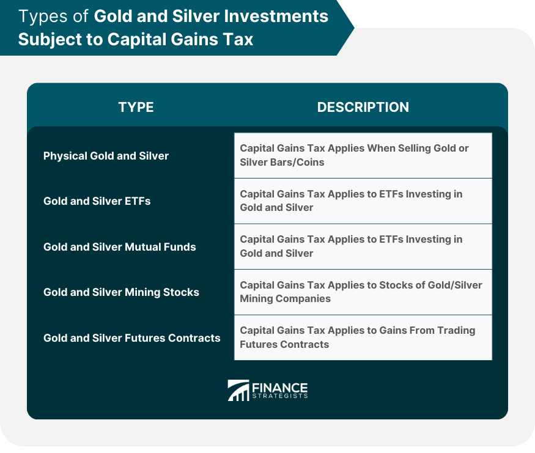

## Table of Contents

## What are the basic tax rules for investing in physical gold and silver?

When you invest in physical gold and silver, you need to know about taxes. If you buy gold or silver and then sell it for more than you paid, you have to pay capital gains tax on the profit. How much tax you pay depends on how long you held the metal before selling it. If you held it for a year or less, it's a short-term capital gain, and you pay your regular income tax rate on it. If you held it for more than a year, it's a long-term capital gain, and the tax rate is lower, usually 0%, 15%, or 20%, depending on your income.

There are also some special rules to keep in mind. If you sell gold or silver coins or bullion that are considered collectibles, the long-term capital gains tax rate can be as high as 28%. Additionally, if you use gold or silver in a business or trade, the gains or losses might be treated differently for tax purposes. It's a good idea to keep good records of when you bought the metal, how much you paid, and when you sold it, so you can figure out your taxes correctly. If you're not sure about the rules, talking to a tax professional can help you understand what you need to do.

## How is the purchase of physical gold and silver taxed?

When you buy physical gold and silver, you usually don't have to pay any taxes right away. This means you can buy gold or silver coins, bars, or jewelry without worrying about paying sales tax in most states. However, some states might charge sales tax on certain types of gold and silver, so it's good to check the rules where you live.

The tax part comes into play when you sell your gold or silver. If you sell it for more than you paid, you'll have to pay capital gains tax on the profit. How much tax you pay depends on how long you held the gold or silver before selling it. If you held it for a year or less, it's a short-term capital gain, and you pay your regular income tax rate. If you held it for more than a year, it's a long-term capital gain, and the tax rate is lower, usually 0%, 15%, or 20%, depending on your income. If you're selling collectible coins or bullion, the long-term capital gains tax rate can be as high as 28%. Always keep good records of your purchases and sales to make tax time easier.

## Are there any tax exemptions or deductions available for gold and silver investments?

There aren't many specific tax exemptions or deductions just for buying gold and silver. But if you use gold or silver in your business, like if you're a jeweler, you might be able to deduct the cost of the metal as a business expense. This can lower your taxable income. Also, if you hold gold or silver in a self-directed IRA, you might not have to pay taxes on the gains until you take the money out of the IRA.

Another thing to know is that if you donate gold or silver to a charity, you can usually get a tax deduction for the fair market value of what you give. This can help lower your taxes if you itemize your deductions. But remember, the rules can be different depending on where you live and your situation, so it's a good idea to talk to a tax professional to make sure you're doing everything right.

## What is the tax treatment of gains from selling physical gold and silver?

When you sell physical gold and silver, you have to pay taxes on any profit you make. This profit is called a capital gain. If you sell the gold or silver within a year of buying it, the gain is a short-term capital gain. You pay your regular income tax rate on short-term gains, which can be as high as 37% depending on your income. If you hold the gold or silver for more than a year before selling, the gain is a long-term capital gain. The tax rate for long-term gains is usually lower, at 0%, 15%, or 20%, depending on your income.

There's a special rule for gold and silver that are considered collectibles, like certain coins or bullion. If you sell these and they're long-term gains, you might have to pay a higher tax rate of up to 28%. It's important to keep good records of when you bought the gold or silver, how much you paid, and when you sold it, so you can figure out your taxes correctly. If you're not sure about the rules, talking to a tax professional can help you understand what you need to do.

## How does the holding period affect the taxation of gold and silver investments?

When you sell your gold or silver, the time you held onto it before selling it changes how much tax you have to pay. If you sell it within one year of buying it, it's called a short-term capital gain. You pay your regular income tax rate on this, which can be high, up to 37% depending on your income. But if you wait and sell it after holding it for more than a year, it becomes a long-term capital gain. The tax rate for long-term gains is usually lower, at 0%, 15%, or 20%, depending on how much money you make.

There's also a special rule for certain types of gold and silver, like collectible coins or bullion. If these are long-term gains, you might have to pay a higher tax rate of up to 28%. So, it's good to keep track of when you bought your gold or silver, how much you paid, and when you sold it. This helps you figure out your taxes the right way. If you're not sure about the rules, talking to a tax professional can help you understand what you need to do.

## What are the differences in tax treatment between gold and silver?

When you sell gold or silver, you have to pay taxes on any profit you make. This profit is called a capital gain. The tax you pay depends on how long you held the gold or silver before selling it. If you sell it within a year of buying it, it's a short-term capital gain, and you pay your regular income tax rate on it. This can be as high as 37% depending on your income. If you hold it for more than a year before selling, it's a long-term capital gain, and the tax rate is usually lower, at 0%, 15%, or 20%, depending on your income.

There's a special rule for certain types of gold and silver, like collectible coins or bullion. If you sell these and they're long-term gains, you might have to pay a higher tax rate of up to 28%. This rule applies to both gold and silver, so it's important to know if what you're selling is considered a collectible. The main difference in tax treatment between gold and silver is usually not about the metal itself, but about whether it's classified as a collectible or not. Keeping good records of when you bought and sold your gold or silver, and how much you paid, can help you figure out your taxes correctly.

## How do state and local taxes impact physical gold and silver investments?

State and local taxes can affect your physical gold and silver investments. Some states charge sales tax when you buy gold or silver, but most states don't. For example, if you live in a state that doesn't charge sales tax on gold and silver, you won't have to pay extra when you buy them. But if your state does charge sales tax, you'll need to pay it at the time of purchase. It's a good idea to check the rules in your state so you know what to expect.

When you sell your gold or silver, you might also have to pay state taxes on any profit you make. Some states have their own rules about capital gains, and they might tax your profits differently than the federal government does. This means you could have to pay both federal and state taxes on your gains. Keeping good records of your purchases and sales can help you figure out what you owe. If you're not sure about the rules in your state, talking to a tax professional can help you understand what you need to do.

## What are the tax implications of using gold and silver in a retirement account like an IRA?

If you put gold or silver in a special kind of retirement account called a self-directed IRA, you won't have to pay taxes on any money you make from them right away. This means if the value of your gold or silver goes up while it's in the IRA, you don't have to pay taxes on that gain until you take the money out of the IRA. But, there are rules you need to follow. You can't just buy any kind of gold or silver; it has to be the kind that's allowed in an IRA, like certain coins or bars. If you don't follow these rules, you could get in trouble and have to pay penalties.

When you do take money out of your IRA, you'll have to pay taxes on it. If you take the money out before you're 59 and a half years old, you might also have to pay an extra penalty. The tax you pay will depend on your income at the time you take the money out. It's a good idea to talk to a tax professional to make sure you're doing everything right and to understand how much you might have to pay in taxes when you take the money out of your IRA.

## How does the tax treatment vary if gold and silver are considered collectibles?

When you sell gold and silver that are considered collectibles, like certain coins or bullion, the tax rules can be different. If you hold these collectibles for more than a year before selling them, any profit you make is called a long-term capital gain. Usually, long-term capital gains are taxed at rates of 0%, 15%, or 20%, depending on your income. But for collectibles, the tax rate can be higher, up to 28%. This means if you're selling collectible gold or silver, you might have to pay more in taxes than if you were selling other types of investments.

If you sell your collectible gold or silver within a year of buying it, the profit is a short-term capital gain. You pay your regular income tax rate on short-term gains, which can be as high as 37% depending on your income. So, whether your gold and silver are considered collectibles can make a big difference in how much tax you have to pay when you sell them. It's important to know if what you're selling is a collectible so you can figure out your taxes correctly.

## What are the international tax considerations for investing in physical gold and silver?

When you invest in physical gold and silver and you live in one country but buy or sell in another, you need to think about taxes in both places. Different countries have different rules about taxing gold and silver. Some countries might charge a tax when you buy gold or silver, while others might not. When you sell, you might have to pay capital gains tax in the country where you live, and sometimes in the country where you sell too. This can get complicated, so it's a good idea to know the tax rules in both countries.

If you move gold or silver from one country to another, you might also have to pay taxes on it when you bring it into the new country. Some countries have special taxes on importing gold and silver, and you might need to fill out forms to bring it in. Keeping good records of when and where you bought and sold your gold and silver can help you figure out what taxes you need to pay. If you're not sure about the rules, talking to a tax professional who knows about international taxes can help you understand what you need to do.

## How can one report and document gold and silver transactions for tax purposes?

When you buy or sell gold and silver, it's important to keep good records to help with your taxes. Every time you buy gold or silver, write down the date you bought it, how much you paid, and what kind of gold or silver it is. If you sell it later, write down the date you sold it and how much you got for it. Keeping these records helps you figure out if you made a profit or a loss, and how much tax you might have to pay. You can use a notebook, a spreadsheet, or even a special app to keep track of everything.

When it's time to do your taxes, you'll need to report any profits from selling gold or silver on your tax return. If you made a profit, you'll need to fill out a form called Schedule D to report your capital gains. This form asks for details about when you bought and sold the gold or silver, how much you paid, and how much you sold it for. If you're not sure how to fill out the form or what to report, talking to a tax professional can help. They can make sure you're doing everything right and help you understand how much tax you need to pay.

## What advanced tax strategies can be used to minimize tax liabilities on gold and silver investments?

One way to lower your taxes on gold and silver is to use a self-directed IRA to hold your investments. When you put gold or silver in an IRA, you don't have to pay taxes on any profits until you take the money out. This can help your investments grow without losing part of your gains to taxes right away. But you need to make sure you're following the rules for what kinds of gold and silver can go in an IRA. If you don't, you could get in trouble and have to pay penalties. Talking to a tax professional can help you set up an IRA the right way and understand the rules.

Another strategy is to hold onto your gold and silver for more than a year before selling. If you do this, any profit you make is a long-term capital gain, which usually has a lower tax rate than short-term gains. But if your gold or silver is considered a collectible, like certain coins or bullion, the tax rate can be higher, up to 28%. So, it's important to know if what you're selling is a collectible. Also, if you donate gold or silver to a charity, you might be able to get a tax deduction for the value of what you give. This can help lower your taxes if you itemize your deductions. Keeping good records and understanding the rules can help you use these strategies to pay less in taxes.

## What are the tax implications of precious metal investments?

The IRS classifies physical gold and silver as collectibles, which subjects them to a distinct taxation framework compared to other types of investments. This classification means that when these assets are sold, the resulting capital gains are taxed at potentially higher rates. Specifically, the tax treatment of these gains is bifurcated into long-term and short-term categories, contingent on the duration of the holding period.

For long-term capital gains—referring to assets held for more than one year—the applicable tax rate is capped at 28%. This rate is notably higher than the typical long-term capital gains rates applied to other investment vehicles, such as stocks and bonds, which range from 15% to 20% for most taxpayers. Conversely, short-term gains, which arise from selling assets held for a year or less, are taxed as ordinary income. Hence, the tax rate for short-term gains corresponds to the investor's ordinary income tax bracket, which may range from 10% to 37% based on current federal tax brackets in the United States.

An accurate comprehension of the cost basis is crucial for determining taxable gain on the sale of precious metals. The cost basis is generally derived from the purchase price of the asset, supplemented by any additional expenditures incurred in acquiring the precious metal, such as commissions or fees. Calculating the gain involves subtracting this cost basis from the sale price: 

$$
\text{Gain} = \text{Sale Price} - \text{Cost Basis}
$$

If an investor fails to accurately track and account for these costs, they may inadvertently report either an inflated or understated gain, leading to incorrect tax payments. Therefore, maintaining meticulous records of purchase receipts and associated costs is vital for ensuring compliance with tax obligations while optimizing the financial outcomes of precious metal investments.

By understanding these tax implications, investors in gold and silver can make informed decisions to potentially lower their tax burdens and enhance their overall investment returns.

## References & Further Reading

[1]: Hoffman, N. (2000). ["Taxation of Precious Metals."](https://en.wikipedia.org/wiki/Taxation_of_precious_metals) Kitco Commentary.

[2]: Internal Revenue Service. (2021). ["Publication 544: Sales and Other Dispositions of Assets."](https://www.irs.gov/publications/p544) IRS.gov.

[3]: Taylor, L. (2017). ["The Taxation of Precious Metals."](https://www.thinkadvisor.com/2017/03/24/the-taxation-of-precious-metals-and-collectibles/) Forbes.

[4]: Bohan, J. (2019). ["The Rising Role of Algorithmic Trading in Financial Markets."](https://www.researchgate.net/publication/378287610_Machine_learning_in_financial_markets_A_critical_review_of_algorithmic_trading_and_risk_management) Investopedia.

[5]: Silver, N. (2018). ["Understanding Tax Implications of Algorithmic Trading."](https://www.researchgate.net/publication/378548435_Algorithmic_Trading_and_AI_A_Review_of_Strategies_and_Market_Impact) The Balance.