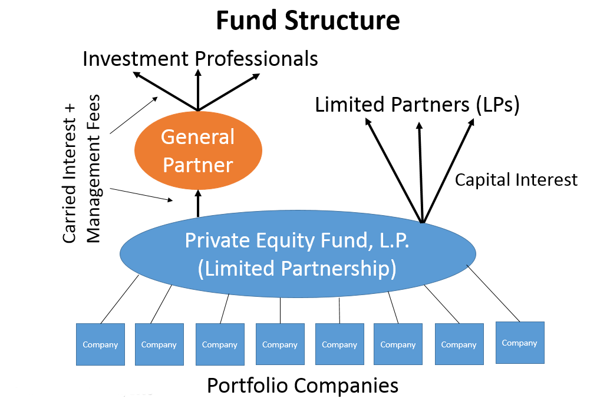

## Table of Contents

## What are private equity and hedge funds?

Private equity funds are investment funds that collect money from investors to buy and manage companies that are not publicly traded on stock exchanges. They aim to improve these companies' performance and sell them later for a profit. These funds often focus on long-term investments and can involve significant changes to the companies they acquire, like restructuring or expanding operations. Because private equity funds deal with private companies, they are less regulated than public investments, which can lead to higher potential returns but also higher risks.

Hedge funds are also investment funds that pool money from investors, but they use a wider range of strategies to earn returns. These strategies can include buying stocks, bonds, commodities, and even using complex financial instruments like derivatives. Hedge funds often aim to make money whether markets are going up or down, which is why they are called "hedge" funds—they try to hedge against market downturns. Like private equity funds, hedge funds are typically less regulated and available only to wealthy individuals or institutional investors, which allows them to take on more risk in pursuit of higher returns.

## How do private equity and hedge funds differ from traditional investments?

Private equity and hedge funds are different from traditional investments like stocks and bonds. Traditional investments are usually bought and sold on public markets, like stock exchanges, where anyone can invest. They follow strict rules and have to share a lot of information with the public. Private equity and hedge funds, on the other hand, are not traded on public markets. They are often only available to rich people or big organizations, and they don't have to follow as many rules. This means they can take bigger risks and try to make more money, but it also makes them riskier.

Private equity funds focus on buying and managing whole companies that are not on the stock market. They work to make these companies better and then sell them for a profit, which can take many years. Hedge funds, meanwhile, use many different ways to make money, like betting on stocks going up or down, or using complex financial tools. They try to make money no matter what the market is doing. Both types of funds can offer higher returns than traditional investments, but they also come with higher risks and less transparency.

## What is taxation and why is it important for investors?

Taxation is when the government takes a part of your money to pay for things like roads, schools, and hospitals. For investors, taxes can affect how much money they keep from their investments. When you make money from investments, like selling stocks or getting dividends, you have to pay taxes on that money. The amount of tax you pay depends on the type of investment and the tax laws in your country.

It's important for investors to understand taxes because it can change how much they really earn from their investments. If you don't think about taxes, you might end up with less money than you expected. Smart investors try to find ways to pay less tax legally, like using tax-advantaged accounts or choosing investments that are taxed less. Knowing about taxes helps investors make better choices and keep more of their money.

## How are private equity funds typically structured for tax purposes?

Private equity funds are usually set up as partnerships for tax purposes. This means the fund itself doesn't pay taxes on the money it makes. Instead, the investors in the fund, called limited partners, pay taxes on their share of the fund's profits. This can be good for investors because they only pay taxes on the money they actually get, not on the money the fund makes before it's shared out.

The people who run the fund, called general partners, also get special tax treatment. They often get paid in two ways: a management fee and a share of the profits, called carried interest. The management fee is taxed like regular income, but carried interest is usually taxed at a lower rate, like capital gains. This can save the general partners a lot of money in taxes, which is why the structure of private equity funds is important for both the investors and the people running the fund.

## What are the common tax treatments for income from hedge funds?

Income from hedge funds can be taxed in different ways depending on what kind of money the fund makes. If the [hedge fund](/wiki/hedge-fund-trading-strategies) makes money from things like interest, dividends, or short-term trading, that income is usually taxed as regular income. This means it gets taxed at the same rate as your salary or wages, which can be pretty high. But if the hedge fund makes money from long-term investments, like holding onto stocks for more than a year, that income might be taxed at a lower rate, called the capital gains rate. This can save investors some money on taxes.

Hedge fund managers also get special tax treatment on their earnings. They often get paid in two ways: a management fee and a share of the profits, called carried interest. The management fee is taxed like regular income, which can be high. But carried interest is usually taxed at the lower capital gains rate, even though it's really a reward for managing the fund. This can save hedge fund managers a lot of money in taxes. It's important for investors to understand these tax rules because they can affect how much money they keep from their investments in hedge funds.

## What is carried interest and how is it taxed in private equity?

Carried interest is a part of the profits that people who run private equity funds get. It's like a bonus for doing a good job managing the fund. Instead of getting paid a regular salary, these managers, called general partners, get a share of the money the fund makes when it sells companies it has bought and improved. This share is usually around 20% of the profits.

For tax purposes, carried interest is usually treated as a capital gain, not regular income. This means it gets taxed at a lower rate than if it were salary or wages. In many countries, the tax rate for capital gains is less than half of what you would pay on regular income. This can save the managers a lot of money in taxes. It's a big reason why people want to work in private equity, but it's also a topic that some people think should be changed to make it fairer.

## How do the tax implications of short-term vs. long-term capital gains affect hedge fund investors?

The tax implications of short-term vs. long-term capital gains can make a big difference for hedge fund investors. Short-term capital gains are profits from investments that you hold for one year or less. These gains are taxed at the same rate as your regular income, which can be pretty high. If you're in a high tax bracket, you might pay up to 37% on these gains in the U.S., for example. This means if your hedge fund makes a lot of money from quick trades, you could end up paying a lot in taxes.

On the other hand, long-term capital gains are profits from investments you hold for more than a year. These gains are taxed at a lower rate, usually between 0% and 20% in the U.S., depending on your income. For hedge fund investors, this means that if the fund holds onto investments for longer periods, the profits from those investments will be taxed less. This can help investors keep more of their money. So, understanding whether a hedge fund focuses on short-term or long-term investments can help you figure out how much you might owe in taxes.

## What are the tax considerations for foreign investors in U.S. private equity and hedge funds?

Foreign investors in U.S. private equity and hedge funds need to think about a few tax things. One big thing is something called "withholding tax." When foreign investors get money from U.S. investments, like dividends or interest, the U.S. government might take out a part of it right away. This is to make sure they get some tax money from foreign investors. The rate of this tax can be different depending on what kind of money it is and if there's a special tax treaty between the U.S. and the investor's home country. These treaties can help lower the tax rate, so it's good for investors to check if their country has one with the U.S.

Another thing to think about is something called "effectively connected income" (ECI). If a foreign investor is really involved in running the fund or if the fund is making money from things like real estate in the U.S., that money might be taxed like regular income. This means it could be taxed at a higher rate than other types of investment income. Foreign investors have to file a U.S. tax return to report this kind of income and pay the right amount of tax. It's important for them to understand these rules because it can affect how much money they keep from their investments in U.S. private equity and hedge funds.

## How can fund managers use offshore entities to minimize tax liabilities?

Fund managers sometimes set up offshore entities to help lower their taxes. An offshore entity is a company or fund that's based in a country with lower taxes or special tax rules. By using these entities, fund managers can move money around in a way that pays less tax. For example, they might put their fund in a place like the Cayman Islands, where there's no tax on investment income. This can save a lot of money because the profits from the fund don't get taxed as much, or sometimes not at all.

But using offshore entities isn't just about saving money on taxes. It can also help keep things private. Some countries with offshore entities have strict rules about keeping financial information secret. This means that what the fund is doing and how much money it's making can stay hidden from the public and even from some tax authorities. However, using offshore entities can be tricky. Governments around the world are trying to stop people from avoiding taxes this way, so fund managers need to be careful and make sure they're following all the rules.

## What are the implications of the Tax Cuts and Jobs Act of 2017 on private equity and hedge fund taxation?

The Tax Cuts and Jobs Act of 2017 made some big changes that affect private equity and hedge funds. One big change was lowering the top tax rate for individuals from 39.6% to 37%. This means that the people who run these funds, called general partners, might pay less tax on their regular income, like management fees. Another change was keeping the lower tax rate for carried interest, which is a big part of how these managers get paid. Carried interest is still taxed as a capital gain, which is usually less than half of what you'd pay on regular income. This helps the managers keep more of their money.

The Act also changed some rules about how businesses can deduct their expenses. Now, businesses can deduct up to 20% of their qualified business income, which can help private equity and hedge funds save on taxes. But there are some limits to this, especially for people in certain professions or if their income is really high. Overall, these changes mean that private equity and hedge fund managers might pay less in taxes, but they need to be careful to follow all the new rules and understand how they apply to their specific situation.

## How do state and local taxes impact the overall tax burden for private equity and hedge fund investors?

State and local taxes can add to the overall tax burden for private equity and hedge fund investors. These taxes can be different depending on where the investor lives or where the fund is based. For example, some states have high income taxes, which can take a big chunk out of the money investors make from their funds. If an investor lives in a state like California or New York, they might pay a lot more in state taxes than someone living in a state with no income tax, like Florida or Texas. This can make a big difference in how much money investors keep at the end of the day.

On top of state income taxes, there can also be other local taxes, like city or county taxes, that add to the total tax bill. Some places have special taxes on things like capital gains or investment income, which can hit private equity and hedge fund investors hard. It's important for investors to think about these state and local taxes when they're deciding where to live or where to set up their funds. By choosing a place with lower taxes, they might be able to keep more of their money. But it's not always easy, because other things like where the best investment opportunities are can also matter a lot.

## What advanced tax planning strategies can be employed by high-net-worth individuals investing in private equity and hedge funds?

High-net-worth individuals can use several advanced tax planning strategies when investing in private equity and hedge funds to minimize their tax burden. One common strategy is using offshore entities. By setting up a fund in a country with lower taxes, like the Cayman Islands, investors can reduce the taxes they pay on their investment income. This can be especially helpful for carried interest, which is often taxed at a lower rate if it's considered a capital gain. However, investors need to be careful and make sure they follow all the rules, because governments are trying to stop tax avoidance.

Another strategy is to use tax-advantaged accounts, like self-directed IRAs or other retirement accounts. These accounts let investors put money into private equity and hedge funds without paying taxes right away on the earnings. The money can grow tax-free until the investor takes it out in retirement, which can save a lot in taxes over time. High-net-worth individuals can also use something called tax-loss harvesting, where they sell investments that have lost value to offset gains from other investments. This can help lower their overall tax bill. It's important for these investors to work with a good tax advisor to make sure they're using these strategies the right way and following all the tax laws.

## References & Further Reading

[1]: Fleischer, Victor. (2007). ["Two and Twenty: Taxing Partnership Profits in Private Equity Funds."](https://papers.ssrn.com/sol3/papers.cfm?abstract_id=892440) The University of Chicago Law Review, 83(1), 1-59.

[2]: ["The Taxation of Private Equity Carried Interests"](https://scholarship.law.wm.edu/wmlr/vol50/iss1/4/) by Peter R. Orszag and Joseph E. Stiglitz, National Tax Journal, Vol. 63, No. 2 (June 2010).

[3]: ["Taxation and Regulation of Banks and Hedge Funds"](https://www.imf.org/en/Publications/WP/Issues/2016/12/31/The-Taxation-and-Regulation-of-Banks-25196) by Joseph E. Gagnon and Gary Gorton, National Bureau of Economic Research Working Paper No. 17625.

[4]: ["Algorithmic Trading and DMA"](https://www.amazon.com/Algorithmic-Trading-DMA-introduction-strategies/dp/0956399207) by Barry Johnson

[5]: ["High-Frequency Trading: A Practical Guide to Algorithmic Strategies and Trading Systems"](https://www.ahmetbeyefendi.com/wp-content/uploads/2020/07/High-Frequency-Trading-Irene-Aldridge.pdf) by Irene Aldridge