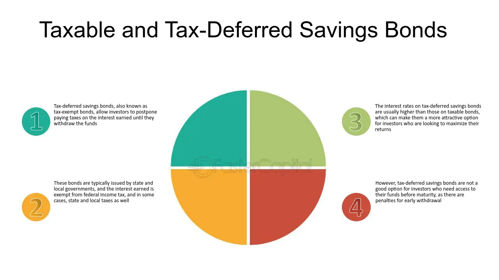

## Table of Contents

## What are U.S. Savings Bonds?

U.S. Savings Bonds are a type of investment issued by the U.S. Department of the Treasury. They are considered a safe way to save money because they are backed by the full faith and credit of the U.S. government. People buy these bonds to save money over time, and they earn interest until they are cashed in. There are different types of savings bonds, like Series EE and Series I, each with its own rules about how much interest they earn and when you can cash them in.

When you buy a U.S. Savings Bond, you are lending money to the government. In return, the government promises to pay you back the amount you paid for the bond, plus interest, after a certain period. You can buy these bonds in small amounts, making them a good choice for people who want to save a little at a time. You can buy them online through the TreasuryDirect website or, in some cases, with your tax refund. They are a popular choice for gifts and for saving for long-term goals like education or retirement.

## How are U.S. Savings Bonds taxed at the federal level?

The interest you earn on U.S. Savings Bonds is subject to federal income tax. You don't have to pay this tax until you cash in the bond or it stops earning interest, whichever comes first. This means you can choose when to pay the tax, which can be helpful for planning your taxes.

There is a special rule for using the interest from Series EE and Series I bonds to pay for education. If you use the money for qualified higher education expenses, you might not have to pay federal tax on the interest. There are some rules about who can use this tax break, like your income and the type of education expenses, so it's good to check the details with the IRS or a tax advisor.

U.S. Savings Bonds are not subject to state or local taxes. This can make them a good choice if you live in a place with high state taxes. Remember, though, you still have to report the interest on your federal tax return when you cash in the bond or it matures.

## Are there any state or local taxes on U.S. Savings Bonds?

U.S. Savings Bonds are not taxed by state or local governments. This means you don't have to pay any state or city taxes on the interest you earn from these bonds. This can be a big plus if you live in a place with high state taxes.

Even though you don't pay state or local taxes, you still need to pay federal taxes on the interest. You only pay these federal taxes when you cash in the bond or it stops [earning](/wiki/earning-announcement) interest. This lets you decide when to pay the taxes, which can help with your tax planning.

## What is the difference between taxing the interest annually versus at maturity?

When you tax the interest on a U.S. Savings Bond annually, you pay taxes on the interest it earns every year. This means you report the interest as income on your tax return each year, even if you haven't cashed in the bond yet. This can be good if you want to spread out your tax payments over time, but it can also mean you pay taxes before you actually get the money.

On the other hand, taxing the interest at maturity means you only pay taxes when you cash in the bond or it stops earning interest. This way, you don't have to report any interest until you get the money. It can be helpful for tax planning because you can choose when to cash in the bond and pay the tax. This method is used for U.S. Savings Bonds, so you can decide when to pay the tax based on when you need the money or what works best for your taxes.

## Can the interest from U.S. Savings Bonds be tax-exempt under certain conditions?

Yes, the interest from U.S. Savings Bonds can be tax-exempt if you use it to pay for qualified higher education expenses. This applies to Series EE and Series I bonds. To get this tax break, you need to meet certain rules, like your income must be below a certain level and the education expenses must be for you, your spouse, or your dependent. It's a good idea to check the details with the IRS or a tax advisor to make sure you qualify.

This tax exemption can be a big help if you're saving for college or other higher education costs. Instead of paying federal taxes on the interest, you can use all of it to help cover tuition, fees, and other qualified expenses. Just remember, even though the interest might be tax-exempt for federal taxes, you still don't have to pay state or local taxes on U.S. Savings Bonds interest at all.

## How does the education tax exclusion work with U.S. Savings Bonds?

The education tax exclusion lets you use the interest from Series EE and Series I U.S. Savings Bonds without paying federal taxes on it, as long as you use the money for qualified higher education expenses. These expenses can include tuition and fees for college, university, or vocational school. To get this tax break, the bonds must be in your name or your spouse's name if you're married, and you need to be at least 24 years old when the bonds were issued. Also, your income has to be below a certain level, and you must use the money for yourself, your spouse, or someone you claim as a dependent on your taxes.

You can find out if you qualify by checking the income limits and other rules set by the IRS. If you meet all the requirements, you can fill out Form 8815 when you file your taxes to exclude the interest from your taxable income. This can save you a lot of money if you're saving for college or other higher education costs. Just remember, even though the interest might be tax-exempt for federal taxes, you still don't have to pay state or local taxes on U.S. Savings Bonds interest at all.

## What are the income limits for the education tax exclusion?

The income limits for the education tax exclusion change every year. For the year 2023, if you file your taxes as single or head of household, you can't exclude any interest if your modified adjusted gross income (MAGI) is $100,800 or more. If you're married and filing jointly, you can't exclude any interest if your MAGI is $155,250 or more. If your income is less than these amounts, you might be able to exclude some or all of the interest, depending on how much you earn.

For example, if you're single and your MAGI is between $85,800 and $100,800, or if you're married filing jointly and your MAGI is between $128,650 and $155,250, you can exclude part of the interest. The amount you can exclude goes down as your income goes up in these ranges. If your income is below $85,800 for single filers or $128,650 for joint filers, you can exclude all the interest from your taxes. Always check the latest IRS rules to make sure you know the current limits and how they apply to you.

## How do you report interest income from U.S. Savings Bonds on your tax return?

When you cash in your U.S. Savings Bonds or they stop earning interest, you need to report the interest you earned on your federal tax return. You do this by filling out Form 1040 or Form 1040-SR. On these forms, you'll find a section called "Interest Income." You write the total interest you earned from your savings bonds in this section. The IRS gets a record of this interest from the Treasury Department, so it's important to report it correctly.

If you're using the interest from your Series EE or Series I bonds for qualified higher education expenses, you might not have to pay federal tax on that interest. To claim this tax break, you need to fill out Form 8815 and attach it to your tax return. On Form 8815, you'll show how much interest you earned and how much you used for education. If you meet the income limits and other rules, you can exclude that interest from your taxable income. Always check the latest IRS guidelines to make sure you're following the rules correctly.

## What happens if you cash in a bond before it matures?

If you cash in a U.S. Savings Bond before it matures, you might lose some of the interest it could have earned. Most bonds have a penalty if you cash them in within the first five years. For example, with Series EE and Series I bonds, you lose the last three months of interest if you cash them in before five years are up. This means you get back less money than if you had waited.

Even though you might lose some interest, you still have to pay taxes on the interest you did earn when you cash in the bond. You report this interest on your federal tax return. If you're using the money for qualified higher education expenses, you might not have to pay federal tax on the interest, but you need to meet certain rules to get this tax break.

## Are there any tax strategies to minimize the tax liability from U.S. Savings Bonds?

One way to lower the taxes you pay on U.S. Savings Bonds is to use the interest for qualified higher education expenses. If you meet certain income limits and other rules, you can avoid paying federal taxes on the interest. This can save you a lot of money if you're saving for college or other higher education costs. Just make sure the bonds are in your name or your spouse's name, and you were at least 24 years old when you bought them. Check with the IRS to make sure you qualify for this tax break.

Another strategy is to choose when to cash in your bonds to manage your tax bill. Since you only pay federal taxes on the interest when you cash in the bond or it stops earning interest, you can decide the best time to do this based on your income and tax situation. If you think your income will be lower in a certain year, you might want to cash in the bonds then to pay less tax. Remember, if you cash in the bonds before five years are up, you lose the last three months of interest, so think about that when planning your strategy.

## How do changes in tax laws affect the taxation of U.S. Savings Bonds?

Changes in tax laws can affect how you pay taxes on U.S. Savings Bonds. If the government changes the tax rules, it might change how much tax you pay on the interest from your bonds. For example, if the tax rates go up, you might have to pay more tax on the interest when you cash in your bonds. On the other hand, if the tax rates go down, you might pay less. Also, if the rules about using bond interest for education change, it could affect whether you can avoid paying federal taxes on that interest.

These changes can make a big difference in your savings plan. It's a good idea to keep an eye on any new tax laws that might affect your bonds. If the rules change, you might need to adjust your strategy for when to cash in your bonds or how to use the money. Talking to a tax advisor can help you understand how new laws might affect your savings and what you can do to pay less tax.

## What are the implications of holding U.S. Savings Bonds in a trust or estate?

When you hold U.S. Savings Bonds in a trust or estate, it can change how the interest is taxed. Normally, you only pay federal taxes on the interest when you cash in the bonds or they stop earning interest. But if the bonds are in a trust or estate, the interest might be taxed differently. The trust or estate might have to pay taxes on the interest each year, instead of waiting until the bonds are cashed in. This means you need to think about how this could affect your tax planning.

Also, if the bonds are in a trust or estate, the rules for using the interest for education expenses might not apply. Usually, you can avoid paying federal taxes on the interest if you use it for qualified higher education costs. But when bonds are held in a trust or estate, this tax break might not be available. It's a good idea to talk to a tax advisor to understand how holding bonds in a trust or estate will affect your taxes and what you can do to save money.

## What are the types of U.S. Savings Bonds?

U.S. savings bonds are a form of government debt that provides a safe investment option with predictable returns. The primary types of U.S. savings bonds are Series EE and Series I bonds, each designed to cater to different financial strategies and investor needs.

**Series EE Bonds** are known for their reliability and straightforward structure. These bonds feature a fixed interest rate that is determined at the time of purchase. A notable feature of Series EE bonds is their commitment to double in value over a 20-year period, regardless of the prevailing interest rates. This guarantee can be particularly attractive for investors seeking a long-term, secure investment vehicle. The fixed interest rate method means that earnings accrue monthly and compound semiannually, offering steady growth over time.

**Series I Bonds**, by contrast, provide protection against inflation, a key differentiator from Series EE bonds. Series I bonds have a composite interest rate, which is a combination of a fixed rate and an inflation rate that adjusts every six months according to the Consumer Price Index for All Urban Consumers (CPI-U). This dual-rate mechanism allows Series I bonds to maintain their value in real terms, appealing to investors concerned about inflation eroding their earnings. The formula for the composite rate is:

$$
\text{Composite Rate} = \text{Fixed Rate} + 2 \times \text{Inflation Rate} + (\text{Fixed Rate} \times \text{Inflation Rate})
$$

This equation ensures that the [interest rate](/wiki/interest-rate-trading-strategies) keeps pace with inflation, providing an effective hedge against rising price levels.

**Series HH Bonds** are an older type of savings bond that the U.S. government no longer issues. However, existing Series HH bonds continue to hold value and pay interest. These bonds were unique because they provided investors with fixed interest payments every six months, making them similar to annuities. They were often used as a reinvestment option for matured Series EE bonds. Although new purchases are no longer possible, holders of existing Series HH bonds continue to receive interest until maturity, maintaining their value for those who invested in them before issuance ceased.

In summary, Series EE and Series I bonds serve as vital tools for individuals seeking low-risk investment opportunities. With distinct features tailored to different financial circumstances and goals, they remain a popular choice for conservative investors looking to balance interest income and inflation protection.

## What is the relationship between Algorithmic Trading and Bonds?

Algorithmic trading in bonds involves the use of sophisticated computer algorithms to automate trading decisions, thereby optimizing execution and enhancing strategic outcomes. The application of [algorithmic trading](/wiki/algorithmic-trading) in the bond market improves efficiency, particularly in executing large orders and navigating through various market segments. Although U.S. savings bonds are traditionally designed to be held until maturity and are not frequently traded, algorithmic trading offers significant advantages in broader government securities where [liquidity](/wiki/liquidity-risk-premium) and pricing strategies are crucial.

These trading algorithms are built to process large volumes of data at rapid speeds, enabling traders to identify [arbitrage](/wiki/arbitrage) opportunities, manage portfolios dynamically, and improve the timing of market entries and exits. For example, an algorithm can be programmed to execute trades based on specific market conditions such as interest rate changes, economic indicators, or [volatility](/wiki/volatility-trading-strategies) levels.

A common approach in algorithmic trading is the use of quantitative models to predict price movements or market behavior. These models might employ statistical techniques like regression analysis, time series analysis, or [machine learning](/wiki/machine-learning) algorithms. For instance, a simple regression model might be represented as:

$$
P(t) = \beta_0 + \beta_1 X_1(t) + \beta_2 X_2(t) + \cdots + \beta_n X_n(t) + \epsilon(t)
$$

where $P(t)$ is the predicted price at time $t$, $\beta_0$ is the intercept, $\beta_1, \beta_2, \ldots, \beta_n$ are the coefficients for the predictor variables $X_1(t), X_2(t), \ldots, X_n(t)$, and $\epsilon(t)$ is the error term.

In broader government securities, algorithms enhance liquidity by facilitating quicker and more accurate matching of buy and sell orders, thereby reducing the bid-ask spreads. This improved liquidity is essential in large and heavily-traded markets like U.S. Treasury securities, where timely execution can significantly affect the profitability of investment strategies.

Furthermore, algorithms assist in better pricing strategies by dynamically adjusting the prices based on market trends and [order book](/wiki/order-book-trading-strategies) dynamics. This capability is essential for market-making, where the objective is to profit from the spread between bid and ask prices.

Overall, while U.S. savings bonds are not typically the focus of algorithmic trading strategies due to their nature, the principles and technologies behind algorithmic trading play a vital role in optimizing trading across a spectrum of government securities, enhancing market operations and investor outcomes.

## References & Further Reading

Explore further resources to gain more insights into U.S. savings bonds and algorithmic trading strategies. For comprehensive information on U.S. savings bonds, you can visit [TreasuryDirect](https://www.treasurydirect.gov/). This website is an authoritative source for purchasing bonds and understanding their interest and tax implications. It provides details on the process of buying, redeeming, and managing savings bonds, as well as up-to-date information on current rates and terms. It is essential for investors to peruse these resources for well-informed financial planning and decision-making.

For a deeper understanding of financial markets and investment strategies, consider reading [books](/wiki/algo-trading-books) and scholarly articles that offer detailed analyses and perspectives. Some recommended readings include "The Bond Book" by Annette Thau for an overview of bond investments, and "Algorithmic Trading: Winning Strategies and Their Rationale" by Ernie Chan, which explores the quantitative strategies behind algorithmic trading. Articles in financial journals and papers on trading algorithms can also provide valuable academic and practical insights, helping bridge the gap between theory and application in modern investing.

Further, numerous online courses and tutorials on platforms like Coursera, EdX, and Khan Academy cover both savings bonds and algorithmic trading, providing interactive learning experiences with expert instructors. These resources can enhance your knowledge and skills, contributing to more strategic investment choices.

