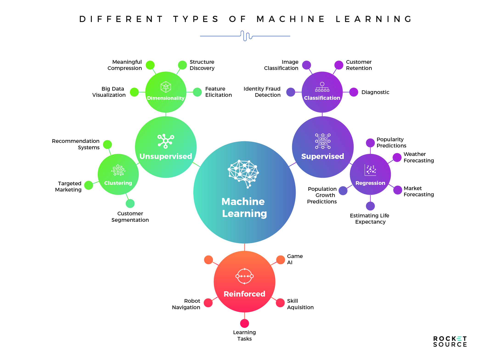

## Table of Contents

## What is a taxonomy in the context of machine learning?

In the context of machine learning, a taxonomy is a way to organize and classify different types of data, algorithms, or models into categories. Think of it as a big family tree where each branch represents a different group. For example, in machine learning, you might have a taxonomy that separates algorithms into supervised learning, unsupervised learning, and reinforcement learning. This helps people understand the relationships between different methods and choose the right one for their specific problem.

Taxonomies are useful because they make complex information easier to understand and navigate. For instance, if you are trying to solve a problem with image recognition, you can look at a taxonomy to see which algorithms are commonly used for this task. This can save time and help you make better decisions. Overall, taxonomies act like a map, guiding you through the vast landscape of machine learning techniques and helping you find the best path to your goal.

## Why is taxonomy expansion important in machine learning?

Taxonomy expansion in machine learning is important because it helps keep up with new ideas and technologies. As machine learning grows, new methods and algorithms are created all the time. If we don't update our taxonomy, it can become outdated and not very useful. By expanding the taxonomy, we can include these new methods, making it easier for people to understand and use the latest techniques. This way, the taxonomy stays relevant and helpful for everyone working in the field.

Expanding the taxonomy also helps to make sure that all the different parts of [machine learning](/wiki/machine-learning) are well-organized. When new categories or subcategories are added, it can show how different methods are connected or how they are different from each other. This can lead to better understanding and more creative ways to solve problems. For example, if a new type of [neural network](/wiki/neural-network) is developed, adding it to the taxonomy can help researchers see how it fits with other types of networks, which might lead to new ideas or improvements.

## What are the basic components of a taxonomy expansion model?

The basic components of a taxonomy expansion model include a way to collect new data or methods, a method to analyze this new information, and a system to update the existing taxonomy. First, the model needs to gather new data or methods that have been developed recently. This could be done by looking at new research papers, listening to experts in the field, or using data from new experiments. Once this new information is collected, the model needs to analyze it to see how it fits with what is already known. This analysis might involve comparing the new methods to existing ones, looking for similarities and differences, and deciding where the new methods should go in the taxonomy.

After analyzing the new information, the model needs a way to update the existing taxonomy. This involves adding new categories or subcategories, moving existing items to different places, or even merging categories if they become too similar. The update process should be careful and well-thought-out to make sure the taxonomy stays organized and useful. By expanding the taxonomy in this way, it can stay up-to-date with the latest developments in machine learning, helping researchers and practitioners find the best methods for their work.

## How does TaxoExpan approach taxonomy expansion?

TaxoExpan is a smart way to grow a taxonomy in machine learning. It uses a method called "iterative expansion." This means it keeps adding new things to the taxonomy bit by bit. First, TaxoExpan looks at new data or methods that have been developed. It then tries to figure out where these new things fit in the existing taxonomy. It does this by comparing the new things to what is already there, looking for similarities and differences. This helps TaxoExpan decide if the new things should go into a new category, or if they should be added to an existing one.

Once TaxoExpan knows where the new things should go, it updates the taxonomy. It might add new categories, move things around, or even combine categories if they become too similar. The key is to keep the taxonomy organized and useful. TaxoExpan makes sure that the taxonomy stays up-to-date with the latest developments in machine learning. This helps researchers and practitioners find the best methods for their work more easily. By using this iterative approach, TaxoExpan keeps the taxonomy growing and improving over time.

## What types of data are typically used to train taxonomy expansion models?

Taxonomy expansion models are usually trained using a variety of data types. One common type of data is text from research papers and articles. These texts contain new ideas and methods that can be added to the taxonomy. By analyzing the words and phrases in these papers, the model can learn how to place new concepts into the right categories. Another type of data used is from expert opinions and discussions. Experts often share their thoughts on new developments, and this information can help the model understand how to organize new methods correctly.

In addition to text data, taxonomy expansion models can also use structured data from databases. These databases might contain information about existing taxonomies and how they have been updated over time. By studying this data, the model can learn patterns and rules for expanding the taxonomy effectively. Sometimes, the model might also use data from experiments and simulations. This data can show how new methods perform in real-world situations, helping the model decide where they fit best in the taxonomy. By using a mix of these different types of data, the model can keep the taxonomy up-to-date and useful for everyone in the field.

## Can you explain the difference between supervised and unsupervised taxonomy expansion?

Supervised taxonomy expansion is like having a teacher to guide you. In this method, you start with a set of examples where you already know where things should go in the taxonomy. You use these examples to train a model, showing it exactly how to place new concepts into the right categories. For example, if you have a new type of machine learning algorithm, you might show the model where similar algorithms are already placed in the taxonomy. The model then learns from these examples and uses them to decide where to put new things. This method is good when you have a lot of clear examples to work with.

Unsupervised taxonomy expansion is more like exploring on your own without a teacher. Here, you don't have examples to show the model where things should go. Instead, the model looks at the data and tries to figure out the best way to organize it. It might look for patterns or similarities between different pieces of data to decide how to create new categories or subcategories. This method is useful when you don't have a lot of labeled examples, but it can be harder to make sure the taxonomy stays organized and accurate. Both methods have their place, depending on the kind of data you have and what you need the taxonomy to do.

## What are some common challenges faced when implementing taxonomy expansion models?

One common challenge when implementing taxonomy expansion models is dealing with the complexity of the data. As new methods and technologies emerge, the data that needs to be organized can become very complicated. This makes it hard for the model to figure out where new things should go in the taxonomy. For example, if a new type of neural network is developed, the model has to understand how it is different from existing networks and where it fits best. This can be tricky because the differences might be small or hard to spot. The model needs to be smart enough to see these differences and make good decisions.

Another challenge is keeping the taxonomy up-to-date and accurate. As the field of machine learning grows, new ideas and methods are constantly being added. This means the taxonomy needs to be updated regularly to stay useful. However, updating the taxonomy can be a lot of work. The model has to be careful not to make the taxonomy too messy or confusing. It needs to balance adding new categories with keeping the existing ones organized. If the model makes mistakes, the taxonomy can become hard to use, which can slow down research and make it harder for people to find the best methods for their work.

## How does TaxoExpan handle the problem of semantic drift in taxonomy expansion?

TaxoExpan tackles the problem of semantic drift by using a smart way to keep the meaning of categories clear as the taxonomy grows. Semantic drift happens when the meaning of a category changes over time, making it hard to keep the taxonomy organized. TaxoExpan uses a method called "iterative expansion" to add new things to the taxonomy bit by bit. This helps because it can check and adjust the meanings of categories as it goes along. By doing this, TaxoExpan makes sure that the categories stay meaningful and useful, even as new ideas and methods are added.

To make sure the meanings stay clear, TaxoExpan also uses a technique called "contextual analysis." This means it looks at the words and phrases around new concepts to understand their meaning better. By comparing these new concepts to what is already in the taxonomy, TaxoExpan can see if the meanings of categories are starting to drift. If it finds a drift, it can fix it by moving things around or adding new categories. This way, TaxoExpan keeps the taxonomy organized and easy to use, helping researchers and practitioners find the best methods for their work.

## What evaluation metrics are used to assess the performance of taxonomy expansion models?

When people want to see how well a taxonomy expansion model is doing, they use different ways to measure it. One common way is to look at how accurate the model is. This means checking if the new things the model adds to the taxonomy are put in the right places. Another way is to use a measure called F1 score. The F1 score is a mix of two other measures: precision and recall. Precision looks at how many of the things the model added were correct, while recall looks at how many of the correct things the model found. The F1 score helps give a good overall picture of how well the model is doing. 

Another important way to measure the performance of taxonomy expansion models is to check how well they keep the taxonomy organized. This can be done by looking at a measure called "consistency." Consistency means that the new things added to the taxonomy fit well with the old ones and do not make the taxonomy confusing. People also use "coverage" to see how many new things the model can handle. Coverage is about how much of the new data the model can add to the taxonomy. By using these different measures, people can get a good idea of how well the taxonomy expansion model is working and where it might need to be improved.

## How can taxonomy expansion models be integrated into existing machine learning pipelines?

Integrating taxonomy expansion models into existing machine learning pipelines can be done by adding them as a step where new data or methods are analyzed and added to the taxonomy. First, you need to find a spot in your pipeline where new information comes in. This could be after you collect new data or when you learn about new algorithms. Once you have this spot, you can plug in the taxonomy expansion model. The model will look at the new information and decide where it fits in the taxonomy. This helps keep your taxonomy up-to-date without messing up the rest of your pipeline.

After the taxonomy expansion model does its job, the updated taxonomy can be used to improve other parts of your machine learning work. For example, if you are training a model, you can use the expanded taxonomy to help choose the right algorithms or to better understand the data you are working with. This can make your models more accurate and helpful. By adding the taxonomy expansion model in the right place and using its results wisely, you can make your machine learning pipeline smarter and more effective.

## What are some advanced techniques used in TaxoExpan to improve taxonomy expansion accuracy?

TaxoExpan uses a technique called "contextual analysis" to make its taxonomy expansion more accurate. This means it looks at the words and phrases around new concepts to understand their meaning better. By comparing these new concepts to what is already in the taxonomy, TaxoExpan can see if the meanings of categories are starting to drift. If it finds a drift, it can fix it by moving things around or adding new categories. This way, TaxoExpan keeps the taxonomy organized and easy to use, helping researchers and practitioners find the best methods for their work.

Another advanced technique TaxoExpan uses is "iterative expansion." This means it adds new things to the taxonomy bit by bit, checking and adjusting the meanings of categories as it goes along. By doing this, TaxoExpan makes sure that the categories stay meaningful and useful, even as new ideas and methods are added. This careful approach helps prevent mistakes and keeps the taxonomy up-to-date with the latest developments in machine learning.

## What future developments are expected in the field of taxonomy expansion models?

In the future, taxonomy expansion models are expected to become even smarter and more helpful. One big change might be the use of more advanced [artificial intelligence](/wiki/ai-artificial-intelligence) techniques, like [deep learning](/wiki/deep-learning). These techniques can help the models understand the meaning of new data better, making the taxonomy more accurate and useful. Another expected development is the use of more data from different sources, like social media and real-time data streams. This can help keep the taxonomy up-to-date with the latest ideas and methods, making it easier for people to find what they need.

Another future development could be better ways to work together on taxonomies. This might mean creating tools that let many people add and change the taxonomy at the same time. By working together, people can make the taxonomy more complete and accurate. Also, there might be new ways to check how good the taxonomy is, using new measures and tests. These improvements can help make sure the taxonomy stays useful and easy to use, even as the field of machine learning keeps growing.

## References & Further Reading

[1]: Carvalho, V. O., Prudêncio, R. B. C., & Ludermir, T. B. (2019). ["A Survey of Taxonomy Expansion Strategies."](https://link.springer.com/chapter/10.1007/978-3-540-87536-9_54) arXiv preprint arXiv:1908.05861.

[2]: Farber, M., Abualhaija, S., & Heesche, T. (2018). ["A Survey on Taxonomy Induction, Focal Concepts, and Relation Labels: A Case Study of the ACL Anthology."](https://www.aclweb.org/anthology/L18-1324/) In Proceedings of the Eleventh International Conference on Language Resources and Evaluation.

[3]: Suchanek, F. M., Abiteboul, S., & Senellart, P. (2011). ["PARIS: Probabilistic Alignment of Relations, Instances, and Schema."](https://arxiv.org/abs/1111.7164) Proceedings of the VLDB Endowment, 5(3), 157-168.

[4]: Navigli, R., & Velardi, P. (2004). ["Learning Domain Ontologies from Document Warehouses and Dedicated Web Sites."](https://aclanthology.org/J04-2002/) Computational Linguistics, 30(2), 151-179.

[5]: Guo, X., Zhang, Z., & Deng, Y. (2018). ["A Survey on Voice Analytics for Customer Interaction: The Journey from Academic Research to Commercial Adoption."](https://www.benthamdirect.com/content/journals/cmc/10.2174/0109298673328877241113091539) IEEE Access, 6, 74225-74235.