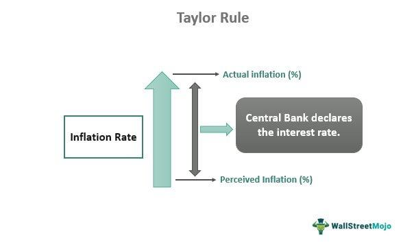

The Taylor Rule is a fundamental formula in economic policymaking, playing a crucial role in the guidance of monetary policy. Developed by economist John Taylor, it offers a methodical framework that allows central banks like the Federal Reserve to adjust interest rates in response to shifts in inflation and economic growth. By providing a structured formula, the Taylor Rule assists central banks in maintaining equilibrium, thus ensuring economic stability.

The Taylor Rule's formula is based on the relationship between nominal interest rates, inflation, and economic output. It suggests adjustments to the interest rate based on deviations from target inflation and economic growth, offering a grounded approach for monetary policy adjustments.



This article investigates the broader implications of the Taylor Rule across various domains, from its influence on economic models and policy formulation to its integration within algorithmic trading systems. The approach aids in forecasting economic trends and policy decisions, with a particular emphasis on preventing asset bubbles, which can destabilize financial markets. By comprehensively understanding the Taylor Rule, traders, economists, and policymakers can strive for a stable and balanced economic environment, benefiting from both theoretical insights and practical applications.

## Table of Contents

## Understanding the Taylor Rule

The Taylor Rule is a monetary policy guideline that central banks can use to determine appropriate interest rate levels based on prevailing economic conditions, particularly inflation and GDP growth. Proposed by economist John B. Taylor in 1993, the rule offers a structured framework for adjusting the nominal interest rate in response to economic fluctuations. 

The formula for the Taylor Rule is traditionally expressed as:

$$
i_t = r_t^* + \pi_t + 0.5(\pi_t - \pi^*) + 0.5(y_t - y^*)
$$

where:
- $i_t$ is the nominal interest rate.
- $r_t^*$ represents the real equilibrium interest rate, reflecting the underlying real rate of return that is neutral to the economy.
- $\pi_t$ denotes the current inflation rate.
- $\pi^*$ is the target inflation rate, often set around 2% by many central banks including the Federal Reserve.
- $y_t$ indicates the logarithm of current GDP.
- $y^*$ symbolizes the logarithm of potential GDP, a measure of economic output in the absence of cyclical fluctuations.

The Taylor Rule posits that central banks should increase interest rates when the inflation rate exceeds the target or when real GDP surpasses its potential level. This is intended to prevent the economy from overheating. Conversely, it suggests reducing interest rates when inflation is below the target or when real GDP falls short of its potential, thereby stimulating economic activity.

The rule is based on the principle of maintaining equilibrium between actual economic performance and desired economic targets, assisting central banks in preserving economic stability. By providing a systematic method for [interest rate](/wiki/interest-rate-trading-strategies) adjustment, the Taylor Rule aids policymakers in mitigating economic [volatility](/wiki/volatility-trading-strategies), ultimately aiming for a balanced economic environment.

## Components of the Taylor Rule

The Taylor Rule is a fundamental formula in monetary policy, primarily composed of several interrelated components: the nominal federal funds rate, the real interest rate, the inflation rate, and GDP output. Each of these elements plays a critical role in determining an appropriate monetary policy stance.

The nominal federal funds rate is the interest rate at which depository institutions lend balances to each other overnight. This rate serves as a primary tool for central banks, notably the Federal Reserve, to influence broader economic conditions. The Taylor Rule employs this rate as a key variable to guide policy adjustments in response to changes in economic indicators.

Central to the Taylor Rule is the concept of the real interest rate, which is the nominal rate adjusted for inflation. This adjustment is crucial as inflation erodes the purchasing power of money, impacting economic decision-making. The formula emphasizes maintaining an equilibrium real interest rate, which is considered neutral for economic growth—neither stimulating nor restraining the economy. This rate aligns with the long-term potential growth of the economy and the optimal inflation target, often set at around 2%.

Mathematically, the Taylor Rule can be expressed as:

$$
i_t = r^* + \pi_t + 0.5(\pi_t - \pi^*) + 0.5(y_t - y^*),
$$

where:
- $i_t$ is the nominal federal funds rate,
- $r^*$ is the real equilibrium interest rate,
- $\pi_t$ is the current inflation rate,
- $\pi^*$ is the target inflation rate,
- $y_t$ is the logarithm of real GDP,
- $y^*$ is the logarithm of potential output (potential GDP).

The Taylor Rule also examines the gap between current GDP and potential GDP, called the output gap. This measurement assesses the economy's performance relative to its potential. A positive output gap, where actual GDP exceeds potential GDP, might signal overheating, warranting higher interest rates to curb inflation. Conversely, a negative output gap points to underutilized resources, suggesting the need for lower rates to stimulate economic activity.

By quantifying the deviation of inflation from its target and the output gap, the Taylor Rule provides a systematic framework for adjusting interest rates. This structured approach helps central banks modulate economic activity, aiming to maintain economic stability over varying economic conditions.

## The Taylor Rule and Inflation

Inflation is a critical variable considered in the Taylor Rule, as it significantly impacts the economic decisions of central banks. Influenced by factors such as consumer price indices (CPI), producer prices, and employment indices, inflation gauges the pace at which the general level of prices for goods and services rises, eroding purchasing power. The Taylor Rule employs these indicators to advise central banks on appropriate adjustments to interest rates.

Taylor proposed a formula where the real interest rate should be approximately 1.5 times the current inflation rate, aiming for a long-term target inflation rate of around 2%. This target aligns with the inflation objectives of many central banks, including the Federal Reserve, providing a benchmark for a stable economic environment. The Taylor Rule can be mathematically expressed as follows:

$$
i_t = r^* + \pi_t + 0.5(\pi_t - \pi^*) + 0.5(y_t - y^*)
$$

Where:
- $i_t$ is the nominal interest rate.
- $r^*$ is the real interest rate target.
- $\pi_t$ is the current inflation rate.
- $\pi^*$ is the target inflation rate (often 2%).
- $y_t$ is the logarithm of current output.
- $y^*$ is the logarithm of potential output.

To track inflation trends effectively, methods like moving averages are applied. Moving averages smooth out short-term fluctuations and highlight longer-term trends in inflation, aiding central banks in decision-making. For example, using a moving average of CPI data can filter out noise and reflect underlying inflation trends more accurately.

Python code can assist in calculating and analyzing such moving averages. Here is a simple example of calculating a moving average for inflation data using Python:

```python
import pandas as pd

# Sample inflation data
inflation_data = pd.Series([1.5, 1.7, 2.0, 2.2, 2.1, 2.3, 2.5, 2.4, 2.6, 2.7])

# Calculate moving average with a window size of 3
moving_average = inflation_data.rolling(window=3).mean()

print(moving_average)
```

The implications of accurately tracking inflation trends have a direct impact on interest rate settings, allowing central banks to preclude overheating in the economy or conversely, provide stimulus when necessary. By targeting a real interest rate that exceeds inflation by a [factor](/wiki/factor-investing), based on the Taylor Rule's prescriptions, central banks aim to stabilize purchasing power and maintain economic stability within their respective jurisdictions.

## Economic Output in the Taylor Rule

Total economic output is a fundamental consideration in the application of the Taylor Rule, proposed by John Taylor as a guideline for central banks to adjust interest rates responsively to changing economic conditions. The economic output is commonly represented by Gross Domestic Product (GDP), which measures the total value of all goods and services produced within a country over a specific time period. To effectively utilize the Taylor Rule, it is essential to assess economic output against its potential, often termed potential GDP.

The calculation of real GDP is central to this assessment, achieved through the deflation of nominal GDP using the GDP deflator. The GDP deflator is an index that reflects changes in the price level of goods and services and is distinct from other measures of inflation like the Consumer Price Index (CPI) because it includes all goods and services produced domestically, rather than just a consumer-relevant subset. The formula for calculating real GDP is as follows:

$$
\text{Real GDP} = \frac{\text{Nominal GDP}}{\text{GDP Deflator}} \times 100
$$

By analyzing real GDP relative to potential GDP, central banks aim to determine the output gap — the difference between actual economic performance and optimal economic performance. A positive output gap, where real GDP exceeds potential GDP, signals an overheating economy which might necessitate increasing interest rates to curb inflationary pressures. Conversely, a negative output gap, where real GDP is below potential GDP, suggests underutilized economic capacity, warranting lower interest rates to stimulate growth.

The objective in applying the Taylor Rule is to maintain a neutral interest rate environment wherein both inflation and GDP growth are aligned with their respective targets, promoting economic stability. The formula for the Taylor Rule can be simplified as:

$$
i_t = r^* + \pi_t + 0.5(\pi_t - \pi^*) + 0.5(y_t - y^*)
$$

Here, $i_t$ is the nominal interest rate, $r^*$ is the equilibrium real interest rate, $\pi_t$ is the current inflation rate, $\pi^*$ is the target inflation rate, $y_t$ is the log of real GDP, and $y^*$ is the log of potential GDP.

Central banks utilize this framework to assess whether current economic output is in line with its potential, subsequently making informed decisions about monetary policy adjustments. This strategic alignment is crucial for ensuring that monetary interventions effectively stabilize the economy, avoiding undue inflation or stagnation.

## Application of the Taylor Rule in Algorithmic Trading

Algorithmic trading systems leverage the Taylor Rule to anticipate central bank policy changes and adjust trading strategies accordingly. The rule's systematic and formulaic nature makes it ideal for integration into quantitative models used by hedge funds and traders. By incorporating economic indicators—such as inflation and GDP growth—algorithmic models can simulate potential adjustments in interest rates. 

The Taylor Rule suggests setting the nominal interest rate ($i_t$) based on a formula: 
$$
i_t = r^* + \pi_t + 0.5(\pi_t - \pi^*) + 0.5(y_t - y^*)
$$
where:
- $r^*$ is the equilibrium real interest rate,
- $\pi_t$ is the current inflation rate,
- $\pi^*$ is the target inflation rate,
- $y_t$ is the logarithm of real GDP,
- $y^*$ is the logarithm of potential GDP.

This formula helps predict future interest rate movements, which are critical for traders making decisions based on expected market conditions. Quantitative models can automate the analysis of interest rate changes by continuously updating inputs like inflation rates and GDP data. These models execute trades based on predefined thresholds for interest rate deviations from expected Taylor Rule predictions.

In Python, for example, traders can set up a simple function to calculate the Taylor Rule rate:

```python
def taylor_rule_rate(r_star, pi_t, pi_star, y_t, y_star):
    return r_star + pi_t + 0.5 * (pi_t - pi_star) + 0.5 * (y_t - y_star)
```

By simulating various economic scenarios, traders can prepare strategies for potential central bank actions. The predictive nature of the Taylor Rule supports scenario analysis, enabling traders to model different market conditions and optimize their algorithms for various outcomes.

This approach not only enhances precision in trading decisions but also aids in risk management by providing a systematic method to gauge economic health and central bank tendencies. Algorithmic systems integrate these outputs with other economic indicators and technical analysis tools to generate comprehensive trading signals.

In summary, the Taylor Rule's integration into [algorithmic trading](/wiki/algorithmic-trading) frameworks facilitates precise predictions of central bank actions and enables traders to optimize trading strategies accordingly. Its structured approach aligns well with [quantitative trading](/wiki/quantitative-trading) models, supporting dynamic and informed trading decisions.

## The Taylor Rule's Role in Preventing Asset Bubbles

Historically, deviations from the Taylor Rule have played a noteworthy role in economic crises. A prime example is the 2007-2008 financial crisis, where many analysts argue that the prolonged period of low interest rates prior to the crisis contributed to the buildup of asset bubbles, especially in the housing market. The Taylor Rule suggests that central banks should adjust interest rates in response to divergences in inflation and economic output. When these rates are set too low relative to what the Taylor Rule would prescribe, it can lead to excessive borrowing and investing in speculative assets, fueling asset bubbles.

The formula proposed by John Taylor specifies that the nominal interest rate should adjust based on the inflation gap (the difference between actual and target inflation) and the output gap (the difference between actual and potential output). Mathematically, it can be expressed as:

$$
i_t = r^*_t + \pi_t + 0.5(\pi_t - \pi^*) + 0.5(y_t - y^*_t)
$$

where:
- $i_t$ is the nominal interest rate.
- $r^*_t$ is the real equilibrium interest rate.
- $\pi_t$ is the rate of inflation.
- $\pi^*$ is the target inflation rate.
- $y_t$ is the log of actual output.
- $y^*_t$ is the log of potential output.

By aligning interest rates with economic fundamentals, the Taylor Rule serves as a guideline to avoid the distortionary effects of overly low rates. When rates fall below the level suggested by the Taylor calculation, the opportunity cost of capital declines, encouraging speculative behavior and unsustainable asset price expansions. This can foster environments conducive to bubbles, as seen in numerous case studies spanning various sectors besides housing, such as tech stocks in the late 1990s.

The preventative role of the Taylor Rule is underscored in theoretical insights that highlight its capacity to guide central banks in setting interest rates that stabilize both inflation and output. Adhering closely to the Taylor Rule can therefore curb excessive monetary expansion that might otherwise lead to the overheating of markets.

By maintaining a balanced approach to policy rate adjustments, the Taylor Rule helps central banks minimize the risk of asset price bubbles and the subsequent economic instability they can produce. Through creating a more predictable and stable interest rate environment, it supports sustainable economic growth and financial stability.

## Conclusion

The Taylor Rule remains a pivotal tool in monetary policy for managing economic stability. Its ability to provide a structured approach for adjusting interest rates ensures that central banks can react systematically to changes in inflation and GDP, thereby maintaining equilibrium in the economy. Key to its effectiveness is the rule's flexibility to adapt to various economic conditions, making it a valuable asset not only for policymakers but also for traders and economists.

The expansion of the Taylor Rule's principles into trading arenas underscores its versatility. In algorithmic trading, where quantitative models drive decision-making, the Taylor Rule serves as a foundational element for predicting central bank actions. By integrating economic indicators such as inflation and output gaps into algorithms, traders can fine-tune their strategies to align with anticipated monetary policy changes. This capability enhances the efficiency of trading systems and allows for more informed decision-making.

The Taylor Rule's role as a bridge between economic theory and practical trading strategies highlights its significance in both policy formulation and market dynamics. By translating macroeconomic variables into actionable insights, it supports a balanced approach to both stabilizing economies and optimizing market interactions. Ultimately, the Taylor Rule's enduring impact lies in its dual application, fostering a synergy between policy and market forces that is essential for sustained economic health.

## References & Further Reading

[1]: Taylor, J. B. (1993). ["Discretion versus policy rules in practice."](https://web.stanford.edu/~johntayl/Onlinepaperscombinedbyyear/1993/Discretion_versus_Policy_Rules_in_Practice.pdf) Carnegie-Rochester Conference Series on Public Policy. 

[2]: Taylor, J. B. (2007). ["Housing and monetary policy."](https://www.nber.org/papers/w13682) In Housing, Housing Finance, and Monetary Policy. 

[3]: ["The Taylor Rule as a Guide to Conducting Monetary Policy"](https://www.investopedia.com/articles/economics/10/taylor-rule.asp) by Janet L. Yellen, presented at the Federal Reserve.

[4]: Bosch, J. (2013). ["Applications of the Taylor Rule in Financial Markets."](https://www.degruyter.com/document/doi/10.1515/roe-2014-0204/pdf) 

[5]: ["Handbook of Monetary Policy"](https://www.taylorfrancis.com/books/edit/10.4324/9780429270949/handbook-monetary-policy-jack-rabin) by Alan S. Blinder, Andrew W. Lo, and Robert F. Engle.

[6]: Svensson, L. E. O. (1999). ["Inflation Targeting as a Monetary Policy Rule."](https://www.nber.org/papers/w6790) National Bureau of Economic Research Working Paper. 

[7]: ["Monetary Policy and the Housing Bubble"](https://www.federalreserve.gov/newsevents/speech/bernanke20100103a.htm) by Robert L. Hetzel, Economic Review.

[8]: Brayton, F., & Tinsley, P. A. (1996). ["A guide to FRB/US: A macroeconomic model of the United States."](https://www.federalreserve.gov/pubs/feds/1996/199642/199642pap.pdf) Federal Reserve Discussion Papers.

[9]: ["Monetary Policy Rules"](https://www.federalreserve.gov/monetarypolicy/policy-rules-and-how-policymakers-use-them.htm) by John B. Taylor (Ed.), University of Chicago Press.