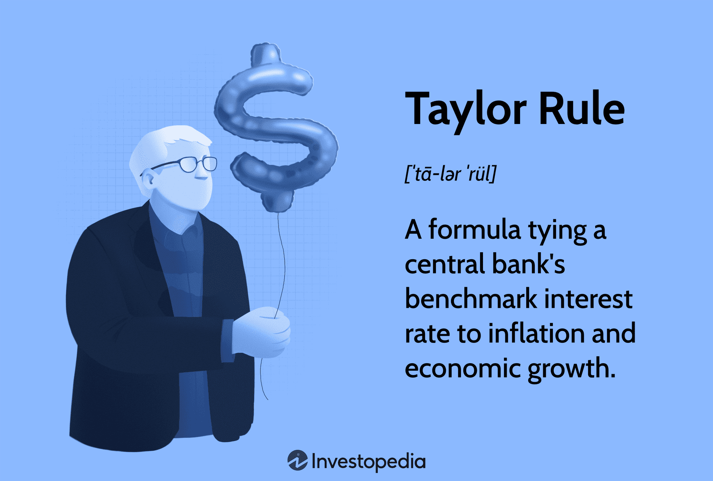

## Table of Contents

## What is the Taylor Rule?

The Taylor Rule is a guideline that helps central banks decide on interest rates. It was created by economist John Taylor. The rule suggests that central banks should adjust interest rates based on how the economy is doing. If inflation is high or the economy is growing too fast, the central bank should raise interest rates. If inflation is low or the economy is slowing down, the central bank should lower interest rates.

The Taylor Rule uses a simple formula to figure out the right interest rate. It looks at the current inflation rate and how far the economy is from its full potential. The rule says that the interest rate should be set at a level that is the sum of the inflation rate, the desired inflation rate, and half the difference between the actual and potential economic output, plus a small constant. This helps keep inflation stable and the economy growing at a healthy pace.

## Who developed the Taylor Rule and when?

The Taylor Rule was developed by John B. Taylor, an economist. He came up with this rule in 1993. John Taylor wanted to help central banks figure out what interest rates should be.

The rule is simple but useful. It helps central banks decide if they should raise or lower interest rates based on how the economy is doing. Since John Taylor introduced it, many central banks have used the Taylor Rule to guide their decisions.

## What are the key components of the Taylor Rule formula?

The Taylor Rule formula has a few important parts that help central banks decide on interest rates. One key part is the current inflation rate. This is how much prices are going up right now. Another part is the desired inflation rate, which is the level of inflation the central bank wants to reach. The difference between the actual and potential economic output is also important. This shows how well the economy is doing compared to how well it could be doing.

The formula also includes a small constant, which is usually around 2%. This constant helps set a base level for the interest rate. To use the formula, you add the current inflation rate, the desired inflation rate, and half of the difference between the actual and potential economic output. Then, you add the small constant. This gives you the interest rate that the central bank should set to keep the economy stable and inflation under control.

## How does the Taylor Rule help in setting interest rates?

The Taylor Rule helps central banks decide what interest rates should be by looking at how the economy is doing. It uses a simple formula that takes into account the current inflation rate, which is how much prices are going up, and the desired inflation rate, which is the level of inflation the central bank wants. The rule also considers the difference between how the economy is actually doing and how well it could be doing. By using these pieces of information, the Taylor Rule helps central banks figure out if they need to raise or lower interest rates to keep the economy stable.

When the economy is growing too fast or inflation is too high, the Taylor Rule suggests that the central bank should raise interest rates. This makes borrowing money more expensive, which can slow down the economy and help control inflation. On the other hand, if the economy is slowing down or inflation is too low, the rule says the central bank should lower interest rates. This makes borrowing cheaper, which can help the economy grow faster. By following the Taylor Rule, central banks can make better decisions about interest rates to keep the economy on track.

## What is the difference between the Taylor Rule and actual monetary policy?

The Taylor Rule is a guideline that helps central banks decide on interest rates based on simple math. It looks at things like inflation and how the economy is doing compared to how well it could be doing. The rule gives a specific number for what the interest rate should be. But, actual monetary policy is what central banks really do, and it can be different from what the Taylor Rule suggests. Central banks might take into account more things than just the numbers the Taylor Rule uses. They might also consider things like what's happening in other countries, big events, or even what people expect to happen in the future.

Sometimes, central banks might choose to set interest rates higher or lower than what the Taylor Rule says. This can happen if they think the economy needs a different approach. For example, if there's a big crisis, like a financial crash, the central bank might lower interest rates a lot more than the Taylor Rule would suggest to help the economy recover. Or, if they're worried about a bubble in the housing market, they might raise rates more than the rule says to cool things down. So, while the Taylor Rule is a helpful guide, actual monetary policy can be more flexible and take into account a wider range of factors.

## How does the Taylor Rule account for inflation?

The Taylor Rule helps central banks decide on interest rates by looking at inflation. It uses the current inflation rate, which is how much prices are going up right now. The rule also considers the desired inflation rate, which is the level of inflation the central bank wants. By comparing these two, the Taylor Rule helps figure out if the interest rate should go up or down to keep inflation under control.

If inflation is too high, the Taylor Rule suggests that the central bank should raise interest rates. This makes borrowing money more expensive, which can slow down spending and help bring inflation down. On the other hand, if inflation is too low, the rule says the central bank should lower interest rates. This makes borrowing cheaper, which can encourage spending and help inflation go up to the desired level. By following the Taylor Rule, central banks can use interest rates to keep inflation stable.

## What role does the output gap play in the Taylor Rule?

The output gap is an important part of the Taylor Rule. It shows the difference between how much the economy is actually producing and how much it could produce if it was working at its best. When the economy is doing better than its best, the output gap is positive. When it's doing worse, the output gap is negative. The Taylor Rule uses this information to help decide on interest rates.

If the output gap is positive, it means the economy is growing too fast. The Taylor Rule suggests that the central bank should raise interest rates to slow things down. This helps keep the economy from overheating. If the output gap is negative, it means the economy is not doing as well as it could. The Taylor Rule says the central bank should lower interest rates to help the economy grow faster. By looking at the output gap, the Taylor Rule helps keep the economy balanced.

## Can the Taylor Rule be used for all economies, or is it specific to certain types of economies?

The Taylor Rule is a helpful guide for setting interest rates, but it's not perfect for every economy. It was made with big, developed economies in mind, like the United States. These economies have a lot of data and a stable way of working. The rule uses simple numbers like inflation and how the economy is doing compared to how well it could do. But smaller or less developed economies might not have all the data they need to use the rule well. They might also have different problems, like high unemployment or big changes in prices, that the Taylor Rule doesn't take into account.

Even in big economies, central banks might not always follow the Taylor Rule exactly. They might need to think about other things, like what's happening in other countries or big events that can shake up the economy. So, while the Taylor Rule can be a good starting point for many economies, it's not a one-size-fits-all solution. Central banks often need to adjust the rule or use other tools to make sure they're doing what's best for their economy.

## How have central banks adapted or modified the Taylor Rule in practice?

Central banks have found the Taylor Rule useful but often need to tweak it to fit their own situations. They might change the numbers in the rule to match what they think is best for their economy. For example, some central banks might use a different number for the desired inflation rate or change how much weight they give to the output gap. They might also add new parts to the rule, like looking at how much people are borrowing or what they expect prices to do in the future. This helps them make better decisions that fit their unique economic conditions.

In practice, central banks often use the Taylor Rule as a starting point but don't follow it exactly. They might decide to set interest rates higher or lower than what the rule suggests if they think it's needed. For instance, during big events like a financial crisis, central banks might lower rates a lot more than the rule says to help the economy recover. Or, if they're worried about a bubble in the housing market, they might raise rates more than the rule suggests to cool things down. By being flexible and adapting the Taylor Rule, central banks can better manage their economies and keep them stable.

## What are the criticisms and limitations of the Taylor Rule?

The Taylor Rule is a helpful guide, but it has some problems. One big issue is that it's too simple. The rule uses just a few numbers to decide on interest rates, but real economies are much more complicated. It doesn't look at things like what's happening in other countries, big events, or even what people expect to happen in the future. This can make the rule less useful when the economy is facing unusual challenges.

Another criticism is that the Taylor Rule might not work well for all economies. It was made for big, stable economies like the United States. Smaller or less developed countries might not have all the data they need to use the rule well. They might also have different problems, like high unemployment or big changes in prices, that the rule doesn't take into account. So, while the Taylor Rule can be a good starting point, central banks often need to adjust it or use other tools to make sure they're doing what's best for their economy.

## How does the Taylor Rule perform during economic crises?

The Taylor Rule can be tricky to use during economic crises. It's made to help set interest rates based on simple numbers like inflation and how the economy is doing. But during a crisis, like a big financial crash, these numbers might not tell the whole story. The rule might suggest setting interest rates at a level that doesn't help the economy recover fast enough. For example, if the economy is in a deep crisis, the Taylor Rule might not suggest lowering interest rates as much as needed to get things going again.

Because of this, central banks often need to be flexible during economic crises. They might choose to set interest rates much lower than what the Taylor Rule suggests. This can help the economy recover faster by making borrowing cheaper and encouraging spending. So, while the Taylor Rule is a good guide for normal times, central banks often need to go beyond it during crises to do what's best for the economy.

## What are the advanced variations of the Taylor Rule and their applications?

Advanced variations of the Taylor Rule have been developed to make it work better in different situations. One variation is the "Taylor Rule with Interest Rate Smoothing." This version adds a part that looks at how interest rates have changed in the past. It helps make changes to interest rates smoother and less sudden, which can be good for the economy. Another variation is the "Forward-Looking Taylor Rule." This one uses what people expect to happen with inflation and the economy in the future, not just what's happening now. This can help central banks make better decisions by thinking ahead.

These advanced versions of the Taylor Rule are used by central banks to set interest rates in a way that fits their specific needs. The Interest Rate Smoothing version is helpful when central banks want to avoid big, sudden changes in interest rates that could shake up the economy. The Forward-Looking version is useful when central banks want to plan for the future and make sure they're ready for what might happen next. By using these variations, central banks can make more informed decisions and keep the economy stable, even when things are changing fast.

## What is the Taylor Rule and how can it be understood?

The Taylor Rule is a monetary policy guideline that central banks can use to determine appropriate interest rate levels based on prevailing economic conditions, particularly inflation and GDP growth. Proposed by economist John B. Taylor in 1993, the rule offers a structured framework for adjusting the nominal interest rate in response to economic fluctuations. 

The formula for the Taylor Rule is traditionally expressed as:

$$
i_t = r_t^* + \pi_t + 0.5(\pi_t - \pi^*) + 0.5(y_t - y^*)
$$

where:
- $i_t$ is the nominal interest rate.
- $r_t^*$ represents the real equilibrium interest rate, reflecting the underlying real rate of return that is neutral to the economy.
- $\pi_t$ denotes the current inflation rate.
- $\pi^*$ is the target inflation rate, often set around 2% by many central banks including the Federal Reserve.
- $y_t$ indicates the logarithm of current GDP.
- $y^*$ symbolizes the logarithm of potential GDP, a measure of economic output in the absence of cyclical fluctuations.

The Taylor Rule posits that central banks should increase interest rates when the inflation rate exceeds the target or when real GDP surpasses its potential level. This is intended to prevent the economy from overheating. Conversely, it suggests reducing interest rates when inflation is below the target or when real GDP falls short of its potential, thereby stimulating economic activity.

The rule is based on the principle of maintaining equilibrium between actual economic performance and desired economic targets, assisting central banks in preserving economic stability. By providing a systematic method for [interest rate](/wiki/interest-rate-trading-strategies) adjustment, the Taylor Rule aids policymakers in mitigating economic [volatility](/wiki/volatility-trading-strategies), ultimately aiming for a balanced economic environment.

## What are the components of the Taylor Rule?

The Taylor Rule is a fundamental formula in monetary policy, primarily composed of several interrelated components: the nominal federal funds rate, the real interest rate, the inflation rate, and GDP output. Each of these elements plays a critical role in determining an appropriate monetary policy stance.

The nominal federal funds rate is the interest rate at which depository institutions lend balances to each other overnight. This rate serves as a primary tool for central banks, notably the Federal Reserve, to influence broader economic conditions. The Taylor Rule employs this rate as a key variable to guide policy adjustments in response to changes in economic indicators.

Central to the Taylor Rule is the concept of the real interest rate, which is the nominal rate adjusted for inflation. This adjustment is crucial as inflation erodes the purchasing power of money, impacting economic decision-making. The formula emphasizes maintaining an equilibrium real interest rate, which is considered neutral for economic growth—neither stimulating nor restraining the economy. This rate aligns with the long-term potential growth of the economy and the optimal inflation target, often set at around 2%.

Mathematically, the Taylor Rule can be expressed as:

$$
i_t = r^* + \pi_t + 0.5(\pi_t - \pi^*) + 0.5(y_t - y^*),
$$

where:
- $i_t$ is the nominal federal funds rate,
- $r^*$ is the real equilibrium interest rate,
- $\pi_t$ is the current inflation rate,
- $\pi^*$ is the target inflation rate,
- $y_t$ is the logarithm of real GDP,
- $y^*$ is the logarithm of potential output (potential GDP).

The Taylor Rule also examines the gap between current GDP and potential GDP, called the output gap. This measurement assesses the economy's performance relative to its potential. A positive output gap, where actual GDP exceeds potential GDP, might signal overheating, warranting higher interest rates to curb inflation. Conversely, a negative output gap points to underutilized resources, suggesting the need for lower rates to stimulate economic activity.

By quantifying the deviation of inflation from its target and the output gap, the Taylor Rule provides a systematic framework for adjusting interest rates. This structured approach helps central banks modulate economic activity, aiming to maintain economic stability over varying economic conditions.

## What is the relationship between the Taylor Rule and Inflation?

Inflation is a critical variable considered in the Taylor Rule, as it significantly impacts the economic decisions of central banks. Influenced by factors such as consumer price indices (CPI), producer prices, and employment indices, inflation gauges the pace at which the general level of prices for goods and services rises, eroding purchasing power. The Taylor Rule employs these indicators to advise central banks on appropriate adjustments to interest rates.

Taylor proposed a formula where the real interest rate should be approximately 1.5 times the current inflation rate, aiming for a long-term target inflation rate of around 2%. This target aligns with the inflation objectives of many central banks, including the Federal Reserve, providing a benchmark for a stable economic environment. The Taylor Rule can be mathematically expressed as follows:

$$
i_t = r^* + \pi_t + 0.5(\pi_t - \pi^*) + 0.5(y_t - y^*)
$$

Where:
- $i_t$ is the nominal interest rate.
- $r^*$ is the real interest rate target.
- $\pi_t$ is the current inflation rate.
- $\pi^*$ is the target inflation rate (often 2%).
- $y_t$ is the logarithm of current output.
- $y^*$ is the logarithm of potential output.

To track inflation trends effectively, methods like moving averages are applied. Moving averages smooth out short-term fluctuations and highlight longer-term trends in inflation, aiding central banks in decision-making. For example, using a moving average of CPI data can filter out noise and reflect underlying inflation trends more accurately.

Python code can assist in calculating and analyzing such moving averages. Here is a simple example of calculating a moving average for inflation data using Python:

```python
import pandas as pd

# Sample inflation data
inflation_data = pd.Series([1.5, 1.7, 2.0, 2.2, 2.1, 2.3, 2.5, 2.4, 2.6, 2.7])

# Calculate moving average with a window size of 3
moving_average = inflation_data.rolling(window=3).mean()

print(moving_average)
```

The implications of accurately tracking inflation trends have a direct impact on interest rate settings, allowing central banks to preclude overheating in the economy or conversely, provide stimulus when necessary. By targeting a real interest rate that exceeds inflation by a [factor](/wiki/factor-investing), based on the Taylor Rule's prescriptions, central banks aim to stabilize purchasing power and maintain economic stability within their respective jurisdictions.

## What is the role of economic output in the Taylor Rule?

Total economic output is a fundamental consideration in the application of the Taylor Rule, proposed by John Taylor as a guideline for central banks to adjust interest rates responsively to changing economic conditions. The economic output is commonly represented by Gross Domestic Product (GDP), which measures the total value of all goods and services produced within a country over a specific time period. To effectively utilize the Taylor Rule, it is essential to assess economic output against its potential, often termed potential GDP.

The calculation of real GDP is central to this assessment, achieved through the deflation of nominal GDP using the GDP deflator. The GDP deflator is an index that reflects changes in the price level of goods and services and is distinct from other measures of inflation like the Consumer Price Index (CPI) because it includes all goods and services produced domestically, rather than just a consumer-relevant subset. The formula for calculating real GDP is as follows:

$$
\text{Real GDP} = \frac{\text{Nominal GDP}}{\text{GDP Deflator}} \times 100
$$

By analyzing real GDP relative to potential GDP, central banks aim to determine the output gap — the difference between actual economic performance and optimal economic performance. A positive output gap, where real GDP exceeds potential GDP, signals an overheating economy which might necessitate increasing interest rates to curb inflationary pressures. Conversely, a negative output gap, where real GDP is below potential GDP, suggests underutilized economic capacity, warranting lower interest rates to stimulate growth.

The objective in applying the Taylor Rule is to maintain a neutral interest rate environment wherein both inflation and GDP growth are aligned with their respective targets, promoting economic stability. The formula for the Taylor Rule can be simplified as:

$$
i_t = r^* + \pi_t + 0.5(\pi_t - \pi^*) + 0.5(y_t - y^*)
$$

Here, $i_t$ is the nominal interest rate, $r^*$ is the equilibrium real interest rate, $\pi_t$ is the current inflation rate, $\pi^*$ is the target inflation rate, $y_t$ is the log of real GDP, and $y^*$ is the log of potential GDP.

Central banks utilize this framework to assess whether current economic output is in line with its potential, subsequently making informed decisions about monetary policy adjustments. This strategic alignment is crucial for ensuring that monetary interventions effectively stabilize the economy, avoiding undue inflation or stagnation.

## What is the Taylor Rule's Role in Preventing Asset Bubbles?

Historically, deviations from the Taylor Rule have played a noteworthy role in economic crises. A prime example is the 2007-2008 financial crisis, where many analysts argue that the prolonged period of low interest rates prior to the crisis contributed to the buildup of asset bubbles, especially in the housing market. The Taylor Rule suggests that central banks should adjust interest rates in response to divergences in inflation and economic output. When these rates are set too low relative to what the Taylor Rule would prescribe, it can lead to excessive borrowing and investing in speculative assets, fueling asset bubbles.

The formula proposed by John Taylor specifies that the nominal interest rate should adjust based on the inflation gap (the difference between actual and target inflation) and the output gap (the difference between actual and potential output). Mathematically, it can be expressed as:

$$
i_t = r^*_t + \pi_t + 0.5(\pi_t - \pi^*) + 0.5(y_t - y^*_t)
$$

where:
- $i_t$ is the nominal interest rate.
- $r^*_t$ is the real equilibrium interest rate.
- $\pi_t$ is the rate of inflation.
- $\pi^*$ is the target inflation rate.
- $y_t$ is the log of actual output.
- $y^*_t$ is the log of potential output.

By aligning interest rates with economic fundamentals, the Taylor Rule serves as a guideline to avoid the distortionary effects of overly low rates. When rates fall below the level suggested by the Taylor calculation, the opportunity cost of capital declines, encouraging speculative behavior and unsustainable asset price expansions. This can foster environments conducive to bubbles, as seen in numerous case studies spanning various sectors besides housing, such as tech stocks in the late 1990s.

The preventative role of the Taylor Rule is underscored in theoretical insights that highlight its capacity to guide central banks in setting interest rates that stabilize both inflation and output. Adhering closely to the Taylor Rule can therefore curb excessive monetary expansion that might otherwise lead to the overheating of markets.

By maintaining a balanced approach to policy rate adjustments, the Taylor Rule helps central banks minimize the risk of asset price bubbles and the subsequent economic instability they can produce. Through creating a more predictable and stable interest rate environment, it supports sustainable economic growth and financial stability.

## References & Further Reading

[1]: Taylor, J. B. (1993). ["Discretion versus policy rules in practice."](https://web.stanford.edu/~johntayl/Onlinepaperscombinedbyyear/1993/Discretion_versus_Policy_Rules_in_Practice.pdf) Carnegie-Rochester Conference Series on Public Policy. 

[2]: Taylor, J. B. (2007). ["Housing and monetary policy."](https://www.nber.org/papers/w13682) In Housing, Housing Finance, and Monetary Policy. 

[3]: ["The Taylor Rule as a Guide to Conducting Monetary Policy"](https://www.investopedia.com/articles/economics/10/taylor-rule.asp) by Janet L. Yellen, presented at the Federal Reserve.

[4]: Bosch, J. (2013). ["Applications of the Taylor Rule in Financial Markets."](https://www.degruyter.com/document/doi/10.1515/roe-2014-0204/pdf) 

[5]: ["Handbook of Monetary Policy"](https://www.taylorfrancis.com/books/edit/10.4324/9780429270949/handbook-monetary-policy-jack-rabin) by Alan S. Blinder, Andrew W. Lo, and Robert F. Engle.

[6]: Svensson, L. E. O. (1999). ["Inflation Targeting as a Monetary Policy Rule."](https://www.nber.org/papers/w6790) National Bureau of Economic Research Working Paper. 

[7]: ["Monetary Policy and the Housing Bubble"](https://www.federalreserve.gov/newsevents/speech/bernanke20100103a.htm) by Robert L. Hetzel, Economic Review.

[8]: Brayton, F., & Tinsley, P. A. (1996). ["A guide to FRB/US: A macroeconomic model of the United States."](https://www.federalreserve.gov/pubs/feds/1996/199642/199642pap.pdf) Federal Reserve Discussion Papers.

[9]: ["Monetary Policy Rules"](https://www.federalreserve.gov/monetarypolicy/policy-rules-and-how-policymakers-use-them.htm) by John B. Taylor (Ed.), University of Chicago Press.