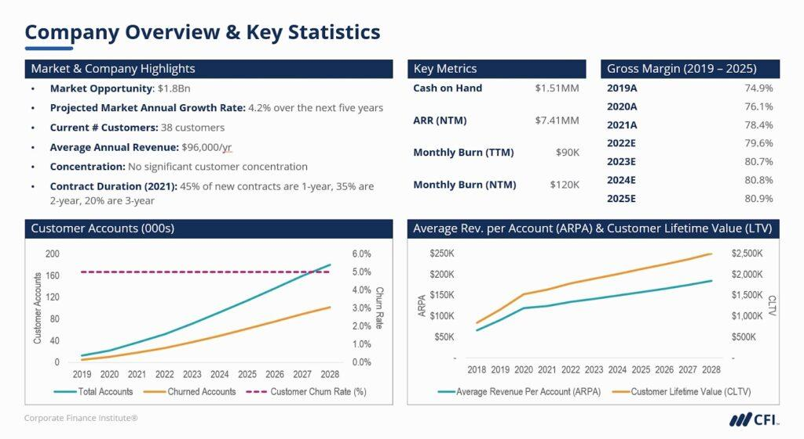

## Table of Contents

## What is a teaser document?

A teaser document is a short summary of a business plan or investment opportunity. It is used to attract interest from potential investors or partners without giving away too much detailed information. The goal of a teaser document is to get people excited and curious enough to want to learn more about the project or business.

Usually, a teaser document includes basic information like the name of the business, what it does, and why it's a good investment. It might also include some key financial data or highlights of the business's achievements. However, it keeps the most sensitive or detailed information confidential until the reader expresses serious interest and signs a non-disclosure agreement.

## What is the purpose of a teaser document?

A teaser document is used to get people interested in a business or investment without telling them everything right away. It's like a sneak peek that shows just enough to make someone want to learn more. The document usually has the name of the business, what it does, and why it could be a good investment. It might also show some important numbers or achievements, but it keeps the big secrets hidden.

The main goal of a teaser document is to catch the attention of potential investors or partners. By sharing just a little bit of information, it makes people curious and excited. Once they are interested, they might ask for more details. But before getting those details, they usually have to sign a special agreement to keep the information secret. This way, the business can share more without worrying about their ideas being stolen.

## Who typically uses teaser documents?

Teaser documents are often used by businesses that want to attract investors or partners. They are especially helpful for startups and small companies that need money to grow. These businesses use teaser documents to show off what they do and why they are a good investment, without giving away all their secrets.

Big companies might also use teaser documents when they want to sell part of their business or find new partners. These documents help them share just enough information to get people interested, but not so much that they lose control over their plans. By using teaser documents, both small and big businesses can start important conversations without risking their confidential information.

## What are the key components of a teaser document?

A teaser document usually starts with the name of the business and a short description of what it does. This part is important because it gives people a quick idea of the business. The document also explains why the business is a good investment. It might talk about the market the business is in, how big that market is, and how the business plans to make money. This helps people see the potential of the business.

The teaser document also includes some key numbers or achievements. These could be things like how much money the business has made, how fast it is growing, or any big successes it has had. But, the document keeps the most important secrets hidden. It only gives enough information to make people want to learn more. Once someone is interested, they might have to sign a special agreement to get the full details.

## How do you create an effective teaser document?

To create an effective teaser document, start with a clear and catchy title that includes the name of your business. Follow this with a brief description of what your business does. Keep it simple and easy to understand. Next, explain why your business is a good investment. Talk about the market you are in, how big it is, and how your business plans to make money. This part should show the potential of your business and get people excited.

Include some key numbers or achievements in your teaser document. These could be things like how much money your business has made, how fast it is growing, or any big successes you've had. But, don't give away all your secrets. Keep the most important information hidden to make people curious and want to learn more. Once someone is interested, they might have to sign a special agreement to get the full details. This way, you can share more without worrying about your ideas being stolen.

Remember, the goal of a teaser document is to catch the attention of potential investors or partners. It should be short and to the point, giving just enough information to make people want to ask for more. By using a teaser document, you can start important conversations and build interest in your business without risking your confidential information.

## What are common mistakes to avoid when creating a teaser document?

When creating a teaser document, one common mistake is including too much detail. The goal of a teaser is to give just enough information to get people interested, not to tell them everything. If you share too many details, you might lose the mystery that makes people want to learn more. Also, avoid using too much technical language or jargon. Keep it simple so that anyone can understand what your business does and why it's a good investment.

Another mistake to watch out for is not highlighting the key points that make your business attractive. You need to clearly show why your business is a good opportunity, like how big the market is or how fast you're growing. If you don't make these points clear, people might not see the potential and lose interest. Lastly, make sure your teaser document looks professional. A sloppy or poorly designed document can turn people off, even if your business idea is great. Keep it clean, well-organized, and easy to read.

## How does a teaser document differ from an executive summary?

A teaser document and an executive summary both give an overview of a business, but they are used for different reasons. A teaser document is like a sneak peek. It shares just enough information to get people interested in a business or investment without telling them everything. It's used to catch the attention of potential investors or partners and make them want to learn more. A teaser document keeps the most important secrets hidden until someone signs a special agreement to keep the information confidential.

On the other hand, an executive summary is a detailed summary of a business plan or project. It gives a full picture of the business, including its goals, strategies, and financial details. An executive summary is usually shared with people who are already interested and need more information to make a decision. Unlike a teaser document, an executive summary is not meant to keep secrets but to provide a clear and complete overview of the business.

## Can a teaser document be used in different industries? If so, how?

Yes, a teaser document can be used in many different industries. It's a helpful tool for any business that wants to attract investors or partners. For example, in the tech industry, a startup might use a teaser document to show off a new app or software without giving away all the details. In the real estate industry, a developer might use a teaser document to get people interested in a new project, like a shopping center or apartment building, without sharing the full plans. No matter the industry, the goal is the same: to get people excited and curious enough to want to learn more.

In the healthcare industry, a company might use a teaser document to attract investors for a new medical device or treatment. They would share just enough information to show the potential of the product without revealing all the research and development details. Similarly, in the energy sector, a company might use a teaser document to get interest in a new renewable energy project, like a wind farm or solar panel installation. By using a teaser document, businesses in any industry can start important conversations and build interest without risking their confidential information.

## What are the legal considerations when using a teaser document?

When using a teaser document, it's important to think about legal issues. One big thing to remember is that you need to be careful about what information you share. You don't want to give away any secrets that could hurt your business. Also, make sure that the information you do share is true and not misleading. If you say something that isn't correct, it could cause problems later on.

Another legal consideration is protecting your ideas. Since a teaser document is meant to get people interested without telling them everything, you might want to have them sign a non-disclosure agreement (NDA) before sharing more details. This agreement helps keep your information safe. It's also a good idea to talk to a lawyer to make sure you're doing everything right and following the laws in your area.

## How can the effectiveness of a teaser document be measured?

The effectiveness of a teaser document can be measured by looking at how many people it gets interested. If a lot of people reach out to learn more about your business after reading the teaser document, it means the document is doing a good job. You can also track how many of these interested people end up signing a non-disclosure agreement (NDA) to get more details. This shows that the teaser document was strong enough to make people want to take the next step.

Another way to measure the effectiveness is by seeing if the teaser document leads to actual meetings or investment discussions. If people are willing to meet with you or talk about investing in your business, it's a sign that the teaser document was successful. You can also ask for feedback from the people who read it. If they say it was clear and interesting, it means the document was effective in getting their attention and keeping them curious.

## What advanced strategies can be employed to enhance the impact of a teaser document?

To make a teaser document more powerful, you can use storytelling to make it more interesting. Instead of just listing facts, tell a short story about your business. Talk about the problem you are solving and how your business makes a difference. This can help people connect with your business on an emotional level. You can also use visuals like pictures or graphs to make the document more eye-catching. A good picture can show what your business does better than a lot of words. Make sure the visuals are clear and professional to keep people interested.

Another advanced strategy is to target your teaser document to specific people. Find out who your ideal investors or partners are and write the document with them in mind. Use language and examples that they will understand and care about. You can also use digital tools to track how people interact with your teaser document. For example, you can see how long they spend reading it or which parts they click on. This information can help you make the document even better. By using these strategies, you can make your teaser document more effective and get more people interested in your business.

## How have digital tools and technologies influenced the creation and distribution of teaser documents?

Digital tools and technologies have made it easier to create and share teaser documents. Now, you can use software like Microsoft Word or Google Docs to write and design your teaser document. These tools let you add pictures, graphs, and other visuals to make your document look better. You can also use online platforms to share your teaser document with people all over the world. This means you can reach more potential investors or partners without having to print and mail physical copies.

Technology also helps you track how people interact with your teaser document. You can use tools like Google Analytics to see how many people read your document, how long they spend on it, and which parts they find most interesting. This information can help you make your teaser document even better. Plus, digital tools let you update your teaser document quickly if you need to change something. This makes it easier to keep your information fresh and relevant.

## References & Further Reading

[1]: ["Quantitative Trading: How to Build Your Own Algorithmic Trading Business"](https://www.amazon.com/Quantitative-Trading-Build-Algorithmic-Business/dp/1119800064) by Ernest P. Chan

[2]: ["Advances in Financial Machine Learning"](https://www.amazon.com/Advances-Financial-Machine-Learning-Marcos/dp/1119482089) by Marcos Lopez de Prado

[3]: ["Machine Learning for Algorithmic Trading"](https://github.com/stefan-jansen/machine-learning-for-trading) by Stefan Jansen

[4]: ["Evidence-Based Technical Analysis: Applying the Scientific Method and Statistical Inference to Trading Signals"](https://www.amazon.com/Evidence-Based-Technical-Analysis-Scientific-Statistical/dp/0470008741) by David Aronson

[5]: Chaboud, A. P., Chiquoine, B., Hjalmarsson, E., & Vega, C. (2014). ["Rise of the Machines: Algorithmic Trading in the Foreign Exchange Market."](https://www.jstor.org/stable/43612951) International Finance Discussion Papers, Board of Governors of the Federal Reserve System.