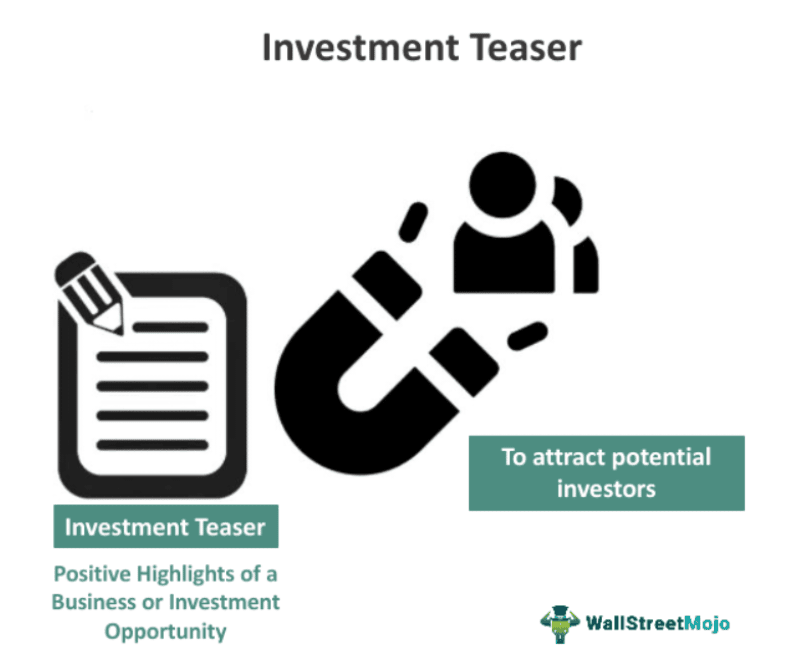

In the dynamic world of finance, efficient document management is essential, particularly in algorithmic trading and investments. Central to this process is the teaser document, a critical instrument used to communicate potential investment opportunities to prospective investors. These documents serve as introductory previews that highlight the investment potential of a given venture, enabling investors to quickly assess and respond to market prospects.

Teaser documents play a significant role in modern finance by providing concise, targeted information that can spur investor interest. As financial markets have evolved with technological advancements, the way in which these documents are shared and managed has transformed significantly. Technology has streamlined document distribution, making it faster and more efficient to disseminate teasers to a wide audience. The advent of online platforms and data analytics has further revolutionized this space, allowing for better-targeted communications that can reach suitable investors more effectively.



Algorithmic trading, which involves using computer algorithms to automate trading decisions, relies heavily on accurate and timely data. Teaser documents offer initial insights that can influence these automated strategies by highlighting emerging trends and investment opportunities. The seamless integration of teaser documents into trading platforms allows investors to act quickly on new information, optimizing their responses to market changes.

In exploring the role of teaser documents, this article will examine their content, uses in financial markets, and impact on algorithmic trading. Understanding these dynamics is crucial for leveraging teaser documents to their full potential in today's technology-driven investment landscape.

## Table of Contents

## Understanding Teaser Documents

A teaser document is a concise summary designed to present an investment opportunity. Its purpose is to spark interest among potential investors by providing a snapshot of what is being offered. These documents are strategically crafted to pique curiosity without divulging exhaustive details. Typically, they highlight the potential of a stock offering or investment venture, outlining attractive aspects while intentionally omitting comprehensive specifics such as pricing strategies or exhaustive risk analysis.

The primary function of a teaser document is to gauge interest and gather feedback from the market. This feedback can be valuable for determining investor appetite for the opportunity and shaping the trajectory of formal offerings. By analyzing responses to the teaser, companies can refine their strategies and ensure that the formal proposal aligns with market expectations. Essentially, teaser documents serve as a tool for market testing, allowing firms to assess demand and make informed decisions about whether to proceed with a full-scale offering.

## Components of a Teaser Document

Teaser documents typically encapsulate the core aspects of a company's business operations succinctly. They offer concise descriptions that include key products or services, projected revenue streams, and the entity's standing within its market. These elements aim to shape a clear, initial understanding of the investment opportunity, catering to potential investors seeking summaries without the intricacy of exhaustive reports.

The narrative within teaser documents often focuses on the positive traits of the opportunity. However, they usually exclude certain critical details such as pricing strategies or potential risks associated with the investment. This selective inclusion of information is deliberate, designed to stimulate interest without overwhelming the reader with complexities that belong in more comprehensive documents like full prospectuses or investment memorandums.

To enhance the appeal and informativeness of teaser documents, incorporating specific financial indicators and market performance metrics is beneficial. Financial indicators might include figures such as EBITDA (Earnings Before Interest, Taxes, Depreciation, and Amortization) margins, net income forecasts, or cash flow projections. Market performance metrics could involve market share data, growth rates, or competitive positioning, providing a snapshot of the potential return on investment and the strategic advantages of the business.

Employing charts or succinct data tables can effectively convey these metrics, offering visual reinforcement of the written content. For instance, a bar chart illustrating projected revenue growth over the next five years can provide a quick reference point for investors, helping them to assess the prospective scalability of the business. Furthermore, integrating data visualization tools can be advantageous, particularly if the teaser document is shared digitally, allowing for interactive engagement with the presented data.

Overall, the strategic assembly of information in teaser documents is vital. It ensures that potential investors are not only intrigued but are also equipped with enough preliminary data to pursue further investigation, potentially culminating in a formal engagement with the investment opportunity.

## Role in Algorithmic Trading

Algorithmic trading relies heavily on algorithms that process vast amounts of data to make informed trading decisions. In this context, teaser documents play a role by providing essential preliminary insights that algorithmic investors can utilize to gauge potential investment opportunities. These documents, typically concise in nature, highlight the essential attributes of an investment without delving into exhaustive details, thus offering a starting point for further analysis.

In [algorithmic trading](/wiki/algorithmic-trading), the information contained within teaser documents can influence the development and adjustment of trading algorithms. These documents serve as initial indicators of potential shifts in market trends or investment opportunities, allowing trading models to be adjusted accordingly. For instance, if a teaser document highlights a new product launch or strategic partnership, algorithms can be programmed to detect similar patterns and execute trades based on anticipated market movements.

The structured data within teaser documents can be integrated into automated models to refine trading strategies and optimize performance. Algorithms can be designed to extract key metrics from these documents, such as projected revenues or market positions, and incorporate them into statistical models. The usage of such structured data ensures that the decisions made by trading algorithms are rooted in the most current and relevant information available, thereby enhancing their performance.

Here's a basic Python example of how such data might be incorporated into an algorithmic trading strategy:

```python
def analyze_teaser_document(teaser_info):
    # Sample function to process key information from a teaser document
    market_trend_signal = 0

    if 'new_product' in teaser_info:
        market_trend_signal += 1

    if teaser_info.get('projected_revenue_growth', 0) > 0.1:
        market_trend_signal += 1

    return market_trend_signal

def update_trading_strategy(signal_strength):
    # Simplified trading strategy update based on market trend signal
    if signal_strength >= 2:
        return "Increase investment"
    elif signal_strength == 1:
        return "Hold current position"
    else:
        return "Decrease investment"

# Mock teaser data
teaser_data = {
    'new_product': True,
    'projected_revenue_growth': 0.15,
}

# Processing teaser document
signal = analyze_teaser_document(teaser_data)
strategy = update_trading_strategy(signal)

print(f"Trading strategy: {strategy}")
```

In this example, key pieces of information from the teaser document are used to generate a market trend signal. Depending on the strength of this signal, the trading strategy is adjusted to increase, hold, or decrease investment. Such integration not only enhances decision-making processes in algorithmic trading but also ensures that strategies remain adaptive to the ever-evolving market dynamics. As algorithmic trading continues to advance, the effective use of teaser documents will remain crucial in uncovering profitable investment opportunities and optimizing trading algorithms.

## Creating Effective Teaser Documents

Producing a successful teaser document requires a strategic approach to content planning, ensuring it remains brief, professional, and factual. To achieve this, several key elements should be emphasized.

First and foremost, focus on highlighting the unique selling points (USPs) of the investment opportunity. This involves clearly outlining what sets the opportunity apart from others in the market, whether it's innovative technology, a strong management team, or proprietary market insights. By doing so, potential investors can quickly identify the primary benefits and how these align with their investment goals.

Clear and concise writing is crucial. A teaser document should be easily digestible, allowing investors to grasp essential information without wading through jargon or superfluous detail. This clarity ensures that readers can quickly assess the potential of the opportunity, facilitating a more efficient decision-making process.

Incorporating pertinent financial analytics can significantly enhance the document's effectiveness. Highlight key metrics such as projected revenue growth, expected return on investment (ROI), and market share potential. Providing these insights is essential for quantitatively-minded investors and can often tip the scales in favor of the opportunity.

Here's a simplified Python code snippet for how financial metrics such as projected revenue growth can be calculated:

```python
def projected_revenue_growth(current_revenue, future_revenue):
    growth_rate = ((future_revenue - current_revenue) / current_revenue) * 100
    return growth_rate

# Example usage
current_revenue = 1000000  # Example current revenue
future_revenue = 1500000   # Example future revenue
growth = projected_revenue_growth(current_revenue, future_revenue)
print(f"Projected Revenue Growth: {growth}%")
```

Utilizing teaser documents effectively lays a solid foundation for successful investment launches. By capturing investor interest early on, companies can streamline the process from preliminary exposure to formal investment proposals. As the financial landscape continues to evolve, the role of well-crafted teaser documents in attracting and nurturing potential investment interest remains vital.

## Conclusion

Teaser documents play a critical role in both modern investing and algorithmic trading. As compact, well-targeted summaries of investment opportunities, they serve as an effective communication tool for engaging potential investors. By offering key insights without overwhelming detail, these documents help navigate the initial stages of investment interest and transition smoothly towards complete formal proposals. This condensed format is particularly beneficial in the fast-paced environment of algorithmic trading, where quick, data-driven decisions are essential.

In algorithmic trading, teaser documents provide initial data points that can be integrated into trading models to detect potential market trends or shifts. As these documents influence algorithmic strategies, they become integral to refining trading performance and maximizing returns. The effectiveness of teaser documents lies in their ability to succinctly present crucial financial indicators and market metrics that can be used to inform algorithmic decision-making processes.

As algorithmic trading technologies advance, the strategic utilization of teaser documents will continue to be crucial. Their function as a bridge between preliminary investor interest and detailed financial proposals ensures their continued relevance in investment strategies. By maintaining their precision and clarity, teaser documents can support informed, strategic decisions, ultimately fostering successful investment ventures.

## References & Further Reading

[1]: ["Quantitative Trading: How to Build Your Own Algorithmic Trading Business"](https://www.amazon.com/Quantitative-Trading-Build-Algorithmic-Business/dp/1119800064) by Ernest P. Chan

[2]: ["Advances in Financial Machine Learning"](https://www.amazon.com/Advances-Financial-Machine-Learning-Marcos/dp/1119482089) by Marcos Lopez de Prado

[3]: ["Machine Learning for Algorithmic Trading"](https://github.com/stefan-jansen/machine-learning-for-trading) by Stefan Jansen

[4]: ["Evidence-Based Technical Analysis: Applying the Scientific Method and Statistical Inference to Trading Signals"](https://www.amazon.com/Evidence-Based-Technical-Analysis-Scientific-Statistical/dp/0470008741) by David Aronson

[5]: Chaboud, A. P., Chiquoine, B., Hjalmarsson, E., & Vega, C. (2014). ["Rise of the Machines: Algorithmic Trading in the Foreign Exchange Market."](https://www.jstor.org/stable/43612951) International Finance Discussion Papers, Board of Governors of the Federal Reserve System.