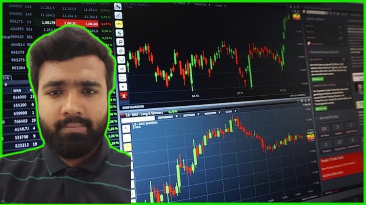

## Table of Contents

## What is technical analysis and why is it important for trading?

Technical analysis is a way to study the stock market by looking at charts and numbers instead of the company's business. Traders use it to guess where the price of a stock might go next. They look at patterns and trends in the past to make decisions about buying or selling stocks. It's like trying to predict the weather by looking at old weather reports.

This method is important for trading because it helps traders make quick decisions. Instead of waiting for a company's news or financial reports, traders can use technical analysis to act fast. It's especially useful in short-term trading, where timing is everything. By understanding the patterns and signals from the charts, traders can try to make profits by buying low and selling high, or vice versa.

## What are the basic concepts beginners should know before starting a technical analysis course?

Before starting a technical analysis course, beginners should understand a few basic concepts. First, they need to know about price charts. These charts show how the price of a stock changes over time. There are different types of charts like line charts, bar charts, and candlestick charts. Each type gives different information, but they all help you see patterns in the price movement. Recognizing these patterns is key to technical analysis because they can suggest what might happen next with the price.

Another important concept is indicators. Indicators are tools that help you understand the chart better. They can show things like how fast the price is moving or if the price is too high or too low compared to what it should be. Some common indicators are moving averages, which smooth out price changes to show a clearer trend, and the Relative Strength Index (RSI), which tells you if a stock might be overbought or oversold. Understanding how to use these indicators can help you make better guesses about future price movements.

Lastly, beginners should know about support and resistance levels. Support is a price level where a stock often stops falling and starts to go up again. Resistance is the opposite; it's where a stock often stops rising and starts to fall. These levels are important because they can show where the price might change direction. By learning to spot these levels on a chart, you can make more informed decisions about when to buy or sell a stock.

## Which technical analysis courses are recommended for beginners in 2024?

For beginners looking to start with technical analysis in 2024, the "Technical Analysis Masterclass" on Udemy is a great choice. This course is taught by a well-known trader and covers all the basics you need to know. It starts with simple concepts like reading charts and understanding trends, then moves on to more advanced topics like using indicators and drawing support and resistance lines. The course also includes practical exercises and quizzes to help you practice what you learn. It's easy to follow and perfect for someone just starting out.

Another good option is the "Introduction to Technical Analysis" course offered by Coursera, in partnership with a top university. This course is designed for beginners and breaks down technical analysis into easy-to-understand lessons. You'll learn about different types of charts, how to use common indicators, and how to spot patterns that can help you predict price movements. The course also includes real-world examples and case studies, which can help you see how technical analysis works in practice. Plus, you can earn a certificate at the end, which can be a nice addition to your resume.

If you prefer a more interactive learning experience, consider the "Technical Analysis for Beginners" workshop series on Trading Academy. These workshops are led by experienced traders and are held online, making them accessible from anywhere. The series covers the fundamentals of technical analysis, including chart reading, trend analysis, and the use of key indicators. Each session includes live demonstrations and Q&A segments, allowing you to ask questions and get immediate feedback. This hands-on approach can be very helpful for beginners who want to learn by doing.

## How do intermediate courses build on the foundational knowledge of technical analysis?

Intermediate courses in technical analysis take what you learned in beginner courses and go deeper. They help you understand more complex patterns and indicators that you might not have seen before. For example, while a beginner course might teach you about simple moving averages, an intermediate course will show you how to use more advanced indicators like the MACD (Moving Average Convergence Divergence) or Bollinger Bands. These courses also teach you how to combine different indicators to make better predictions about where the price might go next. You'll learn about things like divergence, where the price and an indicator move in opposite directions, which can be a strong signal that a big price move is coming.

In addition to learning about more advanced tools, intermediate courses also focus on strategy development. You'll learn how to create your own trading plans based on what you see in the charts. This includes setting entry and exit points, managing risk, and deciding how much money to put into each trade. Intermediate courses often include case studies and real-world examples, so you can see how other traders use technical analysis to make money. By the end of an intermediate course, you should feel more confident in your ability to analyze charts and make trading decisions based on what you see.

## What are the top-rated intermediate technical analysis courses available in 2024?

In 2024, one of the top-rated intermediate technical analysis courses is "Advanced Technical Analysis Strategies" on Udemy. This course is perfect for people who already know the basics and want to learn more. It teaches you about advanced indicators like the MACD and Bollinger Bands. You'll also learn how to combine different indicators to make better predictions about where the price might go next. The course includes lots of real-world examples and case studies, so you can see how other traders use these tools to make money. It's easy to follow and has great reviews from people who have taken it.

Another highly recommended course is "Intermediate Technical Analysis" offered by Coursera, in partnership with a top university. This course builds on what you learned in beginner courses and goes deeper into more complex patterns and strategies. You'll learn about things like divergence, where the price and an indicator move in opposite directions, which can be a strong signal that a big price move is coming. The course also focuses on strategy development, teaching you how to create your own trading plans based on what you see in the charts. It includes practical exercises and quizzes to help you practice what you learn, and you can earn a certificate at the end, which can be a nice addition to your resume.

## What advanced techniques are covered in expert-level technical analysis courses?

Expert-level technical analysis courses dive into very advanced techniques that go beyond what you learn in intermediate courses. These courses teach you about complex chart patterns like Elliott Wave Theory, which helps you predict where the price might go next by looking at repeating wave patterns. You'll also learn about advanced indicators like the Ichimoku Cloud, which can show you support and resistance levels, as well as trend direction and momentum all at once. These courses also cover how to use multiple time frames to get a better view of the market, so you can see both the big picture and the small details.

Another important part of expert-level courses is learning about algorithmic trading and how to use computer programs to make trading decisions based on technical analysis. You'll learn how to code your own trading strategies and backtest them to see how they would have worked in the past. This can help you find the best strategies to use in the future. These courses also focus on risk management and psychology, teaching you how to stay calm and stick to your plan even when the market is moving fast. By the end of an expert-level course, you should be able to use very advanced techniques to make better trading decisions.

## Which institutions or platforms offer the best expert-level technical analysis courses in 2024?

In 2024, one of the best places to find expert-level technical analysis courses is on Udemy. They offer a course called "Mastering Advanced Technical Analysis" which is perfect for people who already know a lot about trading. This course teaches you about very complex things like Elliott Wave Theory and the Ichimoku Cloud. You'll also learn how to use computer programs to make trading decisions and how to test your strategies to see if they work. The course is easy to follow and has great reviews from people who have taken it.

Another top choice for expert-level courses is Coursera, which partners with top universities to offer courses like "Advanced Technical Analysis and Algorithmic Trading." This course goes deep into advanced techniques and also teaches you how to code your own trading strategies. It focuses on risk management and psychology, helping you stay calm and stick to your plan even when the market is moving fast. By the end of the course, you'll be able to use very advanced techniques to make better trading decisions.

## How do technical analysis courses incorporate real-time market data and simulation tools?

Technical analysis courses often use real-time market data to help students learn. They show live charts and data so students can see how the market is moving right now. This helps them practice what they learn by looking at real prices and patterns. Some courses even let students connect to their own trading accounts, so they can see how their strategies work with real money. This makes the learning experience more exciting and helps students understand how technical analysis works in the real world.

Simulation tools are also a big part of these courses. They let students practice trading without risking real money. These tools create a pretend market where students can buy and sell stocks based on what they learn. They can try out different strategies and see how they would have worked in the past. This helps students get better at making decisions and understanding how the market moves. By using both real-time data and simulation tools, technical analysis courses give students a safe way to practice and learn before they start trading for real.

## What are the key differences between online and in-person technical analysis courses?

Online technical analysis courses offer a lot of flexibility. You can learn from home at your own pace, which is great if you have a busy schedule. These courses often use videos, quizzes, and interactive tools to help you learn. You can also connect to real-time market data and use simulation tools to practice trading without risking real money. However, online courses can sometimes feel less personal because you don't meet your teacher or classmates face-to-face. You might need to be more self-motivated to keep up with the lessons and ask questions through email or online forums.

In-person technical analysis courses, on the other hand, give you a more hands-on experience. You can ask questions directly to your teacher and learn from other students in the class. This can make the learning experience more interactive and engaging. In-person courses often include live demonstrations and group activities, which can help you understand the material better. The downside is that you have to go to a specific place at a set time, which might not be easy if you have other commitments. Also, in-person courses can be more expensive because of the need for a physical space and materials.

## How can one evaluate the effectiveness of a technical analysis course?

To evaluate the effectiveness of a technical analysis course, you can start by looking at what you learn. A good course should teach you the basics like reading charts and understanding trends, and then move on to more advanced topics like using indicators and creating trading strategies. You should feel like you're learning new things and getting better at analyzing the market. If the course includes quizzes and exercises, use them to test your knowledge and see if you're really understanding the material. If you can apply what you learn to real market situations, that's a good sign the course is effective.

Another way to evaluate a course is by looking at what other people say about it. Check out reviews and ratings from other students who have taken the course. They can tell you if the course was helpful and if they learned a lot. You can also see if the course offers real-time market data and simulation tools, which can make learning more practical and fun. If the course has a good reputation and helps you practice what you learn, it's likely to be effective. Remember, the best course for you is one that fits your learning style and helps you reach your trading goals.

## What are the latest trends in technical analysis education for 2024?

In 2024, one of the big trends in technical analysis education is the use of artificial intelligence (AI) and machine learning. These technologies help students learn faster by showing them patterns and trends that might be hard to see on their own. Courses now use AI to give personalized feedback and help students create their own trading strategies. This makes learning more fun and helps students understand the market better. Another trend is the focus on real-time data and simulation tools. More courses are using live market data so students can practice what they learn with real prices and patterns. This helps them get ready for actual trading without risking real money.

Another trend is the rise of interactive and community-based learning. Many courses now include online forums and group activities where students can talk to each other and learn together. This makes the learning experience more social and helps students feel less alone as they learn about trading. Also, there's a growing emphasis on teaching risk management and trading psychology. Courses are not just about reading charts anymore; they also teach students how to stay calm and stick to their plans, even when the market is moving fast. These trends make technical analysis education more practical and helpful for students in 2024.

## How do certification and continuous learning opportunities enhance the value of technical analysis courses?

Certification from a technical analysis course can make you look more professional and trustworthy. When you finish a course and get a certificate, it shows that you know a lot about technical analysis. This can help you get a job in trading or make other people trust your trading advice more. Some courses even let you take exams to get special certifications, like the ones from the Chartered Market Technician (CMT) Association. These certifications can open up more job opportunities and make you stand out in the trading world.

Continuous learning opportunities also make technical analysis courses more valuable. The market is always changing, so it's important to keep learning new things. Good courses offer extra lessons, webinars, and updates to help you stay up-to-date. They might also have online communities where you can talk to other traders and learn from them. By keeping up with the latest trends and techniques, you can become a better trader and make smarter decisions. This ongoing learning helps you stay ahead in the fast-moving world of trading.

## References & Further Reading

[1]: Bergstra, J., Bardenet, R., Bengio, Y., & Kégl, B. (2011). ["Algorithms for Hyper-Parameter Optimization."](https://dl.acm.org/doi/10.5555/2986459.2986743) Advances in Neural Information Processing Systems 24.

[2]: ["Advances in Financial Machine Learning"](https://www.amazon.com/Advances-Financial-Machine-Learning-Marcos/dp/1119482089) by Marcos Lopez de Prado

[3]: ["Evidence-Based Technical Analysis: Applying the Scientific Method and Statistical Inference to Trading Signals"](https://www.semanticscholar.org/paper/Evidence-Based-Technical-Analysis%3A-Applying-the-and-Aronson/3b33df8737f1772e9e14d66a08c9696f140a2ee1) by David Aronson

[4]: ["Machine Learning for Algorithmic Trading"](https://github.com/PacktPublishing/Machine-Learning-for-Algorithmic-Trading-Second-Edition) by Stefan Jansen

[5]: ["Quantitative Trading: How to Build Your Own Algorithmic Trading Business"](https://www.amazon.com/Quantitative-Trading-Build-Algorithmic-Business/dp/0470284889) by Ernest P. Chan