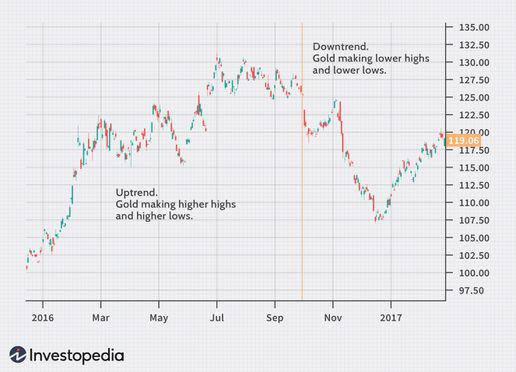

Gold has long been regarded as a strategic asset within investment portfolios due to its unique properties and historical significance. As a tangible asset, gold possesses intrinsic value, serving as a safeguard against inflation and currency fluctuations. This intrinsic value, combined with its rarity, durability, and universal acceptance, cements gold's role as a reliable store of value, especially during periods of economic uncertainty.

Technical analysis plays a critical role in gold trading, offering investors insights into market movements by analyzing historical price trends and trading volumes. Through various technical indicators such as moving averages, relative strength index (RSI), and Fibonacci retracement levels, traders can make informed decisions on when to buy or sell gold. This approach helps in identifying potential entry and exit points, optimizing trading strategies to capitalize on short-term price movements.



Exchange-Traded Funds (ETFs) have transformed how investors gain exposure to gold investments. Gold ETFs provide a convenient and cost-effective way to invest in gold without the need to physically acquire and store the metal. These financial instruments track the price of gold, allowing investors to partake in the market's movements with ease. Moreover, gold miner ETFs broaden this exposure by including stocks of companies involved in gold mining, offering an indirect investment route with the potential for amplified returns due to company performance.

The advent of algorithmic trading further optimizes gold investment strategies by employing advanced mathematical models and computerized systems to automate trading processes. Algorithms can analyze large datasets at high speeds, identifying patterns and executing trades at optimal times without the emotional biases that often affect human traders. This precision and efficiency enhance the overall effectiveness of trading strategies, allowing investors to capture opportunities that manual trading might miss.

This article will explore these concepts and their relevance to gold investing, highlighting how a combination of technical analysis, ETFs, and algorithmic trading can optimize investment strategies. By understanding and applying these tools, investors can better navigate the complexities of the gold market, ultimately enhancing their portfolio's resilience and performance.

## Table of Contents

## Understanding Gold as an Investment

Gold has been a significant component of economic systems throughout history, primarily serving as a form of currency, store of value, and a strategic asset in investment portfolios. Its historical significance as a hedge against economic uncertainties is well-documented. During periods of economic instability, such as inflation, war, or financial crises, gold often retains its value while other assets depreciate. This characteristic makes it a preferred choice for conservatives and traditional investors looking to safeguard their investments against market volatility.

The intrinsic appeal of gold stems from several of its unique properties. As a precious metal, gold is not only rare but also exceptionally durable, with the ability to withstand tarnishing and corrosion. These physical attributes, coupled with a universal acceptance across cultures as a valuable commodity, boost its desirability and trustworthiness among investors.

Gold's role as a non-correlated asset is pivotal in diversified portfolios. Unlike traditional equities and bonds, gold demonstrates a tendency to move independently, or even inversely, to the performance of other assets. This property can be understood through the correlation coefficient, a statistical measure that quantifies the degree to which two securities move in relation to each other. For instance, during economic downturns when stock markets typically decline, gold prices often increase, thereby providing balance and reducing overall portfolio risk.

Including gold in investment strategies offers distinct benefits for risk mitigation. It acts as a stabilizing force by counteracting losses in other, more volatile asset classes. By integrating gold into a well-balanced investment portfolio, investors can achieve a strategic spread of risk, enhancing the potential for returns while safeguarding against unforeseen market downturns. 

The strategic inclusion of gold, whether through direct ownership of the metal or through financial instruments such as gold-backed exchange-traded funds (ETFs), remains a powerful method to ensure portfolio resilience and durability across varying market conditions.

## Technical Analysis in Gold Trading

Technical analysis is a widely-recognized approach in trading that involves evaluating financial instruments by examining statistical trends gathered from trading activity, such as price movement and [volume](/wiki/volume-trading-strategy). This methodology is particularly effective in gold trading, a market characterized by its inherent [volatility](/wiki/volatility-trading-strategies) and susceptibility to global economic shifts.

Gold traders employ a variety of technical indicators and tools to predict likely price movements and make informed decisions. Among the most prominent of these tools are moving averages, the Relative Strength Index (RSI), and the Moving Average Convergence Divergence (MACD). Moving averages help smooth out price data to identify the direction of a trend, and traders often use a combination of short-term and long-term moving averages to discern possible buy or sell signals. The RSI is a [momentum](/wiki/momentum) oscillator that measures the speed and change of price movements and can indicate whether gold is overbought or oversold. MACD, on the other hand, uses moving averages to display changes in strength, direction, momentum, and duration of a trend, providing critical insights into potential future behavior of gold prices.

In addition to these indicators, gold miner Exchange-Traded Funds (ETFs) play a crucial role in confirming market trends. These ETFs, composed of stocks from companies involved in gold extraction and production, are highly sensitive to gold price fluctuations. By analyzing the performance of gold miner ETFs, investors can gain corroborative evidence of broader trends in the gold market. For instance, if gold prices are on an upward trajectory and gold miner ETFs are also performing well, it further substantiates the presence of a strong uptrend in the market.

Identifying uptrends and downtrends in gold trading is vital for maximizing profitability and minimizing risks. An uptrend is characterized by a series of higher highs and higher lows, suggesting a bullish market sentiment, while a downtrend features lower highs and lower lows, signaling bearish momentum. Recognizing these trends early allows traders to position themselves appropriately, either capitalizing on potential price increases or hedging against decreases.

Effective use of technical analysis in gold trading not only provides insights into current market conditions but also aids in forecasting future movements, making it an indispensable tool for traders looking to optimize their strategies.

## Investing in Gold Miner ETFs

Exchange-Traded Funds (ETFs) are investment vehicles that trade on stock exchanges, similar to individual stocks. They are constructed to track specific indices, commodities, or baskets of assets, providing investors with opportunities to diversify their portfolios efficiently. In the context of gold investment, ETFs offer a practical means of gaining exposure to the gold market without the need to physically own and store the metal. Gold miner ETFs, in particular, invest in shares of companies involved in the mining and extraction of gold, making them a strategic choice for investors looking to align with the gold market's performance.

One of the primary benefits of using gold miner ETFs is diversification. By investing in a basket of mining companies rather than a single stock, investors can mitigate risks associated with individual company performance and focus on industry-wide trends. This diversification extends the potential for returns amid varying market conditions, as some companies may outperform others based on their operational efficiencies, geographical locations, and cost structures.

Gold miner ETFs can be analyzed to track market performance in various ways. For instance, they are often benchmarked against major gold indices or spot gold prices. The performance of an [ETF](/wiki/etf-trading-strategies) like VanEck Vectors Gold Miners ETF (GDX) or iShares MSCI Global Gold Miners ETF (RING) reflects the collective performance of the underlying mining companies, offering insights into market trends. Comparisons between different ETFs can reveal insights about regional or company-specific factors affecting the broader gold industry.

When selecting the right gold miner ETFs based on market conditions, investors should consider several factors. Market volatility, geopolitical instability, and currency fluctuations are crucial considerations, as they influence gold prices and, subsequently, the profitability of mining operations. Additionally, investors should evaluate the expense ratios, [liquidity](/wiki/liquidity-risk-premium), and the underlying holdings of the ETFs. This analysis involves looking at the geographical distribution of mining assets, the production costs, and the reserve levels of the companies within the ETF.

For example, during market uncertainty or rising inflation, gold prices often increase, enhancing the attractiveness of gold miner ETFs. Conversely, in economic climates with strong currency stability and low inflation, the profit margins of gold mining companies might shrink due to reduced gold prices, affecting ETF valuations negatively. Hence, gauging economic indicators alongside the operating performance and prospective growth ventures of mining companies can guide investors in making informed ETF selections. 

Investors can leverage tools like Sharpe ratios to assess the risk-adjusted returns of different ETFs or use back-testing and historical performance analysis to estimate future growth trajectories. Here is a simple Python code snippet demonstrating how to calculate the Sharpe ratio of an ETF:

```python
import numpy as np

# Assume returns is an array of daily return rates of the ETF
returns = np.array([...])

# Calculate the mean and standard deviation of returns
mean_return = np.mean(returns)
std_dev = np.std(returns)

# Risk-free rate, for simplicity, assume it's zero
risk_free_rate = 0

# Calculate the Sharpe ratio
sharpe_ratio = (mean_return - risk_free_rate) / std_dev

print("Sharpe Ratio:", sharpe_ratio)
```

By applying such quantitative tools alongside a qualitative assessment of market dynamics, investors can make strategic choices about which gold miner ETFs align with their investment goals and risk tolerance.

## Algorithmic Trading Strategies in Gold Investment

Algorithmic trading involves the use of computer programs and algorithms to execute trading decisions automatically. It has become an integral part of modern investment strategies due to its ability to process massive datasets and execute trades at speeds and frequencies that are beyond human capability. In the context of gold investment, [algorithmic trading](/wiki/algorithmic-trading) can significantly enhance trading strategies by exploiting market inefficiencies and optimizing entry and [exit](/wiki/exit-strategy) points.

Algorithms optimize trading strategies in the gold markets by systematically analyzing historical and real-time data. They identify patterns, trends, and signals that inform buy and sell decisions. For instance, algorithms can leverage technical indicators such as moving averages or momentum indicators to develop rule-based trading strategies. This approach enables traders to capitalize on predictable changes in gold price movements.

A simple example of an algorithmic trading strategy in the gold market is the Moving Average Crossover strategy. This strategy involves two moving averages, such as a 50-day moving average (MA) and a 200-day moving average. The crossover of these averages can generate buy or sell signals. A basic Python implementation of this strategy could look like this:

```python
import pandas as pd
import numpy as np
import matplotlib.pyplot as plt

# Load historical gold price data
data = pd.read_csv('gold_prices.csv')
data['Date'] = pd.to_datetime(data['Date'])
data.set_index('Date', inplace=True)

# Calculate moving averages
data['50MA'] = data['Close'].rolling(window=50).mean()
data['200MA'] = data['Close'].rolling(window=200).mean()

# Generate signals
data['Signal'] = np.where(data['50MA'] > data['200MA'], 1, -1)

# Plot
plt.figure(figsize=(12,6))
plt.plot(data['Close'], label='Gold Price')
plt.plot(data['50MA'], label='50-Day MA')
plt.plot(data['200MA'], label='200-Day MA')
plt.legend()
plt.show()
```

This strategy signals a buy when the short-term moving average crosses above the long-term moving average and a sell when it crosses below. This simple strategy can be enhanced by incorporating other technical indicators or [machine learning](/wiki/machine-learning) models to improve its predictive power and adaptability to different market conditions.

One of the key advantages of algorithmic trading is its ability to reduce emotional biases in investment decisions. By automating the trading process, algorithms adhere strictly to predefined rules and criteria, which prevents impulsive decisions based on emotions such as fear or greed. This objectivity and consistency can lead to more disciplined trading behavior and improve overall performance in the volatile gold markets.

Moreover, algorithmic trading offers the capability to backtest strategies using historical data, providing valuable insights into their effectiveness before actual implementation. This approach allows investors to fine-tune their strategies and mitigate risks associated with unforeseen market movements.

Overall, algorithmic trading represents a powerful tool for investors seeking to optimize their gold investment strategies through data-driven decision-making and enhanced execution efficiency.

## Conclusion

In summary, gold remains a vital component of diversified investment portfolios due to its historical role as a hedge against economic uncertainties and its status as a non-correlated asset. The strategic inclusion of gold investments is further enhanced through the effective use of technical analysis, exchange-traded funds (ETFs), and algorithmic trading. Technical analysis offers critical insights into market trends and price movements, empowering traders to make informed decisions when engaging in gold trading. Gold miner ETFs provide a proficient means of accessing gold markets, allowing investors to gain exposure while potentially benefiting from reduced risks compared to direct investment in physical gold.

Furthermore, algorithmic trading strategies present a robust mechanism for optimizing gold investments. By leveraging sophisticated algorithms, investors can execute trades with increased precision and reduced emotional bias, ultimately improving their trading outcomes. The synergy between these approaches facilitates a comprehensive and dynamic strategy to maximize returns on gold investments.

As innovation in financial technologies continues to progress, these strategies [carry](/wiki/carry-trading) the potential to evolve, offering novel opportunities for investors. By embracing the integration of technical analysis, ETFs, and algorithmic trading, investors can not only enhance their current methodologies but also adapt to future developments in gold investment strategies, ensuring robust portfolio performance in the ever-changing market landscape.

## References & Further Reading

[1]: Pring, M. J. (1991). ["Technical Analysis Explained: The Successful Investor’s Guide to Spotting Investment Trends and Turning Points."](https://archive.org/details/technicalanalysi00prin) McGraw Hill Professional.

[2]: Murphy, J. J. (1999). ["Technical Analysis of the Financial Markets: A Comprehensive Guide to Trading Methods and Applications."](https://archive.org/details/technicalanalysi0000murp) New York Institute of Finance.

[3]: Bodie, Z., Kane, A., & Marcus, A. J. (2017). ["Investments"](https://www.mheducation.com/highered/product/Investments-Bodie.html) (11th ed.). McGraw-Hill Education.

[4]: Engle, R. (2002). ["Dynamic Conditional Correlation: A Simple Class of Multivariate Generalized Autoregressive Conditional Heteroskedasticity Models."](https://www.tandfonline.com/doi/abs/10.1198/073500102288618487) Journal of Business & Economic Statistics, 20(3), 339-350.

[5]: Natoli, C. (2020). ["Algorithmic and High-Frequency Trading."](https://assets.cambridge.org/97811070/91146/frontmatter/9781107091146_frontmatter.pdf) Routledge.

[6]: Smirnov, D., & Hao, D. (2020). ["Backtrader Cookbook: Internalizing and Automating Financial Strategies."](https://link.aps.org/doi/10.1103/PhysRevE.102.062139) Packt Publishing.

[7]: Chan, E. (2013). ["Algorithmic Trading: Winning Strategies and Their Rationale."](https://github.com/ftvision/quant_trading_echan_book) Wiley Trading.