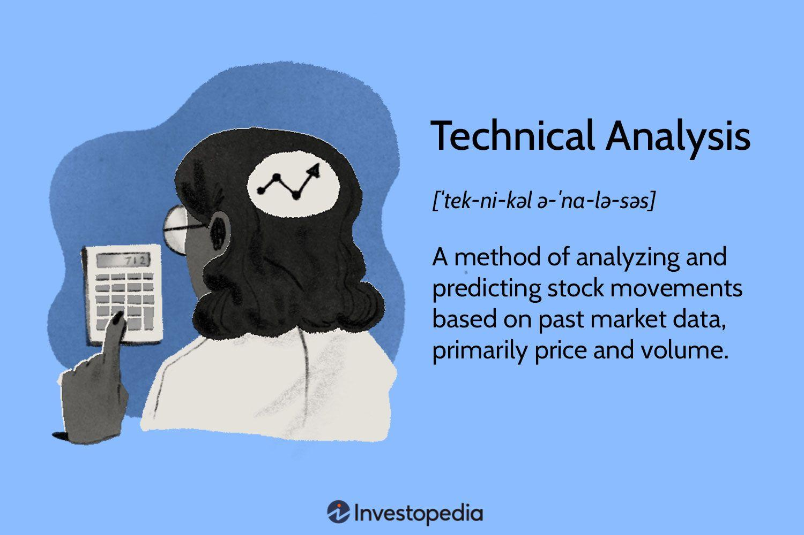

The stock market stands as a cornerstone of the global economy, serving as a platform for companies to raise capital and for investors to gain ownership in businesses. By facilitating the exchange of stocks, or shares, of publicly held companies, the stock market provides a critical mechanism for price discovery and liquidity. The ability to buy and sell stocks on public exchanges provides businesses the capital needed for growth and expansion, while offering investors the opportunity to achieve financial growth through ownership stakes that can appreciate in value or generate dividend income.

Investing in the stock market has historically been one of the most effective ways to build wealth over the long term. It offers individuals a chance to take part in the profits of successfully managed companies, benefiting from growth in earnings and share price appreciation. However, investing requires a strategic approach and a comprehensive understanding of market dynamics to manage risks and maximize returns.



Technical analysis is a vital tool used to evaluate market trends and identify potential investment opportunities. It involves analyzing statistical trends from past market activity, primarily using price and volume. Key tools include charts and indicators that help identify patterns and signals for market entry and exit points. This approach assists investors and traders in making informed decisions based on historical data rather than subjective valuation.

In recent years, algorithmic trading has emerged as a transformative force within the investment landscape. This method employs computer algorithms to execute trades at speeds and efficiencies impossible for human traders to achieve. These algorithms rely on complex mathematical models and statistical analysis to determine the optimal timing and pricing of trades. By reducing human error and emotion-driven decisions, algorithmic trading enhances market efficiency and liquidity, reshaping how investments are executed and managed.

Combining technical analysis with algorithmic trading can significantly enhance investment strategies. Technical indicators can be systematically integrated into trading algorithms, allowing for automated decision-making based on predefined criteria. This fusion enables sophisticated risk management and more precise execution of trades, leveraging the strengths of both analytical methods. Advances in technology and machine learning promise further optimization of these strategies, paving the way for more adaptive and responsive investment approaches in the future.

## Table of Contents

## Understanding the Basics of Stock Market Investing

Stock market investing is the process of purchasing shares of companies listed on public exchanges with the aim of generating returns over time. The fundamental principles of stock market investing include the understanding of ownership, as shares represent fractional ownership in a company, and the expectation of [earning](/wiki/earning-announcement) dividends and capital gains. Investors commit capital with the hope that the value of the stocks will appreciate or that the company will pay dividends, providing them a return on their investments.

Before delving into the stock market, conducting thorough market research and due diligence is crucial. This process involves analyzing a company's financial health, competitive positioning, and potential for future growth. Financial statements, including balance sheets, income statements, and cash flow statements, offer insights into a company's performance and are essential tools for evaluation. Market research helps investors understand broader industry trends and informs them about economic indicators that could impact stock performance.

Distinguishing between short-term trading and long-term investing is vital for market participants. Short-term trading focuses on capitalizing on market [volatility](/wiki/volatility-trading-strategies) within a brief period. This approach involves frequent buying and selling, which may suit those who thrive on market dynamics and are skilled in technical analysis to predict price movements. Long-term investing, contrastingly, emphasizes holding investments over extended periods to benefit from compound growth and the realization of intrinsic value. This strategy is often associated with a buy-and-hold philosophy, where market fluctuations are seen as opportunities to acquire undervalued stocks.

However, stock market investments are not devoid of risks. Market risk, company-specific risk, and [liquidity](/wiki/liquidity-risk-premium) risk are pivotal considerations. Market risk involves the potential for losses due to broader economic factors affecting the entire market. Company-specific risk, meanwhile, pertains to challenges unique to a particular firm, such as management changes or product recalls. Liquidity risk arises when there is difficulty in selling shares promptly without adversely impacting the stock price.

For novice investors, a variety of tools and resources can aid in navigating the stock market landscape. Online brokerage accounts provide platforms for executing trades and often include educational resources and research tools. Financial news websites, investment forums, and stock screening tools offer additional insights and community support. Novice investors can also leverage investment apps, which simplify stock tracking and portfolio management. Furthermore, simulated trading platforms allow new investors to practice without real financial risk, helping them gain the experience needed to make informed decisions.

## Technical Analysis: A Closer Look

Technical analysis is a method used to evaluate and predict future price movements of financial securities based on historical market data, primarily price and [volume](/wiki/volume-trading-strategy). It operates on the premise that all relevant information, such as economic factors, market sentiment, and investor behavior, is reflected in the stock’s price. Unlike [fundamental analysis](/wiki/fundamental-analysis), which evaluates a company's financial statements, technical analysis focuses on identifying patterns and trends to guide investment decisions. Its significance in the stock market lies in its ability to assist traders and investors in making informed decisions, identifying optimal entry and [exit](/wiki/exit-strategy) points, and managing risks effectively.

One of the fundamental tools of technical analysis is the chart, which visually represents historical price data. Various types of charts are employed, including line charts, bar charts, and candlestick charts. Each chart type offers unique insights into price movements. Indicators are also pivotal in technical analysis, with moving averages, Relative Strength Index (RSI), and Bollinger Bands being among the most commonly used. These tools help to smooth out price data, identify overbought or oversold conditions, and gauge market [momentum](/wiki/momentum).

Candlestick patterns, which originated in Japan, are a critical component of technical analysis. Each candlestick represents price movements within a specific timeframe, including the open, high, low, and close prices. Patterns formed by these candlesticks, such as dojis, hammers, and engulfing patterns, can provide significant insights into future price actions. Trends are another essential concept; they indicate the general direction in which a market or security is moving. Identifying trends, whether upward, downward, or sideways, allows traders to align their strategies accordingly.

Understanding market psychology through technical analysis involves recognizing that investor behavior patterns are often repetitive. This repetition is based on collective emotions such as fear and greed, which are vividly expressed in the market’s price action. By analyzing historical chart patterns and trends, traders can gauge market sentiment, predict potential price reversals, and make decisions that consider psychological factors influencing the market.

However, relying solely on technical analysis has its strengths and limitations. Its strengths include the ability to provide a framework for systematic trading approaches, identify potential buy or sell signals, and offer rapid feedback based on market activity. Technical analysis can be applied across various timeframes, making it versatile for different trading strategies.

Nonetheless, one of the primary limitations of technical analysis is that it ignores the underlying factors influencing a company's valuation, such as earnings reports, economic data, and news events. As a result, it may provide misleading signals during times of high market volatility or when news impacts market dynamics. Moreover, technical patterns are not always predictive—the same pattern can yield different outcomes under varying market conditions, making risk management essential.

In conclusion, while technical analysis offers valuable tools and insights for understanding price behavior and market psychology, it is most effective when used alongside other analytical methods and risk management strategies.

## The Rise of Algorithmic Trading

Algorithmic trading, often referred to as algo trading, is defined as the use of computer algorithms to execute trading orders in financial markets at speeds and frequencies beyond human capability. These algorithms are designed with complex mathematical models that process vast sets of market data, allowing for real-time decision-making and execution based on specified parameters and conditions.

The popularity of [algorithmic trading](/wiki/algorithmic-trading) has surged over recent years due to its ability to enhance market efficiency and reduce costs associated with trading. Algorithms enable traders to capitalize on small price discrepancies, execute high-frequency trades, and manage vast portfolios systematically. These algorithms can analyze multiple market indicators simultaneously, making decisions with precision that human traders cannot match.

Algorithm development relies heavily on mathematical models such as statistical [arbitrage](/wiki/arbitrage), [machine learning](/wiki/machine-learning), and time series analysis. For instance, [statistical arbitrage](/wiki/statistical-arbitrage) models identify price discrepancies in correlated securities, while machine learning models can adapt and improve their strategies based on newly acquired data. A common approach involves regression models, where traders predict future price movements based on historical data patterns.

The primary advantages of algorithmic trading include increased speed and efficiency. Algorithms can execute trades in milliseconds, minimizing latency and allowing traders to exploit short-lived market opportunities. This capability ensures better price execution and reduces the impact of human errors, emotional biases, and cognitive limitations on trading decisions.

However, algorithmic trading is not without ethical and practical challenges. One significant concern is the potential for market manipulation through techniques such as spoofing, where traders place large orders they do not intend to execute to create false demand or supply. Additionally, algo trading has been criticized for contributing to market volatility, particularly during events like the "flash crash" of May 6, 2010, when the Dow Jones Industrial Average dropped nearly 1,000 points within minutes before recovering almost as quickly.

Moreover, the reliance on complex algorithms raises issues of fairness and accessibility, as small traders and investors often lack the resources to develop or acquire such sophisticated systems. There is an ongoing debate over the need for regulatory frameworks to address these concerns and ensure fair market practices.

Algorithmic trading is significantly altering the landscape of financial markets. It has led to changes in traditional trading venues, increased competition, and the emergence of new platforms dedicated to high-speed trading. Financial institutions are increasingly adopting algorithmic strategies to optimize their trading operations, resulting in shifts in market dynamics and liquidity structures.

In conclusion, algorithmic trading is transforming financial markets by enhancing efficiency, reducing trading costs, and reshaping the competitive environment. Nevertheless, it also introduces challenges that necessitate careful consideration of regulatory and ethical implications. As technology progresses, algorithmic trading is likely to continue evolving, presenting new opportunities and challenges for traders and regulators alike.

## Integrating Technical Analysis with Algorithmic Trading

Technical analysis and algorithmic trading are becoming increasingly intertwined, providing enhanced capabilities for investors and traders. Technical indicators, including moving averages, relative strength index (RSI), and Bollinger Bands, are often at the core of algorithmic strategies. These indicators are translated into rules or algorithms that automate trading decisions, allowing for real-time market reactions.

### Incorporating Technical Indicators into Algorithmic Strategies

Technical indicators serve as the backbone for many algorithmic strategies by helping to pinpoint entry and exit points in trading. For instance, moving average crossovers can signal changes in market trends. A simple algorithm might look like this in Python:

```python
import pandas as pd

def moving_average_strategy(data, short_window=40, long_window=100):
    data['short_moving_avg'] = data['Close'].rolling(window=short_window, min_periods=1).mean()
    data['long_moving_avg'] = data['Close'].rolling(window=long_window, min_periods=1).mean()

    data['signal'] = 0
    data['signal'][short_window:] = np.where(data['short_moving_avg'][short_window:] > data['long_moving_avg'][short_window:], 1, 0)

    return data['signal']

# Assuming 'data' is a DataFrame containing stock prices
signals = moving_average_strategy(data)
```

This example demonstrates how technical indicators can be mathematically programmed to execute trading decisions automatically when predefined conditions are met.

### Case Studies of Successful Integration

One well-known example of successful integration of technical analysis with algorithmic trading is the Medallion Fund managed by Renaissance Technologies. This fund employs sophisticated algorithms that analyze historical price data, utilizing technical indicators to generate consistent profits over time[^1^].

### Enhancing Decision-Making and Risk Management

The integration of these techniques enhances decision-making by removing human emotion from the equation. Algorithms can process vast datasets much faster than a human, identifying trends and patterns that might otherwise go unnoticed. Moreover, algorithms can optimize risk management by setting stop-loss orders that are automatically executed when certain price levels are breached, thus reducing potential losses.

### Role of Machine Learning

Machine learning (ML) adds another layer to improving trading algorithms. ML algorithms can learn from historical data to identify patterns and correlations, constantly optimizing the trading strategy. These models range from simple linear regression to more complex neural networks. For instance, a regression model can be used to predict future stock prices based on historical data features:

```python
from sklearn.model_selection import train_test_split
from sklearn.linear_model import LinearRegression

X = data[['feature1', 'feature2', 'feature3']]  # Example features
y = data['Close'].shift(-1)  # Shifted Close price for prediction

X_train, X_test, y_train, y_test = train_test_split(X, y, test_size=0.2, random_state=42)

model = LinearRegression()
model.fit(X_train, y_train)

predictions = model.predict(X_test)
```

Integrating ML with technical analysis not only improves predictive accuracy but also adapts to changing market conditions.

### Future Developments

Looking forward, technological advancements such as quantum computing and enhanced ML algorithms could revolutionize the integration of technical analysis with algorithmic trading. Quantum computing offers the potential for solving optimization problems more efficiently than classical computers, while advanced ML models can process unstructured data sources like news articles or social media feeds along with traditional price data.

In summary, the synergy between technical analysis and algorithmic trading, bolstered by machine learning, offers exciting prospects for enhancing investment strategies. As technology and methodologies evolve, their combined potential will likely further reshape financial markets and investment tactics.

[^1^]: Richard Olsen, "The Evolution of Financial Market Forecasting," *Journal of Forecasting*, vol. 29, no. 1, 2010.

## Conclusion: The Future of Investing

Understanding technical analysis and algorithmic trading offers substantial benefits to investors seeking to optimize their portfolios. Technical analysis provides insights into market trends and investor psychology by using historical data to predict future price movements. This analytical approach helps investors make more informed decisions by identifying patterns and potential reversals, thus enabling timely entry and exit points in trades.

Algorithmic trading, on the other hand, leverages complex mathematical models and computer programs to execute trades at speeds and frequencies that are impossible for human traders. This methodology enhances trading efficiency and accuracy while minimizing human error. By harnessing algorithms, traders can capitalize on short-lived market conditions and [carry](/wiki/carry-trading) out emotion-free trading strategies.

Combining technical analysis with algorithmic trading can significantly enhance investment outcomes. Integrating technical indicators into algorithmic strategies improves decision-making processes and risk management. For instance, moving averages, Relative Strength Index (RSI), and Fibonacci retracements like those commonly used in technical analysis can be programmed into algorithms to execute trades automatically based on predefined criteria. This integration allows for a more comprehensive analysis and execution approach, taking advantage of both historical data insights and rapid response capabilities.

As the stock market continues to evolve, several trends are likely to influence the future of investing. Machine learning and [artificial intelligence](/wiki/ai-artificial-intelligence) (AI) are increasingly being incorporated into trading systems, facilitating adaptive strategies that learn and improve over time. This evolution leads to the development of more sophisticated trading algorithms capable of analyzing vast datasets to uncover subtle market signals.

Investors are encouraged to pursue ongoing education and embrace advancements in technology to remain competitive. By acquiring new skills and staying informed of technological changes, investors can better navigate the complexities of modern trading environments. Platforms offering courses in algorithmic trading and technical analysis, such as Coursera and Udemy, as well as certifications from organizations like the Chartered Market Technician (CMT) Association, provide valuable educational resources.

Looking forward, the investment landscape is positioned for significant transformation as technology continues to bridge gaps between traditional investing techniques and cutting-edge innovations. By embracing a data-driven approach and continually adapting to emerging tools and methods, investors can enhance their ability to achieve sustainable financial growth in an increasingly complex market environment.

## References and Further Reading

### Books and Articles for Additional Learning

1. **"Technical Analysis of the Financial Markets" by John J. Murphy**  
   This comprehensive guide provides insights into various technical analysis tools and techniques. It is often regarded as a staple for beginners and seasoned traders alike who wish to deepen their understanding of technical charts and market trends.

2. **"Algorithmic Trading: Winning Strategies and Their Rationale" by Ernest P. Chan**  
   A great resource for learning about algorithmic trading strategies, this book explains the principles behind successful strategies and the rationale for their development.

3. **Academic Journals**  
   Consider reading peer-reviewed papers such as those found in the *Journal of Banking & Finance* or *Financial Analysts Journal* for the latest research on stock market analysis and algorithmic trading.

### Online Resources for Real-Time Market Data and Analysis Tools

1. **Yahoo Finance (finance.yahoo.com)**  
   Provides real-time data, news, and analysis tools. An excellent starting point for novice investors.

2. **TradingView (tradingview.com)**  
   An advanced charting platform that provides a range of tools for technical analysis and a social community where traders share ideas.

3. **Google Finance (google.com/finance)**  
   Offers data on stock market trends and analysis tools to track portfolio performance.

### Forums and Communities for Investor Networking and Support

1. **Reddit's r/investing (reddit.com/r/investing)**  
   A popular forum where members discuss strategies, insights, and experiences related to stock investing.

2. **Investopedia's Simulator and Community (investopedia.com/simulator)**  
   Provides a trading simulator and community discussion board for investors to practice strategies and exchange ideas.

3. **Elite Trader (elitetrader.com)**  
   A community forum dedicated to trading strategies where members can engage in discussions about trading practices and experiences.

### Courses and Certifications for Algorithmic Trading

1. **Coursera: "Machine Learning for Trading" by Georgia Tech**  
   This [course](/wiki/best-algorithmic-trading-courses) offers foundational knowledge on how to use machine learning techniques for algorithmic trading.

2. **Udemy: "Algorithmic Trading & Quantitative Analysis Using Python"**  
   A practical course covering Python tools and libraries necessary for implementing algorithmic trading strategies.

3. **CFA Institute's Program**  
   The Chartered Financial Analyst (CFA) program includes comprehensive modules on quantitative strategies and investment skills, beneficial for those wanting to specialize in algorithmic trading.

### Software and Platforms for Technical Analysis and Algorithmic Trading

1. **MetaTrader 4/5 (metatrader4.com / metatrader5.com)**  
   Widely used platforms for algorithmic trading and technical analysis, supporting custom scripting of trading algorithms.

2. **QuantConnect (quantconnect.com)**  
   An open-source, cloud-based platform offering algorithmic trading [backtesting](/wiki/backtesting) and deployment solutions. It supports languages like Python and C#.

3. **Interactive Brokers API (interactivebrokers.com/api)**  
   Provides a robust API allowing for the development of custom trading algorithms and strategies in multiple programming languages.

These resources provide comprehensive support for investors looking to deepen their understanding of stock market dynamics, technical analysis, and algorithmic trading, enabling better-informed and more sophisticated investment decisions.

## References & Further Reading

[1]: Bergstra, J., Bardenet, R., Bengio, Y., & Kégl, B. (2011). ["Algorithms for Hyper-Parameter Optimization."](https://papers.nips.cc/paper/4443-algorithms-for-hyper-parameter-optimization) Advances in Neural Information Processing Systems 24.

[2]: ["Advances in Financial Machine Learning"](https://www.amazon.com/Advances-Financial-Machine-Learning-Marcos/dp/1119482089) by Marcos Lopez de Prado

[3]: ["Evidence-Based Technical Analysis: Applying the Scientific Method and Statistical Inference to Trading Signals"](https://www.amazon.com/Evidence-Based-Technical-Analysis-Scientific-Statistical/dp/0470008741) by David Aronson

[4]: ["Machine Learning for Algorithmic Trading"](https://github.com/PacktPublishing/Machine-Learning-for-Algorithmic-Trading-Second-Edition) by Stefan Jansen

[5]: ["Quantitative Trading: How to Build Your Own Algorithmic Trading Business"](https://www.amazon.com/Quantitative-Trading-Build-Algorithmic-Business/dp/0470284889) by Ernest P. Chan