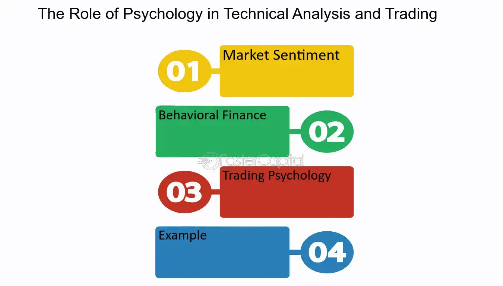

## Table of Contents

## What is technical analysis and how does it differ from fundamental analysis?

Technical analysis is a way to study the stock market by looking at charts and patterns. People who use technical analysis believe that past price movements can help predict future price movements. They use tools like moving averages, trend lines, and other indicators to make decisions about buying or selling stocks. It's all about understanding the market's behavior and making predictions based on that.

On the other hand, fundamental analysis is about looking at a company's financial health and overall business. It involves studying things like earnings, expenses, assets, and liabilities to figure out if a stock is a good buy. People who use fundamental analysis want to know if a company is strong and if its stock is priced fairly. They look at the company's financial statements, industry conditions, and even the economy as a whole to make their decisions.

The main difference between the two is that technical analysis focuses on market trends and patterns, while fundamental analysis focuses on the company's actual performance and value. Both methods can be useful, and some investors use a combination of both to make their investment choices.

## How can beginners start applying basic technical analysis tools?

Beginners can start applying basic technical analysis tools by first learning about simple charts and indicators. A good place to start is with a price chart, which shows how the price of a stock changes over time. You can look at different time frames, like daily, weekly, or monthly charts. One of the easiest tools to use is the moving average, which smooths out price data to help you see the overall trend. For example, a 50-day moving average shows the average price of a stock over the last 50 days. If the stock price is above the moving average, it might be a good time to buy, and if it's below, it might be a good time to sell.

Another basic tool beginners can use is trend lines. These are lines drawn on a chart to show the direction of the price movement. If the price is going up, you draw a line along the bottom of the price movements to see the upward trend. If the price is going down, you draw a line along the top of the price movements to see the downward trend. Trend lines help you see if a stock is in an uptrend or a downtrend. By combining these simple tools, beginners can start to understand how the market is moving and make better decisions about when to buy or sell stocks.

## What are the most common chart patterns used in technical analysis?

In technical analysis, some of the most common chart patterns are head and shoulders, double tops and bottoms, and triangles. The head and shoulders pattern looks like a head with two shoulders and can signal that a stock's price might go down. A double top looks like the letter "M" and can also mean the price might go down, while a double bottom looks like the letter "W" and can mean the price might go up. Triangles can be ascending, descending, or symmetrical, and they show that the price is getting ready to make a big move, either up or down.

Another common pattern is the flag and pennant, which show short pauses in a strong trend. A flag looks like a small rectangle, and a pennant looks like a small triangle. Both of these patterns usually mean that the price will keep moving in the same direction it was going before the pause. The cup and handle pattern looks like a cup with a handle on the side and can signal that the price might go up. Recognizing these patterns can help you predict what the price might do next and make better decisions about buying or selling stocks.

## How does market psychology influence technical analysis?

Market psychology plays a big role in technical analysis because it's all about how people feel about buying and selling stocks. When lots of people are feeling good about a stock, they buy it, and the price goes up. This can create patterns on the charts that technical analysts look at. For example, if everyone is excited about a stock and the price keeps going up, you might see an uptrend on the chart. Technical analysts use these patterns to guess what people might do next, like if they'll keep buying or start selling.

But market psychology can also make things tricky. Sometimes, people get too excited or too scared, and this can make the market move in ways that are hard to predict. For instance, if everyone suddenly decides to sell a stock because they're scared, the price can drop really fast, even if the company is doing well. Technical analysts have to be careful and think about how people's feelings might change the patterns they see on the charts. By understanding market psychology, they can make better guesses about what might happen next.

## What role do support and resistance levels play in market psychology?

Support and resistance levels are important in market psychology because they show where people feel comfortable buying or selling a stock. Support is like a floor for the price. When the price gets close to the support level, people think it's a good time to buy because they believe the price won't go much lower. This belief comes from past experiences where the price bounced back up from that level. On the other hand, resistance is like a ceiling for the price. When the price gets close to the resistance level, people think it's a good time to sell because they believe the price won't go much higher. This also comes from past experiences where the price dropped back down from that level.

These levels can affect how people feel about a stock and what they decide to do. If the price breaks through the support level, it can make people feel worried and they might start selling more, which can make the price drop even further. If the price breaks through the resistance level, it can make people feel excited and they might start buying more, which can make the price go up even higher. So, support and resistance levels are not just lines on a chart; they show where people's feelings about buying and selling can change, and this can move the market.

## How can traders use volume to understand market sentiment?

Traders can use [volume](/wiki/volume-trading-strategy) to understand market sentiment by looking at how many shares of a stock are being bought and sold. When the volume is high, it means a lot of people are trading the stock, which can show strong feelings about it. If the price is going up and the volume is high, it might mean that people are feeling really good about the stock and want to buy more. On the other hand, if the price is going down and the volume is high, it might mean that people are feeling worried and want to sell their shares.

Volume can also help traders see if a price change is important or not. If the price goes up or down a little bit but the volume is low, it might not mean much because not many people are trading. But if the price changes a lot and the volume is high, it's a stronger sign that people's feelings about the stock are changing. By watching the volume, traders can get a better idea of how other people feel about the stock and make smarter choices about buying or selling.

## What are the psychological biases that affect trading decisions?

Psychological biases can really mess up trading decisions. One big bias is called overconfidence. This is when traders think they know more than they actually do and make risky choices. They might see a few good trades and think they're experts, so they start taking bigger risks. Another common bias is loss aversion. This is when traders are so scared of losing money that they hold onto losing stocks for too long, hoping the price will go back up. They might even sell winning stocks too soon just to avoid the pain of a loss.

Another bias that affects trading is confirmation bias. This is when traders only pay attention to information that agrees with what they already think. They might ignore warning signs that a stock is going down because they really want to believe it will go up. Herd mentality is also a big problem. This is when traders follow what everyone else is doing without thinking for themselves. If everyone is buying a stock, they might buy it too, even if it's not a good idea. Understanding these biases can help traders make better decisions and avoid common mistakes.

## How do advanced technical indicators like RSI and MACD reflect market psychology?

Advanced technical indicators like the Relative Strength Index (RSI) and the Moving Average Convergence Divergence (MACD) help traders understand how people feel about a stock. The RSI measures how fast and how much a stock's price is changing. If the RSI is over 70, it means the stock might be overbought, which can show that people are too excited about it and might start selling soon. If the RSI is under 30, it means the stock might be oversold, which can show that people are too worried and might start buying soon. By looking at the RSI, traders can see if people's feelings about a stock are too extreme and might change soon.

The MACD also shows how people feel about a stock by looking at the difference between two moving averages. When the MACD line crosses above the signal line, it can mean that people are starting to feel better about the stock and might start buying more. When the MACD line crosses below the signal line, it can mean that people are starting to feel worse about the stock and might start selling more. The MACD can also show how strong these feelings are. If the MACD line moves far away from the signal line, it means people's feelings are strong, and the price might keep moving in that direction for a while. By using the MACD, traders can see how people's feelings about a stock are changing and make better decisions about buying or selling.

## What is the impact of herd behavior on market trends and technical analysis?

Herd behavior can really change how the market moves. When a lot of people start doing the same thing, like buying or selling a stock, it can make the price go up or down a lot. This is because when everyone is doing the same thing, it can make the trend stronger. For example, if everyone starts buying a stock because they see others doing it, the price can go up fast. But if everyone starts selling because they see others doing it, the price can go down fast. This can create big moves in the market that might not be based on what's really happening with the company.

Technical analysts need to watch out for herd behavior because it can make the patterns they see on the charts less reliable. If a lot of people are following the herd, the price might move in a way that doesn't make sense based on the company's actual value. This can make it hard to predict what will happen next. But, by understanding that herd behavior is happening, technical analysts can be more careful and look for signs that the trend might be about to change. They might see that the volume is really high or that the price is moving too fast, which can be clues that the herd is in control and the trend might not last long.

## How can expert traders use sentiment analysis to improve their technical analysis?

Expert traders can use sentiment analysis to make their technical analysis better by looking at what people are saying and feeling about a stock. They can read news, social media, and other sources to see if people are feeling good or bad about a stock. If a lot of people are talking positively about a stock, it might mean the price will go up. If people are talking negatively, it might mean the price will go down. By combining this information with the patterns they see on the charts, traders can get a better idea of what might happen next. For example, if the charts show a stock is in an uptrend and sentiment analysis shows people are feeling good about it, the trader might feel more confident about buying the stock.

Sentiment analysis can also help traders spot when the market might be about to change direction. If the charts show a stock is going up but sentiment analysis shows people are starting to feel bad about it, it might be a sign that the price will start to go down soon. This can help traders decide when to sell a stock before the price drops. By paying attention to both technical patterns and what people are saying, expert traders can make smarter decisions and maybe even find good opportunities that other people might miss.

## What are the limitations of technical analysis in predicting market movements?

Technical analysis has some big problems when it comes to guessing what the market will do next. One problem is that it only looks at past prices and patterns. It doesn't think about what's happening with the company or the economy. So, if something big changes, like a new law or a problem with the company, technical analysis might not see it coming. Another problem is that a lot of people use the same patterns and indicators. If everyone is looking at the same things, they might all make the same choices at the same time. This can make the market move in ways that don't make sense based on what's really happening.

Another limitation is that technical analysis can be hard to use when the market is moving a lot. If the price is going up and down a lot, the patterns can be hard to see. This can make it tough to know what to do. Also, technical analysis can be affected by people's feelings. If everyone is feeling the same way, like excited or scared, they might all do the same thing, like buy or sell a lot. This can make the market move in ways that are hard to predict. So, while technical analysis can be helpful, it's not perfect and traders need to be careful and use other information too.

## How can a deep understanding of market psychology enhance the effectiveness of technical analysis strategies?

A deep understanding of market psychology can make technical analysis strategies work better by helping traders see why the market is moving the way it is. When traders know how people feel about a stock, they can guess what might happen next. For example, if everyone is excited about a stock and the price is going up, a trader might see an uptrend on the chart. But if they also know that people are starting to feel worried, they might think the price will go down soon. By combining what they see on the charts with what they know about how people feel, traders can make smarter choices about when to buy or sell.

Understanding market psychology can also help traders spot when the market might be about to change direction. If the charts show a stock is going up but people are starting to feel bad about it, a trader might think the price will start to go down soon. This can help them decide when to sell a stock before the price drops. By paying attention to both the patterns on the charts and what people are saying, traders can get a better idea of what might happen next and maybe even find good opportunities that other people might miss.

## References & Further Reading

[1]: Bergstra, J., Bardenet, R., Bengio, Y., & Kégl, B. (2011). ["Algorithms for Hyper-Parameter Optimization."](https://dl.acm.org/doi/10.5555/2986459.2986743) Advances in Neural Information Processing Systems 24.

[2]: ["Advances in Financial Machine Learning"](https://www.amazon.com/Advances-Financial-Machine-Learning-Marcos/dp/1119482089) by Marcos Lopez de Prado

[3]: ["Evidence-Based Technical Analysis: Applying the Scientific Method and Statistical Inference to Trading Signals"](https://www.amazon.com/Evidence-Based-Technical-Analysis-Scientific-Statistical/dp/0470008741) by David Aronson

[4]: ["Machine Learning for Algorithmic Trading"](https://github.com/stefan-jansen/machine-learning-for-trading) by Stefan Jansen

[5]: ["Quantitative Trading: How to Build Your Own Algorithmic Trading Business"](https://www.amazon.com/Quantitative-Trading-Build-Algorithmic-Business/dp/1119800064) by Ernest P. Chan