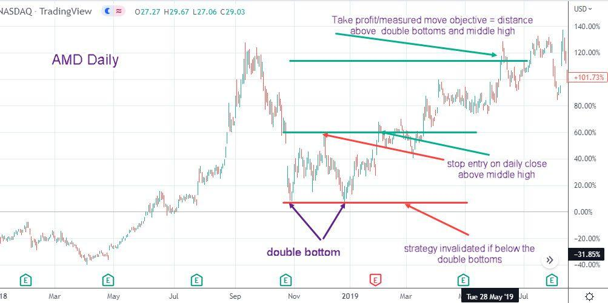

## Table of Contents

## What is a technical analysis report and why is it important in trading?

A technical analysis report is a document that traders use to study past market data, like price and volume, to predict future price movements of stocks, currencies, or other financial instruments. It uses charts, patterns, and indicators to help traders make decisions about when to buy or sell. Think of it as a roadmap that helps traders navigate the ups and downs of the market.

Technical analysis reports are important in trading because they help traders make more informed decisions. By looking at historical data, traders can spot trends and patterns that might repeat in the future. This can give them an edge in deciding the best times to enter or exit trades. Without these reports, traders might be more likely to make decisions based on emotions or incomplete information, which can lead to mistakes and losses.

## What are the basic components of a technical analysis report?

A technical analysis report usually starts with an introduction that explains what the report is about and what it aims to do. It often includes a brief overview of the financial instrument being analyzed, like a stock or currency. This section might also mention the time frame of the analysis, whether it's short-term or long-term. The introduction sets the stage for the rest of the report by giving readers a clear idea of what to expect.

The main body of the report is where you'll find the detailed analysis. This part includes charts and graphs that show the price movements and trading volumes over time. Analysts use these charts to identify patterns and trends, like support and resistance levels, which can help predict where prices might go next. They also use technical indicators, like moving averages or the Relative Strength Index (RSI), to make their predictions more accurate. This section is crucial because it shows the evidence that supports the analyst's conclusions.

The report usually ends with a conclusion and recommendations. The conclusion sums up the main findings from the analysis, explaining what the patterns and indicators suggest about future price movements. The recommendations part gives specific advice on what actions to take, like whether to buy, sell, or hold the financial instrument. These recommendations are based on the analysis done in the main body and help traders make informed decisions.

## How does the double bottom pattern work in trading?

The double bottom pattern is a shape you see on a price chart that looks like the letter "W". It shows up when the price of something, like a stock, goes down to a low point, then goes up a bit, and then goes down to about the same low point again before going up for good. This pattern is important because it tells traders that the price might start going up and keep going up. The two low points are called the "bottoms," and the line that connects the highest points between the bottoms is called the "neckline." When the price breaks above the neckline, it's a signal that it's a good time to buy.

Traders use the double bottom pattern to decide when to buy a stock or other financial thing. When they see the price hit the second bottom and then start to go up past the neckline, they think it's a good sign that the price will keep going up. They might set a target price for how high they think it will go, which is usually about as high as the distance from the bottoms to the neckline, measured from the point where the price breaks the neckline. This pattern helps traders feel more confident about their decisions because it's based on what the price has done before.

## What are the key indicators used in identifying a double bottom pattern?

The double bottom pattern is a shape on a price chart that looks like the letter "W". It has two main parts that help traders spot it: the bottoms and the neckline. The bottoms are the two low points that are about the same level. The neckline is the line that connects the highest points between the two bottoms. Traders watch for the price to hit the second bottom and then start to go up past the neckline. When this happens, it's a sign that the price might keep going up, so it could be a good time to buy.

To make sure it's really a double bottom pattern, traders also look at the [volume](/wiki/volume-trading-strategy) of trading. Usually, the volume is higher when the price hits the second bottom than when it hits the first bottom. This shows that more people are interested in buying at the second bottom, which makes the pattern stronger. Another thing traders check is how long it takes for the pattern to form. If it takes too long, the pattern might not be as reliable. So, traders need to pay attention to both the shape of the pattern and these other signs to make the best decisions.

## Can you explain the step-by-step process of conducting a technical analysis for a double bottom pattern?

To conduct a technical analysis for a double bottom pattern, start by looking at the price chart of the stock or other financial instrument you're interested in. You need to find a pattern that looks like the letter "W". This pattern has two low points, called bottoms, that are about the same level. The two bottoms should be separated by a peak, and the line connecting the highest points between the two bottoms is called the neckline. Once you spot this pattern, check if the price breaks above the neckline after hitting the second bottom. This break above the neckline is a key sign that the price might start going up and keep going up.

Next, you should look at the trading volume to make sure the double bottom pattern is strong. Usually, the volume is higher when the price hits the second bottom than when it hits the first bottom. This higher volume shows that more people are interested in buying at the second bottom, which makes the pattern more reliable. Also, consider how long it takes for the pattern to form. If it takes too long, the pattern might not be as trustworthy. Once you've checked all these things, you can set a target price for how high you think the price will go. This target is usually about as high as the distance from the bottoms to the neckline, measured from the point where the price breaks the neckline. By following these steps, you can use the double bottom pattern to make better trading decisions.

## What are the common mistakes to avoid when using the double bottom pattern in trading?

One common mistake when using the double bottom pattern is not waiting for the price to break above the neckline before making a trade. Some traders get too excited when they see the second bottom and jump in too early. But if the price doesn't break the neckline, the pattern might not be a real double bottom, and the price could go down instead of up. It's important to be patient and wait for that break above the neckline to make sure the pattern is strong.

Another mistake is ignoring the trading volume. The volume should be higher at the second bottom than at the first bottom. If it's not, the pattern might not be as reliable. Traders sometimes forget to check the volume and end up making decisions based only on the shape of the pattern. Also, some traders don't pay attention to how long it takes for the pattern to form. If it takes too long, the pattern might not be as trustworthy. So, always look at the volume and the time frame along with the shape of the pattern to make better trading decisions.

## How can the double bottom pattern be applied to country trading strategies?

The double bottom pattern can be used in country trading strategies to help traders decide when to buy or sell a country's currency. When you see a double bottom pattern on a currency chart, it means the currency has hit a low point twice and then started to go up. If the price breaks above the neckline after the second bottom, it's a sign that the currency might keep going up. Traders can use this pattern to enter a trade at a good time, hoping to make money as the currency's value increases. They need to watch the trading volume too, because if it's higher at the second bottom, it makes the pattern stronger and more reliable.

Applying the double bottom pattern to country trading also means looking at other factors like the country's economy and news events. For example, if a country's economy is doing well or there's good news, it might support the double bottom pattern and make it more likely that the currency will go up. Traders should also be patient and not rush into a trade before the price breaks the neckline. By combining the double bottom pattern with an understanding of the country's economic situation, traders can make better decisions and improve their chances of success in currency trading.

## What are the psychological aspects traders should consider when trading using the double bottom pattern?

When traders use the double bottom pattern, they need to think about their feelings and how these can affect their choices. Seeing the pattern can make traders feel hopeful because it suggests the price will go up. But sometimes, this hope can make them jump into a trade too soon, before the price breaks the neckline. It's important for traders to stay calm and patient, waiting for clear signs before making a move. If they let their emotions take over, they might end up buying at the wrong time and losing money.

Another thing traders should consider is the fear of missing out, or FOMO. When they see the price start to rise after the second bottom, they might worry about missing a good chance to make money. This fear can push them to act too quickly without checking if the pattern is strong enough. Traders need to remember to look at the trading volume and how long the pattern takes to form. By keeping their emotions in check and focusing on the facts, traders can make better decisions and avoid mistakes caused by feeling too excited or too worried.

## How do macroeconomic factors influence the effectiveness of the double bottom pattern in country trading?

Macroeconomic factors can make the double bottom pattern more or less useful when trading a country's currency. Things like interest rates, inflation, and how well the country's economy is doing can change how people see the currency's value. If a country's economy is getting better, like if they have low unemployment and growing businesses, the double bottom pattern might be a stronger sign that the currency will go up. People might feel more confident about the currency and start buying it, which can make the pattern work better. On the other hand, if the economy is doing badly, like if there's high inflation or a lot of debt, the pattern might not be as reliable because people might not want to buy the currency.

Traders need to think about these big economic factors when they see a double bottom pattern. For example, if a country's central bank raises interest rates, it can make the currency more attractive to investors, which can support the double bottom pattern. But if there's bad news, like a big drop in the country's exports, it might make people less interested in the currency and weaken the pattern. By looking at both the double bottom pattern and the country's economic situation, traders can make smarter choices about when to buy or sell the currency.

## What advanced technical indicators can enhance the accuracy of a double bottom pattern analysis?

To make the double bottom pattern more accurate, traders can use other technical indicators like the Relative Strength Index (RSI) and the Moving Average Convergence Divergence (MACD). The RSI helps traders see if a currency is overbought or oversold. When the RSI shows that the currency is oversold at the second bottom, it can make the double bottom pattern stronger. This means there's a better chance the price will go up. The MACD can also help by showing when the trend might change. If the MACD line crosses above the signal line right after the second bottom, it's a good sign that the price will start going up.

Another useful indicator is the volume oscillator, which looks at how the trading volume changes over time. If the volume is higher at the second bottom than at the first, it can make the double bottom pattern more reliable. Traders can also use the Average True Range (ATR) to see how much the price is moving. A low ATR at the second bottom can show that the price is stable, which can make the pattern stronger. By using these advanced indicators along with the double bottom pattern, traders can make better guesses about where the price will go next.

## How can backtesting be used to validate a double bottom country trading strategy?

Backtesting is a way to check if a double bottom trading strategy works well by looking at old data. Traders use a computer program to see how the strategy would have done in the past. They look at old price charts to find times when the double bottom pattern showed up. Then, they pretend to buy the currency when the price breaks above the neckline and sell it when it reaches the target price. By doing this, traders can see if the strategy would have made money or lost money in the past. This helps them feel more sure about using the strategy in the future.

Backtesting also helps traders find problems with their strategy. They can see if the double bottom pattern works better with certain currencies or during certain times. They might find that the strategy works well for some countries but not for others. Traders can also change things like how long they wait before selling or what other indicators they use to make the strategy better. By testing different ideas on old data, traders can make their double bottom strategy stronger and more likely to work well when they use it for real trading.

## What are the latest research findings on the effectiveness of the double bottom pattern in different market conditions?

Recent research shows that the double bottom pattern can work well in different market conditions, but it depends on a few things. In strong bull markets, where prices are going up a lot, the double bottom pattern often works better because more people are buying, which can make the pattern stronger. But in bear markets, where prices are going down, the pattern might not be as reliable because people are more likely to sell, which can make the price go down even after it hits the second bottom. Researchers have also found that the pattern works better when the trading volume is higher at the second bottom, which shows more people are interested in buying.

Another important finding is that the double bottom pattern can be more effective in certain types of markets, like [forex](/wiki/forex-system) markets, where currencies are traded. In these markets, the pattern can be a good sign of a trend change, especially when combined with other indicators like the RSI or MACD. However, the pattern might not work as well in very choppy or unpredictable markets, where prices move a lot without clear trends. So, traders need to think about the overall market conditions and use other tools to make sure the double bottom pattern is a good sign for their trading decisions.

## What is the History of Technical Analysis?

Technical analysis has a rich history, tracing its origins to several key figures and foundational principles that have shaped its evolution over time. 

The roots of technical analysis can be traced back to 18th-century Japan with Sokyu Honma, a rice trader from Sakata, who is often credited with the development of the candlestick charting method. Candlestick charts remain a fundamental tool in technical analysis, providing insights into market sentiment through the depiction of price movements within given time frames.

In the West, the late 19th and early 20th centuries marked significant advancements in technical analysis through the development of Dow Theory by Charles H. Dow, a co-founder of Dow Jones & Company. Dow Theory laid the groundwork for modern technical analysis by proposing that markets move in predictable ways, characterized by trends that persist until definitive reversal signals emerge.

One of the core principles of technical analysis is the concept of support and resistance. Support refers to a price level where a downtrend can be expected to halt due to a concentration of demand, while resistance is a price level where an uptrend can be expected to pause due to a concentration of selling interest. These levels are fundamental in predicting potential price [breakout](/wiki/breakout-trading) or reversal points.

Pattern recognition plays a crucial role in technical analysis, with traders identifying specific formations on charts as signals of future price movements. Common patterns include head and shoulders, triangles, and flags. Indicators such as Simple Moving Averages (SMAs) and Exponential Moving Averages (EMAs) are widely used to smooth out price data, thereby identifying the direction of the prevailing trend. The formulas for SMAs and EMAs can be expressed as follows:

- **Simple Moving Average (SMA):**
$$
  \text{SMA} = \frac{P_1 + P_2 + \cdots + P_n}{n}

$$
  where $P$ represents the price at each period and $n$ is the number of periods.

- **Exponential Moving Average (EMA):**
$$
  \text{EMA} = P_t \times \left(\frac{2}{n + 1}\right) + \text{EMA}_{t-1} \times \left(1 - \frac{2}{n + 1}\right)

$$
  where $P_t$ is the price at the current period and $n$ is the number of periods.

Oscillators, such as the Relative Strength Index (RSI) and the Moving Average Convergence Divergence (MACD), are designed to indicate overbought or oversold conditions and help traders identify potential reversal points across various market environments.

Academic research has increasingly focused on evaluating the efficacy of technical indicators. Studies often assess whether the historical predictive power of these tools remains relevant in modern electronic markets. Research has explored the statistical validity of technical indicators, examining their performance in different markets and under varying conditions to provide evidence-based insights for practitioners.

The history and development of technical analysis underscore its enduring significance as a method for interpreting financial markets, with concepts like support, resistance, and pattern recognition continuing to serve as essential components in trading strategies.

## What are the Backtesting Results?

In analyzing the [backtesting](/wiki/backtesting) results of trading strategies centered around the double top and bottom patterns, several key performance metrics are pivotal to understanding the effectiveness of the strategies. Among these, the expected return, [volatility](/wiki/volatility-trading-strategies), and Sharpe ratio provide a comprehensive overview of the strategy's potential.

The **expected return** of a strategy gives an average performance indicator per trading period, reflecting the profit a trader can expect on average from the investment. However, high returns must be weighed against the strategy's **volatility**, which indicates the degree of variation in trading returns over time. A strategy exhibiting high volatility may pose substantial risk, potentially deterring risk-averse investors.

The **Sharpe ratio**, a crucial metric in performance evaluation, is defined as the ratio of the expected excess return of the portfolio over the risk-free rate to its standard deviation. Formally, it can be expressed as:

$$
\text{Sharpe Ratio} = \frac{E[R_p] - R_f}{\sigma_p}
$$

where $E[R_p]$ is the expected portfolio return, $R_f$ is the risk-free return, and $\sigma_p$ represents the standard deviation of portfolio returns. A higher Sharpe ratio indicates a more favorable risk-adjusted return.

Periods of **drawdown**, where the portfolio drops from its peak value before recovering, are inevitable and serve as an indicator of a strategy's robustness. The magnitude and frequency of drawdowns provide insight into potential vulnerabilities within the trading strategy and can inform necessary adjustments to improve long-term viability.

**Stagnant periods** may occur when the strategy yields minimal returns, neither advancing nor declining significantly. During such times, heightened scrutiny of market conditions and strategy assumptions is essential. Strategy enhancements can be made by tweaking pattern recognition criteria, adjusting parameter settings such as stop-loss and take-profit thresholds, or by incorporating additional technical indicators to refine entry and exit signals.

Platforms like **Quantconnect** play a significant role in backtesting by providing a versatile environment where historical trading strategies can be evaluated against a wide array of financial data. This platform facilitates the testing of various trading hypotheses under different market conditions, thus enabling traders to identify and refine strategies with greater confidence. Through comprehensive backtesting provided by such platforms, traders can distill insights from past performance, aiding in the optimization of future trading decisions.

## References & Further Reading

[1]: Murphy, J. J. (1999). ["Technical Analysis of the Financial Markets: A Comprehensive Guide to Trading Methods and Applications."](https://www.amazon.com/Technical-Analysis-Financial-Markets-Comprehensive/dp/0735200661) New York Institute of Finance.

[2]: Schwager, J. D. (1989). ["Market Wizards: Interviews with Top Traders."](https://www.amazon.com/Market-Wizards-Interviews-Top-Traders/dp/0135560934) Wiley.

[3]: Lo, A. W., & Hasanhodzic, J. (2010). ["The Evolution of Technical Analysis: Financial Prediction from Babylonian Tablets to Bloomberg Terminals."](https://www.amazon.com/Evolution-Technical-Analysis-Prediction-Babylonian/dp/1576603490) Wiley.

[4]: Fama, E. F., & Blume, M. E. (1966). ["Filter Rules and Stock Market Trading."](https://www.jstor.org/stable/2351744) Journal of Business, 39(1), 226-241. 

[5]: Park, C.-H., & Irwin, S. H. (2007). ["What Do We Know About the Profitability of Technical Analysis?"](https://onlinelibrary.wiley.com/doi/abs/10.1111/j.1467-6419.2007.00519.x) Journal of Economic Surveys, 21(4), 786-826.

[6]: Kahneman, D. (2011). ["Thinking, Fast and Slow."](https://link.springer.com/article/10.1007/s00362-013-0533-y) Farrar, Straus and Giroux.

[7]: Shiller, R. J. (2010). ["Irrational Exuberance."](https://www.cfainstitute.org/-/media/documents/book/rf-publication/2010/rf-v2010-n2-5.pdf) Princeton University Press.

[8]: SSRN. ["Research on the Principles and Effectiveness of Technical Analysis."](https://www.ssrn.com/index.cfm/en/) Social Science Research Network.