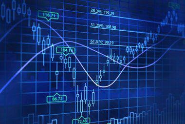

The stock market is a multifaceted environment where technical analysis and algorithmic trading have significant influence. Technical analysis is a method used by traders to evaluate and predict future market trends based on past price movements and trading volumes. This approach operates on the assumption that historical patterns and behaviors in a security's price movements can repeat over time, enabling traders to anticipate future changes.

A prominent concept linked to technical analysis is the self-fulfilling prophecy. This concept is based on the idea that if a substantial number of traders rely on the same technical indicators, their collective actions can actually affect the market, driving prices in the anticipated direction. For instance, if numerous traders identify a specific resistance level and decide to sell their securities at this price point, their actions could indeed cause the market price to decline, thereby confirming the predicted resistance. This phenomenon raises questions about whether technical analysis can predict market movements or if it merely creates conditions for its predictions to manifest through collective trader behavior.

This article examines how technical analysis may contribute to the creation of self-fulfilling prophecies and evaluates its role in the context of algorithmic trading, a modern paradigm in financial markets. Algorithmic trading involves the use of computer algorithms to execute trades at high speeds based on predetermined strategies, often grounded in technical analysis. The integration of algorithms into trading practices enhances the speed and frequency of transactions, leading to discussions on the extent to which technical signals influence market movements in such a tech-driven landscape.

There is ongoing debate regarding the effectiveness of technical analysis: some argue that data patterns offer genuine insights into market mechanics, while others view them as coincidences caused by mass trader behavior. Through this article, we will examine these debates and consider the potential of technical analysis to either predict market trends or become self-reinforcing in nature.

## Table of Contents

## Understanding Technical Analysis

Technical analysis is a methodology used by traders and investors to evaluate and predict future price movements in financial markets. It relies on chart patterns, mathematical indicators, and statistical measures to analyze historical price data, with the aim of forecasting future trends. This approach assumes that all relevant information is already reflected in the stock price, and patterns repeat over time.

Common tools employed in technical analysis include trendlines, moving averages, and support and resistance levels. Trendlines are used to identify the general direction of price movement and are drawn by connecting a series of highs or lows on a chart. Moving averages, another frequently used indicator, smooth out price data by creating a constantly updated average price over a specific time frame. This helps to highlight trends by filtering out short-term fluctuations. Support and resistance levels are price points where historical buying or selling pressure has caused reversals, and traders often use these levels to predict future price movements.

Despite its widespread use, technical analysis is frequently debated as being more of an art than a science. Critics argue that many of the indicators used can become self-fulfilling prophecies. For example, if a large number of traders act on the same technical signals, such as entering or exiting a position at a specific moving average, their collective actions can drive the market in the anticipated direction, thus reinforcing the prediction.

Certain chart patterns, like the head and shoulders or Fibonacci retracements, are particularly popular among traders. The head and shoulders pattern is a reversal pattern that signals a change in trend direction. It consists of three peaks: the central peak (the head) is higher than the two outside peaks (the shoulders). Fibonacci retracements involve using horizontal lines to indicate areas of support or resistance at the key Fibonacci levels before the price continues in the original direction.

Such patterns and tools are extensively utilized, not only because they have shown historical success but also because their widespread acceptance leads to their predictions becoming true. This generates ongoing debates about the predictability and efficacy of technical analysis indicators beyond being artifacts of crowd behavior. Nevertheless, technical analysis remains an integral part of the decision-making process for many traders, offering a framework for interpreting market dynamics and gauging sentiment.

## The Self-Fulfilling Prophecy Debate

A self-fulfilling prophecy in financial markets occurs when a prediction influences behavior in such a way that it makes the prediction come true. This phenomenon is particularly relevant in technical analysis, where traders make decisions based on established patterns that, when widely recognized and acted upon, can lead to the predicted market movement. For instance, if many traders identify a potential [breakout](/wiki/breakout-trading) from a resistance level and collectively place buy orders, the resulting demand can push prices upward, effectively validating the initial prediction.

The widespread adoption of technical analysis tools among market participants contributes to their self-reinforcing nature. Indicators like trendlines, moving averages, and specific chart patterns become a form of shared knowledge. The more traders pay attention to these signals, the more likely they are to act in concert, driving the market in the expected direction, thus creating a feedback loop.

This process raises debate among traders and analysts. Some argue these technical tools lack inherent predictive power, suggesting instead that it is the large-scale trading behavior that shapes market outcomes. This perspective implies that the value of technical analysis lies in its ability to map collective trader psychology rather than forecast with precision.

Conversely, proponents of technical analysis assert its capacity to provide genuine insights, arguing that these tools are grounded in the analysis of historical price data and investor behavior patterns, which can reveal underlying market dynamics. By examining past price actions, technical analysts believe it is possible to identify probable future movements, attributing predictive power to the tools themselves rather than collective trader actions alone.

This duality of perspectives—whether technical analysis serves primarily as a self-fulfilling prophecy or as an insightful predictor of market trends—defines the ongoing discourse in financial circles, underscoring the complex interplay between market psychology and analytical methodologies.

## Algorithmic Trading and Technical Analysis

Algorithmic trading utilizes automated systems to execute trades following pre-established strategies, frequently incorporating technical analysis indicators. These algorithms are designed to identify and exploit market opportunities far faster than a human trader, thus increasing both the speed and [volume](/wiki/volume-trading-strategy) of trades. The ability to execute trades at such rapid speeds can potentially intensify the effects of self-fulfilling prophecies. When a majority of algorithms are programmed to recognize and act upon the same technical signals, their synchronized actions can drive the market in the direction anticipated by these signals.

The interaction between [algorithmic trading](/wiki/algorithmic-trading) and technical analysis significantly impacts short-term price movements. Algorithms can process copious amounts of data and detect patterns almost instantaneously. This rapid processing capability enables algorithms to react to market fluctuations at a speed that is unattainable for human traders. Although this can enhance market efficiency by narrowing spreads and providing [liquidity](/wiki/liquidity-risk-premium), it also introduces questions regarding the predictability and influence of technical indicators in such an automated environment.

The rise of algorithmic trading introduces additional complexities related to herding and collective behavior. When a large number of trading algorithms are set to execute similar trades based on technical signals, this can lead to herding behavior, where many market participants follow similar strategies. This collective action can amplify the effects of self-fulfilling scenarios, particularly if the initial technical signal was widespread among the algorithms. In this context, the self-reinforcing nature of technical analysis becomes more pronounced as price movements are driven by the aggregated actions of automated systems rather than individual trader decisions.

Ultimately, while technology has revolutionized trading by enabling intricate algorithms to process and act on financial data with unprecedented speed, it also raises critical questions. These include the extent to which technical signals remain predictive when largely influenced by algorithmic behavior and whether the resulting market movements genuinely reflect underlying economic conditions or merely the mechanical responses of trading algorithms.

## Case Studies and Examples

Examining historical cases where technical indicators apparently forecasted market movements can provide valuable insights into the effectiveness and limitations of technical analysis. These cases offer practical examples of how various tools and techniques might serve as predictors in financial markets through collective trading behavior.

One illustrative example is the use of moving averages, which have frequently aligned with significant price movements in both stock and commodity markets. Moving averages, particularly the 50-day and 200-day moving averages, are often used to identify trends or reversals. When the shorter-term 50-day moving average crosses above the longer-term 200-day moving average, it generates a "golden cross" signal; conversely, when it crosses below, a "death cross" signal is indicated. Historically, these signals have been considered critical points for buying or selling.

A famous occurrence of the golden cross appeared in early 2012 for the S&P 500 index, which was followed by a notable rally in the index. Many traders and investment managers, believing in the predictive nature of this signal, likely contributed to the upward [momentum](/wiki/momentum) by aligning their strategies accordingly. This alignment indicates a self-fulfilling nature as the collective response to the signal may partly cause the predicted price movement.

Another example involves the use of trendlines in predicting price movements. In the 2016 Brexit scenario, GBP/USD trendlines were used extensively by traders. As the British pound started to decline against the US dollar, technical analysts pointed to the breach of major trendline supports as an indicator of further losses. The widespread attention and credibility given to these trendlines among market participants might have exacerbated the pound's decline.

Moreover, the 1997 Asian Financial Crisis provides insights into the limitations of technical analysis when market conditions are influenced by external macroeconomic factors. During this period, despite the presence of standard technical patterns, unexpected shifts in economic conditions across Asia led to unforeseen [volatility](/wiki/volatility-trading-strategies), demonstrating that reliance solely on technical indicators can sometimes be insufficient.

These examples highlight both the potential of technical analysis as a heuristic tool and its limitations. While technical indicators may sometimes predict market movements due to widespread belief and collective action, unforeseen factors can disrupt the anticipated outcomes. Thus, technical analysis should be employed as a component of a broader, more diversified strategic approach to trading and investment.

## Criticism and Skepticism

Critics of technical analysis frequently argue that financial markets are characterized by inherent unpredictability, often described as following a "random walk." This theory suggests that price movements are independent, and future prices cannot be predicted based on past movements. As such, any perceived patterns in price charts could be mere coincidences rather than indicative of actual market trends.

Moreover, there is a concern that technical analysis suffers from data mining bias and survivorship bias. Data mining bias occurs when analysts identify patterns in historical data that are statistically insignificant and unlikely to repeat in the future. This happens when analysts search extensively through historical data for patterns without accounting for the large number of possible patterns that might appear purely by chance. Survivorship bias refers to the focus on successful patterns and indicators that have worked in the past, ignoring those that failed. This skewed analysis can create an illusion of predictability and reliability.

Some traders and investors may place undue reliance on technical indicators, using them as standalone tools for making trading decisions. This exclusive focus on technical signals can be risky if it excludes other critical analyses, such as [fundamental analysis](/wiki/fundamental-analysis), which considers economic indicators, financial statements, and broader market trends. Integrating these dimensions can provide a more comprehensive understanding of market dynamics and potentially mitigate the risks of over-relying on one approach.

The debate over the effectiveness of technical analysis often centers around the contrast between randomness and systematic patterns. Proponents of the random walk hypothesis argue that price changes are a result of new information entering the market, which is inherently unpredictable. By this logic, any attempt to forecast future prices based solely on past price patterns may be futile. On the other hand, some traders and researchers believe that certain market behaviors may lead to systematic patterns that can be capitalized upon using technical analysis.

This ongoing debate challenges traders to critically assess the methodologies and tools they employ. It highlights the need for a balanced approach that recognizes the limitations of technical analysis, encourages diversification of strategies, and fosters an understanding of both predictable patterns and inherent market uncertainties.

## Conclusion

Technical analysis remains a divisive topic within financial circles, influenced by both historical success and skepticism. It has been a cornerstone for many traders who rely on its ability to discern patterns and trends, yet it persistently faces criticism for lacking scientific rigor and being potentially self-reinforcing due to its widespread adherence. Whether technical analysis is genuinely predictive or simply self-fulfilling continues to be a point of contention.

In modern trading, particularly with the rise of algorithmic trading, technical analysis plays an indispensable role. Algorithms execute trades based on predefined strategies that often incorporate technical indicators. This integration underscores the importance of technical analysis in today’s fast-paced markets. The capacity of algorithms to process vast amounts of data and identify patterns at speeds unattainable for human traders further emphasizes its real-world applicability.

However, traders and investors should approach technical analysis as one of many tools within a diversified strategy. A balanced approach that includes both technical and fundamental analysis can provide a more comprehensive understanding of market dynamics. Investors need to recognize the limitations of relying solely on historical patterns which may not necessarily predict future events due to market volatility and unforeseen circumstances.

Continuous learning and adaptation to market dynamics are essential for success. Understanding the interplay between human and algorithmic actions, as well as developing a keen sense of market sentiment, can provide valuable insights. Traders must not only focus on technical indicators but also stay informed about broader economic trends and market news, which can influence market behavior in unexpected ways.

Ultimately, while technical analysis remains a subject of debate, its relevance and application in modern trading strategies cannot be understated. Its use, complemented by other analytical methods, enables traders to navigate the complexities of financial markets with a more robust, informed approach.

## References & Further Reading

[1]: ["Evidence-Based Technical Analysis: Applying the Scientific Method and Statistical Inference to Trading Signals"](https://www.amazon.com/Evidence-Based-Technical-Analysis-Scientific-Statistical/dp/0470008741) by David Aronson

[2]: ["Quantitative Trading: How to Build Your Own Algorithmic Trading Business"](https://www.amazon.com/Quantitative-Trading-Build-Algorithmic-Business/dp/1119800064) by Ernest P. Chan

[3]: ["Technical Analysis of the Financial Markets: A Comprehensive Guide to Trading Methods and Applications"](https://www.amazon.com/Technical-Analysis-Financial-Markets-Comprehensive/dp/0735200661) by John J. Murphy

[4]: Lo, A. W., & MacKinlay, A. C. (1999). ["A Non-Random Walk Down Wall Street."](https://www.jstor.org/stable/j.ctt7tccx) Princeton University Press.

[5]: [Lopez de Prado, M. (2018). "Advances in Financial Machine Learning."](https://www.amazon.com/Advances-Financial-Machine-Learning-Marcos/dp/1119482089) Wiley.