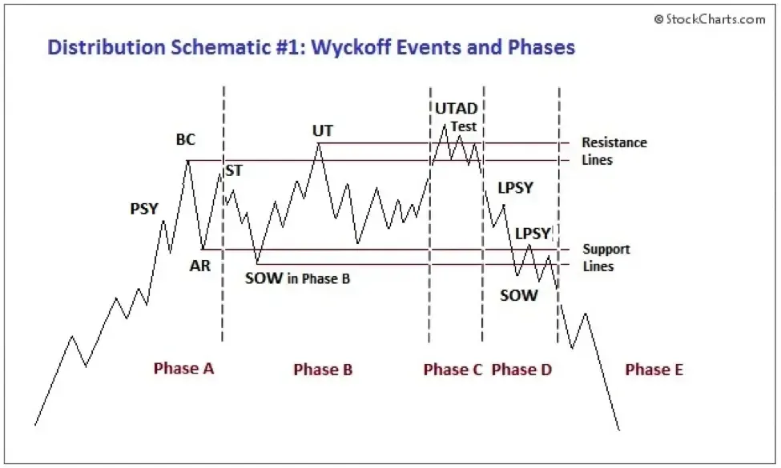

## Table of Contents

## What is technical analysis?

Technical analysis is a way to study and predict how the prices of things like stocks, currencies, or commodities might move in the future. It looks at past price movements and trading volumes to find patterns and trends. People who use technical analysis believe that all the information they need is already shown in the price movements, so they don't need to look at the company's financial reports or news about the economy.

The main tools used in technical analysis are charts and indicators. Charts show how prices have changed over time, and they can be simple line charts or more complex ones like candlestick charts. Indicators are calculations based on the price and volume data, and they help to spot trends, momentum, and possible turning points in the market. Some common indicators are moving averages, the Relative Strength Index (RSI), and the Moving Average Convergence Divergence (MACD). By using these tools, traders try to make better decisions about when to buy or sell.

## How does technical analysis differ from fundamental analysis?

Technical analysis and fundamental analysis are two different ways to look at investments like stocks. Technical analysis focuses on the price movements and trading volumes of a stock. It uses charts and indicators to find patterns and trends that can help predict future price movements. People who use technical analysis believe that all important information is already shown in the price, so they don't need to look at other things like the company's financial reports or news about the economy.

On the other hand, [fundamental analysis](/wiki/fundamental-analysis) looks at the actual value of a company. It involves studying the company's financial statements, like its income statement, balance sheet, and cash flow statement. Fundamental analysts also look at things like the company's management, the industry it's in, and the overall economy. They use this information to decide if a stock is a good buy based on whether it's undervalued or overvalued compared to its true worth.

In short, technical analysis is all about the numbers on the charts, while fundamental analysis is about understanding the company's real value. Both methods can be useful, and some investors use a mix of both to make their decisions.

## What are the basic principles of technical analysis?

Technical analysis is based on the idea that history tends to repeat itself in the markets. It looks at past price movements and trading volumes to find patterns and trends. People who use technical analysis believe that all the important information about a stock is already shown in its price. They think they don't need to look at other things like the company's financial reports or news about the economy. Instead, they use charts and indicators to spot these patterns and make predictions about where the price might go next.

Another key principle of technical analysis is that market trends are important. It assumes that prices move in trends, and these trends can be upward, downward, or sideways. By identifying these trends early, traders can make better decisions about when to buy or sell. Technical analysts use tools like moving averages, the Relative Strength Index (RSI), and the Moving Average Convergence Divergence (MACD) to help them see these trends and make their predictions.

## Can you explain the concept of a self-fulfilling prophecy in the context of financial markets?

A self-fulfilling prophecy in financial markets happens when a lot of people believe something will happen, and their actions make it come true. For example, if many traders think a stock's price will go up, they might all start buying it. This buying can push the price up, making their belief come true even if there was no real reason for the price to go up in the first place.

This idea is important in technical analysis, where people look at past price movements to predict the future. If enough traders see a pattern and act on it, their actions can create the very outcome they expected. So, even if the pattern didn't mean anything at first, it can become real because so many people believed in it and acted on it.

## How might technical analysis contribute to a self-fulfilling prophecy?

Technical analysis can help create a self-fulfilling prophecy because it looks at past price movements to predict the future. If many traders see the same pattern on a chart and believe it means the price will go up, they might all start buying the stock. This buying can push the price up, making their prediction come true. So, even if the pattern didn't really mean anything at first, it becomes real because so many people believed in it and acted on it.

For example, if a lot of traders see a "head and shoulders" pattern, which some think means the price will drop, they might start selling the stock. This selling can make the price go down, just like they thought it would. The pattern itself didn't cause the price to drop; it was the traders' actions based on what they saw that made it happen. This shows how technical analysis can lead to self-fulfilling prophecies in the market.

## What are some common technical indicators used in analysis?

Technical indicators are tools that help traders understand what might happen to the price of a stock or other investment. Some common ones are moving averages, which smooth out price data to show trends over time. A simple moving average (SMA) calculates the average price over a certain number of days, while an exponential moving average (EMA) gives more weight to recent prices. Traders often use moving averages to spot when a trend might be starting or ending. For example, if a short-term moving average crosses above a long-term one, it might mean the price is going to go up.

Another popular indicator is the Relative Strength Index (RSI), which measures how fast and how much a price has changed. It helps traders see if a stock is overbought or oversold. If the RSI is over 70, it might mean the price has gone up too fast and could drop soon. If it's under 30, it might mean the price has gone down too fast and could go up soon. The Moving Average Convergence Divergence (MACD) is also widely used. It shows the relationship between two moving averages and can help traders see changes in the strength, direction, [momentum](/wiki/momentum), and duration of a trend. When the MACD line crosses above the signal line, it might be a good time to buy, and when it crosses below, it might be a good time to sell.

## How do traders and investors use technical analysis to make decisions?

Traders and investors use technical analysis to make decisions by looking at charts and indicators to find patterns and trends in the price movements of stocks or other investments. They believe that all the important information about a stock is already shown in its price, so they don't need to look at other things like the company's financial reports or news about the economy. By studying these patterns, they try to predict where the price might go next. For example, if they see a pattern that usually means the price will go up, they might decide to buy the stock. If they see a pattern that usually means the price will go down, they might decide to sell it.

One common way traders use technical analysis is by looking at moving averages. These are lines on a chart that show the average price of a stock over a certain number of days. If a short-term moving average crosses above a long-term one, it might mean the price is going to go up, so traders might decide to buy. Another tool they use is the Relative Strength Index (RSI), which helps them see if a stock is overbought or oversold. If the RSI is over 70, it might mean the price has gone up too fast and could drop soon, so traders might decide to sell. If it's under 30, it might mean the price has gone down too fast and could go up soon, so they might decide to buy. By using these and other technical indicators, traders and investors try to make better decisions about when to buy or sell.

## What evidence supports the idea that technical analysis can be a self-fulfilling prophecy?

Technical analysis can become a self-fulfilling prophecy because many traders look at the same charts and patterns. If a lot of them see a pattern that they think means the price will go up, they might all start buying the stock. This buying can push the price up, making their prediction come true. So, even if the pattern didn't really mean anything at first, it becomes real because so many people believed in it and acted on it.

For example, if traders see a "head and shoulders" pattern, which some think means the price will drop, they might start selling the stock. This selling can make the price go down, just like they thought it would. The pattern itself didn't cause the price to drop; it was the traders' actions based on what they saw that made it happen. This shows how technical analysis can lead to self-fulfilling prophecies in the market.

## Are there any studies or research that challenge the effectiveness of technical analysis as a self-fulfilling prophecy?

Some studies and research challenge the idea that technical analysis works as a self-fulfilling prophecy. These studies say that just because a lot of people believe in a pattern and act on it, it doesn't always make the pattern come true. For example, a study by Andrew Lo and Craig MacKinlay found that stock prices don't always follow the patterns that technical analysts look for. They said that the market is too random and unpredictable for technical analysis to work all the time.

Another study by Burton Malkiel in his book "A Random Walk Down Wall Street" argues that technical analysis is not a reliable way to predict stock prices. Malkiel says that the market is like a random walk, where past price movements don't help predict future ones. He believes that any success from technical analysis is just luck, not because of self-fulfilling prophecies. These studies suggest that while technical analysis might work sometimes, it's not a sure way to make money in the stock market.

## How can understanding the self-fulfilling prophecy aspect of technical analysis improve trading strategies?

Understanding the self-fulfilling prophecy aspect of technical analysis can help traders make better decisions. If a lot of people see the same pattern on a chart and believe it means the price will go up, they might all start buying the stock. This buying can push the price up, making their belief come true. So, if traders know that many others are watching the same patterns, they can try to get in on the action early. By buying before everyone else starts buying, they might make a profit when the price goes up because of the self-fulfilling prophecy.

On the other hand, traders can also use this knowledge to be careful. If they see a pattern that a lot of people believe in, but they think it's not really based on anything solid, they might decide not to follow the crowd. This way, they can avoid buying into a trend that might not last long. By understanding how self-fulfilling prophecies work, traders can be smarter about when to follow the crowd and when to go their own way.

## What are the limitations and risks associated with relying on technical analysis?

Technical analysis has some big limitations and risks. One big problem is that it might not always work. The market can be very random, and just because a pattern showed up in the past doesn't mean it will happen again. This means that even if a lot of people see the same pattern and act on it, the price might not go the way they expect. Also, technical analysis doesn't look at things like the company's financial health or news about the economy, which can be really important. If traders only use technical analysis, they might miss out on important information that could affect the stock's price.

Another risk is that technical analysis can lead to a lot of false signals. Traders might see a pattern and think the price is going to go up or down, but it might not happen. This can lead to buying or selling at the wrong times, which can cost money. Also, if too many people are using the same patterns, the market can become crowded. When everyone tries to buy or sell at the same time, it can cause big swings in the price that are hard to predict. So, while technical analysis can be useful, it's important for traders to be careful and not rely on it too much.

## How do market sentiment and behavioral economics play into the self-fulfilling prophecy of technical analysis?

Market sentiment and behavioral economics are big parts of why technical analysis can become a self-fulfilling prophecy. Market sentiment is what people feel about the market. If a lot of people feel good about a stock, they might all start buying it, pushing the price up. Behavioral economics looks at how people make choices, often based on what they see others doing. If traders see a pattern on a chart and think it means the price will go up, they might all start buying the stock because they think everyone else will too. This can make the price go up, even if the pattern didn't really mean anything at first.

These ideas show how technical analysis can lead to self-fulfilling prophecies. When traders see the same patterns and act on them, their actions can make the pattern come true. For example, if a lot of people see a "head and shoulders" pattern and think it means the price will drop, they might start selling the stock. This selling can make the price go down, just like they thought it would. So, it's not the pattern itself that causes the price to move; it's the traders' actions based on what they see and what they think others will do that makes it happen.

## References & Further Reading

[1]: ["Evidence-Based Technical Analysis: Applying the Scientific Method and Statistical Inference to Trading Signals"](https://www.amazon.com/Evidence-Based-Technical-Analysis-Scientific-Statistical/dp/0470008741) by David Aronson

[2]: ["Quantitative Trading: How to Build Your Own Algorithmic Trading Business"](https://www.amazon.com/Quantitative-Trading-Build-Algorithmic-Business/dp/1119800064) by Ernest P. Chan

[3]: ["Technical Analysis of the Financial Markets: A Comprehensive Guide to Trading Methods and Applications"](https://www.amazon.com/Technical-Analysis-Financial-Markets-Comprehensive/dp/0735200661) by John J. Murphy

[4]: Lo, A. W., & MacKinlay, A. C. (1999). ["A Non-Random Walk Down Wall Street."](https://www.jstor.org/stable/j.ctt7tccx) Princeton University Press.

[5]: [Lopez de Prado, M. (2018). "Advances in Financial Machine Learning."](https://www.amazon.com/Advances-Financial-Machine-Learning-Marcos/dp/1119482089) Wiley.