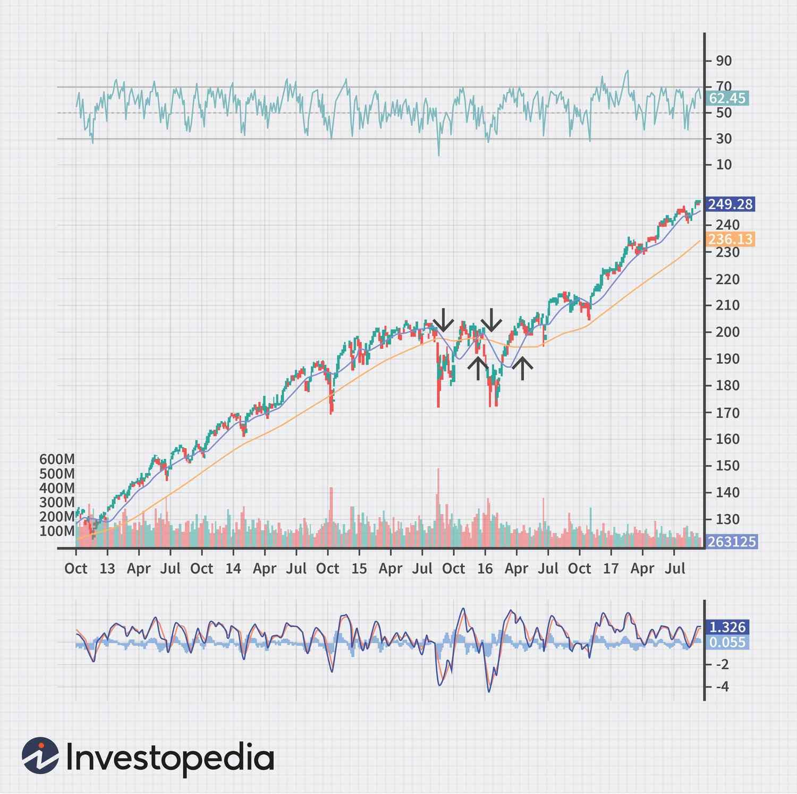

## Table of Contents

## What is technical analysis and why is it important for stock trading?

Technical analysis is a way to study stock prices by looking at charts and patterns. It helps traders predict where the stock price might go next. Instead of focusing on a company's business, technical analysis looks at past price movements and trading volumes. Traders use tools like moving averages, trend lines, and other indicators to spot patterns that can signal if a stock price will go up or down.

This method is important for stock trading because it helps traders make decisions based on what the market is doing right now, not just on what they think a company might do in the future. By understanding these patterns, traders can find good times to buy or sell stocks. This can help them make more money and manage their risks better. Even though it's not perfect and doesn't work all the time, many traders find technical analysis useful for making quick and informed trading choices.

## How does technical analysis differ from fundamental analysis?

Technical analysis and fundamental analysis are two different ways to look at stocks. Technical analysis focuses on the stock's price movements and trading patterns. It uses charts and tools like moving averages and trend lines to predict where the stock price might go next. Traders who use technical analysis don't care much about the company's business; they just want to know what the market is doing right now.

On the other hand, [fundamental analysis](/wiki/fundamental-analysis) looks at the company's actual business. It involves studying things like the company's earnings, debts, and how well it's managed. People who use fundamental analysis want to know if the company is a good investment based on its financial health and future growth potential. They might look at the company's financial statements, industry trends, and even the economy to decide if the stock is a good buy.

Both methods have their strengths and are used by different types of investors. Technical analysis is great for short-term trading because it helps traders make quick decisions based on current market trends. Fundamental analysis is often used for long-term investing because it helps investors understand the true value of a company over time.

## What are the basic principles of technical analysis?

Technical analysis is based on the idea that history tends to repeat itself in the stock market. It looks at past price movements and trading volumes to find patterns that can help predict future price changes. The main principle is that all the information you need to know about a stock is already shown in its price and [volume](/wiki/volume-trading-strategy) data. This means you don't need to look at the company's business details; just focus on what the market is doing.

Another key principle is that prices move in trends. Technical analysts believe that once a trend starts, it's likely to continue until something changes it. They use tools like moving averages and trend lines to spot these trends and make trading decisions. By understanding these trends, traders can decide when to buy or sell a stock to make a profit. Even though technical analysis isn't perfect and doesn't work all the time, many traders find it helpful for making quick and informed choices in the market.

## What are the most common types of charts used in technical analysis?

In technical analysis, the most common types of charts are line charts, bar charts, and candlestick charts. A line chart is the simplest one. It shows the closing prices of a stock over time, connected by a line. This helps traders see the overall trend of the stock price easily. A bar chart gives more information. Each bar shows the opening, high, low, and closing prices for a specific time period. The top of the bar is the highest price, the bottom is the lowest price, and small marks on the bar show where the price opened and closed.

Candlestick charts are also very popular and give even more details. Like bar charts, they show the opening, high, low, and closing prices. But they use a different way to show this information. Each "candlestick" has a wide part called the "body" and thin lines called "wicks" or "shadows." The body shows the opening and closing prices, and the wicks show the high and low prices. If the closing price is higher than the opening price, the body is usually colored white or green. If the closing price is lower than the opening price, the body is usually colored black or red. This makes it easy to see at a glance if the price went up or down during that time period.

## How do candlestick patterns help in predicting stock price movements?

Candlestick patterns help traders predict stock price movements by showing how the price changed during a specific time period. Each candlestick tells a story about whether the buyers or sellers were in control. For example, a "bullish engulfing" pattern happens when a small red candlestick is followed by a larger green candlestick that completely covers it. This pattern suggests that buyers have taken over and the price might go up soon. On the other hand, a "bearish engulfing" pattern is the opposite, with a small green candlestick followed by a larger red one, signaling that sellers are in control and the price might go down.

Traders look for these patterns because they can signal when a trend might change. For instance, a "hammer" pattern, which looks like a hammer with a long lower wick and a small body at the top, often appears at the bottom of a downtrend. It suggests that the price might start going up because buyers are stepping in. Similarly, a "shooting star" pattern, which looks like an upside-down hammer with a long upper wick, often appears at the top of an uptrend and suggests that the price might start going down because sellers are taking over. By recognizing these patterns, traders can make better decisions about when to buy or sell stocks.

## What are support and resistance levels and how are they identified?

Support and resistance levels are important ideas in technical analysis. They help traders know where a stock's price might stop going down or up. A support level is like a floor for the stock price. It's a price where the stock has stopped falling before and might stop falling again. Traders think that at this price, more people will want to buy the stock, so the price won't go lower. A resistance level is like a ceiling for the stock price. It's a price where the stock has stopped going up before and might stop going up again. Traders think that at this price, more people will want to sell the stock, so the price won't go higher.

To find these levels, traders look at the stock's price history on a chart. They look for places where the price has bounced off in the past. If the price has hit a certain level a few times and then gone back up, that's probably a support level. If the price has hit a certain level a few times and then gone back down, that's probably a resistance level. Traders also use tools like trend lines and moving averages to help spot these levels. Once they find them, they can use this information to decide when to buy or sell the stock.

## What are the key technical indicators beginners should start with?

For beginners, starting with simple technical indicators can make it easier to understand the stock market. One key indicator to begin with is the moving average. A moving average smooths out price data to show the overall trend over time. There are two types you might hear about: the simple moving average (SMA) and the exponential moving average (EMA). The SMA calculates the average price over a certain number of days, while the EMA gives more weight to recent prices. By comparing short-term and long-term moving averages, like a 50-day and a 200-day moving average, you can see if the stock is in an uptrend or downtrend. When the short-term average crosses above the long-term average, it's called a "golden cross" and might signal a good time to buy. When it crosses below, it's called a "death cross" and might signal a good time to sell.

Another useful indicator for beginners is the Relative Strength Index (RSI). The RSI measures how fast and how much a stock's price has changed recently. It ranges from 0 to 100, and it tells you if a stock might be overbought or oversold. If the RSI is above 70, the stock might be overbought, meaning it could be a good time to sell because the price might go down soon. If the RSI is below 30, the stock might be oversold, meaning it could be a good time to buy because the price might go up soon. Using the RSI can help you spot when the stock's price might be ready to change direction. Together, moving averages and the RSI can give beginners a good start in understanding and predicting stock price movements.

## How can moving averages be used to make trading decisions?

Moving averages are a simple tool that can help you make smart trading choices. They work by smoothing out the price of a stock over time, which makes it easier to see the overall trend. There are two main types: the simple moving average (SMA) and the exponential moving average (EMA). The SMA takes the average price over a set number of days, while the EMA puts more focus on recent prices. By looking at different moving averages, like a 50-day and a 200-day, you can tell if the stock is going up or down. When the shorter-term average crosses above the longer-term average, it's called a "golden cross." This might be a good time to buy the stock because it suggests the price is starting to go up. If the shorter-term average crosses below the longer-term average, it's called a "death cross," which might be a sign to sell because the price could start going down.

Using moving averages can also help you decide when to buy or sell by showing you support and resistance levels. If the stock price stays above a moving average, that average can act like a support level, where the price might not go much lower. If the price stays below a moving average, it can act like a resistance level, where the price might not go much higher. By watching these levels, you can make better choices about when to get into or out of a trade. For example, if the price of a stock keeps bouncing off a 50-day moving average, you might see that as a good time to buy because it shows strong support. On the other hand, if the price keeps getting stopped by a 200-day moving average, you might think about selling because it shows strong resistance.

## What is the significance of volume in technical analysis?

Volume is really important in technical analysis because it shows how many shares of a stock are being bought and sold. When a lot of shares are traded, it means there's a lot of interest in the stock. This can make price movements more reliable. For example, if the price of a stock goes up and the volume is high, it's a stronger sign that the price will keep going up because more people are buying. On the other hand, if the price goes up but the volume is low, it might not be a good sign because fewer people are interested, and the price might not keep going up.

Traders also use volume to spot when a trend might be starting or ending. If the volume gets bigger when the price is moving in a certain direction, it can mean that the trend is strong and likely to continue. For example, if a stock's price starts going up and the volume is much higher than usual, it's a good sign that the uptrend is strong. If the volume starts to drop while the price keeps moving in the same direction, it might mean the trend is getting weaker and could be about to change. By watching volume, traders can make better decisions about when to buy or sell a stock.

## How do traders use trend lines and channels in their analysis?

Traders use trend lines to see the direction of a stock's price over time. A trend line is a straight line drawn on a chart that connects the highs or lows of the price. If the price is going up, traders draw a line along the bottom of the price movements to show the support level. If the price is going down, they draw a line along the top of the price movements to show the resistance level. When the price keeps bouncing off a trend line, it tells traders that the trend is strong. If the price breaks through the trend line, it might mean the trend is changing, and traders might decide to buy or sell based on that.

Channels are another tool traders use, and they are made by drawing two parallel trend lines. One line follows the highs of the price, and the other follows the lows. This creates a channel that shows the range where the price is moving. If the price stays inside the channel, it means the trend is steady. Traders might buy near the bottom of the channel and sell near the top. If the price breaks out of the channel, it can signal a big change in the trend. For example, if the price breaks above the top line of an uptrend channel, it might be a good time to buy because the price could keep going up. If it breaks below the bottom line of a downtrend channel, it might be a good time to sell because the price could keep going down.

## What are some advanced technical analysis tools and how are they applied?

Advanced technical analysis tools include things like Bollinger Bands, the MACD (Moving Average Convergence Divergence), and Fibonacci retracement levels. Bollinger Bands are made up of three lines: a middle line that's a moving average, and two outer lines that are set above and below the middle line. These outer lines show how much the price is moving around. When the price touches the upper band, it might mean the stock is overbought and could go down soon. When it touches the lower band, it might mean the stock is oversold and could go up soon. Traders use Bollinger Bands to find good times to buy or sell based on how the price is moving.

The MACD is another tool that helps traders see if a stock's trend is getting stronger or weaker. It uses two moving averages: a fast one and a slow one. When the fast line crosses above the slow line, it's a sign that the stock's price might go up. When the fast line crosses below the slow line, it's a sign that the price might go down. Traders also look at a line called the "signal line" that's drawn on the MACD chart. When the MACD line crosses above the signal line, it might be a good time to buy. When it crosses below, it might be a good time to sell. The MACD helps traders see changes in the stock's [momentum](/wiki/momentum).

Fibonacci retracement levels are used to find where the price might stop going down or up during a trend. Traders draw lines on the chart at certain percentages, like 23.6%, 38.2%, 50%, 61.8%, and 100%. These levels are based on the Fibonacci sequence, which is a pattern found in nature and math. If the price goes down during an uptrend and then starts going up again, it might stop near one of these Fibonacci levels. Traders use these levels to decide when to buy or sell. For example, if the price hits the 61.8% level and starts going back up, a trader might see that as a good time to buy because it suggests the uptrend is still strong.

## How can beginners avoid common pitfalls when using technical analysis?

Beginners can avoid common pitfalls in technical analysis by not relying too much on just one tool or indicator. It's easy to think that a single moving average or RSI reading will always tell you what to do, but the market is more complicated than that. Instead, beginners should use a mix of different tools and look at the bigger picture. For example, if a moving average suggests buying a stock, but the volume is low and the RSI shows it's overbought, it might be better to wait. By using several indicators together, beginners can get a clearer idea of what's happening and make better decisions.

Another common mistake is getting too emotional about trades. It's normal to feel excited or worried when the stock price moves, but letting those feelings guide your choices can lead to bad decisions. Beginners should stick to a plan and not change it just because they're feeling nervous or greedy. Setting clear rules for when to buy and sell, and sticking to them, can help keep emotions in check. Also, beginners should start with small trades and learn from their mistakes without risking too much money. Over time, as they get more experience, they'll get better at using technical analysis and avoiding these common pitfalls.

## References & Further Reading

[1]: Murphy, J. J. (1999). ["Technical Analysis of the Financial Markets: A Comprehensive Guide to Trading Methods and Applications"](https://archive.org/details/technicalanalysi0000murp). New York Institute of Finance.

[2]: Aronson, D. R. (2006). ["Evidence-Based Technical Analysis: Applying the Scientific Method and Statistical Inference to Trading Signals"](https://www.amazon.com/Evidence-Based-Technical-Analysis-Scientific-Statistical/dp/0470008741). Wiley.

[3]: Chan, E. P. (2008). ["Quantitative Trading: How to Build Your Own Algorithmic Trading Business"](https://github.com/ftvision/quant_trading_echan_book). Wiley.

[4]: Jansen, S. (2018). ["Machine Learning for Algorithmic Trading"](https://github.com/stefan-jansen/machine-learning-for-trading). Packt Publishing.

[5]: Lopez de Prado, M. (2018). ["Advances in Financial Machine Learning"](https://www.amazon.com/Advances-Financial-Machine-Learning-Marcos/dp/1119482089). Wiley.