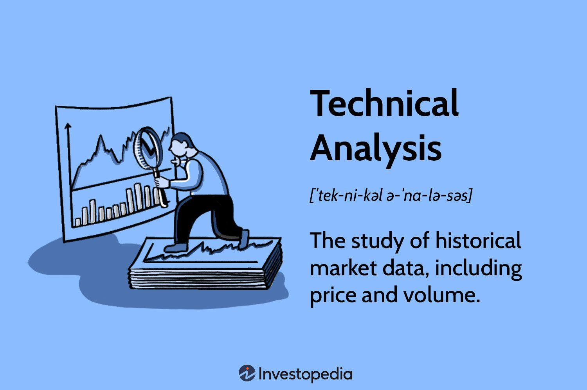

## Table of Contents

## What is technical analysis and why is it important for stock trading?

Technical analysis is a way to study and predict stock prices by looking at past price movements and trading volumes. Instead of focusing on a company's financial health or news, technical analysts use charts and patterns to spot trends and make trading decisions. They believe that all the information about a stock is already reflected in its price, so by studying these price movements, they can guess where the stock might go next.

This method is important for stock trading because it helps traders make quick decisions based on what they see happening in the market right now. By understanding patterns and trends, traders can decide when to buy or sell a stock to make a profit. Technical analysis can also help traders manage risk by setting clear entry and exit points for their trades, making it a valuable tool for anyone looking to navigate the ups and downs of the stock market.

## How do beginners start with technical analysis?

To start with technical analysis, beginners should first learn the basics of how to read stock charts. These charts show the price movements of a stock over time, and they can be daily, weekly, or even monthly. The most common type of chart is a line chart, which connects the closing prices of a stock. Another useful chart is the candlestick chart, which shows the opening, closing, high, and low prices for each period. Beginners should practice looking at these charts to get comfortable with how prices move and change.

Once you're familiar with charts, the next step is to learn about some simple technical indicators and patterns. Moving averages are a good place to start; they smooth out price data to help you see the trend more clearly. For example, a 50-day moving average shows the average price of a stock over the last 50 days. Another useful tool is the Relative Strength Index (RSI), which can tell you if a stock is overbought or oversold. Patterns like support and resistance levels can also help you predict where a stock's price might go next. By starting with these basic tools and practicing regularly, beginners can build a strong foundation in technical analysis.

## What are the key differences between technical analysis and fundamental analysis?

Technical analysis and fundamental analysis are two different ways to look at stocks. Technical analysis focuses on the price movements and trading volume of a stock. It uses charts and patterns to try to predict where the stock price might go next. People who use technical analysis believe that all the information about a stock is already in its price, so they don't need to look at other things like the company's financial health or the economy.

On the other hand, fundamental analysis looks at the actual value of a company. It involves studying things like the company's earnings, its balance sheet, and how it's doing compared to other companies. People who use fundamental analysis want to know if a stock is a good buy based on the company's real worth. They might look at things like the price-to-earnings ratio or the company's growth potential to decide if the stock is undervalued or overvalued.

Both methods have their place in the world of investing. Technical analysis is great for short-term trading because it helps people make quick decisions based on what the market is doing right now. Fundamental analysis, however, is better for long-term investing because it helps people understand the true value of a company and whether it's a good investment for the future.

## What are the most common technical indicators used in stock analysis?

The most common technical indicators used in stock analysis are moving averages, the Relative Strength Index (RSI), and the Moving Average Convergence Divergence (MACD). Moving averages help traders see the overall trend of a stock by smoothing out the price data over a certain period. For example, a 50-day moving average shows the average price of a stock over the last 50 days. Traders often use two moving averages together, like a 50-day and a 200-day, to spot when a stock's trend might be changing. The RSI is another popular indicator that measures how fast a stock's price is moving and whether it's overbought or oversold. If the RSI is above 70, the stock might be overbought and due for a price drop. If it's below 30, the stock might be oversold and ready for a price increase.

The MACD is a bit more complex but very useful for spotting changes in a stock's momentum. It uses two moving averages to create a line that shows the difference between them. When the MACD line crosses above a signal line, it can be a sign to buy the stock. When it crosses below, it might be time to sell. These indicators help traders make decisions based on what the stock's price is doing right now, rather than trying to predict the future based on the company's financials. By using these tools, traders can get a better sense of when to buy or sell a stock to make a profit.

## How can moving averages help in identifying stock trends?

Moving averages help traders see the overall trend of a stock by smoothing out the price data over a certain period. For example, a 50-day moving average shows the average price of a stock over the last 50 days. By looking at this line on a chart, traders can tell if the stock is going up, down, or staying the same. If the moving average is going up, it means the stock's price has been increasing over time. If it's going down, the stock's price has been decreasing. This helps traders see the big picture and not get too caught up in the daily ups and downs of the stock's price.

Traders often use two moving averages together, like a 50-day and a 200-day moving average, to spot when a stock's trend might be changing. When the shorter moving average (like the 50-day) crosses above the longer moving average (like the 200-day), it's called a "golden cross." This is a sign that the stock might start going up, and it could be a good time to buy. On the other hand, when the shorter moving average crosses below the longer moving average, it's called a "death cross." This is a sign that the stock might start going down, and it could be a good time to sell. By using moving averages this way, traders can make better decisions about when to buy or sell a stock.

## What is the significance of support and resistance levels in technical analysis?

Support and resistance levels are important in technical analysis because they help traders see where a stock's price might stop going down or up. Support is like a floor for the stock's price. It's a level where the price has trouble falling below because a lot of people want to buy the stock at that price. When the price gets close to the support level, it often bounces back up. Resistance is like a ceiling for the stock's price. It's a level where the price has trouble going above because a lot of people want to sell the stock at that price. When the price gets close to the resistance level, it often falls back down.

These levels are useful because they can help traders make decisions about when to buy or sell a stock. If a stock's price is near a support level, traders might think it's a good time to buy because the price is likely to go up from there. If the price is near a resistance level, traders might think it's a good time to sell because the price is likely to go down from there. By watching these levels, traders can get a better sense of where the stock's price might go next and make smarter trading choices.

## How do candlestick patterns influence trading decisions?

Candlestick patterns are important for traders because they show what's happening with a stock's price in a clear way. Each candlestick on a chart shows the opening, closing, high, and low prices for a certain time, like a day or an hour. By looking at these patterns, traders can see if buyers or sellers are in control. For example, a "bullish engulfing" pattern happens when a small red candle is followed by a larger green candle that completely covers it. This can mean that buyers are taking over and the price might go up soon. On the other hand, a "bearish engulfing" pattern is the opposite, with a small green candle followed by a larger red one, suggesting that sellers are in control and the price might go down.

Traders use these patterns to make decisions about when to buy or sell a stock. If they see a bullish pattern, they might decide to buy the stock because they think the price will go up. If they see a bearish pattern, they might decide to sell or not buy the stock because they think the price will go down. By understanding these patterns, traders can get a better idea of what might happen next with the stock's price and make smarter choices about their trades.

## What role do volume indicators play in confirming trends?

Volume indicators are important because they show how many people are buying and selling a stock. When a lot of people are trading, it means the volume is high. If the price of a stock is going up and the volume is also high, it can mean that the trend is strong and more people believe the price will keep going up. On the other hand, if the price is going up but the volume is low, it might mean that not many people are sure about the trend, and it could change soon.

Traders use volume indicators to check if a trend is real or not. For example, if a stock breaks through a resistance level with high volume, it's a good sign that the trend is strong and the price might keep going up. But if the stock breaks through with low volume, it might not be a strong trend, and the price could fall back down. By looking at volume along with price, traders can make better decisions about when to buy or sell a stock.

## How can traders use the Relative Strength Index (RSI) to make trading decisions?

The Relative Strength Index (RSI) is a tool that helps traders see if a stock is overbought or oversold. It's a number between 0 and 100. If the RSI is above 70, it means the stock might be overbought, and the price could go down soon. If the RSI is below 30, it means the stock might be oversold, and the price could go up soon. Traders use these levels to decide when to buy or sell a stock. For example, if the RSI is above 70, a trader might sell the stock because they think the price will drop. If the RSI is below 30, a trader might buy the stock because they think the price will rise.

Traders also look for something called "divergence" with the RSI. Divergence happens when the stock's price is going one way, but the RSI is going the other way. For example, if the stock's price is going up but the RSI is going down, it could mean the price might start to fall soon. This can help traders see when a trend might be about to change. By using the RSI, traders can get a better idea of when to make their moves in the market.

## What advanced charting techniques should an expert use for deeper analysis?

Expert traders often use advanced charting techniques like Fibonacci retracement and Elliott Wave Theory to get a deeper understanding of stock trends. Fibonacci retracement helps traders find levels where a stock's price might stop going down or up. They draw lines on the chart based on the Fibonacci sequence, which is a series of numbers where each number is the sum of the two before it. These lines show where the price might find support or resistance. For example, if a stock's price goes up and then starts to fall, traders might look at the Fibonacci levels to see where the price might stop falling and start going up again.

Another advanced technique is Elliott Wave Theory, which says that stock prices move in patterns called waves. These waves come in sets of five when the price is going up and three when it's going down. By looking at these waves, traders can try to predict where the price might go next. For example, if they see that a stock's price has gone up in five waves, they might think it's about to start going down in three waves. Using these advanced techniques, expert traders can make more informed decisions about when to buy or sell a stock.

## How can algorithmic trading be integrated with technical analysis?

Algorithmic trading can be integrated with technical analysis by using computer programs to automatically buy and sell stocks based on the patterns and indicators that technical analysts look at. For example, a trader might use a program to watch for when a stock's price crosses above its 50-day moving average. When this happens, the program can automatically buy the stock because the trader believes it's a good time to buy. The program can also watch for other signals, like when the Relative Strength Index (RSI) goes above 70 or below 30, and make trades based on those signals too.

By using algorithms, traders can make decisions faster and more consistently than they could by watching the market themselves. The computer can look at many stocks at the same time and make trades based on the rules the trader sets up. This can help traders take advantage of opportunities in the market that they might miss if they were trying to do everything by hand. Plus, algorithms can help traders stick to their trading plan without letting emotions get in the way, which can lead to better results over time.

## What are the limitations and criticisms of technical analysis in stock market forecasting?

Technical analysis has some limitations and people often criticize it. One big problem is that it looks at past prices to guess what will happen next, but the stock market can be unpredictable. Just because a stock went up in the past doesn't mean it will go up again. Also, technical analysis doesn't look at important things like a company's earnings or the economy, which can affect stock prices a lot. Some people think that relying only on charts and patterns can make traders miss out on important information.

Another criticism is that technical analysis can be too subjective. Different traders might see different patterns on the same chart, which can lead to different decisions. This means that what works for one trader might not work for another. Also, there's a lot of talk about how technical analysis can become a self-fulfilling prophecy. If enough people believe in a certain pattern and act on it, their actions can make the pattern come true, but this doesn't mean the pattern is always right. Overall, while technical analysis can be a useful tool, it's important for traders to use it along with other methods to get a full picture of the market.

## References & Further Reading

[1]: Bergstra, J., Bardenet, R., Bengio, Y., & Kégl, B. (2011). ["Algorithms for Hyper-Parameter Optimization."](https://papers.nips.cc/paper/4443-algorithms-for-hyper-parameter-optimization) Advances in Neural Information Processing Systems 24.

[2]: ["Advances in Financial Machine Learning"](https://www.amazon.com/Advances-Financial-Machine-Learning-Marcos/dp/1119482089) by Marcos Lopez de Prado

[3]: ["Evidence-Based Technical Analysis: Applying the Scientific Method and Statistical Inference to Trading Signals"](https://www.amazon.com/Evidence-Based-Technical-Analysis-Scientific-Statistical/dp/0470008741) by David Aronson

[4]: ["Machine Learning for Algorithmic Trading"](https://github.com/stefan-jansen/machine-learning-for-trading) by Stefan Jansen

[5]: ["Quantitative Trading: How to Build Your Own Algorithmic Trading Business"](https://www.amazon.com/Quantitative-Trading-Build-Algorithmic-Business/dp/1119800064) by Ernest P. Chan