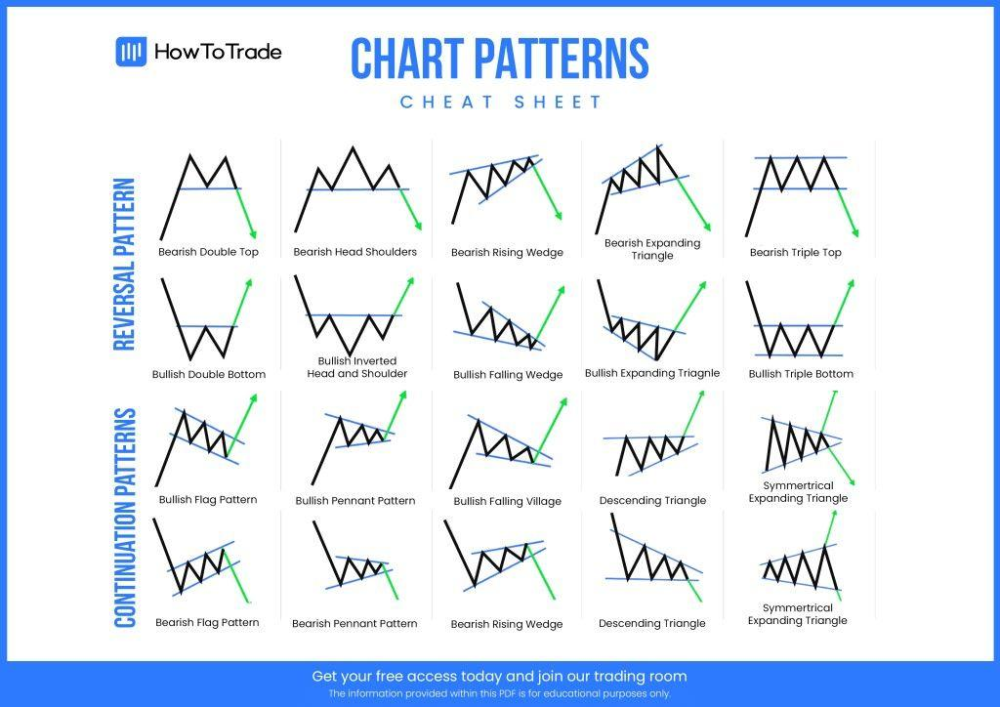

Algorithmic trading has revolutionized the financial markets, offering enhanced precision, speed, and efficiency in executing trades. Central to this development are technical trading strategies, which use historical price data to predict future market movements. These strategies are distinguished by their ability to systematically analyze market trends, patterns, and anomalies, providing a foundation for automated trading systems.

Technical strategies leverage quantitative methods and technical indicators, encompassing both simple and complex models. By harnessing past price movements and associated market variables, these strategies aim to predict future price behavior. This predictive capability enables traders to identify potential entry and exit points in the market, optimizing their investment decisions.



This article examines the spectrum of technical trading strategies applied in algorithmic trading. It discusses their underlying principles, elucidates the advantages they offer, and provides insights into their effective implementation. The discussion includes a critical analysis of popular techniques like trend-following, mean-reversion, and momentum, which are frequently utilized in algorithmic systems. By understanding these strategies, traders can develop robust systems capable of adapting to various market conditions.

With a focus on real-world applications, this guide offers practical knowledge for both novice and experienced traders. By integrating these strategies into their trading systems, practitioners can enhance their trading performance and achieve more consistent results. This article aims to serve as a comprehensive resource, equipping traders with the necessary tools to navigate the ever-evolving landscape of algorithmic trading.

## Table of Contents

## Understanding Technical Trading Strategies

Technical trading strategies rely on analyzing historical market data to anticipate future price movements, predominantly using technical indicators. These strategies offer a systematic approach to deciphering market dynamics, allowing traders to make informed decisions. Broadly, technical trading strategies can be grouped into several categories: trend-following, mean-reversion, momentum, and breakout strategies.

Trend-following strategies capitalize on the assumption that asset prices tend to move in sustained directions over time. By identifying these trends, traders can ride the wave of price movements. A common tool employed in trend-following is the moving average. This indicator smooths out price data by creating a continuously updated average price, aiding in signal detection for either buying or selling. For example, a simple moving average (SMA) of a given period 'n' is calculated as:

$$
\text{SMA}_n = \frac{P_1 + P_2 + ... + P_n}{n}
$$

where $P_i$ represents the price at each period within the n-period.

Mean-reversion strategies are based on the hypothesis that prices will revert to their historical averages over time. These strategies seek opportunities when prices deviate significantly from their average, predicting a potential correction. For example, when a stock price is significantly lower than its historical average, a mean-reversion strategy might suggest a buying opportunity, anticipating a price rebound.

Momentum strategies exploit the idea that stocks performing well in the past will continue to perform well in the future, at least for a short period. This strategy focuses on buying securities that show upward price [momentum](/wiki/momentum) and selling those with downward momentum. Traders typically use the Relative Strength Index (RSI) as a momentum indicator, gauging the speed and change of price movements over a specified period.

Breakout strategies aim to capture price movements when an asset breaks through established support or resistance levels. These strategies are predicated on the assumption that breaking through these levels will lead to significant price action, often with increased [volatility](/wiki/volatility-trading-strategies). Traders might use indicators such as Bollinger Bands to identify potential [breakout](/wiki/breakout-trading) points.

By understanding the principles behind these strategies, traders can better exploit market movements. Each strategy demands a different approach and caters to varying market conditions, offering diverse opportunities for profit maximization. By marrying deep analytical comprehension with practical application, traders can effectively harness these strategies to achieve consistent trading success.

## Common Technical Indicators

Various technical indicators are essential tools in trading strategies, serving to gauge market strength and direction. These indicators offer insights based on historical data and are pivotal in developing [algorithmic trading](/wiki/algorithmic-trading) systems.

### Moving Averages (MAs)
Moving Averages are fundamental in smoothing price data to identify the direction of a trend. The most commonly used types are Simple Moving Average (SMA) and Exponential Moving Average (EMA). While an SMA calculates an average of price data over a specified period, an EMA gives more weight to recent prices, thus responding more quickly to price changes.

**Formula for Simple Moving Average (SMA):**
$$
\text{SMA} = \frac{P_1 + P_2 + \ldots + P_n}{n}
$$

**Code to calculate SMA in Python:**
```python
def calculate_sma(prices, window):
    return sum(prices[-window:]) / window
```

### Relative Strength Index (RSI)
The Relative Strength Index (RSI) is a momentum oscillator that measures the speed and change of price movements on a scale of 0 to 100. It helps identify overbought or oversold conditions, typically using levels of 70 and 30 as benchmarks.

**RSI Formula:**
$$
\text{RSI} = 100 - \left( \frac{100}{1 + \frac{\text{Average Gain}}{\text{Average Loss}}} \right)
$$

**Python Code:**
```python
def calculate_rsi(prices, period=14):
    deltas = [prices[i+1] - prices[i] for i in range(len(prices)-1)]
    gains = sum(x for x in deltas if x > 0) / period
    losses = -sum(x for x in deltas if x < 0) / period
    rs = gains / losses
    return 100 - (100 / (1 + rs))
```

### Moving Average Convergence Divergence (MACD)
MACD is a trend-following momentum indicator that shows the relationship between two moving averages of price. The MACD is calculated by subtracting the 26-period EMA from the 12-period EMA. A nine-day EMA of the MACD, called the "signal line," is then plotted on top of the MACD to indicate buy or sell signals.

**Formula for MACD:**
$$
\text{MACD} = \text{EMA}_{12} - \text{EMA}_{26}
$$
$$
\text{Signal Line} = \text{EMA of MACD}
$$

**Python Code to Calculate MACD:**
```python
import pandas as pd

def calculate_ema(prices, span):
    return pd.Series(prices).ewm(span=span, adjust=False).mean()

def calculate_macd(prices):
    ema_12 = calculate_ema(prices, 12)
    ema_26 = calculate_ema(prices, 26)
    macd_line = ema_12 - ema_26
    signal_line = macd_line.ewm(span=9, adjust=False).mean()
    return macd_line, signal_line
```

### Automation and Combination
Implementing these indicators in algorithmic trading systems enables traders to set predefined criteria and automatically execute trades. This automation enhances efficiency and consistency in trading operations, reducing human error and emotional influence. By combining multiple indicators, traders can increase the reliability of their strategies, confirming trading signals and reducing the likelihood of false positives. For instance, utilizing a combination of RSI and MACD can help authenticate trend strength and market momentum, offering more robust trade entry and [exit](/wiki/exit-strategy) decisions.

## Advantages of Technical Analysis in Algo Trading

Technical analysis offers distinct advantages for algorithmic trading, primarily due to its inherent ability to be codified into discrete algorithms. This transformation of market analysis into computable processes allows for the systematic exploration of financial data and the automation of trading decisions.

Unlike [fundamental analysis](/wiki/fundamental-analysis), which often requires subjective interpretation of qualitative information such as earnings reports or market sentiments, technical analysis focuses on quantifiable data, notably price and [volume](/wiki/volume-trading-strategy). This quantifiable nature enables the straightforward integration of technical analysis into algorithmic systems, which can process large volumes of historical and real-time data swiftly. The formulaic nature of technical analysis lends itself to being expressed in conditional algorithms that can, for instance, execute trades based on moving averages, relative strength indices, or other mathematically defined indicators.

Algorithmic systems can analyze these data-driven strategies concurrently, executing numerous trading strategies across multiple markets and timeframes. Such parallel processing capabilities allow for optimization of opportunities, often leading to better resource allocation and timing in executing trades. An algorithm of this type might look like the following simple Python function that automates trades based on the moving average crossover strategy:

```python
def moving_average_crossover(short_window, long_window, data):
    short_mavg = data['Close'].rolling(window=short_window).mean()
    long_mavg = data['Close'].rolling(window=long_window).mean()

    # Generate trading signals
    data['Signal'] = 0
    data.loc[short_mavg > long_mavg, 'Signal'] = 1
    data.loc[short_mavg <= long_mavg, 'Signal'] = 0

    return data['Signal']
```

Another significant advantage of technical analysis in automated trading is its contribution to mitigating emotional biases. Human traders are often influenced by psychological factors such as fear and greed, which can lead to impulsive decision-making. Automation, however, operates based on predetermined and emotionless criteria, thereby enforcing discipline and consistency in trades. This objectivity increases the reliability of decisions across varying market conditions.

Moreover, these automated systems can adapt rapidly to market changes, as they are designed to update and analyze new data iteratively without human intervention. This feature enhances the agility of trading strategies, enabling them to capture fleeting market opportunities and respond promptly to new information. By reducing emotional interference and ensuring adherence to strategy, technical analysis embedded in algorithmic systems creates a robust framework for making informed trading decisions, improving potential profitability and risk management.

## Developing Technical Trading Algorithms

Creating a technical trading algorithm involves a structured process that begins with the establishment of a well-defined set of trading rules. These rules are based on historical market patterns observed through technical analysis, such as price trends, volume data, and technical indicators. The primary goal is to identify consistent patterns or signals that can inform trade decisions.

Once the rules are established, [backtesting](/wiki/backtesting) becomes a critical step. This involves simulating the algorithm on historical data to assess its performance. By doing this, traders can evaluate how the algorithm would have performed in the past, thereby gauging its potential effectiveness for future trading. Backtesting requires a careful selection of historical data to ensure representativeness and reliability. It's essential to verify the strategy across various market scenarios to understand its strengths and weaknesses thoroughly.

Continuous optimization and refinement of the algorithm are vital to maintain its efficacy in dynamic market conditions. Market environments can change due to economic shifts, technological advancements, or political developments, requiring traders to adjust their strategies accordingly. Optimization techniques may include adjusting parameter values or incorporating additional data inputs to enhance performance. However, traders must be cautious of overfitting—making the model too complex to fit past data perfectly, which could lead to poor future performance.

Risk management strategies are integral to the development of technical trading algorithms. This includes the incorporation of stop-loss orders, which automatically exit a position if a trade moves against the expected direction by a predetermined amount. Position sizing strategies are equally important, determining how much capital to allocate to a particular trade, thereby managing exposure and potential losses. Effective risk management protects against significant adverse market movements and ensures that a trader's capital is preserved.

Here is a simple Python pseudocode example to illustrate the initial steps in developing a technical trading algorithm based on moving averages:

```python
import pandas as pd

# Define the rules for the moving average crossover strategy
def moving_average_strategy(data, short_window=40, long_window=100):
    data['Short_MA'] = data['Close'].rolling(window=short_window, min_periods=1).mean()
    data['Long_MA'] = data['Close'].rolling(window=long_window, min_periods=1).mean()

    data['Signal'] = 0
    data['Signal'][short_window:] = np.where(data['Short_MA'][short_window:] > data['Long_MA'][short_window:], 1, 0)
    data['Position'] = data['Signal'].diff()

    return data

# Backtest the strategy using historical data
def backtest_strategy(data):
    data['Portfolio_Return'] = data['Position'].shift(1) * data['Close'].pct_change()
    cumulative_return = (1 + data['Portfolio_Return']).cumprod() - 1
    return cumulative_return

# Example usage with a DataFrame containing historical market data
# df = pd.read_csv('historical_data.csv')
# strategy_results = moving_average_strategy(df)
# performance = backtest_strategy(strategy_results)
```

This pseudocode demonstrates the setup of a simple moving average crossover strategy, alongside a basic framework for backtesting. By following these steps—rule definition, backtesting, optimization, and risk management—traders can build robust technical trading algorithms to execute trades systematically and efficiently.

## Backtesting and Optimization

Backtesting is a crucial step in algorithmic trading that involves applying a trading algorithm to historical market data to evaluate how it would have performed in the past. This retrospective analysis helps traders assess the potential effectiveness of a strategy before deploying it in live trading environments. One of the primary goals of backtesting is to identify any potential issues within the trading strategy, such as overfitting or data snooping biases.

Overfitting occurs when a trading model is excessively complex, capturing noise rather than the actual signal in historical data. Such models may show impressive performance during backtesting but fail to generalize to unseen data, leading to poor performance in live markets. To mitigate this risk, traders can use techniques such as cross-validation. Cross-validation involves partitioning the data into multiple subsets and ensuring that the model is tested on different parts of the data set. This process helps assess the model's generalizability across various market conditions.

Data snooping bias arises when the same dataset is repeatedly used for strategy development and testing, leading to an overestimation of the strategy's effectiveness. To combat this, it's essential to implement both in-sample and out-of-sample testing. In-sample data is used to develop and fine-tune the strategy, while out-of-sample data serves to independently test the strategy's performance. This approach ensures that the strategy's success is not solely attributable to random patterns in the historical data.

Optimization of trading strategies should focus on enhancing risk-adjusted returns rather than merely maximizing raw returns. Commonly, the Sharpe ratio is used as a measure to assess the return per unit of risk. The Sharpe ratio is calculated as:

$$
\text{Sharpe Ratio} = \frac{E[R_p - R_f]}{\sigma_p}
$$

Where $E[R_p - R_f]$ is the expected excess return of the portfolio over the risk-free rate, and $\sigma_p$ is the standard deviation of the portfolio's excess return. By focusing on risk-adjusted metrics, traders can ensure that their strategies are not only profitable but also maintain an acceptable level of risk.

Optimization processes should avoid overfitting by not excessively fine-tuning parameters solely to maximize historical performance metrics. Instead, traders are encouraged to keep models as simple as possible while still capturing the essential elements of market behavior.

Finally, strategy robustness can be verified through out-of-sample testing, walk-forward analysis, and Monte Carlo simulations. These methods stress-test the algorithm across various scenarios to ensure that it remains effective under changing market conditions. By adopting these backtesting and optimization practices, traders can build trading algorithms that are both robust and capable of delivering consistent performance.

## Challenges and Pitfalls

One major challenge in algorithmic trading is the potential for overfitting strategies to historical data, which can significantly affect future performance. Overfitting occurs when a model is too closely tailored to historical data, capturing noise rather than the actual market signal. This can result in strategies that perform well in backtesting but fail in real-world trading. To mitigate overfitting, it's prudent to incorporate techniques such as cross-validation and avoid overly complex models with too many parameters.

Slippage and transaction costs are other factors that can undermine the profitability of a technical strategy. Slippage refers to the difference between the expected price of a trade and the actual price at which the trade is executed. This discrepancy can arise due to market volatility or delays in trade execution. Transaction costs, including broker fees and bid-ask spreads, should also be integrated into the strategy's calculations, as they can erode profit margins over numerous trades. To account for these elements, traders can simulate realistic trading scenarios during the backtesting phase, incorporating average slippages and transaction cost estimates.

Ensuring good data quality is crucial, as inaccuracies could skew backtesting results and lead to misguided strategy development. Poor data quality can result from missing data points, incorrect pricing, or inconsistent data formats. Employing robust data cleaning and preprocessing techniques is essential to maintain the integrity of the data used for strategy formulation. Traders should source data from reputable providers and continuously audit their datasets for anomalies.

Moreover, traders must remain vigilant about platform reliability and the security of their algorithmic systems. System failures or security breaches can have severe consequences, including unauthorized trades or data loss. Therefore, regular system testing, employing secure coding practices, and using firewall protections are critical measures to safeguard trading operations. A comprehensive risk management approach, including setting appropriate access controls and maintaining software updates, can further enhance system resilience.

These challenges and pitfalls underscore the importance of a disciplined approach in algorithmic trading. By acknowledging these risks and employing strategies to mitigate them, traders can improve the robustness and reliability of their algorithmic trading systems.

## Conclusion

Technical trading strategies in algorithmic trading provide a structured methodology that utilizes quantitative data to navigate the complex landscape of financial markets. By integrating data and advanced technical analysis, traders can develop automated systems designed to enhance both efficiency and the effectiveness of trading outcomes. These systems offer the potential for executing trades with precision and speed unattainable by manual intervention, thus offering competitive advantages in rapidly moving markets.

Continual learning and adaptation are critical for maintaining the relevancy and efficacy of these trading strategies, particularly as market dynamics and technological advancements perpetually evolve. As markets become increasingly sophisticated, traders must be willing to refine their strategies and incorporate emerging data analytics and [machine learning](/wiki/machine-learning) techniques, which can provide deeper insights and superior algorithms.

Embracing technological advancements such as [artificial intelligence](/wiki/ai-artificial-intelligence), big data analytics, and machine learning not only aids in refining existing strategies but also opens avenues for developing novel approaches that may outperform traditional methods. For instance, machine learning algorithms can discover patterns in data that might be invisible through traditional technical analysis. Adopting such innovations requires an openness to change and an unending pursuit of knowledge, as the field of algorithmic trading is always advancing.

Overall, while technical trading strategies offer a formidable toolset for traders in the algorithmic space, success depends on the ability to adapt and evolve continuously with market and technological developments. This approach ensures that trading systems remain competitive and able to provide valuable insights into market trends that can be capitalized upon.

## References & Further Reading

[1]: Bergstra, J., Bardenet, R., Bengio, Y., & Kégl, B. (2011). ["Algorithms for Hyper-Parameter Optimization."](https://dl.acm.org/doi/10.5555/2986459.2986743) Advances in Neural Information Processing Systems 24.

[2]: ["Advances in Financial Machine Learning"](https://www.amazon.com/Advances-Financial-Machine-Learning-Marcos/dp/1119482089) by Marcos Lopez de Prado

[3]: ["Evidence-Based Technical Analysis: Applying the Scientific Method and Statistical Inference to Trading Signals"](https://www.amazon.com/Evidence-Based-Technical-Analysis-Scientific-Statistical/dp/0470008741) by David Aronson

[4]: ["Machine Learning for Algorithmic Trading"](https://github.com/stefan-jansen/machine-learning-for-trading) by Stefan Jansen

[5]: ["Quantitative Trading: How to Build Your Own Algorithmic Trading Business"](https://www.amazon.com/Quantitative-Trading-Build-Algorithmic-Business/dp/1119800064) by Ernest P. Chan