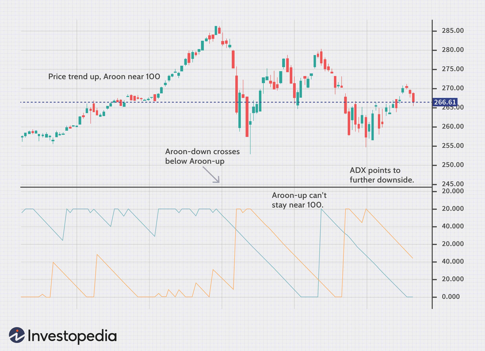

## Table of Contents

## What is technical analysis and why is it important for trading?

Technical analysis is a way to study and predict how prices of things like stocks or cryptocurrencies will move in the future. It looks at past price movements and trading volumes to find patterns and trends. Traders use charts and different tools to see these patterns and make guesses about where prices might go next. It's different from fundamental analysis, which looks at a company's financial health and other big factors.

Technical analysis is important for trading because it helps traders make decisions based on what they see in the market right now. By understanding past price movements, traders can spot opportunities to buy or sell at the right times. This can help them make more money and manage their risks better. Even though it's not perfect and can't predict the future for sure, many traders find it useful because it gives them a way to make sense of the market's ups and downs.

## What are the basic types of technical analysis tools available to traders?

Technical analysis tools help traders understand and predict price movements. Some of the most common tools are charts and indicators. Charts show the price history of a stock or cryptocurrency over time. Traders use different types of charts like line charts, bar charts, and candlestick charts. Each type gives a different view of the price action, helping traders see patterns and trends more clearly.

Indicators are another important tool. They are calculations based on price and [volume](/wiki/volume-trading-strategy) data that help traders make decisions. Popular indicators include moving averages, which smooth out price data to show trends over time, and the Relative Strength Index (RSI), which measures how fast prices are changing to see if a stock is overbought or oversold. Other tools like Bollinger Bands and the Moving Average Convergence Divergence (MACD) help traders spot potential buy or sell signals.

Together, charts and indicators give traders a lot of information to work with. By using these tools, traders can look for patterns and signals that might tell them when to buy or sell. While no tool can predict the future perfectly, these basic types of technical analysis tools are essential for making informed trading decisions.

## How do moving averages work and what are their common applications in trading?

Moving averages are a popular tool in technical analysis that help traders smooth out price data to see the overall trend more clearly. They work by taking the average price of a stock or [cryptocurrency](/wiki/cryptocurrency) over a certain number of time periods, like days or weeks. For example, a 50-day moving average would take the average closing price of the last 50 days. This average is then plotted on a chart, creating a line that moves along with the price but is less jumpy. There are two main types of moving averages: simple moving averages (SMA), which give equal weight to all prices, and exponential moving averages (EMA), which give more weight to recent prices.

In trading, moving averages are used in several ways. One common application is to identify the direction of the trend. If the price is above the moving average, it might mean the trend is up, and if it's below, the trend might be down. Traders also use moving averages to find potential buy or sell signals. For example, when a shorter-term moving average, like a 20-day EMA, crosses above a longer-term moving average, like a 50-day EMA, it's called a "golden cross" and can be a signal to buy. The opposite, called a "death cross," happens when the shorter-term average crosses below the longer-term average and can be a signal to sell. Moving averages can also act as support or resistance levels, where the price might bounce off the moving average line.

## What are candlestick patterns and how can they be used to predict market movements?

Candlestick patterns are a way to look at price movements on a chart. Each candlestick shows what happened with the price in a certain time, like a day or an hour. The candlestick has a body and sometimes lines called wicks or shadows. The body shows the opening and closing prices, and the wicks show the highest and lowest prices during that time. Different patterns can form when you put several candlesticks together, like "doji," "hammer," or "engulfing" patterns. These patterns can tell traders about what might happen next with the price.

Traders use these candlestick patterns to guess where the price might go. For example, if they see a "bullish engulfing" pattern, it might mean the price could go up soon. This pattern happens when a small bearish candlestick is followed by a larger bullish candlestick that covers it completely. On the other hand, a "bearish engulfing" pattern might mean the price could go down. Traders look for these patterns to help them decide when to buy or sell. While candlestick patterns don't always predict the future perfectly, they give traders clues about what the market might do next.

## Can you explain the concept of support and resistance levels in trading?

Support and resistance levels are important ideas in trading. They help traders see where the price of a stock or cryptocurrency might stop going down or up. Support is like a floor for the price. It's a level where the price has trouble going lower because a lot of people want to buy at that price. When the price gets close to the support level, it often bounces back up. Resistance is like a ceiling for the price. It's a level where the price has trouble going higher because a lot of people want to sell at that price. When the price gets close to the resistance level, it often falls back down.

Traders use these levels to make decisions. If the price is near a support level, traders might think it's a good time to buy because they expect the price to go up from there. If the price is near a resistance level, traders might think it's a good time to sell because they expect the price to go down from there. Sometimes, if the price breaks through a support or resistance level, it can mean the price will keep moving in that direction. For example, if the price breaks through a resistance level, it might keep going up, and that old resistance level could become a new support level.

## What is the Relative Strength Index (RSI) and how is it used to identify overbought or oversold conditions?

The Relative Strength Index, or RSI, is a tool that helps traders see if a stock or cryptocurrency might be too expensive or too cheap. It does this by measuring how fast the price is going up or down over a certain time, usually 14 days. The RSI gives a number between 0 and 100. If the number is above 70, it means the stock might be overbought, which means a lot of people have bought it and the price might be too high. If the number is below 30, it means the stock might be oversold, which means a lot of people have sold it and the price might be too low.

Traders use the RSI to make decisions about when to buy or sell. If the RSI is over 70, traders might think it's a good time to sell because the price could go down soon. If the RSI is under 30, traders might think it's a good time to buy because the price could go up soon. The RSI can also show when the price might change direction. For example, if the RSI starts to go down from over 70, it could mean the price will start to go down too. If the RSI starts to go up from under 30, it could mean the price will start to go up. While the RSI is not perfect and can't predict the future for sure, it helps traders see what might happen next with the price.

## How does the Moving Average Convergence Divergence (MACD) indicator help in trading decisions?

The Moving Average Convergence Divergence, or MACD, is a tool that helps traders see when the price of a stock or cryptocurrency might change direction. It works by using two moving averages: a faster one and a slower one. The difference between these two moving averages is called the MACD line. Another line, called the signal line, is a moving average of the MACD line. When the MACD line crosses above the signal line, it might mean the price is going to go up, which could be a good time to buy. When the MACD line crosses below the signal line, it might mean the price is going to go down, which could be a good time to sell.

Traders also look at a histogram on the MACD chart, which shows the difference between the MACD line and the signal line. When the histogram bars get bigger, it means the difference is growing, and this can show how strong the trend is. If the bars start to get smaller, it might mean the trend is getting weaker, and the price could change direction soon. By watching these lines and the histogram, traders can make better guesses about when to buy or sell. While the MACD doesn't predict the future perfectly, it gives traders useful information to help them make decisions.

## What are Fibonacci retracement levels and how are they applied in technical analysis?

Fibonacci retracement levels are a tool that traders use to guess where the price of a stock or cryptocurrency might go next. They are based on numbers from the Fibonacci sequence, which is a series of numbers where each number is the sum of the two before it. In trading, these levels are used to find points where the price might stop going down and start going up again, or stop going up and start going down again. The main Fibonacci levels are 23.6%, 38.2%, 50%, 61.8%, and 78.6%. Traders draw these levels on a chart from the highest point to the lowest point of a price move.

Traders use these levels to make decisions about when to buy or sell. For example, if the price of a stock goes down and then starts to go back up, it might stop at one of the Fibonacci levels. If the price stops at the 38.2% level and starts to go up again, traders might think it's a good time to buy. If the price keeps going down past the 61.8% level, traders might think it's a good time to sell because the price might keep going down. While Fibonacci retracement levels don't always work perfectly, they give traders a way to see where the price might change direction.

## How can traders use Bollinger Bands to assess market volatility and potential price breakouts?

Bollinger Bands are a tool that helps traders see how much the price of a stock or cryptocurrency is moving around. They are made up of three lines on a chart: a middle line, which is a moving average, and two outer lines, called bands, that are set a certain distance away from the middle line. The distance between the bands changes based on how much the price is moving. When the price is moving a lot, the bands get wider, showing that the market is more volatile. When the price is not moving much, the bands get closer together, showing that the market is less volatile.

Traders use Bollinger Bands to guess when the price might break out and start moving a lot. If the price stays close to the upper band for a while, it might mean the price is going to keep going up. If the price stays close to the lower band, it might mean the price is going to keep going down. When the bands are very close together, it can mean that the price is getting ready to make a big move. Traders watch for the price to break out of the bands, which can be a sign that it's time to buy or sell. While Bollinger Bands don't always predict the future perfectly, they help traders see when the market might be getting ready for a big change.

## What advanced chart patterns should an expert trader look for to enhance their trading strategy?

Expert traders often look for advanced chart patterns like the Head and Shoulders, Double Tops and Bottoms, and the Cup and Handle to improve their trading strategies. The Head and Shoulders pattern can signal a big change in the price. It looks like three peaks, with the middle one being the highest (the head) and the other two (the shoulders) being lower but about the same height. If the price breaks below the line that connects the lows between the peaks, it might mean the price will keep going down. Double Tops and Bottoms are patterns where the price hits the same high or low twice before changing direction. A Double Top might mean the price will go down, and a Double Bottom might mean the price will go up. The Cup and Handle pattern looks like a cup with a small handle on the right side. If the price breaks above the handle, it might mean the price will keep going up.

These patterns help expert traders see where the price might go next. They use them to find good times to buy or sell. For example, if they see a Head and Shoulders pattern and the price breaks below the neckline, they might decide to sell because they think the price will go down. If they see a Cup and Handle pattern and the price breaks above the handle, they might decide to buy because they think the price will go up. While these patterns don't always predict the future perfectly, they give expert traders more clues about what the market might do next. By looking for these advanced patterns, traders can make better guesses and improve their trading strategies.

## How can volume analysis be integrated with other technical indicators to improve trading accuracy?

Volume analysis is a powerful tool that traders can use along with other technical indicators to make better trading decisions. Volume shows how many shares or units of a stock or cryptocurrency are being bought and sold. When traders see high volume, it means a lot of people are interested in the stock, which can make price movements stronger. For example, if the price is going up and the volume is high, it might mean the price will keep going up because a lot of people want to buy. On the other hand, if the price is going down with high volume, it might mean the price will keep going down because a lot of people want to sell. By looking at volume along with other indicators like moving averages or the RSI, traders can get a better idea of what the market might do next.

For instance, traders can use volume to confirm signals from other indicators. If a moving average crossover happens with high volume, it might be a stronger signal to buy or sell. The same goes for the RSI; if the RSI shows the stock is overbought or oversold and the volume is high, it might mean the price is more likely to change direction soon. Another way to use volume is with chart patterns. If a pattern like a Head and Shoulders or a Cup and Handle forms with high volume at key points, it can make the pattern more reliable. By combining volume analysis with other technical indicators, traders can improve their accuracy and make more informed decisions about when to buy or sell.

## What are some common pitfalls and limitations of relying solely on technical analysis tools?

Relying only on technical analysis tools can lead to some common problems. One big issue is that these tools look at past price movements and patterns, but they can't predict the future perfectly. The market can be affected by many things that technical analysis doesn't see, like news about a company or changes in the economy. This means that even if a pattern looks like it should work, something unexpected can still happen and change the price. Also, technical analysis can sometimes give false signals, making traders think the price will go up or down when it doesn't. This can lead to bad trades and losing money.

Another limitation is that different traders might see the same chart and come up with different ideas about what it means. This is because technical analysis involves a lot of guessing and personal judgment. What one trader thinks is a good time to buy, another might think is a good time to sell. This can make it hard to trust the signals from technical analysis alone. To make better trading decisions, it's often a good idea to use technical analysis along with other kinds of analysis, like looking at a company's financial health or what's happening in the world. By combining different ways of looking at the market, traders can get a fuller picture and make more informed choices.

## References & Further Reading

[1]: Bergstra, J., Bardenet, R., Bengio, Y., & Kégl, B. (2011). ["Algorithms for Hyper-Parameter Optimization."](https://dl.acm.org/doi/10.5555/2986459.2986743) Advances in Neural Information Processing Systems 24.

[2]: ["Advances in Financial Machine Learning"](https://www.amazon.com/Advances-Financial-Machine-Learning-Marcos/dp/1119482089) by Marcos Lopez de Prado

[3]: ["Evidence-Based Technical Analysis: Applying the Scientific Method and Statistical Inference to Trading Signals"](https://www.amazon.com/Evidence-Based-Technical-Analysis-Scientific-Statistical/dp/0470008741) by David Aronson

[4]: ["Machine Learning for Algorithmic Trading"](https://github.com/stefan-jansen/machine-learning-for-trading) by Stefan Jansen

[5]: ["Quantitative Trading: How to Build Your Own Algorithmic Trading Business"](https://books.google.com/books/about/Quantitative_Trading.html?id=j70yEAAAQBAJ) by Ernest P. Chan