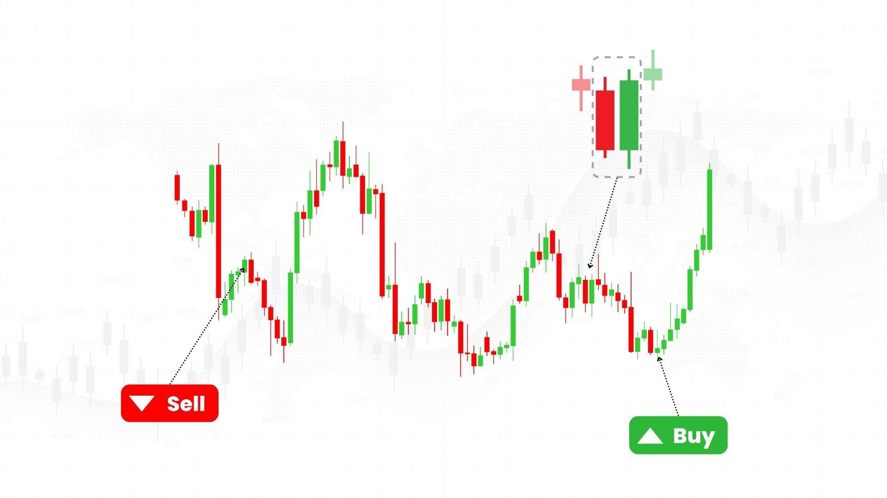

Technical analysis is a methodology in finance that allows traders and investors to forecast the direction of price movements by analyzing past market data, such as price and volume. This approach is intrinsic to many market participants as it offers a structured mechanism to gauge potential price trajectories without relying on the fundamental attributes of the asset in question. Particularly within algorithmic trading, technical analysis plays an essential role by enabling the development of automated trading strategies that exploit historical price patterns to predict future movements.

Algorithmic trading relies heavily on technical indicators to optimize entry and exit points for trades. This method contrasts with modern portfolio theory, which emphasizes diversification and asset allocation to minimize risk. While modern portfolio theory provides a macro-level view of market movement, assuming that markets are generally efficient, technical analysis provides a micro-level perspective that seeks to identify specific price patterns and trends that can be profitably exploited.



Moreover, technical analysis offers a stark contrast to fundamental analysis which focuses on assessing a company's intrinsic value based on factors such as earnings, revenue, and overall financial health. On the other hand, technical analysis assumes that all necessary information is already reflected in the price, enabling it to sidestep the hurdles of deeper financial scrutiny and potential forecasting errors in fundamental analysis.

Contrary to the assertions of the efficient-market hypothesis (EMH), which suggests that stock prices are reflected accurately by all available information and thus unpredictable, technical analysis argues that there are patterns and trends that can, in fact, be identified and profited from. While critics contend that technical analysis lacks scientific validity and results in neck-to-neck interpretations, its focus on market psychology and behavioral patterns can offer traders a unique perspective on how markets move.

In conclusion, technical analysis is a vital tool for many within the financial markets, offering insights that are integral despite criticisms relating to its theoretical foundations. Its application in algorithmic trading underscores its adaptability and resilience in the evolving landscape of financial trading strategies.

## Table of Contents

## The Evolution of Technical Analysis

Technical analysis traces its origins to the 17th century, during the bustling era of the Dutch financial markets. It was here that Joseph de la Vega laid the groundwork with early practices that hinted at a systematic approach to market prediction. His book, "Confusion of Confusions," published in 1688, is one of the first documented explorations of market behaviors and investor psychology, offering insights that remain relevant in understanding market trends today.

The refinement of technical analysis continued significantly in Asia, particularly with the contributions of Homma Munehisa in the Japanese markets. In the 18th century, Munehisa pioneered what would become known as candlestick charting techniques. These techniques mapped market trends by visualizing price movements, thus enabling traders to identify patterns that suggest future price directions. The candlestick charts remain a fundamental tool in technical analysis, helping traders detect market sentiment and predict short-term price movements.

The 20th century marked a significant evolution in technical analysis with several key figures who contributed to its development and popularization. Foremost among these was Charles Dow, whose work laid the foundation for modern technical analysis. Dow's theories, known collectively as Dow Theory, emphasized the importance of market trends and laid out principles like the primary trend, secondary trend, and minor trend, which are still employed in technical analysis.

Another pivotal figure was Richard W. Schabacker, whose work in the 1930s further expanded the theory with the publication of "Technical Analysis and Stock Market Profits." Schabacker's contributions included detailed discussions on chart patterns and their implications for future market movements, cementing the role of pattern recognition in technical analysis.

Finally, Robert D. Edwards, often regarded as the co-author of the quintessential book "Technical Analysis of Stock Trends," further formalized the discipline by delineating several classical chart patterns and their interpretations. His work, alongside John Magee, structured many of the principles used in modern technical analysis, providing a comprehensive framework for analyzing stock movements beyond mere price charts.

This historical evolution has anchored technical analysis as a key methodology in understanding and forecasting market behavior, setting the stage for its integration in [algorithmic trading](/wiki/algorithmic-trading) and modern financial practices.

## Core Principles of Technical Analysis

Technical analysis is predicated on the notion that all relevant market information is reflected in the current price, making it a comprehensive metric for evaluating asset behavior. This approach relies heavily on identifying and interpreting patterns that emerge in price movements and market trends. 

The foundational principle of technical analysis is trend identification, which is the recognition of the general direction in which a market is moving. Trends can be classified as upward (bullish), downward (bearish), or sideways (range-bound), and they play a critical role in guiding trading decisions. Market participants leverage trend lines and channels to visually capture these movements, adapting their strategies as new trends form or existing ones dissipate.

Support and resistance levels are another key concept, representing specific price points that tend to prevent the market from moving higher or lower. Support levels are where demand is strong enough to halt a downward trend, while resistance levels are where selling pressure overcomes buying interest. These levels help traders determine potential entry and [exit](/wiki/exit-strategy) points, allowing for strategic positioning based on market sentiment and historical price action.

Market trend directionality is further supported by technical indicators that analyze statistical information derived from trading activity. Moving averages, among other indicators, smooth out price data to identify trend directions and potential reversals. For instance, a simple moving average (SMA) can be calculated using the following formula:

$$
SMA = \frac{P_1 + P_2 + ... + P_n}{n}
$$

where $P$ represents the price at each time period, and $n$ is the number of periods considered.

The repetitive nature of market actions, often referred to as market cycles, underlines the belief that history tends to repeat itself. This is based on the psychological behaviors of market participants, which manifest in recurrent patterns and formations, such as the head and shoulders and double tops or bottoms. Technical analysts use these repeatable patterns to forecast future price movements, attributing historical behavior to likely future outcomes.

Overall, these core principles provide a structured approach to deciphering market data, allowing traders to capitalize on market inefficiencies through systematic analyses. Despite criticisms, the enduring nature and adaptability of these principles underscore their relevance in financial market environments.

## Technical Analysis in Algorithmic Trading

Algorithmic trading relies significantly on technical analysis, transforming the traditional manual methods of analyzing price and [volume](/wiki/volume-trading-strategy) data into automated processes. This automation aims to execute trades with speed and precision impossible for human traders to achieve. Key to this approach is the utilization of technical indicators, which serve as the foundational building blocks for developing sophisticated trading algorithms.

Technical indicators like moving averages, Relative Strength Index (RSI), Moving Average Convergence Divergence (MACD), and Bollinger Bands, each provide unique insights into market trends and price action. Moving averages help in smoothing out price data, revealing trends over specific periods and guiding entry and exit strategies. For instance, a simple moving average (SMA) can be calculated with a Python function:

```python
def simple_moving_average(prices, window_size):
    sma = []
    for i in range(len(prices) - window_size + 1):
        window = prices[i:i + window_size]
        sma.append(sum(window) / window_size)
    return sma
```

The RSI is a [momentum](/wiki/momentum) oscillator that measures the speed and change of price movements, identifying overbought or oversold conditions. MACD, another momentum indicator, indicates the relationship between two moving averages, providing potential buy or sell signals when these averages cross. Bollinger Bands, on the other hand, measure market [volatility](/wiki/volatility-trading-strategies) and provide dynamic support and resistance levels by constructing bands based on moving average deviations.

The integration of [artificial intelligence](/wiki/ai-artificial-intelligence), notably [neural network](/wiki/neural-network)s, has significantly enhanced pattern recognition within these algorithmic strategies. Neural networks excel at identifying complex patterns in large datasets, making them invaluable for forecasting price movements based on historical data. By learning from patterns that are not immediately apparent through traditional analysis, neural networks enable the development of models that adapt to changing market conditions, offering a predictive edge.

In essence, algorithmic trading powered by technical analysis and AI technologies offers traders the capability to harness high-speed decision-making processes, backed by data-driven insights. This synergy not only improves trading efficiency but also opens new avenues for innovation in financial markets, continually evolving to meet the demands of modern trading.

## Comparison with Fundamental and Quantitative Analysis

Technical analysis, [fundamental analysis](/wiki/fundamental-analysis), and quantitative analysis represent three distinct approaches in financial market analysis, each with its unique methodology and focus. Understanding their differences and how they can complement each other is crucial for traders.

Fundamental analysis centers on evaluating a company's intrinsic value by examining its financial health, market conditions, and broader economic [factor](/wiki/factor-investing)s. This approach seeks to determine whether a stock is overvalued or undervalued based on its financial statements, industry position, and economic environment. Key metrics include earnings per share (EPS), the price-to-earnings (P/E) ratio, and cash flow analysis. Fundamental analysis often involves qualitative assessments, such as management quality and competitive advantages, making it a comprehensive approach to assess long-term investment value.

In contrast, quantitative analysis is more data-driven and relies heavily on mathematical and statistical models to analyze market data. This approach involves using algorithms, econometric models, and other quantitative techniques to predict future price movements and optimize trading strategies. Contrary to the subjective nature of fundamental analysis, quantitative analysis is often more systematic and objective. It includes techniques like [backtesting](/wiki/backtesting) and the application of stochastic calculus, involving concepts like the Black-Scholes model for option pricing.

Despite their different approaches, these analytical methods are not mutually exclusive. Traders frequently use a combination of strategies to enhance their decision-making process. For example, a trader might employ technical analysis to identify optimal entry and exit points, use fundamental analysis to assess the long-term viability of a trade, and apply quantitative analysis to fine-tune the model parameters for better risk management and performance optimization.

The integration of these methods can be illustrated through a Python script to analyze a stock:

```python
import numpy as np
import pandas as pd
import yfinance as yf  # For more datasets, visit: https://paperswithbacktest.com/datasets
import statsmodels.api as sm

# Fetch historical data for a stock
data = yf.download('AAPL', start='2020-01-01', end='2023-01-01')

# Calculate technical indicator: Moving Average
data['MA20'] = data['Close'].rolling(window=20).mean()

# Calculate fundamental ratio: Price-to-Earnings (P/E) Ratio
earnings = 3.28  # Example EPS for the year
data['PE_Ratio'] = data['Close'] / earnings

# Simple Regression as a quantitative approach
X = np.column_stack((data['MA20'], data['PE_Ratio']))
X = sm.add_constant(X)
y = data['Close']
model = sm.OLS(y, X).fit()

print(model.summary())
```

This script fetches historical stock data, computes a technical indicator (20-day moving average), evaluates a fundamental metric (P/E ratio), and applies a quantitative technique (regression analysis) to understand how these variables relate to the stock's closing price. By blending these approaches, traders can derive a more holistic view of the market, leveraging the strengths of each method to mitigate the weaknesses of the others.

## Criticisms and Limitations

The efficient-market hypothesis (EMH) presents a significant challenge to the efficacy of technical analysis by positing that stock market prices fully reflect all available information, rendering them unpredictable and not exploitable for consistent gains. According to the EMH, any apparent patterns or trends in market prices are purely random and result from psychological biases or statistical noise, rather than predictability. This challenges the core premise of technical analysis, which is based on the belief that historical price data can be used to predict future price movements.

Critics also point out that technical analysis can be highly subjective. Different analysts may interpret the same chart patterns or indicators in varying ways, leading to different predictions and trading decisions. This subjectivity introduces a level of variability that can make technical analysis seem more like an art than a science, lacking the empirical rigor associated with more systematic approaches such as quantitative analysis.

Moreover, technical analysis often faces scrutiny for its lack of scientific validation. While there are anecdotal success stories, comprehensive statistical studies provide mixed results on the reliability and profitability of technical analysis as a stand-alone strategy. The assertion that historical patterns will repeat themselves does not hold consistently across different time periods or market conditions, leading to potential contradictions in predictions.

Despite these criticisms, proponents of technical analysis argue that its true value lies in understanding market psychology and investor behavior. They suggest that human emotions, such as fear and greed, significantly influence trading decisions and can lead to predictable patterns under certain circumstances. Technical analysis, from this perspective, provides tools to capitalize on these psychological tendencies by identifying signals that reflect the collective sentiment of the market.

While the debate between proponents and critics continues, technical analysis remains a popular tool among traders who argue that, when combined with other forms of analysis and robust risk management strategies, it can contribute to a more comprehensive understanding of financial markets.

## Conclusion

Technical analysis remains a vital tool for algorithmic traders, providing a robust framework to understand market dynamics and predict price movements. By examining historical price data and trading volumes, it helps traders identify patterns and trends that are likely to recur, thus aiding in the timing of trades and optimization of strategies.

Despite facing criticisms, notably from adherents of the efficient-market hypothesis, technical analysis has stood the test of time. Its methodologies have evolved significantly since their inception in the 17th century, adapting to modern financial markets' complexities. This adaptability may be attributed to the continuous refinement of techniques and the development of more sophisticated analytical tools, which enhance its applicability.

Looking ahead, advancements in technology offer the promise of further refinement in technical analysis practices. The integration of artificial intelligence and [machine learning](/wiki/machine-learning) techniques can facilitate more accurate pattern recognition and predictive capabilities. Additionally, the synergy between technical analysis and behavioral finance opens new avenues for understanding how market psychology influences price movements. As technology continues to advance, the potential for technical analysis to evolve and remain relevant only grows, maintaining its place as an indispensable component of modern trading strategies.

## References & Further Reading

[1]: Homma, M. (1990). [The Japanese Chart of Charts](https://openlibrary.org/books/OL17257997M/The_Japanese_chart_of_charts). New York Institute of Finance.

[2]: de la Vega, J. (1996). [Confusion de Confusiones](https://archive.org/details/confusion-of-confusions-1688). Wiley.

[3]: Schabacker, R. W. (2005). [Technical Analysis and Stock Market Profits](https://books.google.com/books/about/Technical_Analysis_and_Stock_Market_Prof.html?id=5x6rOEagkt8C). Marketplace Books.

[4]: Edwards, R. D., & Magee, J. (2007). [Technical Analysis of Stock Trends](https://www.taylorfrancis.com/books/mono/10.4324/9781315115719/technical-analysis-stock-trends-bassetti-robert-edwards-john-magee). AMACOM.

[5]: Murphy, J. J. (1999). [Technical Analysis of the Financial Markets](https://archive.org/details/technicalanalysi0000murp). New York Institute of Finance.