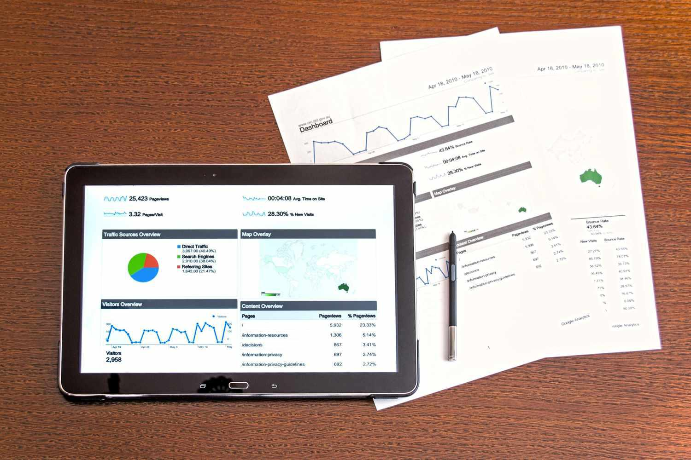

The stock market is a complex ecosystem where traders employ diverse strategies to maximize returns. Among the various methodologies, technical analysis stands out as a pivotal approach, providing critical insights into market behavior. This technique involves examining past market data, primarily prices and volume, to identify patterns and forecast future movements. Practitioners of technical analysis, often referred to as chartists, focus on visual representations of market data to interpret and predict price trends. They leverage historical patterns and statistical tools to identify trading signals and gauge market sentiment.

In recent years, the advent of technology has revolutionized trading through algorithmic trading systems. By merging technical analysis with automation, traders can execute trades more swiftly and efficiently than manual intervention would allow. Algorithmic trading programs utilize predefined criteria, often based on technical indicators, to make real-time trading decisions without human intervention. This fusion of techniques is designed to improve precision and reduce the emotional biases that frequently affect human traders.



This article delves into the intersection of stock market technical analysis, charting, and algorithmic trading, exploring how these elements combine to form sophisticated trading strategies. Through understanding this integration, traders can enhance their analytical capabilities and strategic decision-making, ultimately aiming for improved financial outcomes in the ever-evolving markets.

## Table of Contents

## Understanding Technical Analysis

Technical analysis is a methodology used in stock market trading that involves evaluating prices and trading volumes to predict future market behavior. Unlike [fundamental analysis](/wiki/fundamental-analysis), which focuses on the intrinsic value of securities by examining economic factors and company performance, technical analysis is exclusively concerned with patterns and trends observable in market data.

Chartists, or technical analysts, utilize a variety of tools and techniques to anticipate market direction. Key tools include moving averages, Bollinger Bands, the Relative Strength Index (RSI), and the Moving Average Convergence Divergence (MACD). Each of these tools serves a distinct purpose:

1. **Moving Averages**: A moving average smooths out price data by creating a constantly updated average price. Traders often use the simple moving average (SMA) or exponential moving average (EMA) to identify trends. An SMA is calculated as follows:
$$
   \text{SMA} = \frac{\text{Sum of prices over a number of periods}}{\text{Number of periods}}

$$

   The EMA gives more weight to recent prices, making it more sensitive to recent data changes.

2. **Bollinger Bands**: These are volatility bands placed above and below a moving average. Volatility is based on standard deviation, which changes as volatility increases and decreases.

3. **Relative Strength Index (RSI)**: This momentum oscillator measures the speed and change of price movements. RSI values range from 0 to 100 and are typically used to identify overbought or oversold conditions. A common formula for RSI is:
$$
   \text{RSI} = 100 - \frac{100}{1 + \frac{\text{Average Gain}}{\text{Average Loss}}}

$$

4. **MACD**: The MACD indicator is a trend-following momentum indicator that shows the relationship between two moving averages of a security’s price. It is calculated by subtracting the 26-day EMA from the 12-day EMA.

Technical analysis rests on the assumption that historical market activity, including price movements, can be a valuable indicator of future outcomes. Traders believe that recurring behavior patterns often lead to the repetition of specific price movements. By interpreting these patterns and statistical trends, technical analysts aim to forecast future price directions and make informed trading decisions.

## The Role of Chartists

Chartists play a pivotal role in the stock market by focusing on the interpretation of visual data from charts to identify patterns and trading signals. Their primary objective is to study price movements and derive predictive insights from recurring patterns. The fundamental premise that chartists operate on is the belief that historical price patterns are likely to repeat, thus providing them with a predictive advantage. This belief stems from the psychological behavior of market participants, which tends to adhere to certain patterns under similar economic conditions.

Chartists employ a plethora of tools and techniques to [carry](/wiki/carry-trading) out their analysis. They use various types of charts, such as line charts, bar charts, and candlestick charts, each providing different visual representations of market data. Candlestick charts, for example, are widely favored for their detailed information on open, high, low, and close prices within a specific time frame, facilitating the identification of reversal patterns like "head and shoulders" or "double tops."

Moreover, chartists incorporate multiple technical indicators to refine their analysis and strengthen their trading strategies. Indicators such as moving averages, relative strength index (RSI), and stochastic oscillators help in determining the trend direction and potential reversal points. By combining these indicators, chartists can construct a cohesive strategy that takes into account different facets of market data. For instance, a chartist might use a moving average crossover strategy, where trades are executed when a short-term moving average crosses a long-term moving average, signaling a change in trend.

The role of a chartist is crucial because they bridge the gap between past market data and future predictions, providing invaluable insights into potential market movements. By meticulously analyzing patterns and indicators, chartists enhance their ability to forecast future price actions, offering significant advantages in decision-making processes for traders and investors alike. Their expertise does not lie solely in identifying patterns but also in appreciating the underlying market psychology that drives these formations.

In conclusion, chartists form a vital component of the stock market ecosystem, translating past market dynamics into actionable trading insights. Their work exemplifies the intersection of art and science, as they combine historical analysis with technical methodologies to anticipate future market trends.

## Algorithmic Trading

Algorithmic trading, commonly known as algo trading, integrates computer programs and systems to perform trades based on predefined strategies. This approach replaces manual decision-making in trading, offering the advantage of executing trades at speeds and frequencies far surpassing human capability. By leveraging technical indicators and market data, algorithmic systems analyze real-time market conditions and make swift trading decisions.

At the core of [algorithmic trading](/wiki/algorithmic-trading) are algorithms—sets of rules and calculations designed to autonomously identify trading opportunities. These algorithms are typically informed by technical indicators such as the Moving Average Convergence Divergence (MACD) or Relative Strength Index (RSI). For instance, a simple algo trading strategy might involve monitoring the MACD indicator for crossover events, interpreting these as buy or sell signals depending on the direction of the crossover.

Python is a popular programming language used in algorithmic trading due to its extensive libraries and frameworks. For example, using the `pandas` library for data manipulation and `numpy` for mathematical operations, traders can quickly build and backtest trading algorithms. Consider the following Python code snippet for a simple MACD crossover strategy:

```python
import pandas as pd
import numpy as np

# Sample data input
data = pd.read_csv("market_data.csv")
close_prices = data['Close']

# Calculate MACD components
short_ema = close_prices.ewm(span=12, adjust=False).mean()
long_ema = close_prices.ewm(span=26, adjust=False).mean()
macd = short_ema - long_ema
signal_line = macd.ewm(span=9, adjust=False).mean()

# Generate trading signals
data['Signal'] = np.where(macd > signal_line, 1, 0)
data['Position'] = data['Signal'].diff()

# Output buy/sell signals
buy_signals = data.loc[data['Position'] == 1]
sell_signals = data.loc[data['Position'] == -1]
```

The code calculates the short-term and long-term exponential moving averages to determine the MACD line and a signal line, indicating when to buy or sell. This simplified strategy illustrates how algorithmic systems automate trading decisions based on technical signals.

Another significant advantage of algorithmic trading is its ability to operate continuously without the influence of human emotions such as fear or greed, which often skew judgment. Such systems can adapt to market fluctuations and execute trades with precision.

However, the development and deployment of algorithmic trading systems demand a thorough understanding of programming, market dynamics, and financial mathematics. Ensuring system robustness requires rigorous testing, refinement, and monitoring to prevent anomalies and erroneous trades, particularly in volatile markets.

The seamless integration of computing power, statistical models, and market data exemplifies the strengths of algorithmic trading, showcasing why it has become a cornerstone in the modern trading landscape.

## Combining Technical Analysis with Algorithmic Trading

Many traders blend technical analysis with algorithmic trading systems to enhance decision-making and execution in the stock market. By deploying computing power to encode trading strategies into algorithmic code, traders have the advantage of [backtesting](/wiki/backtesting) these strategies using historical data to assess their effectiveness. This process involves simulating trades on past market data to predict future performance, allowing for continuous refinement and improvement.

The synergy between technical analysis and algorithmic trading provides dynamic and scalable trading systems that can adjust to immediate market conditions. Traders often utilize programming languages such as Python or C++ to develop these algorithms. For instance, moving averages, a popular technical indicator, can serve as a basis for constructing trading algorithms. A simple moving average (SMA), represented mathematically as:

$$

SMA = \frac{P_1 + P_2 + \cdots + P_n}{n}
$$

where $P$ represents the price and $n$ is the number of periods, can signal trading actions when the current price crosses above or below the calculated average. 

In addition to trading signals, the incorporation of automated stop-loss orders based on support and resistance levels is another common practice. These orders limit potential losses by triggering a sale of the asset once the price falls to a predetermined level. Automating these elements reduces human error and emotional bias, providing a consistent and systematic approach to trading decisions.

Algorithmic systems offer further advantages by running continuously and executing trades at speeds unattainable by human traders, ensuring that opportunities are captured as they arise. This combination of technical analysis and algorithmic implementation not only streamlines the trading process but also enables traders to systematically approach the complexity of financial markets, navigating them with increased precision and efficiency.

## Challenges and Considerations

While technical analysis and algorithmic trading provide substantial benefits in stock market trading, they are not without challenges. One significant concern is the diminishing effectiveness of technical indicators in volatile or manipulated markets. In periods of extreme market activity, standard indicators such as moving averages or Bollinger Bands may fail to provide reliable signals, as sudden price swings can distort typical patterns and trends. This variability might lead traders to make misguided decisions based on historical performance, which may not hold in unprecedented situations.

Algorithmic systems, despite their capability to automate trading processes with precision, require rigorous monitoring and validation. Anomalies in the system can result in technical failures, such as erroneous trade execution or significant financial losses. Constant supervision ensures that algorithms function as intended. Moreover, given the complexity of these algorithms, a small bug or overlooked parameter can have cascading effects, emphasizing the need for thorough testing and system checks.

The reliance on historical data is another concern, particularly when macroeconomic factors are not integrated into analysis. Markets are influenced by a plethora of factors beyond historical price and [volume](/wiki/volume-trading-strategy) data, including geopolitical events, [interest rate](/wiki/interest-rate-trading-strategies) changes, and economic indicators like GDP growth. Consequently, traders who focus solely on technical analysis may overlook broader market influences that can impact stock prices.

Balancing technical strategies with an awareness of the broader market environment is crucial. This requires a commitment to continuous learning and adaptation in strategy formulation. Traders must remain aware of global economic developments and adjust their models accordingly. An adaptive approach ensures that trading strategies remain relevant and effective despite an ever-changing financial landscape.

In summary, while technical analysis and algorithmic trading offer sophisticated tools for market engagement, they demand a careful balance of data interpretation and market insight. The ability to navigate these challenges efficiently can significantly enhance a trader's ability to succeed in the stock market.

## Conclusion

Technical analysis and algorithmic trading have transformed stock market strategies, offering traders new ways to approach market opportunities. These methodologies incorporate historical data analysis and automated execution systems, allowing for precise, efficient trading. The integration of charting techniques with algorithmic trading provides a notable strategic advantage, enabling traders to respond swiftly to market signals while minimizing human error and emotional biases.

Success in leveraging these tools requires a fine balance of technical expertise, situational awareness, and adaptability. Traders must be adept in interpreting technical indicators and configuring algorithmic systems to align with market trends. This blend necessitates continuous research and strategy refinement to remain competitive within dynamic market conditions.

The stock market's landscape is ever-changing, driven by technological advancements and global financial shifts. Traders who embrace the fusion of technical analysis and automation must commit to ongoing education and system updates, ensuring strategies remain relevant and effective. By doing so, they can navigate complexities with increased confidence and strategic insight.

Ultimately, the combination of technical analysis and algorithmic trading equips modern traders with a comprehensive toolset. This approach maximizes efficiency and potential returns, fostering a more systematic and disciplined trading environment. As financial markets evolve, traders who master these methodologies position themselves at the forefront of market innovation.

## References & Further Reading

[1]: ["Technical Analysis of the Financial Markets: A Comprehensive Guide to Trading Methods and Applications"](https://www.amazon.com/Technical-Analysis-Financial-Markets-Comprehensive/dp/0735200661) by John J. Murphy

[2]: ["Algorithmic Trading: Winning Strategies and Their Rationale"](https://books.google.com/books/about/Algorithmic_Trading.html?id=WAlFDwAAQBAJ) by Ernie Chan

[3]: ["Technical Analysis Explained: The Successful Investor's Guide to Spotting Investment Trends and Turning Points"](https://www.amazon.com/Technical-Analysis-Explained-Fifth-Successful/dp/0071825177) by Martin J. Pring

[4]: ["Quantitative Technical Analysis: An integrated approach to trading system development and trading management"](https://www.amazon.com/Quantitative-Technical-Analysis-integrated-development/dp/0979183855) by Dr. Howard B. Bandy

[5]: ["Python for Finance: Mastering Data-Driven Finance"](https://www.amazon.com/Python-Finance-Mastering-Data-Driven/dp/1492024333) by Yves Hilpisch