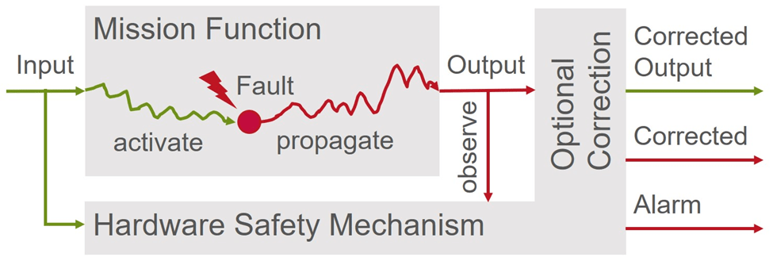

## Table of Contents

## What is a technical correction in financial markets?

A technical correction in financial markets happens when the price of a stock, a group of stocks, or a whole market goes down by a certain amount, usually between 10% and 20%, after it has been going up for a while. This drop is called a correction because it's seen as the market fixing itself or getting back to a more normal or fair price after it got too high.

Corrections can happen for many reasons, like when investors start to think the market is too expensive or when something big happens in the world that makes people worried. Even though corrections can be scary and make people lose money, they are a normal part of how markets work. They help to keep the market healthy by making sure prices don't get too far away from what things are really worth.

## How does a technical correction differ from a market crash?

A technical correction and a market crash are both times when the prices of stocks go down, but they are different in how big the drop is and how it affects people. A technical correction happens when prices fall by about 10% to 20% after they have been going up. It's like the market taking a little break to fix itself and get back to a fair price. People might be a bit worried, but it's pretty normal and happens from time to time.

On the other hand, a market crash is much bigger and scarier. It's when prices drop by a lot more, often over 20%, and it happens really fast. This can make a lot of people lose a lot of money and can even affect the whole economy. Crashes are not as common as corrections, but when they happen, they can cause big problems and make people very worried about their money.

So, while a technical correction is like a small, normal adjustment in the market, a market crash is a big, sudden drop that can have serious effects. Both can make prices go down, but they are different in how big the drop is and how much they shake things up.

## What are the common causes of a technical correction?

A technical correction can happen for a few reasons. One big reason is when people think that the prices of stocks have gone up too much and are now too high. This can make some investors decide to sell their stocks to take their profits, which then makes the prices go down. Another reason is when something important happens in the world or the economy that makes people worried. For example, if there's a big problem in a country that affects businesses, people might start selling their stocks because they're scared about what might happen next.

Also, technical corrections can be caused by changes in interest rates. If the interest rates go up, borrowing money becomes more expensive, and this can slow down the economy. When the economy slows down, people might think that companies won't make as much money, so they sell their stocks, causing prices to drop. Sometimes, technical corrections are just a normal part of the market cycle, where prices go up and down over time. Even though these corrections can be a bit scary, they help keep the market healthy by making sure prices don't get too far away from what things are really worth.

## Can you explain the mechanism behind a technical correction?

A technical correction happens when the price of stocks, or the whole market, goes down by about 10% to 20% after it has been going up for a while. It's like the market taking a little break to fix itself. This drop can start when investors think that the prices have gone too high and are not fair anymore. So, some people decide to sell their stocks to take their profits, which makes the prices start to go down. Other people might see this and get worried, so they start selling too, which makes the prices drop even more.

Sometimes, a technical correction can be caused by something big happening in the world or the economy that makes people worried. For example, if there's a big problem in a country that could affect businesses, people might start selling their stocks because they're scared about what might happen next. Also, if interest rates go up, it can make borrowing money more expensive, which can slow down the economy. When people think the economy is slowing down, they might sell their stocks because they think companies won't make as much money. Even though these corrections can be a bit scary, they help keep the market healthy by making sure prices don't get too far away from what things are really worth.

## How do technical corrections affect stock prices?

Technical corrections make stock prices go down by about 10% to 20%. This happens after the prices have been going up for a while. When investors think the prices are too high, some of them start selling their stocks to take their profits. This selling makes the stock prices start to drop. Other people might see this and get worried, so they start selling too, which makes the prices go down even more.

Sometimes, big events in the world or changes in the economy can also cause a technical correction. For example, if something scary happens in a country that might hurt businesses, people might sell their stocks because they're worried. Also, if interest rates go up, it can make borrowing money more expensive, which can slow down the economy. When people think the economy is slowing down, they might sell their stocks because they think companies won't make as much money. Even though these corrections can be scary, they help keep the market healthy by making sure prices don't get too far away from what things are really worth.

## What role do market indicators play in identifying a technical correction?

Market indicators help people see when a technical correction might be happening. These indicators are like signs that show if the stock market is going up too fast or if it's time for prices to go down a bit. Some common indicators are moving averages, which show the average price of a stock over a certain time, and the Relative Strength Index (RSI), which tells if a stock is being bought or sold too much. When these indicators show that prices are too high or that the market is moving too fast, it might mean a technical correction is coming.

People use these indicators to make smart choices about buying or selling stocks. For example, if the RSI shows that a stock is overbought, it might be a good time to sell before the price drops. On the other hand, if the moving averages show that the price is starting to go down, it could be a sign that a correction is happening. By watching these indicators, investors can get ready for a technical correction and maybe even make some money by selling at the right time.

## How can investors prepare for a technical correction?

Investors can prepare for a technical correction by keeping an eye on market indicators like moving averages and the Relative Strength Index (RSI). These tools help them see if stock prices are getting too high or if the market is moving too fast. If the indicators show that a correction might be coming, investors can think about selling some of their stocks to take their profits before the prices drop. It's also a good idea to have a plan for what to do if the market goes down, so they don't make quick, scared decisions.

Another way to get ready for a technical correction is by spreading out their investments. This means not putting all their money into just one or two stocks, but instead, investing in different kinds of stocks and even other things like bonds. This way, if one part of their investments goes down during a correction, the other parts might not go down as much, which can help protect their money. By being prepared and having a plan, investors can feel more confident and handle a technical correction better.

## What strategies can be used to trade during a technical correction?

During a technical correction, one good strategy is to sell some stocks when the market starts to go down. If you see that the prices are dropping and you think it's the start of a correction, selling some of your stocks can help you keep your money safe. You can then wait for the prices to go down more and buy back the stocks when they are cheaper. This is called "selling high and buying low," and it can help you make money even when the market is going down.

Another strategy is to keep investing, but in a smart way. Instead of stopping your investments because the market is going down, you can keep putting money into the market but spread it out over different kinds of investments. This way, if one part of the market goes down a lot, the other parts might not go down as much, and you can still make some money. This is called "diversification," and it can help you handle a technical correction better.

Lastly, you can use technical indicators to help you trade during a correction. Tools like moving averages and the Relative Strength Index (RSI) can show you when the market might be getting too high or too low. If these indicators show that the market is overbought, it might be a good time to sell. If they show that the market is oversold, it might be a good time to buy. By watching these indicators, you can make smarter choices about when to buy and sell during a technical correction.

## How do technical corrections impact different sectors of the economy?

Technical corrections can affect different parts of the economy in different ways. Some sectors, like technology or consumer goods, might see their stock prices drop more because people think these stocks got too expensive before the correction. These sectors often grow fast and can be popular with investors, so when the market goes down, these stocks might fall more. On the other hand, sectors like utilities or healthcare might not go down as much because people always need these services, no matter what the market is doing. These sectors are seen as safer places to invest during a correction.

Also, technical corrections can change how people spend money. When stock prices go down, people might feel less rich and decide to save more money instead of spending it. This can hurt businesses that rely on people buying things, like retail or travel. But it can help other businesses, like those that offer cheaper products or services, because people might look for better deals. So, while a technical correction can make some parts of the economy struggle, it can also create new chances for other parts to do well.

## What historical examples illustrate the effects of technical corrections?

In 2018, the stock market had a technical correction that started in October. The S&P 500, which is a big group of stocks, went down by about 10% in just a few weeks. This happened because people were worried about things like trade fights between countries and how fast the economy was growing. The tech sector, which had been doing really well before the correction, saw its stocks go down a lot more than other sectors. This showed how some parts of the economy can be hit harder by a correction. Even though it was scary at the time, the market started to go back up after a few months, showing that corrections are a normal part of how markets work.

Another example happened in 2015 when the stock market had a correction that started in August. The S&P 500 went down by about 12% in a short time. People were worried about things like what was happening in China's economy and how low oil prices were affecting the world. Energy companies, which had been doing well before the correction, saw their stocks drop a lot because of the falling oil prices. But other sectors, like healthcare and utilities, didn't go down as much. This showed how different parts of the economy can be affected differently by a correction. Like the 2018 correction, the market eventually started to go back up, reminding people that corrections are just part of the market's ups and downs.

## How do technical corrections influence long-term investment strategies?

Technical corrections can make people who are investing for the long term feel worried, but they can also help these investors make better choices. When the market goes down during a correction, long-term investors might see it as a chance to buy stocks at lower prices. This means they can get more stocks for their money, which can help their investments grow more over time. Instead of selling their stocks when the market goes down, smart long-term investors keep their focus on their big goals and don't let short-term drops scare them.

Also, technical corrections can remind long-term investors to spread out their investments. This means not putting all their money into just one kind of stock or one part of the market. By having a mix of different investments, like stocks, bonds, and other things, investors can protect their money better during a correction. Even though corrections can be scary, they can help long-term investors build a stronger and more balanced investment plan that can handle the ups and downs of the market.

## What advanced tools and models are used to predict technical corrections?

People use fancy tools and models to try to guess when a technical correction might happen. One tool is called [machine learning](/wiki/machine-learning), which is a type of computer program that can learn from past market data to find patterns that might show a correction is coming. Another tool is called sentiment analysis, which looks at what people are saying on social media and in the news to see if people are feeling good or bad about the market. If a lot of people are worried, it might mean a correction is on the way. There are also models like the GARCH model, which helps predict how much the market might move up or down, and this can be a sign that a correction is coming.

These tools and models help investors make smarter choices about their money. By using machine learning, sentiment analysis, and models like GARCH, investors can get a better idea of when the market might go down. This can help them decide when to sell their stocks to take their profits or when to buy more stocks at a lower price. Even though these tools can't predict the future perfectly, they can give investors important information to help them plan for a technical correction.

## What are the strategies for trading during technical corrections?

Successful trading during technical corrections requires a combination of strategic patience, market analysis, and leveraging technological tools. These strategies help investors navigate short-term price adjustments effectively and mitigate associated risks.

One common approach is buying on dips, which involves purchasing stocks when prices fall below intrinsic value during a correction. This strategy assumes that market fundamentals remain strong, and prices will eventually rebound. By acquiring assets at reduced prices, investors can potentially enhance their portfolio's long-term returns.

Diversification is another essential strategy, aimed at reducing portfolio risk. The principle lies in spreading investments across various asset classes or sectors to minimize the impact of adverse price movements in any single investment. For instance, combining stocks, bonds, commodities, and real estate can buffer against [volatility](/wiki/volatility-trading-strategies), allowing a balanced approach during a correction.

Algorithmic trading offers sophisticated methods for addressing market conditions during corrections. These automated systems utilize technical indicators, such as moving averages and Bollinger Bands, to identify and capitalize on market trends. Moving averages smooth out price data and help determine general market direction. For example, a simple moving average (SMA) is calculated as:

$$
\text{SMA} = \frac{(P_1 + P_2 + \ldots + P_n)}{n}
$$

where $P$ is the closing price and $n$ is the number of periods considered. Traders often look for crossovers, where a shorter-term SMA crosses a longer-term SMA, as potential buy or sell signals.

Bollinger Bands, developed by John Bollinger, consist of three lines: a simple moving average in the middle and two standard deviation lines as upper and lower bands. These bands expand and contract based on market volatility. Traders use this indicator to identify overbought or oversold conditions, signaling potential entry or [exit](/wiki/exit-strategy) points.

Python, with its robust libraries and frameworks, enables traders to implement algorithmic strategies efficiently. Below is a simple example of using Python to calculate an SMA:

```python
import pandas as pd

# Assumes historical data in a DataFrame with a 'Close' column
def calculate_sma(data, window):
    return data['Close'].rolling(window=window).mean()

# Example of usage
data = pd.DataFrame({'Close': [100, 101, 102, 98, 97, 99, 105]})
sma_3 = calculate_sma(data, 3)
print(sma_3)
```

By employing systematic strategies and utilizing technological tools, investors and traders can better position themselves to take advantage of opportunities presented by technical corrections, enhancing their overall market strategy.

## References & Further Reading

[1]: ["Advances in Financial Machine Learning"](https://www.amazon.com/Advances-Financial-Machine-Learning-Marcos/dp/1119482089) by Marcos Lopez de Prado

[2]: ["Evidence-Based Technical Analysis: Applying the Scientific Method and Statistical Inference to Trading Signals"](https://www.amazon.com/Evidence-Based-Technical-Analysis-Scientific-Statistical/dp/0470008741) by David Aronson

[3]: ["Machine Learning for Algorithmic Trading"](https://github.com/stefan-jansen/machine-learning-for-trading) by Stefan Jansen

[4]: ["Quantitative Trading: How to Build Your Own Algorithmic Trading Business"](https://www.amazon.com/Quantitative-Trading-Build-Algorithmic-Business/dp/1119800064) by Ernest P. Chan

[5]: Lo, A. W., & MacKinlay, A. C. (1999). ["A Non-Random Walk Down Wall Street"](https://www.jstor.org/stable/j.ctt7tccx). Princeton University Press.

[6]: Pardo, R. (2008). ["The Evaluation and Optimization of Trading Strategies"](https://onlinelibrary.wiley.com/doi/book/10.1002/9781119196969). Wiley.