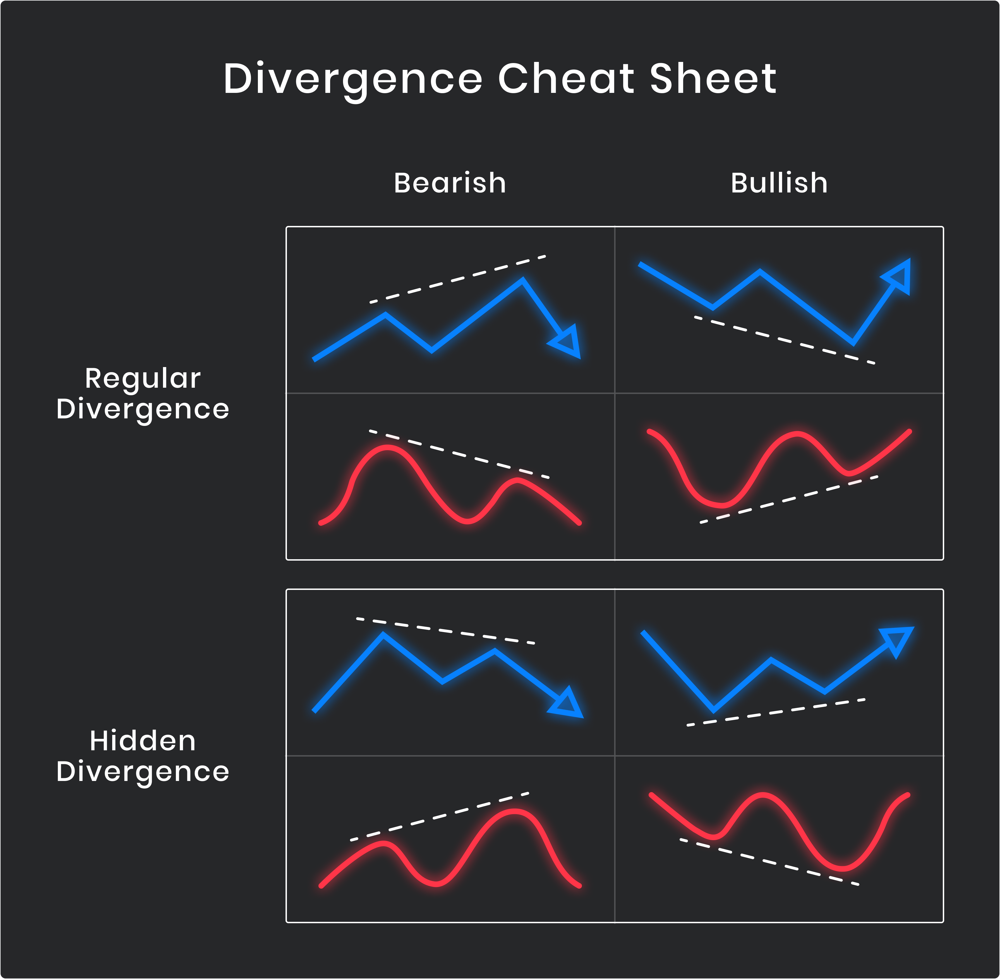

## Table of Contents

## What is technical divergence in trading?

Technical divergence in trading happens when the price of an asset moves in one direction, but the technical indicators move in the opposite direction. This can be a sign that the current trend might be weakening and could reverse soon. Traders use this information to make decisions about buying or selling. For example, if the price of a stock is going up but the momentum indicator is going down, it might mean the upward trend is losing strength.

There are two main types of divergence: bullish and bearish. Bullish divergence occurs when the price is making lower lows, but the indicator is making higher lows. This can signal that the downward trend is losing steam and a reversal to an upward trend might be coming. On the other hand, bearish divergence happens when the price is making higher highs, but the indicator is making lower highs. This suggests that the upward trend might be running out of steam and a downward trend could start soon. By spotting these divergences, traders can try to predict future price movements and adjust their strategies accordingly.

## How does technical divergence differ from convergence?

Technical divergence and convergence are two concepts traders use to understand how an asset's price and technical indicators relate to each other. Divergence happens when the price of an asset moves in one direction, but the technical indicator moves in the opposite direction. For example, if the price is going up but the indicator is going down, that's divergence. This can signal that the current trend might be weakening and could reverse soon. Traders watch for divergence to try to predict when a trend might change.

On the other hand, convergence is when the price of an asset and the technical indicator move in the same direction. If both the price and the indicator are going up or both are going down, that's convergence. This usually means the current trend is strong and likely to continue. Traders use convergence to confirm that a trend is still in place and to make decisions about staying in a trade or entering a new one. Both divergence and convergence help traders make better choices about when to buy or sell.

## What are the main types of technical divergence?

There are two main types of technical divergence: bullish divergence and bearish divergence. Bullish divergence happens when the price of an asset is going down, making lower lows, but the technical indicator is going up, making higher lows. This can mean that the downward trend is getting weaker and might turn into an upward trend soon. Traders look for bullish divergence to find good times to buy an asset.

Bearish divergence is the opposite. It happens when the price of an asset is going up, making higher highs, but the technical indicator is going down, making lower highs. This can mean that the upward trend is losing strength and might turn into a downward trend soon. Traders watch for bearish divergence to find good times to sell an asset or avoid buying it. Both types of divergence help traders predict when a trend might change.

## Can you explain the concept of bullish divergence?

Bullish divergence happens when the price of something, like a stock, is going down, but a technical indicator, like the Relative Strength Index (RSI), is going up. Imagine the price is making lower lows, but the indicator is making higher lows. This difference between the price and the indicator is what we call bullish divergence. It's like a signal that the downward trend might be getting weaker and could start going up soon.

Traders look for bullish divergence because it can be a good time to buy. If they see the price going down but the indicator going up, they might think the price will start going up too. This can help them make money by buying the stock before it starts to rise. So, bullish divergence is a useful tool for traders to spot when a downward trend might be ending and an upward trend might be starting.

## What is bearish divergence and how is it identified?

Bearish divergence happens when the price of something, like a stock, is going up, but a technical indicator, like the Relative Strength Index (RSI), is going down. Imagine the price is making higher highs, but the indicator is making lower highs. This difference between the price and the indicator is what we call bearish divergence. It's like a signal that the upward trend might be getting weaker and could start going down soon.

Traders look for bearish divergence because it can be a good time to sell. If they see the price going up but the indicator going down, they might think the price will start going down too. This can help them make money by selling the stock before it starts to fall. So, bearish divergence is a useful tool for traders to spot when an upward trend might be ending and a downward trend might be starting.

## How can traders use technical divergence to predict market trends?

Traders use technical divergence to predict market trends by looking at the difference between the price of an asset and a technical indicator. When they see the price going up but the indicator going down, it's called bearish divergence. This can mean the upward trend is getting weak and might start going down soon. On the other hand, if the price is going down but the indicator is going up, it's called bullish divergence. This can mean the downward trend is getting weak and might start going up soon. By spotting these differences, traders can guess when a trend might change and make smart choices about buying or selling.

For example, if a trader sees bearish divergence, they might decide to sell their stock before the price starts to fall. This can help them avoid losing money. If they see bullish divergence, they might decide to buy the stock before the price starts to rise. This can help them make money. By using technical divergence, traders can try to predict what the market will do next and make better trading decisions.

## What are the most common indicators used to identify divergence?

The most common indicators used to identify divergence are the Relative Strength Index (RSI), the Moving Average Convergence Divergence (MACD), and the Stochastic Oscillator. The RSI measures how fast and how much the price of something is changing. It helps traders see if a stock is overbought or oversold. The MACD shows the relationship between two moving averages of a stock's price. It helps traders see the strength and direction of a trend. The Stochastic Oscillator compares a stock's closing price to its price range over a certain time. It helps traders see if a stock is overbought or oversold.

Traders use these indicators to spot divergence. For example, if the price of a stock is going up but the RSI is going down, that's bearish divergence. It might mean the upward trend is getting weak. If the price is going down but the MACD is going up, that's bullish divergence. It might mean the downward trend is getting weak. By watching these indicators, traders can guess when a trend might change and make smart choices about buying or selling.

## How reliable is technical divergence as a trading signal?

Technical divergence can be a helpful tool for traders, but it's not always 100% reliable. It's like a clue that can help traders guess when a trend might change, but it doesn't always mean the trend will change right away. Sometimes, the price keeps going in the same direction even when there's divergence. That's why traders often use other tools and information along with divergence to make better decisions.

Even though technical divergence isn't perfect, many traders find it useful. It can give them an early warning that a trend might be getting weak. By paying attention to divergence, traders can be ready to act if the trend does change. But it's important for traders to use divergence along with other signs and not rely on it alone. That way, they can make smarter choices about buying and selling.

## What are the potential pitfalls of relying on divergence for trading decisions?

Relying too much on divergence for trading decisions can lead to some problems. Divergence is not always right. Sometimes, the price keeps going in the same direction even when there's divergence. This can trick traders into thinking the trend will change when it won't. If traders only use divergence and don't look at other things, they might make bad choices and lose money.

Another problem is that divergence can be hard to spot. It's not always clear when it's happening. Different traders might see it differently. Also, even if traders see divergence, they might not know when to act. Waiting too long or acting too soon can both be bad. That's why it's important to use divergence along with other tools and information to make better trading decisions.

## How can technical divergence be integrated into a comprehensive trading strategy?

Technical divergence can be a useful part of a bigger trading plan. It's like a clue that can help traders guess when a trend might change. But it's not perfect, so traders should use it with other tools. For example, they can look at the price of a stock, the [volume](/wiki/volume-trading-strategy) of trades, and other indicators like the Moving Average Convergence Divergence (MACD) or the Relative Strength Index (RSI). By putting all these pieces together, traders can get a better picture of what might happen next. This can help them make smarter choices about when to buy or sell.

Using technical divergence in a complete trading strategy means not relying on it alone. Traders should also think about the bigger picture, like what's happening in the market and the economy. They can use other methods like looking at support and resistance levels, trend lines, and even news events. By combining technical divergence with these other ways of understanding the market, traders can make more informed decisions. This can help them avoid the pitfalls of relying too much on just one signal and improve their chances of making successful trades.

## What advanced techniques can be used to enhance the detection of divergence?

To enhance the detection of divergence, traders can use more advanced techniques like combining multiple indicators. Instead of just looking at one indicator like the RSI, they can also check the MACD and the Stochastic Oscillator at the same time. If all these indicators show the same kind of divergence, it can give traders more confidence that the trend might change. Another way to improve detection is by using different time frames. Traders can look at the same stock on a daily chart, a weekly chart, and even a monthly chart. If they see divergence on more than one time frame, it can be a stronger sign that something big might happen.

Traders can also use software and algorithms to help spot divergence more easily. These tools can scan lots of data quickly and find patterns that might be hard for a person to see. By using these advanced tools, traders can find divergence faster and with less chance of missing it. But even with these fancy techniques, it's still important to use other information too. Traders should always look at the bigger picture, like what's happening in the market and the economy, to make the best decisions.

## Can you discuss case studies where technical divergence led to successful trading outcomes?

In one case, a trader named Sarah used technical divergence to make a successful trade with a tech stock. She noticed that the stock's price was going up, making higher highs, but the RSI was going down, making lower highs. This was a sign of bearish divergence. Sarah decided to sell her shares before the price started to fall. A few days later, the stock did start to go down, and Sarah was happy she sold when she did. By using the bearish divergence signal, she avoided losing money and even made a small profit.

Another example is when a trader named Mike used bullish divergence to buy a stock in the energy sector. He saw that the stock's price was going down, making lower lows, but the MACD was going up, making higher lows. This was a sign of bullish divergence. Mike decided to buy the stock, thinking it would start to go up soon. Sure enough, the stock's price began to rise a week later. Mike was able to sell the stock at a higher price and make a good profit. By spotting the bullish divergence, he was able to make a smart trading decision.

## References & Further Reading

[1]: Bergstra, J., Bardenet, R., Bengio, Y., & Kégl, B. (2011). ["Algorithms for Hyper-Parameter Optimization."](https://papers.nips.cc/paper/4443-algorithms-for-hyper-parameter-optimization) Advances in Neural Information Processing Systems 24.

[2]: ["Advances in Financial Machine Learning"](https://www.amazon.com/Advances-Financial-Machine-Learning-Marcos/dp/1119482089) by Marcos Lopez de Prado

[3]: ["Evidence-Based Technical Analysis: Applying the Scientific Method and Statistical Inference to Trading Signals"](https://www.amazon.com/Evidence-Based-Technical-Analysis-Scientific-Statistical/dp/0470008741) by David Aronson

[4]: ["Machine Learning for Algorithmic Trading"](https://github.com/stefan-jansen/machine-learning-for-trading) by Stefan Jansen

[5]: ["Quantitative Trading: How to Build Your Own Algorithmic Trading Business"](https://www.amazon.com/Quantitative-Trading-Build-Algorithmic-Business/dp/1119800064) by Ernest P. Chan