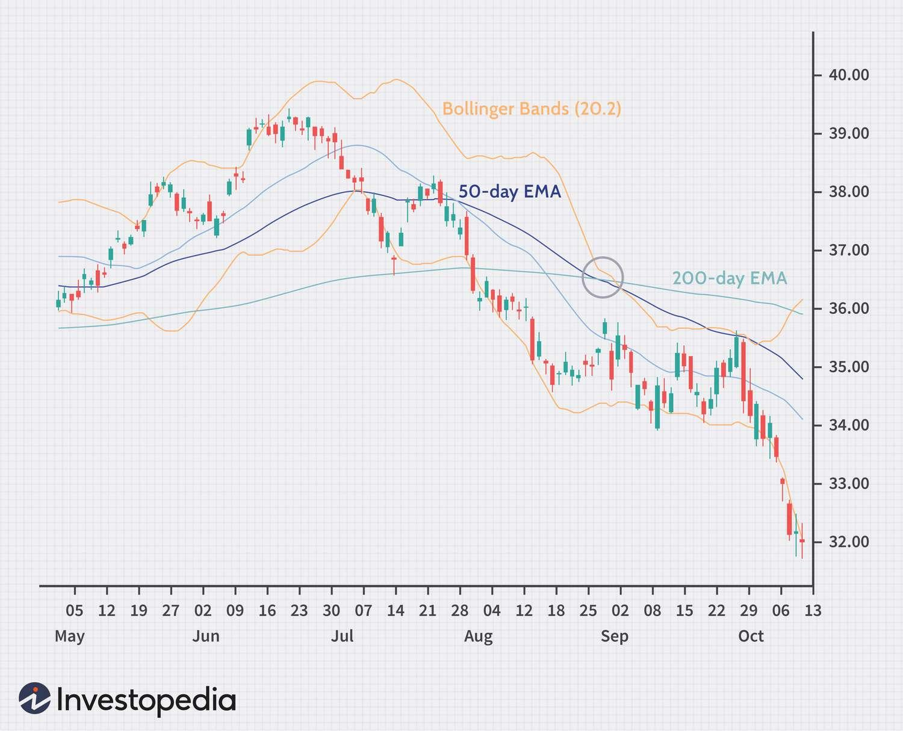

## Table of Contents

## What are technical indicators and why are they important for trading?

Technical indicators are tools that traders use to understand and predict how the prices of stocks, currencies, or other financial assets might move. They use math formulas and past price data to create charts and signals that help traders make decisions. Common examples include moving averages, which smooth out price data to show trends over time, and the Relative Strength Index (RSI), which measures how fast prices are changing to show if something is overbought or oversold.

These indicators are important for trading because they help traders see patterns and trends that might not be obvious just by looking at raw price data. By using technical indicators, traders can make more informed decisions about when to buy or sell. For example, if a moving average shows that a stock's price is starting to trend upwards, a trader might decide it's a good time to buy. Similarly, if the RSI indicates that a stock is overbought, a trader might see it as a signal to sell before the price drops. Overall, technical indicators help traders manage risk and potentially increase their chances of making profitable trades.

## How do technical indicators help in analyzing market trends?

Technical indicators help traders see what's happening in the market by turning price data into easy-to-understand charts and signals. They use math to look at past prices and show if the market is going up, down, or staying the same. For example, a moving average line on a chart can show if a stock's price is trending up over time. If the line is going up, it means the stock's price is generally increasing, which can be a sign to buy.

These indicators also help traders spot when the market might change direction. For instance, the Relative Strength Index (RSI) can tell if a stock is overbought or oversold. If the RSI is high, it might mean the stock's price has gone up too fast and could soon go down. This can be a signal for traders to sell before the price drops. By using these indicators, traders can better understand market trends and make smarter decisions about when to buy or sell.

## What is the difference between leading and lagging indicators?

Leading indicators are like early warning signals. They try to predict what the market will do next before it happens. For example, the Relative Strength Index (RSI) can show if a stock is about to change direction because it's overbought or oversold. Traders use leading indicators to get ahead of the market and make decisions before big changes happen.

Lagging indicators, on the other hand, look at what has already happened. They confirm trends after they've started. A common lagging indicator is a moving average, which shows the average price of a stock over time. It helps traders see if a trend is strong and likely to continue. While lagging indicators don't predict the future, they help traders make sure they're following a real trend and not just a short-term change.

## Can you explain the Moving Average and its types?

A Moving Average is a tool that helps traders see the average price of a stock over time. It smooths out the ups and downs of daily price changes, making it easier to spot trends. Imagine you're looking at a stock's price every day. It goes up and down a lot, which can be confusing. A Moving Average takes the average price over a certain number of days and shows it as a line on a chart. This line helps you see if the stock's price is generally going up, down, or staying the same.

There are two main types of Moving Averages: Simple Moving Average (SMA) and Exponential Moving Average (EMA). A Simple Moving Average is the easiest to understand. It just adds up the closing prices over a set number of days and divides by that number. For example, a 10-day SMA adds up the last 10 days' closing prices and divides by 10. An Exponential Moving Average is a bit more complicated. It gives more weight to recent prices, so it reacts faster to new information. This means an EMA can show changes in the stock's price more quickly than an SMA. Both types help traders see trends, but they do it in slightly different ways.

## What is the Relative Strength Index (RSI) and how is it used?

The Relative Strength Index, or RSI, is a tool traders use to see if a stock is being bought or sold too much. It's like a scale that goes from 0 to 100. If the RSI is over 70, it means the stock might be overbought, which could mean the price might go down soon. If it's under 30, it means the stock might be oversold, and the price could go up soon. The RSI helps traders decide when to buy or sell by showing if a stock's price has moved too far, too fast.

Traders use the RSI to spot when the market might change direction. For example, if a stock's RSI goes above 70 and then starts to drop, it could be a sign to sell before the price falls. On the other hand, if the RSI goes below 30 and then starts to rise, it might be a good time to buy before the price goes up. By watching the RSI, traders can make better decisions about when to get in or out of a trade.

## How does the Moving Average Convergence Divergence (MACD) work?

The Moving Average Convergence Divergence, or MACD, is a tool traders use to see if a stock's price is going up or down. It uses two lines: the MACD line and the signal line. The MACD line is made by taking the difference between a 26-day moving average and a 12-day moving average. The signal line is a 9-day moving average of the MACD line. When the MACD line crosses above the signal line, it can be a sign that the stock's price might go up, which is called a bullish signal. When the MACD line crosses below the signal line, it can be a sign that the price might go down, which is called a bearish signal.

Traders also look at a histogram on the MACD chart, which shows the difference between the MACD line and the signal line. When the histogram bars get bigger, it means the difference between the two lines is growing, which can show that the trend is getting stronger. If the bars start to get smaller, it might mean the trend is weakening. By watching these lines and the histogram, traders can get a better idea of when to buy or sell a stock based on its [momentum](/wiki/momentum) and trend.

## What are Bollinger Bands and what do they indicate?

Bollinger Bands are like lines on a chart that help traders see if a stock's price is moving a lot or staying calm. They are made of three lines: the middle line is a moving average, and the top and bottom lines are set above and below this middle line. The distance between the top and bottom lines changes depending on how much the stock's price is moving around. If the price is jumping up and down a lot, the bands get wider. If the price is staying pretty steady, the bands get closer together.

Traders use Bollinger Bands to spot when a stock's price might be ready to change direction. When the price touches or goes outside the top band, it might mean the stock is overbought and could go down soon. When the price touches or goes outside the bottom band, it might mean the stock is oversold and could go up soon. By watching where the price is compared to the bands, traders can make better guesses about when to buy or sell a stock.

## How can the Stochastic Oscillator be used to predict price movements?

The Stochastic Oscillator is a tool that helps traders see if a stock's price is about to change direction. It does this by comparing the closing price of a stock to its price range over a certain number of days, usually 14 days. The oscillator shows two lines: the %K line and the %D line. These lines move between 0 and 100. If the lines are above 80, it means the stock might be overbought, which could mean the price will go down soon. If the lines are below 20, it means the stock might be oversold, and the price could go up soon.

Traders use the Stochastic Oscillator to spot when to buy or sell a stock. When the %K line crosses above the %D line and both are below 20, it's a sign that the stock might be ready to go up, so it could be a good time to buy. On the other hand, when the %K line crosses below the %D line and both are above 80, it's a sign that the stock might be ready to go down, so it could be a good time to sell. By watching these lines, traders can make better guesses about when the stock's price might change and make smarter trading decisions.

## What is the significance of the Fibonacci Retracement in trading?

The Fibonacci Retracement is a tool that traders use to guess where a stock's price might go next. It uses special numbers called Fibonacci numbers, which come from a pattern found in nature. Traders draw lines on a chart at certain levels, like 23.6%, 38.2%, 50%, 61.8%, and 78.6%. These lines show where the price might stop falling and start going up again, or stop rising and start falling again. It's like trying to find support and resistance levels, which are points where the price often changes direction.

Traders look at these Fibonacci levels to make decisions about when to buy or sell. For example, if a stock's price goes down and then stops at one of these levels, a trader might think it's a good time to buy because the price might start going up again. On the other hand, if the price goes up and then stops at a Fibonacci level, a trader might see it as a good time to sell because the price might start going down. By using Fibonacci Retracement, traders can better understand where the price might go and make smarter trading choices.

## How do volume-based indicators like the On-Balance Volume (OBV) assist in trading decisions?

Volume-based indicators like the On-Balance Volume (OBV) help traders understand how strong a stock's price movement is by looking at the number of shares traded. The OBV adds [volume](/wiki/volume-trading-strategy) on days when the stock's price goes up and subtracts volume on days when the price goes down. This creates a line on a chart that shows if more people are buying or selling the stock. If the OBV line is going up, it means more people are buying, which can be a sign that the stock's price might keep going up. If the OBV line is going down, it means more people are selling, which can be a sign that the price might keep going down.

Traders use the OBV to make better decisions about when to buy or sell a stock. For example, if a stock's price is going up and the OBV line is also going up, it can confirm that the price increase is strong and likely to continue. This might be a good time to buy the stock. On the other hand, if the stock's price is going up but the OBV line is going down, it might mean the price increase is weak and could reverse soon. This could be a signal to sell the stock before the price drops. By watching the OBV, traders can get a better idea of the stock's momentum and make smarter trading choices.

## What are some common pitfalls to avoid when using technical indicators?

One common pitfall when using technical indicators is relying too much on just one indicator. It's easy to think that one tool can tell you everything you need to know about a stock's price, but that's not true. Each indicator looks at the market in a different way, so using just one can give you a limited view. It's better to use a few different indicators together to get a fuller picture of what's happening. This way, you can see if the signals from different indicators agree with each other, which can make your trading decisions more reliable.

Another mistake is not understanding how an indicator works before using it. If you don't know what an indicator is measuring or how it's calculated, you might misread its signals. For example, if you don't know that the Relative Strength Index (RSI) measures how fast prices are changing, you might not understand why it's showing a stock as overbought or oversold. It's important to learn about each indicator and practice using it before making real trades. This helps you avoid making decisions based on signals you don't fully understand.

## How can a beginner trader combine multiple technical indicators for better results?

A beginner trader can combine multiple technical indicators to get a better understanding of the market by using different types of indicators that look at the market in different ways. For example, you might use a trend-following indicator like a Moving Average to see if the stock's price is generally going up or down. Then, you could add a momentum indicator like the Relative Strength Index (RSI) to see if the stock is overbought or oversold. By looking at both, you can see if the trend is strong and likely to continue, or if it might be ready to change direction.

It's also important to use leading and lagging indicators together. A leading indicator like the Stochastic Oscillator can give you early signals about where the price might go next, while a lagging indicator like the Moving Average Convergence Divergence (MACD) can confirm if a trend is real after it's started. If both indicators are showing the same thing, like a buy signal, it can give you more confidence in your decision. But if they disagree, it's a good idea to wait and see more before making a trade. By combining these different tools, a beginner trader can make smarter and more informed trading choices.

## References & Further Reading

[1]: Bergstra, J., Bardenet, R., Bengio, Y., & Kégl, B. (2011). ["Algorithms for Hyper-Parameter Optimization."](https://dl.acm.org/doi/10.5555/2986459.2986743) Advances in Neural Information Processing Systems 24.

[2]: ["Advances in Financial Machine Learning"](https://www.amazon.com/Advances-Financial-Machine-Learning-Marcos/dp/1119482089) by Marcos Lopez de Prado

[3]: ["Evidence-Based Technical Analysis: Applying the Scientific Method and Statistical Inference to Trading Signals"](https://www.amazon.com/Evidence-Based-Technical-Analysis-Scientific-Statistical/dp/0470008741) by David Aronson

[4]: ["Machine Learning for Algorithmic Trading"](https://github.com/stefan-jansen/machine-learning-for-trading) by Stefan Jansen

[5]: ["Quantitative Trading: How to Build Your Own Algorithmic Trading Business"](https://www.amazon.com/Quantitative-Trading-Build-Algorithmic-Business/dp/1119800064) by Ernest P. Chan