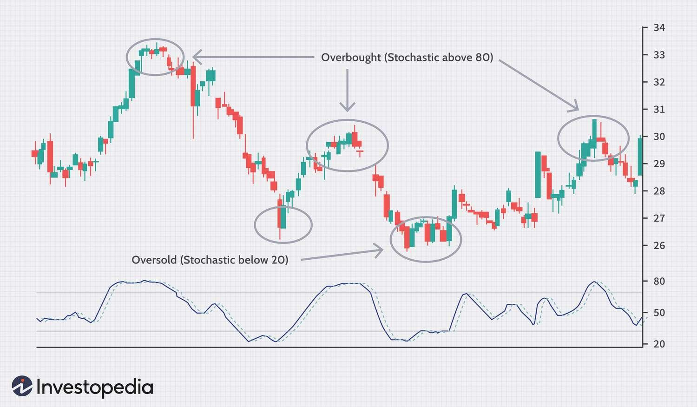

## Table of Contents

## What are technical indicators and why are they important for binary options trading?

Technical indicators are tools used by traders to predict future price movements of an asset based on historical data. They are mathematical calculations that are applied to a chart to help traders make informed decisions about when to buy or sell. In binary options trading, these indicators can help traders identify trends, momentum, and potential reversal points in the market.

Using technical indicators is important for binary options trading because they provide a more objective way to analyze the market. Instead of relying on gut feelings or emotions, traders can use these indicators to make more rational decisions. This can increase the chances of making profitable trades by helping traders spot opportunities that might be missed otherwise. Overall, technical indicators are valuable tools that can enhance a trader's ability to succeed in the fast-paced world of binary options trading.

## How do beginners start using technical indicators in binary options?

Beginners can start using technical indicators in binary options by first choosing a few simple ones to learn. Popular choices for beginners include the Moving Average, Relative Strength Index (RSI), and Bollinger Bands. These indicators are easy to understand and can be found on most trading platforms. Start by adding these indicators to your chart and observe how they move with the price. Take some time to read about each indicator and understand what they are showing you. For example, the Moving Average can help you see the general direction of the price, while the RSI can tell you if an asset is overbought or oversold.

Once you are comfortable with the basics of these indicators, practice using them on a demo account. This allows you to trade without risking real money, which is great for beginners. Try to spot patterns and see how the indicators signal potential buy or sell opportunities. For instance, if the price touches the lower Bollinger Band and the RSI shows the asset is oversold, it might be a good time to consider a "Call" option, expecting the price to rise. Remember, the key is to practice and gain confidence in using these tools before moving to real trading. As you get better, you can start combining different indicators to create your own trading strategy.

## What are the most common technical indicators used in binary options trading?

The most common technical indicators used in binary options trading are the Moving Average, Relative Strength Index (RSI), and Bollinger Bands. The Moving Average helps traders see the general direction of the price by smoothing out the price data over a specific period. It's easy to use and can show if the price is trending up or down. The RSI measures the speed and change of price movements, helping traders know if an asset is overbought or oversold. This can signal when a price might reverse. Bollinger Bands consist of a middle band being a Moving Average and two outer bands that are standard deviations away from the middle band. They help traders see how volatile the price is and can signal potential breakouts or reversals.

These indicators are popular because they are easy to understand and apply to different trading strategies. For example, a trader might use the Moving Average to spot a trend and then use the RSI to confirm if the asset is overbought or oversold before making a trade. Bollinger Bands can help traders see if the price is moving too far from its average, which might mean it's time to buy or sell. By combining these indicators, traders can make more informed decisions and increase their chances of making profitable trades in binary options.

## Can you explain how the Moving Average Convergence Divergence (MACD) indicator works in binary options?

The Moving Average Convergence Divergence (MACD) indicator is a tool that helps traders see the strength and direction of a trend in binary options. It uses two lines: the MACD line and the signal line. The MACD line is created by subtracting the 26-period Exponential Moving Average (EMA) from the 12-period EMA. The signal line is a 9-period EMA of the MACD line. When the MACD line crosses above the signal line, it's a sign that the trend might be getting stronger, and this could be a good time to buy a "Call" option. If the MACD line crosses below the signal line, it might mean the trend is weakening, and it could be a good time to buy a "Put" option.

Another way to use the MACD is to look at the histogram, which shows the difference between the MACD line and the signal line. When the histogram bars are getting taller, it means the trend is getting stronger. When they are getting shorter, the trend might be losing strength. Traders often watch for the histogram to cross above or below the zero line. If it crosses above zero, it's a bullish signal, and if it crosses below zero, it's a bearish signal. By using the MACD, traders can make more informed decisions about when to enter or exit trades in binary options.

## How does the Relative Strength Index (RSI) help in making trading decisions for binary options?

The Relative Strength Index (RSI) helps traders make decisions in binary options by showing if an asset is overbought or oversold. It's a number between 0 and 100. If the RSI goes above 70, it means the asset might be overbought, and the price could go down soon. This might be a good time to buy a "Put" option, expecting the price to fall. On the other hand, if the RSI goes below 30, it means the asset might be oversold, and the price could go up soon. This could be a good time to buy a "Call" option, expecting the price to rise.

Traders also watch for the RSI to move away from these extreme levels. If the RSI was over 70 and starts to move back down, it could mean the price might start to fall. If the RSI was below 30 and starts to move back up, it could mean the price might start to rise. By using the RSI, traders can spot these signals and make better choices about when to trade in binary options.

## What is the Bollinger Bands indicator and how can it be applied to binary options trading?

The Bollinger Bands indicator is a tool used in trading to see how much an asset's price is moving around. It has three lines: the middle line is a moving average, and the other two lines are above and below it. These outer lines are called bands, and they show how far the price can go up or down from the average. When the price goes near the top band, it might mean the price is getting too high and could come back down. When the price goes near the bottom band, it might mean the price is getting too low and could go back up.

In binary options trading, you can use Bollinger Bands to help decide when to buy or sell. If the price touches the bottom band and starts to go up, you might want to buy a "Call" option, thinking the price will keep going up. If the price touches the top band and starts to go down, you might want to buy a "Put" option, thinking the price will keep going down. By watching how the price moves with the Bollinger Bands, you can find good times to make your trades.

## How can traders use the Stochastic Oscillator to predict binary options outcomes?

The Stochastic Oscillator is a tool that helps traders see if a price is going to go up or down. It does this by showing if the price is high or low compared to its recent prices. The Stochastic Oscillator has two lines, called %K and %D, that move between 0 and 100. When these lines go above 80, it means the price might be too high and could go down soon. This could be a good time to buy a "Put" option, thinking the price will fall. When the lines go below 20, it means the price might be too low and could go up soon. This could be a good time to buy a "Call" option, thinking the price will rise.

Traders can also watch for when the %K line crosses over the %D line. If the %K line goes above the %D line and both are below 20, it's a strong signal that the price might start to go up. This is another good time to buy a "Call" option. If the %K line goes below the %D line and both are above 80, it's a strong signal that the price might start to go down. This is a good time to buy a "Put" option. By using the Stochastic Oscillator, traders can make better guesses about what the price will do next and make smarter choices in binary options trading.

## What are some advanced technical indicators and how do they differ from basic ones in binary options?

Advanced technical indicators, like the Ichimoku Cloud and Fibonacci retracement, offer more detailed insights into market trends and potential reversal points compared to basic indicators. The Ichimoku Cloud, for example, uses multiple lines to show support and resistance levels, as well as potential future price movements. It can be a bit complicated because it shows a lot of information at once, but it helps traders see where the price might go next. Fibonacci retracement uses numbers to find levels where the price might stop and turn around. Traders use these levels to guess where the price might go up or down, which can be helpful in deciding when to buy or sell in binary options.

Basic indicators like Moving Averages, RSI, and Bollinger Bands are simpler and easier to understand. They give traders a quick look at the price direction, whether the price is overbought or oversold, and how much the price is moving around. These indicators are good for beginners because they are easy to use and can help make quick trading decisions. The main difference is that advanced indicators give more detailed information and can be more accurate, but they also require more time to learn and understand. Basic indicators are simpler but might not give as much detailed information about the market.

## How can combining multiple technical indicators improve the accuracy of binary options trades?

Combining multiple technical indicators can help traders make better guesses about what the price will do next in binary options trading. When you use more than one indicator, you can see the same thing from different angles. For example, if the Moving Average shows a trend and the RSI shows the price is not overbought or oversold, you can feel more confident about your trade. By looking at different indicators, you can check if they all agree on what might happen next. This can help you avoid making trades based on just one signal that might be wrong.

Using multiple indicators can also help you spot more chances to make trades. One indicator might show a signal that another one misses. For example, the MACD might show a trend change that the Bollinger Bands don't catch. By using both, you can see more opportunities to buy or sell. This can lead to more winning trades because you have a better overall view of the market. But remember, even with multiple indicators, there's no sure way to always win in binary options trading. It's still important to practice and learn how to use these tools well.

## What are the risks of over-relying on technical indicators in binary options trading?

Over-relying on technical indicators in binary options trading can lead to some big problems. One big risk is that you might start to think that these indicators can tell you exactly what the market will do next. But the truth is, no indicator can predict the future perfectly. The market can change because of things that indicators can't see, like news or big events. If you only look at indicators and ignore these other factors, you might make bad trades and lose money.

Another risk is that using too many indicators can make things confusing. When you have a lot of different signals, it can be hard to know which ones to trust. Sometimes, indicators can give you different advice, and this can make you feel unsure about what to do. This confusion can lead to slow decisions or even no decisions at all, which can also hurt your trading. It's important to use indicators as helpful tools, but not to depend on them too much. Always think about the bigger picture and use your own judgment too.

## How can traders backtest technical indicators to optimize their binary options strategy?

Traders can backtest technical indicators to see how well their binary options strategy would have worked in the past. To do this, they need to use a trading platform or software that lets them look at old price data. They pick the indicators they want to use, like Moving Averages or RSI, and apply them to the past data. Then, they see how the indicators would have told them to buy or sell at different times. By comparing these signals to what actually happened to the price, traders can learn if their strategy is good or if it needs changes.

Backtesting helps traders feel more sure about their strategy before they use real money. It's like practicing without any risk. But traders need to remember that past results don't always mean the same thing will happen in the future. The market can change because of new news or events. So, while [backtesting](/wiki/backtesting) is a great tool, traders should also keep learning and adjusting their strategy as they go.

## What are the latest trends and innovations in technical indicators for binary options trading?

The latest trends in technical indicators for binary options trading include the use of [machine learning](/wiki/machine-learning) and [artificial intelligence](/wiki/ai-artificial-intelligence) (AI). These new tools can look at a lot of data very quickly and find patterns that people might miss. They can learn from past trades and get better over time. This can help traders make smarter choices about when to buy or sell. Some trading platforms now offer AI-powered indicators that can give traders signals based on complex data analysis, making it easier for them to follow the market trends.

Another trend is the use of social trading indicators. These tools let traders see what other successful traders are doing and copy their strategies. This can be helpful for beginners who want to learn from experienced traders. Social trading platforms show indicators based on the actions of a group of traders, which can give a good idea of where the market might be going. By using these social trading indicators, traders can feel more confident in their decisions and improve their chances of making profitable trades.

## What is the Importance of Technical Indicators?

Technical indicators are vital tools in binary options trading, providing traders with data-driven insights to make informed decisions. These indicators are essentially mathematical calculations derived from historical price, [volume](/wiki/volume-trading-strategy), or open interest data. By analyzing past market behavior, technical indicators help traders anticipate future price movements, identify trends, and determine potential reversal patterns. They also offer signals for optimal entry and [exit](/wiki/exit-strategy) points, thereby aiding in the development of sound trading strategies.

Several technical indicators are commonly utilized in binary options trading. Among these are moving averages, the Moving Average Convergence Divergence (MACD), Bollinger Bands, the Relative Strength Index (RSI), and stochastics. Each of these indicators serves distinct purposes and offers unique insights into market conditions.

Moving averages, for example, smooth out price data by creating a constantly updated average price, which can help identify the direction of a current trend. They are particularly useful for filtering out the 'noise' from random price fluctuations. The formula for a simple moving average (SMA) can be expressed as:

$$
\text{SMA} = \frac{P_1 + P_2 + \cdots + P_n}{n}
$$

where $P_1, P_2, \ldots, P_n$ are the closing prices over a specified period $n$.

The MACD is another popular indicator that helps traders ascertain [momentum](/wiki/momentum) by comparing two moving averages. It is composed of the MACD line, signal line, and histogram, which signals the difference between the MACD line and the signal line, indicating potential buy or sell signals.

Bollinger Bands provide a range around a moving average where the price typically trades. They adjust dynamically to market [volatility](/wiki/volatility-trading-strategies), expanding during volatile periods and contracting during quieter periods. This feature makes them particularly useful for predicting potential price outbreaks and reversals.

The RSI is a momentum oscillator that measures the speed and change of price movements, ranging from 0 to 100. An RSI below 30 typically indicates an oversold condition, while an RSI above 70 suggests an overbought condition, helping traders make decisions about entry and exit points.

Stochastic oscillators, similar to RSI, compare a particular closing price of a security to a range of its prices over a certain period. The stochastic indicator generates values from 0 to 100, providing signals of overbought or oversold conditions when it crosses certain threshold levels.

Selecting the appropriate technical indicators and accurately interpreting their signals are critical steps for developing effective trading strategies. Traders often use a combination of these indicators to gain comprehensive insights into market dynamics. Understanding how these technical indicators work and integrating their analysis into trading strategies allow traders to enhance their decision-making process and potentially improve trading outcomes in binary options trading.

## References & Further Reading

[1]: Bergstra, J., Bardenet, R., Bengio, Y., & Kégl, B. (2011). ["Algorithms for Hyper-Parameter Optimization."](https://papers.nips.cc/paper/4443-algorithms-for-hyper-parameter-optimization) Advances in Neural Information Processing Systems 24.

[2]: ["Advances in Financial Machine Learning"](https://www.amazon.com/Advances-Financial-Machine-Learning-Marcos/dp/1119482089) by Marcos Lopez de Prado

[3]: ["Evidence-Based Technical Analysis: Applying the Scientific Method and Statistical Inference to Trading Signals"](https://books.google.com/books/about/Evidence_Based_Technical_Analysis.html?id=MeoJAQAAMAAJ) by David Aronson

[4]: ["Machine Learning for Algorithmic Trading"](https://github.com/stefan-jansen/machine-learning-for-trading) by Stefan Jansen

[5]: ["Quantitative Trading: How to Build Your Own Algorithmic Trading Business"](https://www.amazon.com/Quantitative-Trading-Build-Algorithmic-Business/dp/1119800064) by Ernest P. Chan