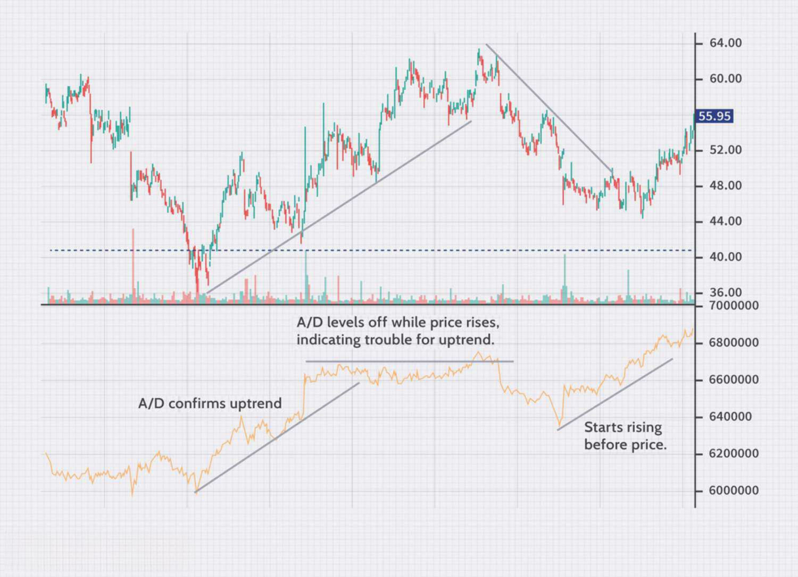

Technical indicators are integral to financial analysis, functioning as vital tools that traders and analysts use to forecast future price movements based on historical data. These indicators provide quantitative insights into market dynamics, enabling traders to identify trends, momentum, volatility, and volume, which are crucial dimensions for informed trading decisions. By distilling vast amounts of historical data into actionable insights, technical indicators help traders anticipate potential price changes, thereby aiding in the development of effective trading strategies.

Algorithmic trading, known as algo trading, has revolutionized financial markets by executing orders with speed and precision, far surpassing the capabilities of human traders. It involves using computer algorithms to automate trading decisions and can analyze multiple market variables to execute trades at optimal times. The growing impact of algo trading can be attributed to its ability to process vast amounts of data swiftly, remove emotional biases from decision-making, and utilize advanced strategies that were previously impractical due to speed and information limitations.



The synergy between technical indicators and algo trading lies in their complementary nature. Technical indicators provide the quantitative framework needed for the algorithms, which, in turn, can amplify and execute these insights at scale. By implementing algorithms that interpret technical indicators, traders can develop automated strategies that identify trading opportunities that align with predefined criteria. This synergy enhances the efficiency and effectiveness of trading practices, leveraging data-driven insights for superior market outcomes.

The purpose of this article is to explore the strategic interplay between technical indicators and algorithmic trading and how this combination can be harnessed to enhance trading success. The structure of the article will follow a logical progression, starting with an understanding of technical indicators and moving through their application in algo trading to offer guidance on creating a robust trading toolkit. It will discuss the advantages of combining these tools and highlight potential challenges, while also forecasting future trends and developments within the field.

Embracing technical indicators in algo trading can significantly enhance trading outcomes by facilitating faster, more accurate, and robust execution of trading strategies. The integration of these tools allows traders to capitalize on market opportunities with increased confidence and reduced risk, ultimately leading to improved trading performance. This article aims to equip traders with the knowledge and insights necessary to leverage these tools effectively, encouraging continuous learning and adaptation in an ever-evolving financial landscape.

## Table of Contents

## Understanding Technical Indicators

Technical indicators are mathematical calculations based on the price, volume, or open interest of a security or contract. These calculations are used by traders to predict future price movements and to identify potential trading opportunities. Technical indicators serve as tools to help traders make more informed decisions by providing insights into market trends, momentum, volatility, and volume dynamics. They are essential components in technical analysis, enabling traders to systematically assess market conditions.

### Types of Technical Indicators

1. **Trend Indicators**: These help in determining the direction and strength of a price trend. Common examples include Moving Averages (MA), Moving Average Convergence Divergence (MACD), and Average Directional Index (ADX). Trend indicators help traders identify whether a market is trending in a particular direction or if it is range-bound.

2. **Momentum Indicators**: Designed to measure the speed or velocity of price movements, these indicators help in identifying the strength of a market trend. Examples include the Relative Strength Index (RSI), Stochastic Oscillator, and Rate of Change (ROC). Momentum indicators are used to determine overbought or oversold conditions and often signal potential reversals.

3. **Volatility Indicators**: These indicators provide information about the degree of price variation over a particular period. Bollinger Bands and Average True Range (ATR) are popular volatility indicators. They are useful in identifying periods of high and low volatility, which can significantly impact the risk and reward of trades.

4. **Volume Indicators**: These assess the strength behind a price movement by analyzing trading volumes. Examples include the On-Balance Volume (OBV) and Volume Weighted Average Price (VWAP). Volume indicators can confirm trends or signal potential reversals by showing the level of interest in a particular trade.

### Importance of Technical Indicators in Identifying Trading Opportunities

Technical indicators provide a systematic approach to market analysis, allowing traders to filter out noise and focus on significant price patterns. By analyzing these indicators, traders can identify entry and [exit](/wiki/exit-strategy) points, recognize the strength or weakness of a trend, and forecast potential market movements. These insights help traders make more calculated decisions, thereby increasing the likelihood of successful trades.

### Historical Perspective and Evolution of Technical Indicators

The concept of using mathematical indicators to analyze market data dates back to the late 19th and early 20th centuries. Early pioneers like Charles Dow, the founder of Dow Theory, laid the groundwork for technical analysis. Over time, with advancements in technology and computational power, the complexity and variety of technical indicators have evolved significantly. Today, a wide array of indicators is available to traders, offering diverse analytical perspectives.

### Limitations and Considerations When Using Technical Indicators

While technical indicators provide valuable insights, they also have limitations. Indicators are derived from historical price data, meaning they are inherently lagging and may not always accurately predict future movements. Moreover, different indicators may provide conflicting signals, leading to potential confusion. Therefore, it is crucial for traders to use a combination of indicators and supplement them with [fundamental analysis](/wiki/fundamental-analysis) to form a more comprehensive market view. Additionally, over-reliance on indicators without understanding their assumptions and limitations can lead to poor trading decisions. Implementing effective risk management strategies and [backtesting](/wiki/backtesting) indicator-driven strategies are essential for mitigating these risks.

## Key Technical Indicators Used in Algo Trading

Technical indicators are essential tools for [algorithmic trading](/wiki/algorithmic-trading), offering quantitative metrics that assist traders in making informed decisions. Among these, Moving Averages, Relative Strength Index (RSI), Moving Average Convergence Divergence (MACD), Bollinger Bands, and Fibonacci Retracement are widely used due to their efficacy in analyzing and forecasting market behavior.

### Moving Averages

Moving Averages (MA) help smooth out price data to identify trends over a specific period. The two primary forms are the Simple Moving Average (SMA) and the Exponential Moving Average (EMA). The SMA calculates the average of prices over a period, while the EMA gives more weight to recent prices, making it more responsive to new information.

**Application**: MAs are commonly used to identify trend direction and to find support and resistance levels. For example, a common strategy is the "Golden Cross," where the short-term MA crosses above a long-term MA, signaling a potential upward trend. The Python code snippet below demonstrates how to calculate the SMA:

```python
def simple_moving_average(prices, window):
    sma = []
    for i in range(len(prices) - window + 1):
        window_avg = sum(prices[i:i + window]) / window
        sma.append(window_avg)
    return sma

prices = [....]  # list of prices
sma = simple_moving_average(prices, 5)
```

### Relative Strength Index (RSI)

The RSI is a [momentum](/wiki/momentum) oscillator that measures the speed and change of price movements, with values ranging from 0 to 100. An RSI above 70 indicates an overbought condition, while below 30 suggests an oversold condition.

**Application**: Traders use RSI to identify potential reversal points. A common tactic involves looking for divergences between RSI and price, where the two move in opposite directions as a signal for a reversal. 

### Moving Average Convergence Divergence (MACD)

MACD demonstrates the relationship between two moving averages of a security’s price, usually the 12-day and 26-day EMAs. The MACD line is the difference between these EMAs, and a nine-day EMA of the MACD, known as the signal line, is plotted on top to act as a trigger for buy or sell signals.

**Application**: Crossovers of the MACD line and the signal line provide buy/sell signals. When the MACD crosses above the signal line, it is considered bullish; when it crosses below, bearish.

### Bollinger Bands

Bollinger Bands consist of a middle band (SMA) and two outer bands (standard deviations above and below the middle band). These bands expand and contract based on market [volatility](/wiki/volatility-trading-strategies).

**Application**: They are employed to identify overbought or oversold conditions. Traders look for price touching the outer bands as a sign of possible reversal but often require confirming evidence before acting.

### Fibonacci Retracement

Fibonacci Retracement uses horizontal lines to indicate possible support and resistance levels based on Fibonacci numbers. It is drawn between two extreme points (e.g., a peak and a trough) and then the key Fibonacci levels are identified.

**Application**: This tool helps in predicting the extent of a market pullback. Traders use Fibonacci levels to determine entry points, stop-loss levels, or price targets. 

### Role of Machine Learning and AI

Machine learning and AI have revolutionized the application of these indicators by enhancing predictive accuracy. Algorithms can analyze vast datasets, identify patterns, and adapt strategies in real-time. For instance, [reinforcement learning](/wiki/reinforcement-learning) can optimize trading strategies by continuously learning from market outcomes.

### Processing Indicator Signals in Algo Trading Systems

Algorithmic trading systems deploy technical indicators to automatically execute trades based on predefined criteria. These systems continuously process real-time market data, applying indicators to generate signals. Once a signal is validated using the trade logic, the system executes buy/sell orders without human intervention. This automated process ensures consistency and precision in trading strategies.

In conclusion, the amalgamation of technical indicators with algorithmic trading provides robust frameworks for market analysis. By leveraging these tools, traders can enhance their ability to predict market trends, optimize trades, and achieve consistent trading performance.

## Building a Finance Trading Toolkit with Technical Indicators

Creating a personalized trading toolkit using technical indicators involves several critical steps designed to enhance trading effectiveness and risk management. This process requires careful consideration of indicator selection, meticulous backtesting, risk management strategies, and leveraging modern software platforms. 

### Steps to Create a Personalized Trading Toolkit Using Technical Indicators

1. **Selection of Indicators:**
   Selecting the right technical indicators is foundational to building a robust trading strategy. Indicators typically fall into categories such as trend (e.g., Moving Averages), momentum (e.g., Relative Strength Index, RSI), volatility (e.g., Bollinger Bands), and [volume](/wiki/volume-trading-strategy) (e.g., On-Balance Volume). When selecting indicators, it's crucial to understand the type of market condition they best identify and ensure they complement each other to avoid redundancy. For instance, combining a trend indicator with a momentum indicator can provide a more comprehensive market analysis.

2. **Factors to Consider When Selecting Indicators:**
   Several factors guide the selection process of technical indicators:
   - **Relevance to Trading Strategy:** Choose indicators that align with your strategic goals, whether it is long-term investing or short-term trading.
   - **Complexity vs. Simplicity:** While complex indicators may offer more nuanced data, simpler indicators are often more reliable and easier to interpret.
   - **Market Type:** Different markets may require different indicators. For example, forex trading might heavily rely on volume-based indicators, whereas equity trading could focus on trend indicators.
   - **Time Frame:** The time horizon of trades can affect indicator selection. Short-term traders might benefit from momentum indicators, while long-term investors might prefer trend-following indicators.

3. **Backtesting and Optimization:**
   Backtesting is critical to evaluate the effectiveness of a trading strategy under historical market conditions. It involves simulating trades based on past data to understand potential performance. Optimization can further refine strategies by adjusting indicator parameters to enhance returns while minimizing risk. For instance, a simple moving average strategy can be backtested across different periods to identify the optimal lookback period. Here's a basic example using Python:

   ```python
   import pandas as pd
   import numpy as np

   # Load historical price data into a DataFrame
   data = pd.read_csv('price_data.csv')
   data['SMA'] = data['Close'].rolling(window=50).mean()

   # Simple backtest logic
   data['Signal'] = 0
   data.loc[data['Close'] > data['SMA'], 'Signal'] = 1  # Buy signal
   data.loc[data['Close'] < data['SMA'], 'Signal'] = -1  # Sell signal

   # Calculating returns
   data['Returns'] = data['Close'].pct_change()
   data['Strategy Returns'] = data['Returns'] * data['Signal'].shift(1)
   total_strategy_return = data['Strategy Returns'].cumsum()[-1]
   ```

4. **Incorporating Risk Management and Position Sizing:**
   Effective risk management is a cornerstone of successful trading. Position sizing determines how much to trade on each signal, typically based on risk tolerance and strategy volatility. A common method is the fixed percentage risk model, where a specific percentage of the capital is risked per trade. Risk management also involves setting stop-loss and take-profit levels to mitigate potential losses and lock in profits.

5. **Leveraging Software and Trading Platforms:**
   Modern trading platforms and software are indispensable for implementing and managing technical indicator-based strategies. Platforms like MetaTrader, TradingView, or Python-based libraries such as pandas, NumPy, and TA-Lib provide the tools needed for analysis and execution. These platforms offer real-time data feeds, backtesting modules, and extensive charting capabilities to facilitate strategy deployment.

By systematically selecting indicators, thoroughly backtesting strategies, incorporating risk management, and utilizing modern software, traders can establish a comprehensive and effective trading toolkit. This approach enhances the ability to make better-informed decisions, leading to potentially improved trading outcomes.

## Advantages of Using Algo Trading with Technical Indicators

Algorithmic trading, often referred to as algo trading, has dramatically transformed the financial landscape. This approach leverages computational power and quantitative methods to execute trades. When integrated with technical indicators, algo trading becomes a powerful tool for enhancing trading outcomes. Here are the key advantages of using algorithmic trading with technical indicators:

### Enhanced Speed and Efficiency in Executing Trades

Algorithmic trading systems execute trades with a speed that is impossible for human traders to achieve. These systems can process market data and make trading decisions in fractions of a second. This speed is crucial in financial markets where price movements happen in milliseconds. By employing algorithms, traders can take advantage of [arbitrage](/wiki/arbitrage) opportunities and execute high-frequency trading strategies that rely on rapid decision-making.

### Minimizing Human Error and Emotional Bias

Human traders are prone to errors and emotional biases, which can lead to suboptimal trading decisions. Emotional factors such as fear and greed often interfere with rational analysis. Algorithmic trading systems operate based on predefined criteria and rules, thus eliminating emotional influence and reducing errors. This objectivity ensures that trading decisions are consistent and aligned with the trader's strategy.

### Ability to Analyze Vast Amounts of Data and Market Conditions

The capacity of algorithmic systems to process vast amounts of data is unparalleled. These systems can analyze complex datasets across multiple financial instruments simultaneously. Algorithms can account for a myriad of variables, such as price movements, trading volumes, and historical data trends, which are essential for making informed trading decisions. This ability enables traders to identify opportunities that would otherwise be overlooked when relying solely on manual analysis.

### Scalability and the Ability to Implement Multiple Strategies

Algo trading systems can efficiently handle multiple trading strategies at various scales. For example, they can manage high-frequency trading and long-term investment strategies concurrently. This scalability allows traders to diversify their portfolios and strategies without a significant increase in overhead. The capability to implement algorithms across different markets and asset classes simultaneously provides a competitive edge in achieving optimized portfolio performance.

### Improved Accuracy in Strategy Execution and Consistency

Algorithmic trading systems execute trades with precision according to the rules and parameters set by the trader. The accuracy of these systems ensures that each trade is executed at the optimal price point within the limits set by the trading plan, reducing slippage and execution errors. Consistency in executing trading strategies minimizes risk and enhances the reliability of the trading process, contributing to more stable and predictable trading outcomes.

In conclusion, the integration of technical indicators into algorithmic trading systems provides significant advantages in speed, efficiency, and accuracy. These benefits, combined with reduced human error and enhanced data processing capabilities, make algo trading an essential approach for modern traders looking to maximize their trading performance and achieve sustainable success.

## Challenges and Risks in Algo Trading

Algorithmic trading has significantly transformed financial markets, offering enhanced efficiency and data-driven decision-making. However, it is important to acknowledge the associated challenges and risks that come with its adoption. This section explores several critical factors traders and firms must consider when engaging in algorithmic trading, ensuring systems are both robust and reliable.

### Potential for Technical Glitches and System Failures

Algorithmic trading platforms are intricate systems reliant on technology. As such, they are susceptible to technical glitches and system failures that can result in severe financial losses. These could be due to hardware malfunctions, software bugs, or connectivity issues, leading to the unintended execution of trades. To mitigate these risks, robust infrastructure and regular maintenance are crucial. Implementing backup systems and redundant networks can provide additional stability and reduce downtime.

### The Risk of Over-Optimization and Curve-Fitting with Technical Indicators

Over-optimization occurs when trading algorithms are excessively tuned to perform well on past data, potentially leading to poor performance in live markets. This phenomenon, known as curve-fitting, can render strategies ineffective under new market conditions. To avoid this, traders should apply cross-validation techniques during the strategy development phase and use out-of-sample data to test the validity of their algorithms. A balanced approach is needed to ensure strategies are neither overly fitted to historical data nor naive to current market dynamics.

```python
from sklearn.model_selection import TimeSeriesSplit
from sklearn.metrics import mean_squared_error

# Example of cross-validation for a time series-based trading strategy
tscv = TimeSeriesSplit(n_splits=5)
for train_index, test_index in tscv.split(prices):
    train, test = prices[train_index], prices[test_index]
    model.fit(train)
    predictions = model.predict(test)
    error = mean_squared_error(test, predictions)
```

### Regulatory and Ethical Considerations in Algo Trading

Regulatory scrutiny in algorithmic trading is increasing as financial markets strive to maintain fairness and transparency. Traders must comply with legal standards to prevent market manipulation and ensure ethical practices. Notably, issues such as spoofing and front-running have highlighted the need for stringent oversight. Firms should adopt compliance frameworks that incorporate both algorithm monitoring and ethical guidelines to align with regulatory requirements.

### Market Changes and the Need for Continuous Strategy Adaptation

Financial markets are dynamic, influenced by economic, political, and social factors. Consequently, algorithmic trading strategies must be adaptable to maintain profitability. It is crucial to incorporate mechanisms that allow algorithms to detect regime shifts and adjust parameters accordingly. This adaptability can be achieved through [machine learning](/wiki/machine-learning) models that update based on new data, ensuring strategies remain relevant.

### The Importance of Monitoring and Managing Algorithmic Trading Systems

Effective monitoring of algorithmic systems is vital to preempt and address potential issues. Real-time analytics and robust risk management protocols can help detect anomalous trading patterns or systemic faults. Traders should implement alert systems and real-time dashboards to facilitate timely interventions when irregularities are detected. Additionally, periodic audits of algorithmic performance and compliance are essential to maintain overall system health.

Overall, while algorithmic trading presents opportunities for enhanced trading performance, it demands diligent attention to associated challenges and risks. Through strategic planning and ongoing management, traders can leverage these systems effectively to achieve their financial goals.

## Future Trends in Algo Trading and Technical Indicators

Algorithmic trading has experienced significant advancements due to emerging technologies and innovations. As we look toward the future, these developments are poised to transform trading strategies and the role technical indicators play within them.

### Emerging Technologies and Innovations

The advent of high-performance computing and distributed computing frameworks is enabling traders to execute complex calculations and data processing tasks more efficiently. Technologies such as cloud computing allow for scalable and cost-effective deployment of algorithmic trading models. Additionally, the rise of quantum computing holds promise for tackling optimization problems at unprecedented scales, though practical applications in finance are still in nascent stages.

### The Role of Big Data and Advanced Analytics

Big data analytics is revolutionizing how traders and algorithms process market information. The ability to analyze vast datasets, including unstructured data from news articles, social media, and financial reports, offers insights into market sentiment and macroeconomic trends that can inform trading decisions. Advanced analytics powered by machine learning algorithms enhance predictive capabilities, allowing for more accurate forecasts and adaptable trading models. These technologies facilitate the synthesis of market indicators, sentiment analysis, and historical data to refine trading strategies.

### Predictions for the Evolution of Technical Indicators and Machine Learning Integration

Machine learning continues to evolve, with [deep learning](/wiki/deep-learning) and reinforcement learning opening new avenues for developing technical indicators. These advanced models can identify complex patterns and correlations in market data that traditional indicators might miss. The integration of these models into trading systems is expected to yield more responsive and adaptive strategies that can cope with dynamic market conditions.

For instance, neural networks can be employed to optimize parameters for traditional indicators like Moving Averages or RSI in a manner that adapts to changing volatility regimes. Here is a simple example of using a [neural network](/wiki/neural-network) in Python to optimize an RSI strategy:

```python
import numpy as np
import pandas as pd
from keras.models import Sequential
from keras.layers import Dense

# Example data
data = np.random.rand(1000, 10)
labels = np.random.randint(2, size=(1000, 1))

# Neural network model
model = Sequential()
model.add(Dense(12, input_dim=10, activation='relu'))
model.add(Dense(8, activation='relu'))
model.add(Dense(1, activation='sigmoid'))

model.compile(loss='binary_crossentropy', optimizer='adam', metrics=['accuracy'])

# Train model
model.fit(data, labels, epochs=150, batch_size=10)

# Predict
predictions = model.predict(data)
```

### Impact of Global Market Trends and Economic Shifts on Algo Trading

Global market trends and economic shifts significantly impact algorithmic trading dynamics. As markets become increasingly interconnected, macroeconomic factors such as [interest rate](/wiki/interest-rate-trading-strategies) changes, geopolitical events, and fiscal policies influence asset prices and trading volumes. Algorithms that are capable of adjusting to these shifts in a timely manner are likely to perform better.

Furthermore, sustainable investing and environmental, social, and governance ([ESG](/wiki/esg-investing)) criteria are gaining prominence, affecting market behavior and the development of new trading strategies. Algo traders are beginning to incorporate ESG factors into their models, leveraging [alternative data](/wiki/best-alternative-data) sources to capture long-term value and comply with regulatory shifts.

### Staying Ahead of Trends and Leveraging New Opportunities

Traders can stay ahead by investing in continuous learning and adopting a flexible approach to strategy development. Embracing new technologies and keeping abreast of regulatory changes is crucial. Engaging with academic research, industry conferences, and collaborating with technology providers can provide insights into emerging trends and innovations.

In conclusion, the future of algorithmic trading lies in the seamless integration of cutting-edge technologies and the ability to adapt to an ever-changing financial landscape. Traders who leverage these advancements can gain a competitive edge and enhance their trading performance.

## Conclusion

Technical indicators play a crucial role in algorithmic trading by offering a means to systematically analyze market data and identify trading opportunities. They serve as the quantitative backbone of many trading strategies, translating price movements into actionable insights. The integration of these indicators within algorithmic frameworks has vastly improved trading efficiency and decision-making accuracy, underscoring their importance to traders who seek a competitive edge.

Developing a robust trading toolkit that effectively employs technical indicators necessitates a comprehensive approach. It involves selecting a diverse set of indicators that complement each other, optimizing strategies through rigorous backtesting, and incorporating risk management practices to safeguard against losses. Crafting such a toolkit allows traders to adapt to various market conditions, thereby enhancing resilience and flexibility.

Traders must embrace continuous learning and adaptation to keep pace with evolving markets. The dynamic nature of financial markets demands that trading strategies are regularly updated and refined. This includes staying informed about new indicators, technological advancements in trading platforms, and enhancements in algorithmic capabilities. By fostering a mindset oriented towards education and adaptation, traders can maintain their relevance and efficacy in the market.

Leveraging technical indicators within algorithmic trading frameworks offers a pathway to more informed trading decisions and improved performance. Traders are encouraged to harness the power of these tools, not only to enhance their current trading strategies but also to explore new opportunities that arise as market conditions change. Through diligent application and innovation, technical indicators can significantly contribute to trading success.

For traders keen to deepen their understanding of technical indicators and algorithmic trading, several resources and further reading materials are recommended. These include "Technical Analysis of the Financial Markets" by John J. Murphy for a foundational grasp, "Algorithmic Trading: Winning Strategies and Their Rationale" by Ernie Chan for strategic insights, and exploring platforms like QuantConnect or QuantInsti for practical, hands-on experience with trading algorithms. Maintaining an active engagement with current research and emerging technologies will further empower traders to leverage technical indicators effectively.

## References & Further Reading

[1]: Murphy, J. J. (1999). ["Technical Analysis of the Financial Markets: A Comprehensive Guide to Trading Methods and Applications."](https://archive.org/details/technicalanalysi0000murp) New York Institute of Finance.

[2]: Chan, Ernest P. (2009). ["Quantitative Trading: How to Build Your Own Algorithmic Trading Business."](https://github.com/ftvision/quant_trading_echan_book) John Wiley & Sons.

[3]: Jansen, Stefan. (2020). ["Machine Learning for Algorithmic Trading: Predictive models to extract signals from market and alternative data for systematic trading strategies with Python."](https://www.amazon.com/Machine-Learning-Algorithmic-Trading-alternative/dp/1839217715) Packt Publishing.

[4]: Aronson, David R. (2006). ["Evidence-Based Technical Analysis: Applying the Scientific Method and Statistical Inference to Trading Signals."](https://onlinelibrary.wiley.com/doi/book/10.1002/9781118268315) John Wiley & Sons.

[5]: Lopez de Prado, Marcos. (2018). ["Advances in Financial Machine Learning."](https://www.amazon.com/Advances-Financial-Machine-Learning-Marcos/dp/1119482089) John Wiley & Sons.

[6]: Easley, D., López de Prado, M. M., & O'Hara, M. (2012). ["The Volume Clock: Insights into the High Frequency Paradigm."](https://papers.ssrn.com/sol3/papers.cfm?abstract_id=2034858) The Journal of Portfolio Management.

[7]: Tsang, L., & Halgamuge, S. K. (2010). ["Improving financial trading decisions using technical analysis and machine learning algorithms."](https://www.sciencedirect.com/science/article/pii/S2210650224003018) 2010 International Conference on Machine Learning and Cybernetics.