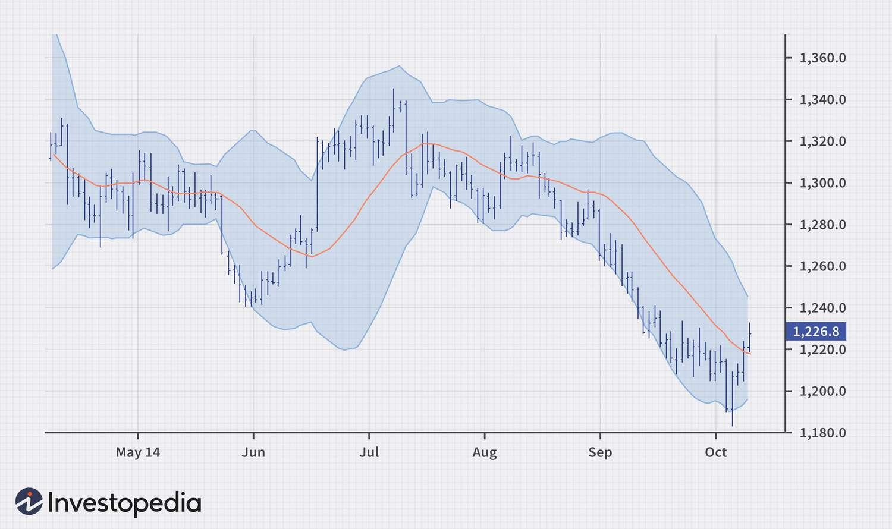

## Table of Contents

## What are technical indicators and why are they important in commodity investing?

Technical indicators are tools used by traders and investors to predict future price movements of commodities based on historical data. They help in analyzing market trends, momentum, and patterns by using mathematical calculations on price, volume, or open interest data. Common technical indicators include moving averages, relative strength index (RSI), and Bollinger Bands. These indicators can be applied to charts to help traders make more informed decisions about when to buy or sell a commodity.

Technical indicators are important in commodity investing because they provide a way to make sense of the often chaotic price movements in commodity markets. By using these indicators, investors can identify potential entry and exit points for their trades, which can help in managing risk and maximizing returns. For example, if a moving average crossover suggests an upward trend, an investor might decide to buy a commodity, anticipating that its price will continue to rise. This systematic approach to analyzing market data can help investors make more objective decisions, rather than relying on gut feelings or market rumors.

## How do beginners identify basic trends using technical indicators in commodity markets?

Beginners can start identifying basic trends in commodity markets by using a simple technical indicator called the moving average. A moving average smooths out price data to create a single flowing line, which makes it easier to spot trends. To use it, you can plot a moving average on a commodity price chart. If the price of the commodity stays above the moving average line, it suggests an uptrend, meaning the price is generally going up. If the price stays below the moving average, it indicates a downtrend, meaning the price is generally going down.

Another useful indicator for beginners is the Relative Strength Index (RSI). The RSI measures the speed and change of price movements and helps identify if a commodity is overbought or oversold. The RSI is shown on a scale from 0 to 100. If the RSI is above 70, it suggests the commodity might be overbought and could soon see a price drop. If it's below 30, it indicates the commodity might be oversold and could soon see a price increase. By watching these levels, beginners can get a sense of when to buy or sell based on the momentum of the commodity's price.

## What are the most common technical indicators used by commodity investors?

Commodity investors often use moving averages to help them see trends in the market. A moving average is just a line on a chart that shows the average price of a commodity over a certain number of days. If the price of the commodity is above this line, it usually means the price is going up, which is called an uptrend. If the price is below the line, it usually means the price is going down, which is a downtrend. Many investors use two moving averages, one short-term and one long-term, and watch for when they cross over each other. This crossover can signal that a trend is starting or ending.

Another common indicator is the Relative Strength Index, or RSI. The RSI helps investors see if a commodity's price is moving too fast in one direction. It's shown as a number between 0 and 100. If the RSI is over 70, it means the commodity might be overbought, and the price could go down soon. If the RSI is under 30, it means the commodity might be oversold, and the price could go up soon. By watching the RSI, investors can try to buy low and sell high.

A third popular indicator is Bollinger Bands. These are lines drawn above and below the moving average of a commodity's price. The top line is usually two standard deviations above the moving average, and the bottom line is two standard deviations below. When the price of the commodity gets close to the top band, it might be a good time to sell because the price could be too high. When the price gets close to the bottom band, it might be a good time to buy because the price could be too low. Bollinger Bands help investors see how much the price is moving around and when it might be a good time to make a trade.

## Can you explain how to use Moving Averages in commodity investing?

Moving averages are a simple but powerful tool that commodity investors use to see trends in the market. A moving average is just a line on a chart that shows the average price of a commodity over a certain number of days. If you want to use a moving average, you pick a time period, like 50 days or 200 days. The 50-day moving average is shorter and reacts quicker to price changes, while the 200-day moving average is longer and shows bigger trends. When you plot these lines on a chart, you can see if the price of the commodity is above or below the moving average. If the price is above the moving average, it means the price is going up, which is called an uptrend. If the price is below the moving average, it means the price is going down, which is a downtrend.

Many investors use two moving averages together to get more information. They watch for a special moment called a crossover, where the shorter moving average (like the 50-day) crosses over the longer moving average (like the 200-day). When the shorter moving average crosses above the longer one, it's called a golden cross, and it can be a signal to buy because it suggests the start of an uptrend. When the shorter moving average crosses below the longer one, it's called a death cross, and it can be a signal to sell because it suggests the start of a downtrend. By using moving averages this way, investors can make better decisions about when to buy or sell commodities based on clear signals from the market.

## What is the Relative Strength Index (RSI) and how is it applied in commodity trading?

The Relative Strength Index (RSI) is a tool that commodity traders use to see if a commodity's price is moving too fast in one direction. It's shown as a number between 0 and 100. When the RSI is over 70, it means the commodity might be overbought, which means the price has gone up a lot and might soon go down. When the RSI is under 30, it means the commodity might be oversold, which means the price has gone down a lot and might soon go up. By looking at the RSI, traders can try to buy low and sell high.

In commodity trading, traders use the RSI to help them decide when to make trades. If the RSI is above 70 and the price of the commodity starts to drop, a trader might decide to sell because it looks like the price might keep going down. If the RSI is below 30 and the price starts to go up, a trader might decide to buy because it looks like the price might keep going up. The RSI helps traders see the momentum of the price, so they can make better decisions about when to buy or sell commodities.

## How can the Moving Average Convergence Divergence (MACD) help in making commodity investment decisions?

The Moving Average Convergence Divergence (MACD) is a tool that commodity investors use to see if the price of a commodity is going up or down. It uses two lines: the MACD line and the signal line. The MACD line is made by taking the difference between a short-term moving average (like 12 days) and a long-term moving average (like 26 days). The signal line is a moving average of the MACD line, usually over 9 days. When the MACD line crosses above the signal line, it's a sign that the price might keep going up, and it could be a good time to buy. When the MACD line crosses below the signal line, it's a sign that the price might keep going down, and it could be a good time to sell.

Another way to use the MACD is to look at the histogram, which is a bar chart that shows the difference between the MACD line and the signal line. If the histogram bars are getting bigger, it means the difference between the two lines is growing, which can show that the price is moving faster in one direction. If the bars are getting smaller, it means the difference is shrinking, which can show that the price might be slowing down or getting ready to change direction. By watching the MACD and its histogram, investors can get a better idea of when to buy or sell commodities based on the momentum of the price.

## What role do Bollinger Bands play in analyzing commodity price volatility?

Bollinger Bands are a tool that commodity investors use to see how much the price of a commodity is moving around. They are made of three lines on a chart: a middle line, which is the moving average of the price, and two outer lines that are usually two standard deviations away from the middle line. When the price of a commodity is moving a lot, the outer lines will be far apart. When the price is not moving much, the outer lines will be close together. By looking at how far apart the lines are, investors can see if the commodity's price is very volatile or not.

Investors use Bollinger Bands to help them make decisions about buying and selling commodities. If the price of a commodity gets close to the top band, it might mean the price is too high and could go down soon. This could be a good time to sell. If the price gets close to the bottom band, it might mean the price is too low and could go up soon. This could be a good time to buy. By watching where the price is in relation to the Bollinger Bands, investors can get a better idea of when to make trades based on the volatility of the commodity's price.

## How do experienced investors use Fibonacci retracement levels in commodity markets?

Experienced investors use Fibonacci retracement levels to find possible points where the price of a commodity might stop going down and start going up again, or stop going up and start going down. They draw lines on a chart from the lowest price to the highest price of a commodity over a certain time. These lines show different levels, like 23.6%, 38.2%, 50%, 61.8%, and 78.6%, which are based on a special math pattern called the Fibonacci sequence. When the price of a commodity gets to one of these levels, it might stop moving and change direction. Investors watch these levels to decide when to buy or sell.

Investors also use Fibonacci retracement levels to set their goals for how much they think the price of a commodity will go up or down. If the price of a commodity goes up and then starts to go down again, investors look at the Fibonacci levels to see where the price might stop going down. They might decide to buy the commodity at one of these levels if they think the price will go back up. On the other hand, if the price goes down and then starts to go up again, investors might sell at a Fibonacci level if they think the price will go back down. By using these levels, experienced investors can make better decisions about when to enter and exit the market.

## Can you describe the application of the Commodity Channel Index (CCI) in trading?

The Commodity Channel Index (CCI) is a tool that traders use to see if a commodity's price is moving too far away from its average price. It's shown as a line on a chart that goes up and down. When the CCI line goes above +100, it means the price might be too high and could go down soon. When the CCI line goes below -100, it means the price might be too low and could go up soon. Traders use these levels to decide when to buy or sell commodities. If the CCI is above +100 and starts to go down, a trader might sell because it looks like the price might keep going down. If the CCI is below -100 and starts to go up, a trader might buy because it looks like the price might keep going up.

Traders also use the CCI to see if the price of a commodity is getting ready to change direction. They look for something called a divergence, which happens when the price of the commodity and the CCI line are moving in different directions. For example, if the price of a commodity is going up but the CCI line is going down, it might mean the price is about to start going down too. By watching for these divergences, traders can get a better idea of when the price might change direction and make better decisions about when to buy or sell commodities.

## What are some advanced technical indicators used specifically for commodity futures?

Advanced technical indicators for commodity futures include the Average Directional Index (ADI) and the Parabolic SAR. The ADI helps traders see how strong a trend is in the market. It has two lines: the ADI line and the DI line. When the ADI line is above 25, it means there is a strong trend, and traders can use this to decide if they should buy or sell. If the ADI line is below 20, it means the market is not moving much, and it might be a good time to wait before making a trade. The DI line helps traders see if the trend is going up or down. If the positive DI line is above the negative DI line, it means the trend is going up, and traders might want to buy. If the negative DI line is above the positive DI line, it means the trend is going down, and traders might want to sell.

Another advanced indicator is the Parabolic SAR, which helps traders see when a trend might change direction. It puts dots on a chart above or below the price of a commodity. When the dots are below the price, it means the trend is going up, and traders might want to buy. When the dots are above the price, it means the trend is going down, and traders might want to sell. The Parabolic SAR can help traders see when to get into or out of a trade based on the direction of the trend. By using these advanced indicators, traders can get a better idea of the strength and direction of trends in the commodity futures market, helping them make more informed decisions about when to buy or sell.

## How can investors combine multiple technical indicators to enhance their commodity trading strategy?

Investors can combine multiple technical indicators to get a better picture of what's happening in the commodity markets. By using different indicators together, they can check if the signals they're seeing are strong and reliable. For example, an investor might use the Moving Average Convergence Divergence (MACD) to see the momentum of a commodity's price and the Relative Strength Index (RSI) to see if the commodity is overbought or oversold. If the MACD shows a bullish crossover (the MACD line crossing above the signal line) and the RSI is below 30, it could be a strong signal to buy because both indicators are suggesting that the price might go up.

Another way to combine indicators is to use them to confirm trends and reversals. An investor might use a moving average to see the general trend of a commodity's price and Bollinger Bands to see how much the price is moving around. If the price is above the moving average and close to the top Bollinger Band, it could mean the price is high and might go down soon. But if the price is also showing a bearish MACD crossover (the MACD line crossing below the signal line), it adds more evidence that it might be a good time to sell. By looking at multiple indicators, investors can make more confident decisions about when to buy or sell commodities.

## What are the limitations and potential pitfalls of relying on technical indicators in commodity investing?

Technical indicators can help investors see trends and make decisions, but they have some limitations. One big problem is that they are based on past data, so they can't always predict what will happen in the future. This means that even if an indicator says to buy or sell, the price of a commodity might not do what the indicator suggests. Also, different indicators can give different signals at the same time, which can make it hard for investors to know what to do. This is called conflicting signals, and it can lead to confusion and bad decisions.

Another issue with technical indicators is that they can sometimes make investors think they see patterns that aren't really there. This is called over-optimization, where investors tweak the indicators too much to fit past data, but then the indicators don't work well with new data. Also, because many investors use the same popular indicators, the market can sometimes move in a way that everyone expects, which can lead to sudden changes when everyone tries to buy or sell at the same time. This is called a self-fulfilling prophecy, and it can make the market more unpredictable. So, while technical indicators can be useful, investors should be careful and use them along with other information to make the best decisions.

## What is an Overview of Technical Indicators?

Technical indicators are quantitative tools used in finance to analyze historical price data and forecast future market trends. These indicators offer insights into price movements and market sentiment by deriving metrics from past price, volume, and open interest data. Investors and traders employ these indicators to make informed decisions by identifying potential buy or sell signals and understanding market momentum.

One of the most commonly used technical indicators is the moving average (MA). A moving average smooths out price data by creating a constantly updated average price. The most widely used types are the simple moving average (SMA) and the exponential moving average (EMA). The formula for the simple moving average for a given period $n$ is:

$$
SMA = \frac{\sum_{i=1}^{n} P_i}{n}
$$

where $P_i$ represents the price at time $i$. The moving average helps filter out 'noise' from random price fluctuations and is useful for identifying underlying trends.

Another significant technical indicator is the Relative Strength Index (RSI). The RSI measures the magnitude of recent price changes to assess overbought or oversold conditions. It is calculated using the formula:

$$
RSI = 100 - \frac{100}{1 + RS}
$$

where $RS$ is the average of $n$ days' up closes divided by the average of $n$ days' down closes. The RSI value ranges between 0 and 100, with typical overbought and oversold conditions occurring above 70 and below 30, respectively.

The Moving Average Convergence Divergence (MACD) is another popular technical indicator used to determine the momentum of a stock. It is calculated by subtracting the 26-period EMA from the 12-period EMA. A signal line, often a 9-day EMA of the MACD, is then plotted on top of the MACD to act as a trigger for buy and sell signals.

The primary significance of these technical indicators lies in their ability to identify buy and sell signals and confirm market momentum. For instance, moving averages are useful for identifying trend direction, with a cross of shorter moving averages above longer ones indicating upward momentum. RSI can signal potential reversals at extreme values, suggesting possible buying opportunities when oversold or selling opportunities when overbought.

However, relying solely on technical indicators comes with significant limitations and challenges. Technical indicators are reactive rather than predictive; they base their analysis on historical data, which may not fully account for future market conditions or sudden economic changes. These indicators can produce false signals during periods of non-trending or volatile markets, leading to potential losses. Furthermore, over-reliance on indicators can result in ignoring broader market fundamentals and external influences such as geopolitical events or macroeconomic factors.

While technical indicators offer valuable insights into market trends and potential entry and [exit](/wiki/exit-strategy) points, they should be employed as part of a comprehensive investment strategy that also considers fundamental analysis and market conditions to enhance decision-making processes.

## References & Further Reading

[1]: Bergstra, J., Bardenet, R., Bengio, Y., & Kégl, B. (2011). ["Algorithms for Hyper-Parameter Optimization."](https://dl.acm.org/doi/10.5555/2986459.2986743) Advances in Neural Information Processing Systems 24.

[2]: ["Advances in Financial Machine Learning"](https://www.amazon.com/Advances-Financial-Machine-Learning-Marcos/dp/1119482089) by Marcos Lopez de Prado

[3]: ["Evidence-Based Technical Analysis: Applying the Scientific Method and Statistical Inference to Trading Signals"](https://www.amazon.com/Evidence-Based-Technical-Analysis-Scientific-Statistical/dp/0470008741) by David Aronson

[4]: ["Machine Learning for Algorithmic Trading"](https://github.com/PacktPublishing/Machine-Learning-for-Algorithmic-Trading-Second-Edition) by Stefan Jansen

[5]: ["Quantitative Trading: How to Build Your Own Algorithmic Trading Business"](https://books.google.com/books/about/Quantitative_Trading.html?id=j70yEAAAQBAJ) by Ernest P. Chan