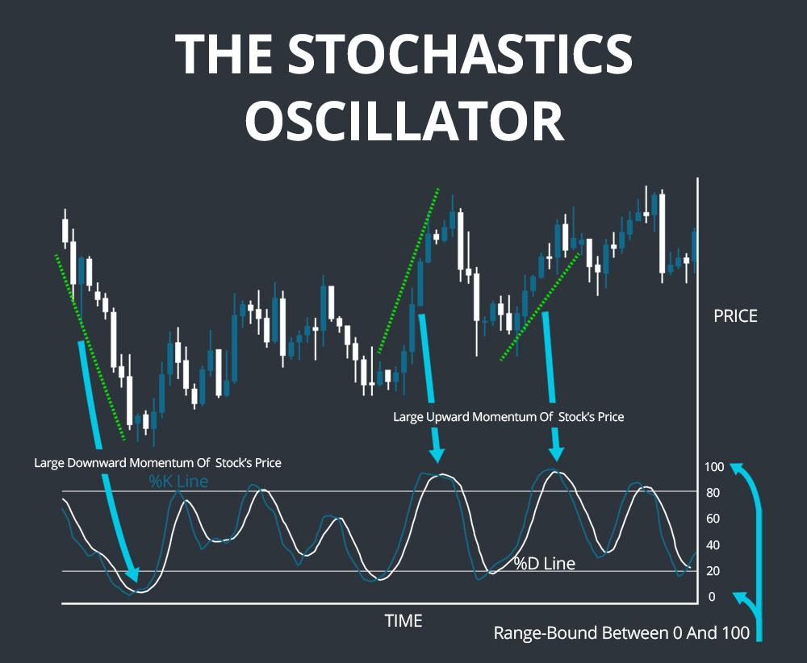

## Table of Contents

## What is a stochastic oscillator and how does it work?

A stochastic oscillator is a tool used in trading to predict when a stock or other asset might change direction. It compares the closing price of a security to its price range over a certain period of time, usually 14 days. The idea is that as prices go up, the closing prices tend to be near the top of the recent price range. When prices start to fall, the closing prices move closer to the bottom of the range. By measuring where the closing price sits within this range, the stochastic oscillator can signal if a stock is overbought or oversold.

The stochastic oscillator works by generating two lines, called %K and %D, which move between 0 and 100. When these lines are above 80, it suggests that the security might be overbought and could soon drop in price. When the lines are below 20, it indicates that the security might be oversold and could soon rise. Traders often look for when these lines cross over each other as a signal to buy or sell. For example, if %K crosses above %D when both are below 20, it might be a good time to buy. If %K crosses below %D when both are above 80, it might be a good time to sell. This helps traders make decisions based on potential price movements.

## What are technical indicators and why are they used in trading?

Technical indicators are tools that traders use to help them make decisions about buying and selling stocks, currencies, or other financial assets. They are based on math and use past price and volume data to predict what might happen next. There are many different kinds of technical indicators, and each one looks at the market in a slightly different way. Some common ones include moving averages, the Relative Strength Index (RSI), and the Moving Average Convergence Divergence (MACD).

Traders use technical indicators because they can help spot trends and patterns that might not be easy to see just by looking at a price chart. For example, a moving average can smooth out price data to show a clearer trend, while the RSI can tell if a stock is overbought or oversold. By using these indicators, traders hope to make better decisions and increase their chances of making a profit. However, it's important to remember that no indicator is perfect, and they should be used along with other tools and analysis.

## How can technical indicators complement the stochastic oscillator?

Technical indicators can help the stochastic oscillator by giving more information about the market. For example, the Moving Average Convergence Divergence (MACD) can show when the trend of a stock is changing. If the MACD line crosses above the signal line, it might mean the trend is getting stronger. Using this with the stochastic oscillator can help traders see if the trend is strong and if the price might keep going up or down. This way, they can make better choices about when to buy or sell.

Another useful indicator is the Relative Strength Index (RSI). The RSI also tells if a stock is overbought or oversold, just like the stochastic oscillator. But, the RSI looks at the speed of price changes instead of where the closing price is in the range. By using both the RSI and the stochastic oscillator, traders can get a better idea of the market's strength. If both indicators show that a stock is overbought or oversold at the same time, it can give a stronger signal to act. This can help traders feel more confident in their decisions.

## What are some common technical indicators used alongside the stochastic oscillator?

Some common technical indicators used with the stochastic oscillator are the Moving Average Convergence Divergence (MACD) and the Relative Strength Index (RSI). The MACD helps traders see if a stock's trend is getting stronger or weaker. It does this by looking at the difference between two moving averages. When the MACD line crosses above the signal line, it might mean the trend is getting stronger. Traders can use this information along with the stochastic oscillator to see if the trend matches what the oscillator is showing. If both are pointing in the same direction, it can give a stronger signal to buy or sell.

The Relative Strength Index (RSI) is another helpful indicator. It tells traders if a stock is overbought or oversold by looking at how fast the price is changing. When the RSI is above 70, it means the stock might be overbought and could soon go down. When it's below 30, it means the stock might be oversold and could go up. Using the RSI with the stochastic oscillator can give traders a clearer picture. If both indicators show that a stock is overbought or oversold at the same time, it can make the signal stronger and help traders decide what to do next.

## How does the Moving Average Convergence Divergence (MACD) enhance the signals from the stochastic oscillator?

The Moving Average Convergence Divergence (MACD) can make the signals from the stochastic oscillator more reliable by showing the strength and direction of a stock's trend. The MACD looks at the difference between two moving averages, which helps traders see if the trend is getting stronger or weaker. When the MACD line crosses above the signal line, it suggests that the trend is gaining strength. By using this information along with the stochastic oscillator, traders can see if the trend matches what the oscillator is showing. If both indicators are pointing in the same direction, it gives a stronger signal to buy or sell, making traders more confident in their decisions.

For example, if the stochastic oscillator shows that a stock is overbought and the MACD line is moving away from the signal line, it could mean that the upward trend is strong and the stock might keep going up for a while. On the other hand, if the stochastic oscillator shows that a stock is oversold and the MACD line is crossing below the signal line, it could mean that the downward trend is getting stronger and the stock might keep falling. By combining these two indicators, traders can get a clearer picture of what might happen next and make better trading choices.

## Can the Relative Strength Index (RSI) be used effectively with the stochastic oscillator, and if so, how?

Yes, the Relative Strength Index (RSI) can be used effectively with the stochastic oscillator. The RSI and the stochastic oscillator both help traders see if a stock is overbought or oversold, but they do it in different ways. The RSI looks at how fast the price is changing. When the RSI is above 70, it means the stock might be overbought and could soon go down. When it's below 30, it means the stock might be oversold and could go up. The stochastic oscillator, on the other hand, compares the closing price to the price range over a certain time. If it's above 80, the stock might be overbought, and if it's below 20, it might be oversold.

Using both the RSI and the stochastic oscillator together can give traders a stronger signal. If both indicators show that a stock is overbought or oversold at the same time, it can make traders more confident in their decision to buy or sell. For example, if the RSI is above 70 and the stochastic oscillator is also above 80, it's a strong sign that the stock might be due for a price drop. If the RSI is below 30 and the stochastic oscillator is below 20, it's a strong sign that the stock might be ready for a price increase. By looking at both indicators, traders can get a clearer picture of the market and make better trading choices.

## What role does the Bollinger Bands play when used in conjunction with the stochastic oscillator?

Bollinger Bands can help traders by showing how much a stock's price is moving up and down. They are made of three lines: the middle line is a moving average, and the other two lines are set above and below it. These upper and lower lines change based on how much the price is moving. When used with the stochastic oscillator, Bollinger Bands can give more information about when a stock might be overbought or oversold. If the price touches the upper Bollinger Band and the stochastic oscillator is above 80, it might mean the stock is overbought and could go down soon. If the price touches the lower Bollinger Band and the stochastic oscillator is below 20, it might mean the stock is oversold and could go up soon.

Using Bollinger Bands with the stochastic oscillator can help traders see if the market is getting ready for a big move. When the price is near the upper or lower Bollinger Band and the stochastic oscillator is also showing overbought or oversold conditions, it can be a strong signal. This can help traders decide when to buy or sell. For example, if the price is at the lower Bollinger Band and the stochastic oscillator is below 20, it might be a good time to buy because the price could start going up. If the price is at the upper Bollinger Band and the stochastic oscillator is above 80, it might be a good time to sell because the price could start going down.

## How can traders use volume-based indicators like the On-Balance Volume (OBV) to confirm stochastic oscillator signals?

Traders can use volume-based indicators like the On-Balance Volume (OBV) to make the signals from the stochastic oscillator more reliable. The OBV looks at how much of a stock is being bought and sold. If the OBV is going up, it means more people are buying the stock, which can mean the price might keep going up. If the OBV is going down, it means more people are selling the stock, which can mean the price might keep going down. When traders see that the stochastic oscillator is showing a stock is overbought or oversold, they can check the OBV to see if the volume matches what the oscillator is saying. If the stochastic oscillator shows a stock is overbought and the OBV is also going up, it's a stronger sign that the price might keep going up for a bit.

For example, if the stochastic oscillator shows that a stock is oversold and the OBV is also going down, it can mean that the price might keep falling. But if the stochastic oscillator shows the stock is oversold and the OBV is going up, it might mean that the price could start going up soon because more people are buying the stock even though it's at a low price. By using the OBV with the stochastic oscillator, traders can get a better idea of what might happen next and make smarter choices about when to buy or sell.

## What are the advantages of using multiple technical indicators with the stochastic oscillator?

Using multiple technical indicators with the stochastic oscillator can make trading decisions more reliable. The stochastic oscillator alone tells traders when a stock might be overbought or oversold by comparing the closing price to the price range over a certain time. But, it can give false signals sometimes. By adding other indicators like the Moving Average Convergence Divergence (MACD), Relative Strength Index (RSI), Bollinger Bands, or On-Balance Volume (OBV), traders can see if the market trend, speed of price changes, price volatility, and trading volume all match what the stochastic oscillator is showing. If all these indicators agree, it makes the signal stronger and helps traders feel more confident about their decisions.

For example, if the stochastic oscillator shows a stock is overbought and the MACD also shows a strong upward trend, it's a good sign that the price might keep going up. If the RSI also says the stock is overbought, and the Bollinger Bands show the price is at the upper band, it's an even stronger signal. Adding the OBV can show if the volume supports this trend. When all these indicators point in the same direction, it reduces the chance of making a wrong move. This way, traders can use the extra information from other indicators to check the stochastic oscillator's signals and make better choices about when to buy or sell.

## How should a trader interpret divergences between the stochastic oscillator and other technical indicators?

When the stochastic oscillator and other technical indicators like the MACD, RSI, or Bollinger Bands show different things, it's called a divergence. This can be confusing for traders, but it can also be a good sign that something important is happening with the price. If the stochastic oscillator shows a stock is overbought but the MACD is still going up, it might mean the price could keep going up for a while, even though it seems high. On the other hand, if the stochastic oscillator says a stock is oversold but the RSI is not going down, it might mean the price could keep falling.

Traders need to be careful when they see divergences because they can mean different things. Sometimes, a divergence can be a warning that the price is about to change direction. For example, if the stochastic oscillator is going up but the price is going down, it might mean the price could start going up soon. But, traders should not just look at one divergence. They should check other indicators and see if they agree or disagree. If more indicators show the same kind of divergence, it can make the signal stronger and help traders decide what to do next.

## What are the potential pitfalls of over-relying on the stochastic oscillator and other technical indicators?

Over-relying on the stochastic oscillator and other technical indicators can lead to some problems. One big issue is that these indicators can give false signals. This means they might tell you to buy or sell a stock, but the price doesn't do what you expect. For example, the stochastic oscillator might say a stock is overbought, but the price keeps going up. If you only use the stochastic oscillator, you might miss out on more gains or sell too early. Also, these indicators are based on past data, so they can't predict the future perfectly. The market can change quickly because of news or other events that the indicators don't see coming.

Another problem is that using too many indicators can make things confusing. If you look at the stochastic oscillator, MACD, RSI, and Bollinger Bands all at once, it can be hard to know which one to trust. Sometimes, these indicators might give different signals, and it can be tough to decide what to do. This can lead to hesitation or making the wrong choice. It's important to use these tools as part of a bigger plan, not the only thing you look at. Traders should also think about other things like the overall market trend, news, and their own trading goals to make the best decisions.

## How can advanced traders customize the settings of the stochastic oscillator and other indicators for better performance?

Advanced traders can change the settings of the stochastic oscillator to make it work better for them. The standard setting for the stochastic oscillator is 14 periods, but traders can make this number bigger or smaller. If they use a smaller number, like 5 or 10 periods, the oscillator will be more sensitive and give signals faster. This can be good if you want to catch quick changes in the market, but it might also give more false signals. If traders use a bigger number, like 20 or 30 periods, the oscillator will be less sensitive and give signals more slowly. This can help avoid false signals, but it might make you miss out on quick moves in the price. Traders can also change how the %K and %D lines are calculated to make the oscillator fit their trading style better.

Traders can also customize other indicators like the MACD, RSI, and Bollinger Bands to work better with the stochastic oscillator. For the MACD, traders can change the length of the moving averages used to calculate it. Shorter periods will make the MACD react faster, while longer periods will make it smoother and less likely to give false signals. With the RSI, traders can change the number of periods it uses, just like with the stochastic oscillator. A shorter period will make the RSI more sensitive, while a longer period will make it smoother. For Bollinger Bands, traders can change the length of the moving average and how wide the bands are. A shorter moving average will make the bands react faster, and wider bands will show bigger price moves. By adjusting these settings, traders can make all these indicators work together better and match their trading goals.

## What is the Stochastic Oscillator and how does it work?

The stochastic oscillator, conceived by Dr. George Lane in the late 1950s, is a pivotal tool in technical analysis, serving as a momentum indicator. Its primary function is to compare a particular closing price of a financial asset to its price range over a specified period, typically 14 days. This comparison aids in determining whether the asset is overbought or oversold, providing insight into potential market movements.

The stochastic oscillator consists of two main components, the %K line and the %D line. The %K line is reflective of the current market momentum and is calculated using the formula:

$$
\%K = \frac{\text{Current Close} - \text{Lowest Low}}{\text{Highest High} - \text{Lowest Low}} \times 100
$$

where "Current Close" is the most recent closing price, "Lowest Low" is the lowest price in the last 14 days, and "Highest High" is the highest price during the same period.

The %D line, on the other hand, is a simple moving average of the %K line, usually calculated over three periods. This line serves as a trigger line, providing smoother signals and helping traders confirm potential buy or sell signals derived from the crossing of these two lines.

Operating within a range of 0 to 100, the stochastic oscillator defines certain levels to identify market conditions: values over 80 are considered to indicate an overbought condition, while values below 20 suggest an oversold condition. These thresholds enable traders to make educated predictions concerning potential trend reversals and market corrections, guiding their strategic entry and [exit](/wiki/exit-strategy) decisions in the market. 

By utilizing these calculated levels, traders can anticipate points where market [momentum](/wiki/momentum) might signal a reversal, thus optimizing their trading outcomes. However, it is crucial to note that while the stochastic oscillator can highlight possible trend changes, it should be used in conjunction with other indicators to validate signals and ensure robust trading strategies.

## How does the Stochastic Oscillator work?

The stochastic oscillator is a technical momentum indicator used in financial trading to identify potential buy or sell signals by analyzing recent price movements. It functions on the principle that closing prices tend to close near the high in an uptrend and near the low in a downtrend. The oscillator calculates the relative position of the most recent closing price relative to the high and low of a specified period, typically 14 days. 

Mathematically, the stochastic oscillator is represented by two lines, %K and %D. The formula for %K is:

$$

\%K = \frac{(C - L_{14})}{(H_{14} - L_{14})} \times 100 
$$

where $C$ is the most recent closing price, $L_{14}$ is the lowest price over the past 14 periods, and $H_{14}$ is the highest price over the same period. The %D line is calculated as a simple moving average of %K, typically over three periods.

The key aspect of the stochastic oscillator lies in recognizing crossovers between the %K and %D lines. When %K crosses above %D, it signals a potential upward trend, indicating a buying opportunity. Conversely, when %K crosses below %D, it may suggest a developing downward trend, signaling a selling point.

The stochastic oscillator is particularly effective in range-bound markets where distinct overbought and oversold conditions are apparent. Overbought conditions are typically indicated when values exceed 80, suggesting that the market may be due for a downward correction, while values below 20 indicate oversold conditions, suggesting a possible upward correction. 

To enhance the reliability of the signals generated by the stochastic oscillator and to minimize false positives, traders frequently combine it with other technical indicators. This additional validation helps confirm the oscillator's signals, particularly in volatile market conditions or during strong price trends where the stochastic oscillator may produce misleading signals alone. 

By integrating the stochastic oscillator with other tools, such as moving averages or the Relative Strength Index (RSI), traders can refine their strategies to confirm trends more robustly and make more informed trading decisions.

## References & Further Reading

[1]: Lane, George C. (1984). ["Lane's Stochastics: Basic Techniques."](https://en.wikipedia.org/wiki/The_Cotton_Club_(film)) Technical Trading Systems.

[2]: Murphy, John J. (1999). ["Technical Analysis of the Financial Markets: A Comprehensive Guide to Trading Methods and Applications."](https://archive.org/details/technicalanalysi0000murp) New York Institute of Finance.

[3]: Wilder, J. Welles Jr. (1978). ["New Concepts in Technical Trading Systems."](https://archive.org/details/newconceptsintec00wild) Trend Research.

[4]: Pring, Martin J. (2002). ["Technical Analysis Explained: The Successful Investor’s Guide to Spotting Investment Trends and Turning Points."](https://www.amazon.com/Technical-Analysis-Explained-Fifth-Successful/dp/0071825177) McGraw-Hill.

[5]: Achelis, Steven B. (2001). ["Technical Analysis from A to Z."](https://archive.org/details/technicalanalysi00ache) McGraw-Hill.