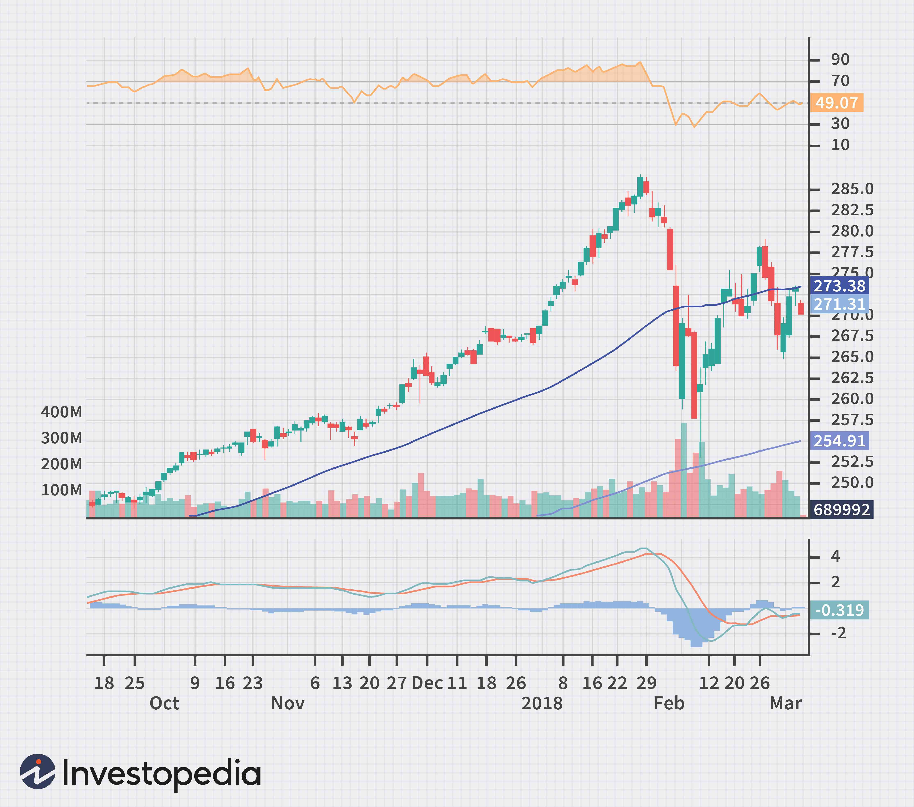

## Table of Contents

## What are technical indicators in financial analysis?

Technical indicators are tools used in financial analysis to help traders and investors make decisions about buying or selling assets. These indicators are based on historical price and volume data of a financial instrument, like stocks or currencies. They help to predict future price movements by identifying patterns and trends. Common examples include moving averages, the Relative Strength Index (RSI), and the Moving Average Convergence Divergence (MACD). Traders use these indicators to get a clearer picture of market conditions and to time their trades more effectively.

These indicators can be divided into two main categories: leading and lagging. Leading indicators, such as the RSI, are designed to predict future price movements and can signal potential reversals before they happen. Lagging indicators, like moving averages, follow price movements and are used to confirm trends after they have been established. Both types of indicators are important because they provide different perspectives on the market. By combining them, traders can make more informed decisions and reduce the risk of making poor trades based on incomplete information.

## How do technical indicators differ from fundamental analysis?

Technical indicators and fundamental analysis are two different ways to look at the financial markets. Technical indicators focus on the price and volume data of a stock or other financial instrument. They use charts and mathematical formulas to find patterns and trends. Traders use these indicators to guess where the price might go next and when to buy or sell. It's all about the past and present price movements, not about the company itself.

Fundamental analysis, on the other hand, looks at the actual value of a company. It involves studying things like the company's earnings, expenses, assets, and the overall economy. Analysts use this information to decide if a stock is a good buy based on its true worth. They might look at financial statements, industry conditions, and even news events. It's about understanding the company's health and future potential, not just its stock price.

Both methods can be useful, but they serve different purposes. Technical indicators are great for short-term trading and quick decisions, while fundamental analysis is better for long-term investing. Some investors use both to get a fuller picture of the market and make smarter choices.

## What are the most common types of technical indicators used by beginners?

For beginners, some of the most common types of technical indicators are moving averages, the Relative Strength Index (RSI), and the Moving Average Convergence Divergence (MACD). Moving averages help smooth out price data to show the trend over a certain period. For example, a simple moving average might show the average price over the last 50 days. This can help beginners see if a stock is generally going up or down. The RSI measures how fast and how much a stock's price has changed recently. It ranges from 0 to 100 and helps you see if a stock might be overbought or oversold. If the RSI is over 70, it might be a good time to sell, and if it's under 30, it might be a good time to buy.

The MACD is another popular indicator that shows the relationship between two moving averages of a stock's price. It helps you see if the stock's momentum is increasing or decreasing. The MACD line is calculated by subtracting the 26-day moving average from the 12-day moving average. A signal line, which is a 9-day moving average of the MACD line, is also used. When the MACD line crosses above the signal line, it can be a sign to buy, and when it crosses below, it can be a sign to sell. These three indicators are easy for beginners to understand and use, making them great starting points for anyone new to technical analysis.

## How can technical indicators help in predicting market trends?

Technical indicators help predict market trends by analyzing past price and volume data. They look for patterns and signals that can show where the market might be headed next. For example, moving averages can help you see if a stock's price is generally going up or down over time. By comparing short-term and long-term moving averages, you can spot when a trend might be starting or ending. This can give you a heads-up on whether it's a good time to buy or sell.

Another way technical indicators predict trends is by measuring the strength and speed of price changes. The Relative Strength Index (RSI) tells you if a stock is overbought or oversold. If the RSI is high, it might mean the price has gone up too fast and could soon drop. If it's low, the price might have dropped too fast and could go back up. The Moving Average Convergence Divergence (MACD) also helps by showing if the stock's momentum is getting stronger or weaker. By using these indicators together, you can get a better idea of what the market might do next and make smarter trading decisions.

## What is the significance of moving averages in technical analysis?

Moving averages are a key tool in technical analysis because they help smooth out price data over time. This makes it easier to see the overall trend of a stock or other financial instrument. By taking the average price over a set period, like 50 days or 200 days, moving averages filter out the short-term ups and downs and show you the bigger picture. For example, if the price of a stock is above its 50-day moving average, it might mean the stock is in an upward trend. If it's below, it could be in a downward trend.

Traders often use moving averages to make decisions about buying or selling. One common strategy is to look at the crossover of short-term and long-term moving averages. When a short-term moving average, like the 50-day, crosses above a long-term moving average, like the 200-day, it's called a "golden cross." This can signal that it's a good time to buy because the trend might be turning bullish. On the other hand, if the short-term average crosses below the long-term average, it's called a "death cross," which might mean it's time to sell because the trend could be turning bearish. By using moving averages, traders can spot these trends and make more informed choices.

## How do oscillators like RSI and MACD work, and what do they indicate?

Oscillators like the Relative Strength Index (RSI) and the Moving Average Convergence Divergence (MACD) are tools that help traders see if a stock's price is moving too fast or too slow. The RSI measures how fast and how much a stock's price has changed recently. It gives you a number between 0 and 100. If the RSI is over 70, it means the stock might be overbought, which could mean the price has gone up too fast and might soon drop. If it's under 30, the stock might be oversold, meaning the price has gone down too fast and might go back up. This helps traders decide when to buy or sell.

The MACD works by comparing two moving averages of a stock's price. It shows you the difference between a 12-day moving average and a 26-day moving average. This difference is called the MACD line. There's also a signal line, which is a 9-day moving average of the MACD line. When the MACD line crosses above the signal line, it might be a good time to buy because the stock's momentum is getting stronger. When it crosses below, it might be a good time to sell because the momentum is getting weaker. By using the MACD, traders can see if a trend is starting or ending and make better trading decisions.

## What are the key differences between leading and lagging indicators?

Leading indicators are like fortune tellers for the stock market. They try to guess what will happen next by looking at things like how fast prices are changing or how many people are buying and selling. For example, the Relative Strength Index (RSI) is a leading indicator. If it shows a stock is overbought, it might mean the price will drop soon. Traders use leading indicators to get ahead of the market and make quick decisions.

Lagging indicators, on the other hand, are like looking in the rearview mirror. They tell you what has already happened by looking at past prices and trends. Moving averages are a good example of lagging indicators. They show you the average price over time, which helps you see if a stock has been going up or down. While they don't predict the future, they help confirm if a trend is real and likely to continue. Traders use them to make sure their guesses about the market are right.

## How can volume-based indicators enhance technical analysis?

Volume-based indicators help traders see how many people are buying and selling a stock. This is important because it shows if a price change is strong or weak. If a stock's price goes up and the volume is high, it means a lot of people are buying, so the price might keep going up. But if the price goes up and the volume is low, it might not be a strong move, and the price could go back down. One common volume-based indicator is the On-Balance Volume (OBV). It adds volume on up days and subtracts it on down days, helping traders see if volume is confirming the price trend.

By using volume-based indicators, traders can get a better idea of the market's strength. For example, the Volume Price Trend (VPT) indicator looks at both price changes and volume to see if they are moving together. If they are, it's a good sign that the trend is strong. Another useful indicator is the Accumulation/Distribution Line, which helps traders see if a stock is being bought or sold by big investors. By adding these volume-based indicators to their analysis, traders can make smarter decisions and understand the market better.

## What are some advanced technical indicators used by expert traders?

Expert traders often use advanced technical indicators like the Bollinger Bands and the Ichimoku Cloud to get a deeper understanding of the market. Bollinger Bands are made up of three lines: a middle line which is a moving average, and two outer lines that show how much the price can change. When the price touches the upper band, it might mean the stock is overbought and could drop soon. When it touches the lower band, it might mean the stock is oversold and could go up. This helps traders see if a stock's price is moving too far away from its average, which can signal good times to buy or sell.

Another advanced tool is the Ichimoku Cloud, which can look a bit complicated but gives a lot of information. It has several lines that help traders see support and resistance levels, as well as future trends. The cloud part of the Ichimoku shows where the price might go next. If the price is above the cloud, it's a bullish sign, meaning the price might keep going up. If it's below the cloud, it's bearish, and the price might keep going down. By using these advanced indicators, expert traders can make more detailed and informed decisions about when to buy or sell stocks.

## How do you combine multiple technical indicators for more accurate predictions?

Combining multiple technical indicators can help traders make more accurate predictions by giving them a fuller picture of the market. For example, a trader might use a moving average to see the overall trend of a stock and the Relative Strength Index (RSI) to check if the stock is overbought or oversold. If the moving average shows the stock is in an upward trend and the RSI is below 30, it might be a good time to buy because the stock is likely to keep going up and is currently undervalued. By looking at different indicators, traders can confirm their guesses and make better decisions.

Another way to combine indicators is by using both leading and lagging indicators together. For instance, a trader might use the Moving Average Convergence Divergence (MACD) to predict future price movements and a volume-based indicator like On-Balance Volume (OBV) to confirm the strength of the trend. If the MACD shows a bullish signal and the OBV is also rising, it's a strong sign that the stock's price will keep going up. By using different types of indicators, traders can see if their predictions are supported by multiple pieces of evidence, which can lead to more accurate and confident trading decisions.

## What are the limitations and potential pitfalls of relying on technical indicators?

Using technical indicators can be tricky because they are not perfect. They look at past prices and patterns, but the future can be different. Sometimes, indicators give false signals, making you think it's a good time to buy or sell when it's not. For example, a stock might look overbought on the RSI, but the price could keep going up. Also, different indicators can give different signals at the same time, which can be confusing. If you rely too much on one indicator, you might miss important information from others.

Another problem is that many people use the same indicators, so when everyone sees the same signal, they might all buy or sell at the same time. This can cause big price swings that don't last long. Also, technical indicators don't tell you why a stock's price is moving. They don't look at things like company news or the economy, which can be just as important. So, while technical indicators can be helpful, it's smart to use them along with other tools and not depend on them too much.

## How can one backtest technical indicators to validate their effectiveness?

Backtesting technical indicators means checking how well they would have worked in the past. You can do this by using old price data to see if the indicator would have given good signals for buying or selling. For example, you might use a computer program to look at what would have happened if you followed the signals from a moving average or RSI over the last few years. This helps you see if the indicator really works or if it just gives false signals a lot.

It's important to backtest carefully because you can trick yourself into thinking an indicator is better than it is. Make sure you use a big enough sample of data and try it out in different market conditions, like when the market is going up and when it's going down. Also, remember that just because an indicator worked in the past doesn't mean it will work in the future. Markets change, and what worked before might not work again. So, [backtesting](/wiki/backtesting) is a good tool, but it's not perfect.

## What are Technical Indicators and How Can They Be Understood?

Technical indicators are essential analytical tools used in financial markets to interpret historical price data and forecast future market movements. These tools are instrumental in helping traders and analysts understand the dynamics of the market, offering insights into trends, momentum, and potential buy or sell signals.

One of the most commonly used technical indicators is the Moving Average (MA). It smooths out price data by creating a constantly updated average price over a specified period. The primary purpose of a moving average is to identify trend directions, providing a clearer view of price changes by filtering out the noise from random price fluctuations. There are different types of moving averages, including the Simple Moving Average (SMA) and the Exponential Moving Average (EMA), each with its specific calculations and uses. The simple moving average is calculated by taking the arithmetic mean of a given set of prices over a specific number of periods. For example, a 10-day SMA is calculated as:

$$
\text{SMA} = \frac{P_1 + P_2 + \cdots + P_{10}}{10}
$$

where $P$ represents the price.

Another widely utilized indicator is the Relative Strength Index (RSI), which measures the speed and change of price movements. The RSI is a [momentum](/wiki/momentum) oscillator that ranges from 0 to 100, and it is primarily used to identify overbought or oversold conditions in a market. A common interpretation of RSI is that a level above 70 indicates that the asset may be overbought, while a level below 30 suggests that it may be oversold. The RSI is calculated using the formula:

$$

\text{RSI} = 100 - \left( \frac{100}{1 + \frac{\text{Average Gain}}{\text{Average Loss}}} \right) 
$$

Finally, the Moving Average Convergence Divergence (MACD) is a trend-following momentum indicator that shows the relationship between two moving averages of a security’s price. The MACD is calculated by subtracting the 26-day EMA from the 12-day EMA, and it generates several signals based on crossovers, divergences, and other patterns. Traders often look for the signal line, a 9-day EMA of the MACD line, to indicate potential buy or sell signals when it crosses above or below the MACD line.

Technical indicators like the Moving Averages, RSI, and MACD are powerful tools for analyzing past market behavior and providing a framework for predicting future price movements. They play an integral role in the decision-making process of traders and are foundational components of technical analysis.

## What is the Role of Technical Indicators in Financial Analysis?

Technical indicators provide a quantitative approach to analyzing market dynamics by utilizing mathematical computations based on price, [volume](/wiki/volume-trading-strategy), and open interest. These indicators transform historical data into actionable insights, making it easier for traders and analysts to understand and predict market behavior.

One of the primary ways technical indicators enhance financial analysis is by complementing [fundamental analysis](/wiki/fundamental-analysis). While fundamental analysis focuses on a company's intrinsic value through financial statements and macroeconomic factors, technical indicators concentrate on price patterns and trends. This dual approach enables a comprehensive understanding of market conditions, allowing traders to make more informed decisions.

Indicators such as Bollinger Bands and the Stochastic Oscillator are particularly useful in assessing market [volatility](/wiki/volatility-trading-strategies) and momentum. Bollinger Bands consist of a middle band represented by a moving average, and two outer bands that are standard deviations away from the middle band. The formula for Bollinger Bands can be represented as:

$$
\text{Upper Band} = \text{SMA}(n) + (k \times \sigma)
$$
$$
\text{Lower Band} = \text{SMA}(n) - (k \times \sigma)
$$

where $\text{SMA}(n)$ is the simple moving average over $n$ periods, $k$ is a factor (usually 2), and $\sigma$ is the standard deviation of the price over the same period. These bands expand and contract based on market volatility, indicating potential price movements. When prices touch the upper band, the asset is considered overbought; when prices touch the lower band, it is considered oversold.

The Stochastic Oscillator, on the other hand, is a momentum indicator comparing a particular closing price of a security to a range of its prices over a certain period. It is expressed as a percentage and calculated as follows:

$$
\text{Stochastic \%K} = \frac{(C - L_{14})}{(H_{14} - L_{14})} \times 100
$$

where $C$ is the most recent closing price, $L_{14}$ is the lowest price over the past 14 sessions, and $H_{14}$ is the highest price over the same 14 sessions. This indicator helps identify potential trend reversals by signaling overbought or oversold conditions.

By utilizing these technical indicators, analysts can gain valuable insights into the market's direction and strength, thus enhancing their overall financial analysis. The objective nature of these indicators is particularly beneficial in reducing emotional biases, allowing for data-driven decision-making.

## What are popular technical indicators and their applications?

Moving averages are a fundamental tool used to identify the direction of trends in financial markets, providing insights into potential reversals. They smooth out price data by creating a constantly updated average price over a specific period, aiding traders in distinguishing actual market trends from fluctuations. There are different types of moving averages, including simple moving averages (SMA) and exponential moving averages (EMA). The SMA calculates the mean price over a chosen time frame, while the EMA gives more weight to recent prices, making it more responsive to new information. For example, the formula for an EMA is:

$$

\text{EMA}_{\text{today}} = \left( \frac{{\text{Price}_{\text{today}} - \text{EMA}_{\text{yesterday}}}}{N+1} \right) + \text{EMA}_{\text{yesterday}}
$$

where $N$ is the number of days in the EMA period.

The Relative Strength Index (RSI) is a momentum oscillator that measures the speed and change of price movements, aiding in identifying overbought or oversold conditions in a market. The RSI ranges from 0 to 100 and is typically used over a 14-day period. An RSI above 70 is considered overbought, suggesting a potential downward correction, while an RSI below 30 indicates oversold conditions, implying a potential upward correction. The formula for RSI is:

$$

\text{RSI} = 100 - \left( \frac{100}{1 + \text{RS}} \right) 
$$

where $\text{RS}$ (relative strength) is the average gain of up days during the specified period divided by the average loss of down days.

The Moving Average Convergence Divergence (MACD) is a trend-following momentum indicator that reveals the relationship between two moving averages of a security’s price. The MACD is calculated by subtracting the 26-period EMA from the 12-period EMA. The result of this calculation is the MACD line. A nine-day EMA of the MACD, called the signal line, is then plotted on top of the MACD line, which can function as a trigger for buy and sell signals. When the MACD line crosses above the signal line, it indicates a bullish signal, while a cross below signifies a bearish signal. The MACD is useful for gauging the strength and momentum of market trends. 

Python can be used to calculate these indicators effectively. For example, to compute the SMA in Python using the pandas library, one might use:

```python
import pandas as pd

# Assuming 'data' is a pandas DataFrame containing the price data
data['SMA'] = data['Close'].rolling(window=20).mean()
```

These indicators are widely used in various trading strategies due to their ability to provide quantitative insights into market behavior, helping traders make informed decisions.

## References & Further Reading

[1]: Bergstra, J., Bardenet, R., Bengio, Y., & Kégl, B. (2011). ["Algorithms for Hyper-Parameter Optimization."](https://dl.acm.org/doi/10.5555/2986459.2986743) Advances in Neural Information Processing Systems 24.

[2]: ["Advances in Financial Machine Learning"](https://www.amazon.com/Advances-Financial-Machine-Learning-Marcos/dp/1119482089) by Marcos Lopez de Prado

[3]: ["Evidence-Based Technical Analysis: Applying the Scientific Method and Statistical Inference to Trading Signals"](https://www.amazon.com/Evidence-Based-Technical-Analysis-Scientific-Statistical/dp/0470008741) by David Aronson

[4]: ["Machine Learning for Algorithmic Trading"](https://github.com/stefan-jansen/machine-learning-for-trading) by Stefan Jansen

[5]: ["Quantitative Trading: How to Build Your Own Algorithmic Trading Business"](https://www.amazon.com/Quantitative-Trading-Build-Algorithmic-Business/dp/1119800064) by Ernest P. Chan