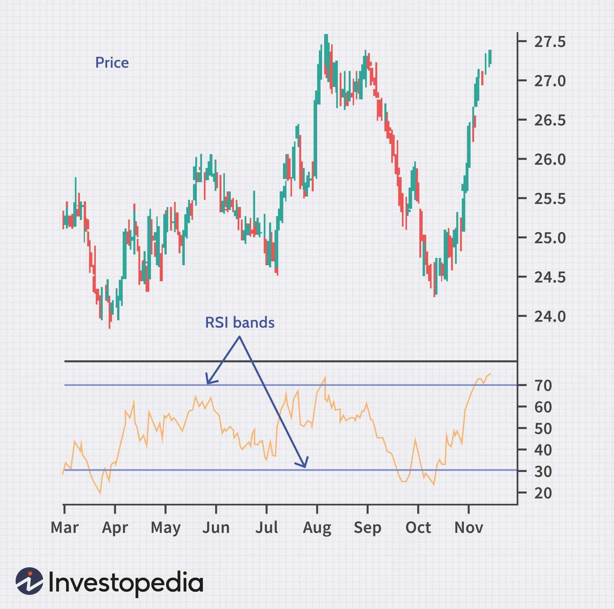

Options trading offers investors a strategic avenue to capitalize on market movements while efficiently managing risk, often requiring a smaller capital outlay compared to traditional stock trading. This approach enables traders to engage in both hedging and speculative strategies without necessarily acquiring the underlying asset. A key component in options trading is the use of technical indicators. These indicators analyze historical market data to anticipate future price movements, thus providing traders with tools to make data-driven decisions.

Algorithmic trading, or algo trading, takes this a step further by leveraging these technical indicators to automate trading decisions. This automation enhances both the efficiency and accuracy of trades, minimizing human error and enabling rapid responses to market fluctuations. Algorithms can process large volumes of data at speeds far beyond human capability, thus executing trades at optimal moments based on predefined criteria.



Key technical indicators frequently used in options trading include a variety of momentum and volatility metrics, each serving distinct purposes. For instance, indicators like the Relative Strength Index (RSI) are used to identify overbought or oversold conditions, which can be particularly advantageous when making time-sensitive options trades. Bollinger Bands measure market volatility and are often employed to determine entry and exit points.

This article will explore these technical indicators, their integration into market analysis and algorithmic trading. Understanding how to effectively employ these tools is essential for enhancing trade performance and making informed trading decisions in both manual and algorithmic contexts.

## Table of Contents

## How Options Trading is Different

Options trading differs significantly from stock trading primarily due to the presence of expiration dates. This time constraint introduces a crucial temporal element to trading strategies that is absent in conventional stock trading. As options have specific expiration periods, the value of an option is not just influenced by the performance of the underlying asset but also by the time remaining until the option's expiration. This necessitates strategic planning accounting for both market movement predictions and time decay.

One significant aspect to be aware of in options trading is time decay, often represented by the Greek letter theta ($\Theta$). Theta measures the rate at which an option loses its value as it approaches its expiration date. Mathematically, theta is expressed as:

$$
\Theta = \frac{\partial \text{Option Price}}{\partial \text{Time}}
$$

With options, this time sensitivity means that traders must be especially astute in their analysis and decision-making. The time decay can erode the premium paid for options, making it imperative to correctly predict not just the direction of the underlying asset but also the timeframe within which the expected movement will occur.

To effectively manage these considerations, traders often employ [momentum](/wiki/momentum) indicators to assess overbought and oversold conditions. Such indicators become invaluable since they can provide signals that a stock is poised to reverse its movement—a critical insight given the finite timeframe associated with options. For instance, the Relative Strength Index (RSI) is widely used to determine these market conditions, helping traders decide when to enter or [exit](/wiki/exit-strategy) positions.

Understanding these time-sensitive dynamics is essential for effectively utilizing technical indicators in options trading. Unlike stock transactions, where decisions can be held over more extended periods, options traders must remain vigilant, constantly evaluating not only market trends but also the diminishing timeline, which directly influences the profitability of their trades. This nuanced comprehension of time's influence on options is a pivotal [factor](/wiki/factor-investing) for success in options trading strategies.

## Technical Indicators in Options Trading

Technical indicators provide insights into potential price moves by analyzing past market data, playing a critical role in options trading. These indicators help traders make informed decisions by identifying trends, momentum, and [volatility](/wiki/volatility-trading-strategies) in the market. This section highlights key indicators such as the Relative Strength Index (RSI), Bollinger Bands, and Moving Average Convergence Divergence (MACD), each serving distinct functions.

The Relative Strength Index (RSI) is a popular momentum oscillator that measures the speed and change of price movements. It is calculated using the formula:

$$
\text{RSI} = 100 - \frac{100}{1 + \text{RS}}
$$

where RS (Relative Strength) is the average of 'n' days’ up closes divided by the average of 'n' days’ down closes. RSI values range between 0 and 100 and are typically used to identify overbought or oversold conditions, with values above 70 indicating potential overbought scenarios and values below 30 signaling possible oversold conditions.

Bollinger Bands consist of a set of lines plotted two standard deviations (positively and negatively) away from a simple moving average (SMA) of the price. This setup creates a band that expands and contracts based on market volatility. The formula for the upper and lower bands is:

$$
\text{Upper Band} = \text{SMA}(n) + k \times \sigma \\
\text{Lower Band} = \text{SMA}(n) - k \times \sigma
$$

where $\sigma$ represents the standard deviation, and $k$ is a constant (typically set to 2). Bollinger Bands are extensively used to identify breakout opportunities by assessing the price touching or breaching these bands, indicative of significant price movements.

The Moving Average Convergence Divergence (MACD) is a trend-following momentum indicator that shows the relationship between two moving averages of a security’s price. It is calculated by subtracting the 26-period Exponential Moving Average (EMA) from the 12-period EMA. The MACD is accompanied by a signal line, which is the 9-day EMA of the MACD line, used to signal buy or sell opportunities when it crosses above or below the MACD line.

Python implementation for calculating these indicators can be performed using libraries such as `pandas` and `numpy`. A simple example of calculating RSI is:

```python
import pandas as pd

def calculate_rsi(data, window=14):
    delta = data['Close'].diff()
    gain = (delta.where(delta > 0, 0)).rolling(window=window).mean()
    loss = (-delta.where(delta < 0, 0)).rolling(window=window).mean()
    rs = gain / loss
    rsi = 100 - (100 / (1 + rs))
    return rsi

# Example usage:
# data is a pandas dataframe with a 'Close' column containing close prices
data['RSI'] = calculate_rsi(data)
```

Utilizing these indicators in options trading allows traders to make well-informed decisions not only by understanding current market conditions but also by predicting future price movements with greater accuracy.

## Popular Momentum Indicators

The Relative Strength Index (RSI) is a momentum oscillator that measures the speed and change of price movements, aiding traders in identifying overbought or oversold conditions in an asset. It operates on a scale of 0 to 100, with values above 70 typically indicating overbought conditions and values below 30 indicating oversold conditions. This makes RSI a valuable tool for predicting potential price reversals in options markets. The RSI is calculated using the formula:

$$

RSI = 100 - \left( \frac{100}{1 + RS} \right) 
$$

where RS (Relative Strength) is the average gain of up periods during a specified time frame divided by the average loss of down periods.

Bollinger Bands are another essential momentum indicator that measures market volatility. They consist of three lines: a middle simple moving average (SMA) and two outer bands set at standard deviations above and below the SMA. The band width adjusts according to market volatility, expanding during volatile periods and contracting when the market is stable. Traders often use Bollinger Bands to identify entry and exit points; a move outside the bands can signal a continuation or reversal of a trend.

The Intraday Momentum Index (IMI) combines principles of candlestick analysis and the RSI, creating a hybrid indicator particularly useful for short-term options traders. Unlike RSI, which typically uses closing prices, IMI evaluates the relationship between the opening and closing prices to gauge daily market momentum. This makes it well-suited for analyzing day-to-day price movements. IMI is calculated similarly to RSI but focuses on intraday trading intervals, providing insights into the strength of smaller, more frequent price changes.

These momentum indicators are integral to technical analysis, allowing traders to better time their trades by understanding the underlying market dynamics. By indicating potential changes in price direction, these tools enhance decision-making in options trading strategies. Understanding their application and limitations is crucial for maximizing their benefits in diverse trading scenarios.

## Volume and Market Sentiment Indicators

The Money Flow Index (MFI) is a momentum indicator that combines price and [volume](/wiki/volume-trading-strategy) data to gauge the buying and selling pressure within an asset. It measures the flow of money into and out of a security over a specific period, typically 14 days. The MFI ranges from 0 to 100, with readings above 80 indicating overbought conditions, while readings below 20 suggest oversold situations. Calculating the MFI involves the following steps:

1. **Typical Price (TP)** for each period:  
   \[ \text{TP} = \frac{\text{High} + \text{Low} + \text{Close}}{3}
$$

2. **Money Flow (MF)**:  
   \[ \text{MF} = \text{TP} \times \text{Volume}
$$

3. **Positive and Negative Money Flow**:  
   - Positive Money Flow occurs when the current Typical Price is higher than the previous one.
   - Negative Money Flow happens when it is lower.

4. **Money Flow Ratio (MFR)**:  
   \[ \text{MFR} = \frac{\text{Positive Money Flow (14-period)}}{\text{Negative Money Flow (14-period)}}
$$

5. **Money Flow Index**:  
   \[ \text{MFI} = 100 - \frac{100}{1 + \text{MFR}}
$$

The MFI is useful for identifying potential reversals or validating current trends in options trading.

The Put-Call Ratio (PCR) is another essential indicator in options trading, which provides insights into market sentiment. It is calculated by dividing the number of traded put options by the number of traded call options. A high PCR indicates bearish sentiment, as more puts are being purchased. Conversely, a low PCR suggests bullish sentiment, with a greater interest in calls. Traders use this ratio to determine market bias and potential turning points.

Open Interest (OI) is the total number of outstanding options contracts that have not been settled. Unlike volume, which accounts for all trades done within a period, OI reflects contracts that have been opened but not closed. An increase in OI signifies new capital inflow and potentially stronger commitments in the market, providing insight into market activity and trader sentiment. Declining OI can indicate profit-taking or the unwinding of positions.

These indicators provide a comprehensive view of market dynamics, enabling options traders to better understand trader sentiment and market trajectories, and to make more informed trading decisions.

## Algorithmic Trading and Technical Indicators

Algorithmic trading utilizes technical indicators to automate trading strategies, aiming to reduce human error and increase consistency in decision-making. This method allows traders to analyze large volumes of market data at remarkable speeds, identifying optimal entry and exit points as dictated by pre-defined parameters. 

Technical indicators, such as the Moving Average Convergence Divergence (MACD) or the Relative Strength Index (RSI), serve as the fundamental inputs for algorithmic systems. These indicators provide insights into market trends and momentum, which are essential for predicting price movements in options trading. The efficient processing capability of algorithms allows for swift reactions to dynamic market conditions, achieving precision that is difficult for manual traders to match.

The implementation of [algorithmic trading](/wiki/algorithmic-trading) necessitates rigorous [backtesting](/wiki/backtesting). This process involves applying trading strategies to historical data to evaluate their effectiveness and refine algorithms accordingly. Backtesting helps uncover potential flaws and adapt strategies to mitigate risks, improving their application in live environments. For example, a Python-based backtesting framework might look like this:

```python
import backtrader as bt

class TestStrategy(bt.Strategy):
    def __init__(self):
        self.rsi = bt.indicators.RSI(self.data.close)

    def next(self):
        if not self.position:
            if self.rsi < 30:
                self.buy()
        else:
            if self.rsi > 70:
                self.sell()

data = bt.feeds.YahooFinanceData(dataname='AAPL')
cerebro = bt.Cerebro()
cerebro.addstrategy(TestStrategy)
cerebro.adddata(data)
cerebro.run()
cerebro.plot()
```

In this example, the Relative Strength Index (RSI) is used to automate buy and sell signals on Apple Inc. stock data. The process simulates trading decisions over historical data, indicating the algorithm's viability before applying it in real-world scenarios. By leveraging algorithmic trading with technical indicators, traders can enhance the accuracy and efficiency of their strategies, aiming for improved outcomes in options trading markets.

## Combining Indicators and Avoiding Common Pitfalls

In options trading, no single technical indicator provides an infallible strategy. Traders often integrate multiple indicators to achieve higher accuracy in forecasting market movements. By combining indicators, such as momentum and volume-based signals, traders aim to balance different facets of market analysis.

For instance, integrating the Relative Strength Index (RSI) with Bollinger Bands can provide a more comprehensive view of price momentum and volatility. RSI highlights overbought or oversold conditions, while Bollinger Bands offer signals regarding market volatility and potential price reversals. Verification of trade signals through cross-referencing reduces the risk associated with relying on a single indicator's output.

However, it's crucial to avoid pitfalls such as over-reliance on any one indicator. Traders should be cautious of overfitting strategies to historical data; a model that appears perfect under backtesting might fail in live trading due to changing market dynamics. Overfitting occurs when a strategy is excessively tuned to past data, losing generalizability to new, unseen market conditions.

To illustrate, consider a simple Python example where a trader backtests a combination of RSI and Moving Average Convergence Divergence (MACD) for a hypothetical options strategy:

```python
import pandas as pd
import numpy as np

# Example data loading, replace with real market data
data = pd.DataFrame({'price': [...]})

# Calculating RSI
def calculate_rsi(series, period=14):
    delta = series.diff()
    gain = (delta.where(delta > 0, 0)).rolling(window=period).mean()
    loss = (-delta.where(delta < 0, 0)).rolling(window=period).mean()
    rs = gain / loss
    return 100 - 100 / (1 + rs)

data['RSI'] = calculate_rsi(data['price'])

# Calculating MACD
short_window = 12
long_window = 26
signal_window = 9

data['Short_MA'] = data['price'].ewm(span=short_window, adjust=False).mean()
data['Long_MA'] = data['price'].ewm(span=long_window, adjust=False).mean()
data['MACD'] = data['Short_MA'] - data['Long_MA']
data['Signal'] = data['MACD'].ewm(span=signal_window, adjust=False).mean()

# Example basic strategy: Buy when RSI < 30 and MACD > Signal
data['Buy_Signal'] = np.where((data['RSI'] < 30) & (data['MACD'] > data['Signal']), 1, 0)

# Simplified backtesting approach
data['Strategy_Return'] = data['Buy_Signal'].shift(1) * data['price'].pct_change()

# Evaluation of strategy performance
total_return = data['Strategy_Return'].cumsum()[-1]
print(f"Strategy Total Return: {total_return * 100:.2f}%")
```

In this algorithm, an optimal decision-making rule is crafted based on combined indicators. However, it's essential to overlay this quantitative approach with qualitative assessments and external market analysis to avoid the illusion of predictability that accompanies overfitted models.

By adopting a prudent strategy of cross-referencing indicators and maintaining flexibility in trading techniques, traders can improve their decision-making process, thus optimizing their performance in the dynamic environment of options trading.

## Conclusion

Technical indicators are integral to the successful trading of options, providing invaluable insights for both manual and algorithmic traders. These tools offer the ability to assess market conditions, forecast potential price movements, and define optimal entry and exit points. By understanding and appropriately combining indicators such as the Relative Strength Index (RSI), Bollinger Bands, and Moving Average Convergence Divergence (MACD), traders gain a significant analytical edge that enhances both market analysis and trade execution.

The strategic application of technical indicators allows traders to navigate the uncertainties of market dynamics with increased confidence. In manual trading, they serve as a guide to interpreting market trends and making informed decisions. For algorithmic traders, these indicators form the backbone of automated strategies, programmed to execute trades based on predefined criteria, thereby reducing the potential for human error.

However, mastery of technical indicators alone does not guarantee success. Continuous learning and the ability to adapt trading strategies remain crucial as financial markets are inherently dynamic. Traders must remain vigilant to new patterns and innovations in trading technology, refining their approaches to stay aligned with market developments. 

Ultimately, the incorporation of technical indicators into trading strategies offers a robust framework for achieving superior outcomes in options trading. Their effectiveness lies in the capacity to balance statistical rigor with the flexibility to adjust to an ever-changing financial landscape.

## FAQs

### What is the most reliable indicator for options trading?

No single indicator can be considered the most reliable as each serves different purposes and performs better under specific conditions. The Relative Strength Index (RSI) can effectively gauge the momentum and identify potential reversal points by measuring the speed and change of price movements. Bollinger Bands are beneficial in determining volatility and identifying possible overbought or oversold conditions by examining price standard deviations relative to moving averages. The Moving Average Convergence Divergence (MACD) enhances trend-following capabilities by demonstrating the relationship between two moving averages of a security’s price. Combined, these indicators help traders make informed decisions, but using them in conjunction with others is advisable to cross-verify market signals.

### Can I use stock indicators for options trading?

Stock indicators can certainly be used in options trading, but traders should account for the differences between the two markets. Indicators like RSI, Bollinger Bands, and MACD remain applicable because they analyze price movements and trends, essential in both stock and options trading. However, options have unique attributes such as expiration dates and volatility measures that may necessitate additional indicators (e.g., implied volatility) to account for these differences. While stock indicators offer valuable insights, integrating options-specific metrics ensures a comprehensive analysis tailored to options trading.

### How does implied volatility impact options pricing?

Implied volatility plays a critical role in options pricing, serving as a forecast of the market's expectation of the future volatility of the underlying asset. According to the Black-Scholes model, a widely used formula for options pricing, an option's value $C$ (for a call option) can be represented as:

$$
C = S_0 \cdot N(d_1) - X \cdot e^{-rT} \cdot N(d_2)
$$

where

$$
d_1 = \frac{\ln(S_0/X) + (r + \sigma^2/2)T}{\sigma\sqrt{T}}
$$

$$
d_2 = d_1 - \sigma\sqrt{T}
$$

Here, $S_0$ is the current price of the underlying asset, $X$ is the strike price, $r$ is the risk-free [interest rate](/wiki/interest-rate-trading-strategies), $T$ is the time to expiration, and $\sigma$ is the implied volatility. Increases in implied volatility generally lead to higher option premiums because they suggest a greater possibility of the option ending in-the-money. Traders often monitor changes in implied volatility closely to adjust their strategies and manage risk appropriately.

## References & Further Reading

[1]: Bergstra, J., Bardenet, R., Bengio, Y., & Kégl, B. (2011). ["Algorithms for Hyper-Parameter Optimization."](https://papers.nips.cc/paper/4443-algorithms-for-hyper-parameter-optimization) Advances in Neural Information Processing Systems 24.

[2]: ["Advances in Financial Machine Learning"](https://www.amazon.com/Advances-Financial-Machine-Learning-Marcos/dp/1119482089) by Marcos Lopez de Prado

[3]: ["Evidence-Based Technical Analysis: Applying the Scientific Method and Statistical Inference to Trading Signals"](https://www.amazon.com/Evidence-Based-Technical-Analysis-Scientific-Statistical/dp/0470008741) by David Aronson

[4]: ["Machine Learning for Algorithmic Trading"](https://github.com/stefan-jansen/machine-learning-for-trading) by Stefan Jansen

[5]: ["Quantitative Trading: How to Build Your Own Algorithmic Trading Business"](https://www.amazon.com/Quantitative-Trading-Build-Algorithmic-Business/dp/1119800064) by Ernest P. Chan