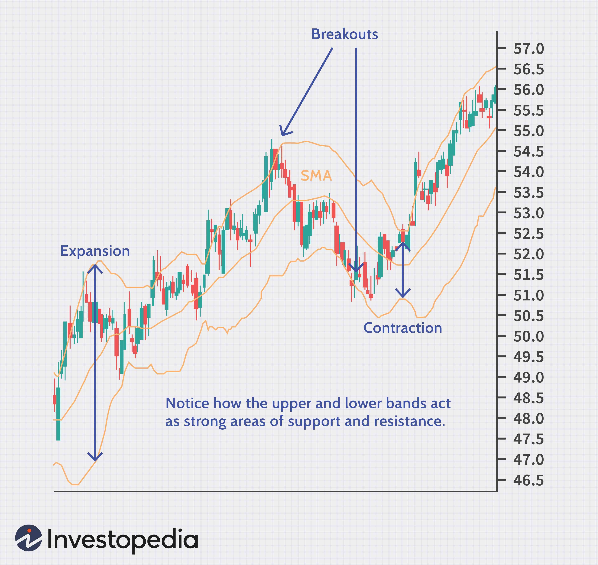

The world of trading is complex, requiring a deep understanding of various tools and strategies to navigate effectively. As market dynamics evolve with remarkable speed, traders must adopt a flexible yet informed approach to maintain a competitive edge. Technical indicators, financial analysis, and algorithmic trading are crucial components that enhance a trader's ability to make informed decisions and optimize trading performance.

Technical indicators serve as essential instruments for traders by providing insights into market trends, momentum, volatility, and volume. They are mathematical calculations based on historical market data such as price and volume. Popular indicators like moving averages, Bollinger Bands, and the Relative Strength Index (RSI) help traders identify potential market opportunities and make more informed trading decisions.

Financial analysis plays a vital role in contextualizing the quantitative data provided by technical indicators. By integrating financial analysis, traders can better understand the macroeconomic factors influencing market movements, allowing them to develop more robust trading strategies. This combination of quantitative and qualitative analysis equips traders with a comprehensive perspective necessary for navigating the complexities of financial markets.

Algorithmic trading, or algo trading, represents a natural progression toward automating the trading process. By employing pre-defined rules to execute trades, algorithms leverage technical indicators and financial analysis to determine optimal buy and sell points. Algo trading offers significant advantages, such as increased speed, reduced emotional bias, and the ability to process vast amounts of data in real-time.

This article provides a comprehensive overview of these key components—technical indicators, trading strategies, and the role of algorithmic trading in today's markets. We explore a selection of popular technical indicators, examining their functions and applications in different trading scenarios. Additionally, we discuss various trading strategies, outlining how they can be effectively implemented and tested.

Our objective is to equip traders and investors with the knowledge needed to effectively use these tools for financial success. By understanding and integrating technical indicators, crafting sophisticated trading strategies, and utilizing algorithmic trading, market participants can significantly enhance their ability to achieve their financial objectives. As the financial markets continue to evolve, staying informed and adaptable remains imperative for long-term success.

## Table of Contents

## Understanding Technical Indicators

Technical indicators are mathematical tools used in technical analysis to evaluate an asset's strength, price movement, and overall market conditions. These indicators provide essential insights into [momentum](/wiki/momentum), trend direction, [volatility](/wiki/volatility-trading-strategies), and [volume](/wiki/volume-trading-strategy), aiding traders in forecasting future price movements and making well-informed decisions. 

Technical indicators rely on historical price data and, in certain cases, volume or open interest, providing a systematic approach to analyzing market dynamics. Among the most commonly utilized technical indicators are moving averages, Bollinger Bands, and the Relative Strength Index (RSI).

**1. Moving Averages:**
Moving averages are utilized to smooth price data, creating a continuously updated average price. They help in identifying trends by filtering out the "noise" from random short-term price fluctuations. There are several types of moving averages, with the most common being the Simple Moving Average (SMA) and the Exponential Moving Average (EMA). For example, the SMA of an asset's price over a period $n$ is calculated as:
$$
\text{SMA}_n = \frac{P_1 + P_2 + \cdots + P_n}{n}
$$
where $P_i$ represents the individual data points over the time period.

**2. Bollinger Bands:**
Bollinger Bands consist of a middle band being a moving average and two outer bands calculated as standard deviations away from this average. They are used to determine high and low conditions relative to previous trades. The bands widen and contract with market volatility, providing traders with insights into potential [breakout](/wiki/breakout-trading) points. A typical formulation involves plotting the standard deviations either side of a moving average line:
$$
\text{Upper Band} = \text{SMA}_n + (k \times \sigma)
$$
$$
\text{Lower Band} = \text{SMA}_n - (k \times \sigma)
$$
where $\sigma$ is the standard deviation over the past $n$ periods and $k$ is the number of standard deviations (usually 2).

**3. Relative Strength Index (RSI):**
The RSI is a momentum oscillator that measures the speed and change of price movements. It fluctuates between 0 and 100. Traditionally, and according to J. Welles Wilder Jr., the creator of the RSI, a value above 70 indicates an asset is overbought, while a value below 30 signifies it is oversold. The RSI is calculated using the formula:
$$
\text{RSI} = 100 - \frac{100}{1 + \frac{\text{Average Gain}}{\text{Average Loss}}}
$$
where the average gain or loss is calculated over a specified period, typically 14 days.

Each technical indicator fulfills a specific function and is often used in combination with others to verify signals, thereby minimizing noise and errors in the analysis. Selecting appropriate indicators depends on an individual trader’s style—whether they prioritize [trend following](/wiki/trend-following), reversal strategies, or volatility breakout tactics—along with their risk tolerance and overall investment goals. Balancing these preferences with the characteristics of chosen indicators can optimize trading effectiveness and lead to successful outcomes.

## Developing Trading Strategies

Trading strategies represent systematic methodologies for executing buy and sell orders within financial markets under a set framework of pre-determined rules. These strategies are inherently designed to eliminate emotional decision-making by relying on structured guidelines and quantifiable data. A core component of many trading strategies is the integration of technical indicators, which serve as tools to pinpoint ideal entry and [exit](/wiki/exit-strategy) points, assess risk management protocols, and enhance potential returns. 

Among the simplest and widely used strategies is the moving average crossover. This strategy involves two moving averages: a shorter-period moving average (e.g., 5-day) and a longer-period moving average (e.g., 20-day). A buy signal may be generated when the short-term average crosses above the long-term average, indicating upward momentum, while a sell signal is indicated when the opposite occurs. 

More sophisticated strategies may incorporate a combination of multiple indicators, such as the Relative Strength Index (RSI) and Bollinger Bands, which together provide complementary signals on momentum and volatility, respectively. This multi-indicator approach aims to validate trading signals and reduce market noise.

An essential aspect of developing any trading strategy is [backtesting](/wiki/backtesting). Backtesting involves running the strategy on historical data to evaluate its performance without risking actual capital. This process reveals the strategy's strengths and weaknesses over different market conditions, helping traders refine their approach before live trading. A critical measure during backtesting is the Sharpe ratio, calculated as:

$$

\text{Sharpe Ratio} = \frac{E[R_a - R_f]}{\sigma_a} 
$$

where $E[R_a - R_f]$ is the expected return of the strategy over the risk-free rate, and $\sigma_a$ is the standard deviation of the excess return. A higher Sharpe ratio is indicative of a strategy that yields a better risk-adjusted return.

Successful trading strategies align closely with the trader's risk appetite, market knowledge, and financial objectives. Risk-averse individuals might favor conservative approaches such as fixed-income security strategies, while risk-tolerant investors may explore high-frequency trading models. Therefore, self-assessment is crucial, as is continuous learning and adaptation to the evolving market landscape to maintain strategy effectiveness.

## The Role of Algorithmic Trading

Algorithmic trading, commonly known as algo trading, represents a significant evolution in the execution and management of trades in modern financial markets. By using computer algorithms to make trading decisions, this approach allows for the automation of processes that traditionally required significant human intervention. These algorithms are typically rule-based, often derived from technical analysis, and can execute trades at optimal times with greater speed and efficiency than human traders.

The core advantage of [algorithmic trading](/wiki/algorithmic-trading) lies in its ability to utilize technical indicators for a data-driven approach. This method enables traders to engage in high-frequency trading—executing a large number of trades in fractions of a second—and to diversify portfolios with efficient strategy execution. For instance, algo trading can effectively identify and exploit minute price discrepancies across financial markets, which might be overlooked or acted upon too slowly by human traders.

One of the key benefits of algorithmic trading is the reduction of emotional bias. Human decision-making in trading can often be clouded by emotions such as fear and greed, leading to suboptimal outcomes. Automated algorithms make decisions based on pure data analysis, improving accuracy and consistency. Furthermore, with algorithms operating continuously and without fatigue, the opportunities to capitalize on market inefficiencies are greatly enhanced.

However, algorithmic trading is not without its risks. To be effective, algorithms require thorough testing and diligent oversight. Backtesting involves simulating the algorithm's performance using historical market data to verify its effectiveness and to identify potential weaknesses or vulnerabilities. Moreover, careful monitoring is essential to mitigate risks associated with technical failures or improper algorithm design. Anomalies or unexpected market conditions can lead to significant financial losses if not addressed promptly.

In summary, while algorithmic trading provides numerous advantages over traditional human trading methods, it necessitates rigorous validation and ongoing management to ensure its proper function and to minimize associated risks. The successful implementation of algo trading strategies can lead to improved trading performance and financial successes when adequately monitored and fine-tuned.

## Popular Technical Indicators in Algo Trading

Technical indicators play a critical role in algorithmic trading strategies by providing quantitative tools for analyzing price movements and market trends. Among the most popular indicators are Moving Averages, Relative Strength Index (RSI), MACD, Bollinger Bands, and the Stochastic Oscillator. These indicators help traders automate the detection of trading signals by quantifying various aspects of market dynamics.

### Moving Averages

Moving Averages (MA) are widely used to identify trends by smoothing out price data over a specified period. The most common types are the Simple Moving Average (SMA) and the Exponential Moving Average (EMA). An SMA is calculated by taking the arithmetic mean of prices over a given time frame:

$$
\text{SMA} = \frac{P_1 + P_2 + \dots + P_n}{n}
$$

where $P_1, P_2, \dots, P_n$ are the prices observed over $n$ periods. The EMA gives more weight to recent prices to react more quickly to price changes. They are instrumental in spotting trend reversals and generating buy/sell signals.

### Relative Strength Index (RSI)

The Relative Strength Index (RSI) is a momentum oscillator that measures the speed and change of price movements. It is typically used to identify overbought or oversold conditions in a market, ranging between 0 and 100. An RSI above 70 suggests that a security is overbought, while below 30 indicates oversold conditions. The RSI formula is:

$$
\text{RSI} = 100 - \frac{100}{1 + \frac{\text{Average Gain}}{\text{Average Loss}}}
$$

This indicator helps in pinpointing entry and exit points driven by momentum.

### MACD

The Moving Average Convergence Divergence (MACD) is another trend-following momentum indicator that shows the relationship between two moving averages of a security’s price. The MACD is calculated by subtracting the 26-period EMA from the 12-period EMA. A nine-day EMA of the MACD, called the "signal line," is then plotted on top of the MACD, functioning as a trigger for buy and sell signals. Crossovers, divergences, and trends in the MACD all contribute to its predictive value.

### Bollinger Bands

Bollinger Bands consist of a middle SMA and two standard deviation lines — one above and one below. These bands expand and contract in response to market volatility. They are used to identify potential breakout points when prices touch the bands, indicating overbought (upper band) or oversold (lower band) market conditions. The bands are defined as:

$$
\text{Upper Band} = \text{SMA}(n) + m \times \text{SD}(n)
$$
$$
\text{Lower Band} = \text{SMA}(n) - m \times \text{SD}(n)
$$

where $n$ is the number of periods, and $m$ is the standard deviation multiplier.

### Stochastic Oscillator

The Stochastic Oscillator is another momentum indicator that measures the closing price level relative to the high-low range over a certain period. Typically, a reading above 80 indicates overbought conditions, while a reading below 20 indicates oversold conditions. The formula for the %K line is:

$$
\%K = \frac{\text{Current Close} - \text{Lowest Low}}{\text{Highest High} - \text{Lowest Low}} \times 100
$$

The %D line is a 3-day SMA of the %K line, providing smoother values for analysis. These indicators are particularly effective in identifying reversal points within the market.

Incorporating these technical indicators into algorithmic trading provides traders with the tools to make data-driven decisions. By automating the detection of trading signals using these indicators, algorithmic systems can execute trades efficiently and with reduced emotional bias, often reacting faster than human traders could manually.

## Conclusion

Mastering technical indicators and trading strategies is crucial for traders looking to gain an edge in financial markets. Technical analysis, with tools such as moving averages and oscillators, provides valuable insights that help in predicting market directions and identifying potential entry and exit points. Algorithmic trading further enhances a trader's ability by leveraging technology for faster and more disciplined trading. Through automation, trades can be executed with precision without the emotional variability inherent in human decision-making.

Despite the precision that algorithmic trading offers, achieving success requires more than just deploying algorithms. No single tool or strategy guarantees success. Therefore, a well-rounded understanding and strategic implementation can greatly enhance performance. Traders need to tailor strategies to align with their specific risk tolerance, market knowledge, and financial goals. Employing strategies that integrate multiple indicators can help corroborate signals and reduce market noise, thus optimizing trading outcomes.

Continual learning and adapting to market changes remain essential components of a successful trading approach. The financial markets are dynamic, with fluctuations driven by economic data, geopolitical events, and investor sentiment. Traders who continuously update their skills and strategies to reflect these changing conditions tend to remain competitive. Incorporating data analysis skills and staying informed about technological advancements can be beneficial.

As the markets evolve, so too should the tools and strategies employed by traders and investors. This involves not only refining existing strategies but also exploring new methodologies and technologies as they emerge. Staying informed about developments such as [machine learning](/wiki/machine-learning) and [artificial intelligence](/wiki/ai-artificial-intelligence) in trading can offer new pathways to enhance trading effectiveness and efficiency. Ultimately, success in trading is achieved through a combination of robust analysis, strategic flexibility, and technological adoption.

## References & Further Reading

[1]: Bergstra, J., Bardenet, R., Bengio, Y., & Kégl, B. (2011). ["Algorithms for Hyper-Parameter Optimization."](https://dl.acm.org/doi/10.5555/2986459.2986743) Advances in Neural Information Processing Systems 24.

[2]: ["Advances in Financial Machine Learning"](https://www.amazon.com/Advances-Financial-Machine-Learning-Marcos/dp/1119482089) by Marcos Lopez de Prado

[3]: ["Evidence-Based Technical Analysis: Applying the Scientific Method and Statistical Inference to Trading Signals"](https://www.amazon.com/Evidence-Based-Technical-Analysis-Scientific-Statistical/dp/0470008741) by David Aronson

[4]: ["Machine Learning for Algorithmic Trading"](https://github.com/stefan-jansen/machine-learning-for-trading) by Stefan Jansen

[5]: ["Quantitative Trading: How to Build Your Own Algorithmic Trading Business"](https://www.amazon.com/Quantitative-Trading-Build-Algorithmic-Business/dp/1119800064) by Ernest P. Chan