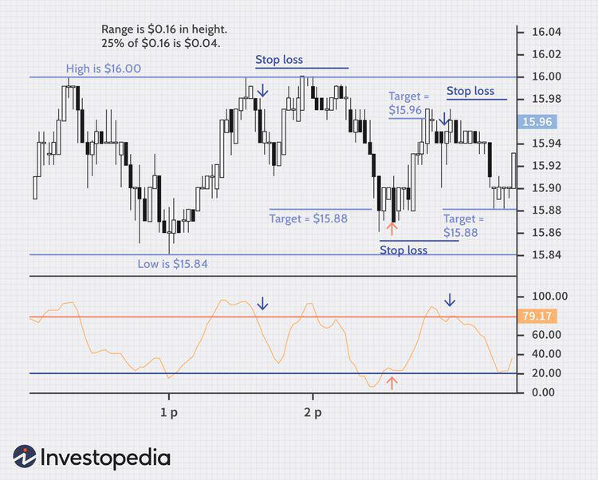

Stock trading represents a fundamental element in the landscape of modern finance, serving as a gateway to potential profit alongside inherent risks. Central to the art and science of stock trading are technical indicators, which offer vital insights into the often turbulent and unpredictable movements of the stock market, particularly when it involves highly volatile stocks. These mathematical constructs provide traders with a framework to interpret historical price data and market trends, facilitating informed decision-making.

Algorithmic trading complements this analytical approach by harnessing computer programs to automate trade executions based on predefined strategies and indicators. This automation not only accelerates the trading process, but it also minimizes the emotional biases that can adversely affect decision-making. By processing vast amounts of data rapidly and systematically, algorithmic trading empowers traders to respond swiftly to market fluctuations, thereby enhancing the potential for profitable outcomes.



This comprehensive guide sets out to explore the essential concepts and strategies that underpin success in trading volatile stocks, particularly through the application of technical indicators and algorithmic methodologies. By integrating these elements into their trading arsenal, traders can navigate the complexities of the stock market with greater precision and confidence.

## Table of Contents

## Understanding Stock Volatility

Volatility in stock trading refers to the extent of variation or fluctuation in a stock's trading price over a specified period. It is a key measure of risk and potential reward, providing insight into the instability and price movement expectations associated with a particular stock. Volatility is typically quantified through statistical measures, such as the standard deviation of returns or the variance, both of which assess the dispersion of a stock’s returns around its mean.

Highly volatile stocks are characterized by significant price movements, which can present lucrative opportunities for traders willing to accept higher levels of risk. Such stocks can experience rapid price increases and decreases within short timeframes, attracting traders who aim to capitalize on these fluctuations. However, this increased potential for rapid gains comes with an equally significant risk of sudden losses, making volatility a double-edged sword in stock trading.

Several factors contribute to stock volatility, including market sentiment, economic indicators, and company-specific news. Market sentiment, driven by the collective actions and attitudes of investors, can lead to increased buying or selling pressure, influencing stock prices. For example, during periods of investor optimism, prices may rise quickly, while during times of fear, prices might drop sharply.

Economic indicators, such as employment figures, inflation rates, and Gross Domestic Product (GDP) growth data, also impact stock [volatility](/wiki/volatility-trading-strategies). Positive economic reports can lead to increased investor confidence and stock price volatility, as traders anticipate higher corporate profits and economic expansion. Conversely, negative economic data may increase uncertainty and lead to heightened volatility as investors adjust their expectations and strategies accordingly.

Company-specific news events, such as earnings reports, product launches, or management changes, have a direct impact on a company's stock price. Positive news can drive stock prices upward, while negative developments can lead to sharp declines. Earnings surprises, in particular, can significantly affect stock volatility, as they may alter investors' perceptions of a company's future performance.

In summary, stock volatility is a complex phenomenon influenced by a myriad of factors. Understanding these elements is crucial for traders seeking to navigate the risks and rewards associated with volatile stocks. To effectively manage volatility, traders often employ strategies that consider these various influences, keeping abreast of market trends and economic developments to make informed trading decisions.

## Technical Indicators for Volatile Stocks

Technical indicators are essential tools for traders who engage in stock trading, particularly those dealing with highly volatile stocks. These indicators are mathematical calculations that utilize historical price and [volume](/wiki/volume-trading-strategy) data to help forecast future stock movements. By leveraging these tools, traders can gain insights into market trends and identify strategic entry and [exit](/wiki/exit-strategy) points.

**Moving Averages**  
Moving averages are one of the simplest and most widely used technical indicators. They smooth out price data by creating a constantly updated average price, which can help traders identify the direction of the trend. There are different types of moving averages, including the simple moving average (SMA) and the exponential moving average (EMA). The SMA is calculated by taking the arithmetic mean of a given set of prices over a specific number of periods. The EMA, meanwhile, gives more weight to recent prices, making it more responsive to new information.

$$
\text{SMA} = \frac{\sum_{i=1}^{n} P_i}{n}
$$

$$
\text{EMA}_t = \left(\frac{2}{n+1}\right) \times (P_t - \text{EMA}_{t-1}) + \text{EMA}_{t-1}
$$

Where $P_i$ represents the price at period $i$, $n$ is the number of periods, and $t$ represents the current period.

**Bollinger Bands**  
Bollinger Bands consist of a middle band being an SMA, and two outer bands, which are standard deviations away from the SMA. These bands widen during periods of high volatility and contract during low volatility, providing a visual representation of volatility and price levels.

$$
\text{Upper Band} = \text{SMA} + k \times \sigma
$$

$$
\text{Lower Band} = \text{SMA} - k \times \sigma
$$

Where $\sigma$ is the standard deviation of the price, and $k$ is typically set to 2.

**Keltner Channels**  
Similar to Bollinger Bands, Keltner Channels use a middle exponential moving average, but the bands are based on the Average True Range (ATR), which captures volatility differently. They are used to identify trending conditions and potential [breakout](/wiki/breakout-trading) points.

$$
\text{Upper Channel} = \text{EMA} + ATR \times \text{multiplier}
$$

$$
\text{Lower Channel} = \text{EMA} - ATR \times \text{multiplier}
$$

**Stochastic Oscillator**  
The Stochastic Oscillator is a [momentum](/wiki/momentum) indicator that compares a stock's closing price to its price range over a specific period. This indicator helps traders identify overbought or oversold conditions, signaling potential reversals.

$$
\text{Stochastic} = \frac{(C - L)}{(H - L)} \times 100
$$

Where $C$ is the most recent closing price, $L$ is the lowest price, and $H$ is the highest price within the look-back period.

These technical indicators, each with unique attributes, assist traders in making informed decisions about volatile stocks. By incorporating them into trading strategies, traders can better navigate the uncertainties associated with rapid price changes and enhance their ability to capitalize on potential profit opportunities.

## Algorithmic Trading: An Overview

Algorithmic trading employs computer programs to execute trading orders automatically, utilizing predefined strategies and indicators. This approach enables traders to effectively manage and analyze large volumes of market data, which might be overwhelming if processed manually. By automating the decision-making process, [algorithmic trading](/wiki/algorithmic-trading) helps minimize the impact of human emotions, which can often lead to suboptimal trading decisions. 

Automation in trading involves using algorithms that can incorporate both technical indicators and real-time market data. Technical indicators, such as moving averages, Relative Strength Index (RSI), and Bollinger Bands, play a crucial role in the formulation of these strategies. By analyzing historical price and volume data, technical indicators can help predict future price movements and provide insights into potential trends or reversals.

The algorithms used in trading are designed to react swiftly to changes in the market, executing trades in milliseconds, which is significantly faster than human capabilities. This speed is not just about executing large volumes of trades but also about identifying profitable opportunities and capitalizing on them before the market changes. Algorithms can also be programmed to take into account various market conditions, allowing traders to create robust trading strategies that adapt to different scenarios.

In addition to technical indicators, other variables such as market sentiment, economic indicators, and global events can also be integrated into these algorithms to enhance their decision-making process. This multi-faceted approach allows for a more comprehensive analysis of the market, leading to more informed trading decisions.

For instance, consider a simple moving average crossover strategy, where a buy signal is generated when a short-term moving average crosses above a long-term moving average, and a sell signal is triggered when the opposite occurs. This strategy can be coded in Python as follows:

```python
def moving_average_crossover_strategy(data, short_window, long_window):
    # Calculate short-term and long-term moving averages
    data['short_mavg'] = data['Close'].rolling(window=short_window, min_periods=1).mean()
    data['long_mavg'] = data['Close'].rolling(window=long_window, min_periods=1).mean()

    data['signal'] = 0
    # Generate buy signals: short-term moving average crosses above long-term moving average
    data.loc[data['short_mavg'] > data['long_mavg'], 'signal'] = 1
    # Generate sell signals: short-term moving average crosses below long-term moving average
    data.loc[data['short_mavg'] < data['long_mavg'], 'signal'] = -1

    return data['signal']

# Example usage with a DataFrame 'df' containing stock price data
buy_sell_signals = moving_average_crossover_strategy(df, short_window=50, long_window=200)
```

This snippet demonstrates how algorithmic trading can automate signal generation based on defined criteria. By leveraging such programmed strategies, traders can systematically approach the market, reducing the likelihood of errors due to emotional and cognitive biases. Algorithmic trading has become increasingly popular due to its efficiency and the ability to rapidly adjust to market conditions, thereby optimizing traders' opportunities for success.

## Popular Algorithms and Strategies

Algorithmic trading has revolutionized financial markets by allowing traders to execute predefined strategies with precision and speed. Among the commonly employed strategies, trend-following, mean reversion, and [arbitrage](/wiki/arbitrage) stand out as particularly effective approaches.

Trend-following strategies focus on capturing gains through the persistent movement of stock prices in a particular direction. Traders utilizing this strategy believe that a stock that is trending will continue to do so. Technical indicators such as moving averages are commonly utilized to identify and follow these trends. A simple moving average (SMA) can be calculated as:

$$
\text{SMA} = \frac{1}{n} \sum_{i=0}^{n-1} P_i
$$

where $P_i$ represents the stock price at instance $i$, and $n$ is the number of periods. When current prices cross above or below the SMA, it may signal a buy or sell opportunity, respectively.

Mean reversion strategies operate under the assumption that stock prices will return to an average value over time. The Relative Strength Index (RSI) is a popular indicator in this context, allowing traders to identify overbought or oversold conditions. RSI is given by:

$$
\text{RSI} = 100 - \left( \frac{100}{1 + \frac{\text{Average Gain}}{\text{Average Loss}}} \right)
$$

Traders use these RSI levels to anticipate price reversals towards the mean, exploiting temporary mispricing.

Arbitrage strategies seek to profit from price discrepancies in different markets or instruments. These opportunities often require complex models and high-speed execution due to the transient nature of price inefficiencies. Pair trading, a form of [statistical arbitrage](/wiki/statistical-arbitrage), involves identifying two correlated stocks. When the price of one diverges from the expected correlation, traders can profit by taking opposite positions in both stocks, assuming convergence will occur.

Algorithmic trading platforms offer robust tools for [backtesting](/wiki/backtesting) these strategies against historical data. This testing is essential to validate and optimize strategies before deployment in live markets. Backtesting assesses strategy performance, allowing traders to refine rules and adapt to volatile market conditions. Python, with libraries like PyAlgoTrade or Backtrader, offers an accessible environment for developing and testing algorithmic strategies.

In highly volatile markets, the ability to backtest and adjust strategies based on previous performance often distinguishes successful traders. Employing advanced algorithms that incorporate technical indicators and taking advantage of algorithmic trading platforms are crucial for navigating the complexities of stock trading efficiently.

## Risks and Challenges

Trading volatile stocks presents inherent risks due to the rapid and unpredictable nature of price movements. These fluctuations can lead to significant gains but also pose the threat of substantial losses. Understanding and preparing for these risks are vital for anyone engaged in stock trading.

Algorithmic trading, which utilizes computer-based systems to automate trading decisions, presents its own set of challenges. The effectiveness of algorithmic trading heavily depends on the precise design and thorough testing of algorithms to ensure they operate reliably under various market conditions. Such testing typically involves backtesting strategies on historical data, which can help identify potential flaws and optimize performance. However, past performance is not always indicative of future results, and algorithms must be continually refined to adapt to changing market conditions.

Moreover, algorithmic trading is susceptible to errors that may arise from system failures or bugs in the code. Such errors can lead to unintended trading actions, potentially resulting in financial losses. To mitigate these risks, traders should implement robust error-checking and fail-safe mechanisms within their systems.

There is also the continuous threat of market anomalies, such as flash crashes or sudden market spikes, which can more severely affect algorithmic systems due to their high-speed trading nature. Algorithms designed to rapidly exploit small market mispricings must be fine-tuned to respond correctly without exacerbating these anomalies.

Regulatory constraints play a crucial role in algorithmic trading, as financial markets are heavily regulated. Traders must ensure compliance with relevant regulations, such as those related to market transparency and trading conduct. Regulatory bodies may impose restrictions on certain trading practices or require reporting of algorithmic trading activities, which can affect algorithm design and implementation.

Ultimately, while the use of algorithms in trading offers significant benefits, including increased efficiency and reduced emotional trading biases, it requires a careful approach to manage the associated risks. Continuous monitoring and adaptation are essential to maintaining effective and compliant trading strategies in increasingly complex and volatile markets.

## The Future of Stock Trading

Technological advancements are reshaping stock trading, with data analytics and [machine learning](/wiki/machine-learning) increasingly at the forefront. These tools enable traders to parse vast quantities of data, identify patterns, and make informed decisions, enhancing both the speed and accuracy of trades. Data analytics provide traders with insights into market trends by analyzing historical and real-time data, thereby facilitating more precise forecasting of price movements. This process often involves using statistical models to assess the probability of various outcomes, helping traders mitigate risks.

Machine learning in stock trading involves algorithms that can learn from and make predictions based on data. These algorithms identify complex patterns and relationships in the data that may not be evident through traditional analysis. For instance, [reinforcement learning](/wiki/reinforcement-learning), a branch of machine learning, is particularly useful for developing trading strategies. It allows systems to evaluate outcomes of different actions and adjust strategies dynamically to maximize returns. In Python, libraries like TensorFlow and PyTorch facilitate the development of such machine learning models.

Emerging technologies and tools are expanding the range of strategies available to traders. For example, blockchain technology is offering new avenues for trading, particularly with digital assets and cryptocurrencies, providing enhanced security and transparency. High-frequency trading ([HFT](/wiki/high-frequency-trading-strategies)) algorithms, capable of executing thousands of trades in fractions of a second, exploit minute price discrepancies in the markets, though they require robust infrastructure and sophisticated algorithms to manage.

As markets evolve, continual adaptation and learning are essential for traders. With the introduction of quantum computing, the potential for even faster processing and more intricate trading algorithms emerges, although it remains largely experimental at this stage. To stay competitive, traders need to integrate new tools and technologies, such as application programming interfaces (APIs) that allow for enhanced connectivity with trading platforms, and incorporate [alternative data](/wiki/best-alternative-data) sources like social media sentiment.

In summary, the future of stock trading lies in leveraging cutting-edge technologies and tools to create more effective and nuanced strategies. As these innovations continue to develop, traders and institutions must remain agile, investing in constant learning and adaptation to harness these advancements successfully.

## Conclusion

Stock trading presents numerous opportunities for profit, particularly when traders effectively utilize technical indicators and algorithmic strategies. In the volatile landscape of stock markets, these tools can provide a systematic approach to decision-making, ultimately increasing the likelihood of favorable outcomes. Technical indicators help decipher complex market signals by analyzing historical price and volume data, identifying patterns, and predicting future movements. This allows traders to make informed decisions on entry and exit points, potentially maximizing gains while minimizing losses.

Algorithmic trading further enhances this process by automating trades based on defined criteria, enabling traders to react quickly to market changes. This automation reduces the emotional impact often associated with manual trading and can process substantial datasets at high speeds. Nevertheless, the complexity of algorithms necessitates a comprehensive understanding of market dynamics and diligent risk management to ensure their accuracy and reliability.

Success in trading highly volatile stocks requires a deep appreciation of potential risks and challenges. Rapid price fluctuations can lead to significant rewards or substantial losses, emphasizing the need for adept risk management strategies. Traders must remain vigilant and adaptable, recognizing market anomalies and technological advancements that could impact their trading activities.

Continuous learning is pivotal in navigating the evolving landscape of stock trading. As technological innovations and market dynamics advance, traders need to stay informed about the latest tools and techniques. By doing so, they can effectively harness the power of technology, optimizing their trading strategies to meet their financial goals. This commitment to education and adaptation is essential to remain competitive and successful in the fast-paced world of stock trading.

## References & Further Reading

[1]: Bergstra, J., Bardenet, R., Bengio, Y., & Kégl, B. (2011). ["Algorithms for Hyper-Parameter Optimization."](https://dl.acm.org/doi/10.5555/2986459.2986743) Advances in Neural Information Processing Systems 24.

[2]: ["Advances in Financial Machine Learning"](https://www.amazon.com/Advances-Financial-Machine-Learning-Marcos/dp/1119482089) by Marcos Lopez de Prado.

[3]: ["Evidence-Based Technical Analysis: Applying the Scientific Method and Statistical Inference to Trading Signals"](https://www.amazon.com/Evidence-Based-Technical-Analysis-Scientific-Statistical/dp/0470008741) by David Aronson.

[4]: ["Machine Learning for Algorithmic Trading"](https://github.com/stefan-jansen/machine-learning-for-trading) by Stefan Jansen.

[5]: ["Quantitative Trading: How to Build Your Own Algorithmic Trading Business"](https://www.amazon.com/Quantitative-Trading-Build-Algorithmic-Business/dp/1119800064) by Ernest P. Chan.