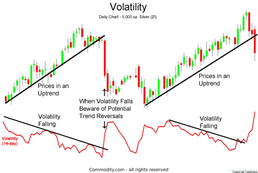

## Table of Contents

## What are technical indicators and why are they important for trading?

Technical indicators are tools that traders use to help them make decisions about buying and selling stocks, currencies, or other financial assets. They are based on mathematical calculations using historical price, volume, or open interest data. These indicators help traders predict future price movements by identifying patterns and trends in the market. Some common technical indicators include moving averages, the Relative Strength Index (RSI), and the Moving Average Convergence Divergence (MACD).

Technical indicators are important for trading because they provide a way to analyze the market more objectively. Instead of relying solely on gut feelings or news events, traders can use these indicators to make more informed decisions. For example, if a moving average shows that a stock's price is trending upwards, a trader might decide to buy the stock, expecting the price to continue rising. By using technical indicators, traders can better understand market trends and potentially increase their chances of making profitable trades.

## How do technical indicators help in trading volatile stocks?

Technical indicators are really helpful when trading stocks that go up and down a lot, known as volatile stocks. These indicators give traders a way to see patterns and trends that might be hard to spot just by looking at the stock's price. For example, a tool called the Relative Strength Index (RSI) can show if a stock is overbought or oversold. If the RSI is high, it might mean the stock's price is too high and could go down soon. If it's low, the price might be too low and could go up. This helps traders decide when to buy or sell the stock.

Another useful indicator for volatile stocks is the Bollinger Bands. These bands show the high and low points of a stock's price over time. When the stock's price gets close to the upper band, it might be a good time to sell because the price could drop soon. When the price is near the lower band, it might be a good time to buy because the price could go up. By using these indicators, traders can make better choices about when to trade volatile stocks, even when the market is moving a lot.

## What are the most common technical indicators used for volatile stocks?

When trading stocks that move up and down a lot, traders often use a few key technical indicators to help them make decisions. One of the most common is the Relative Strength Index (RSI). The RSI helps traders see if a stock is overbought or oversold. If the RSI is above 70, it means the stock might be too expensive and could drop soon. If it's below 30, the stock might be too cheap and could go up. This helps traders know when it might be a good time to buy or sell.

Another popular indicator is Bollinger Bands. These bands show the highest and lowest points of a stock's price over time. When the stock's price gets close to the top band, it might be a good time to sell because the price could fall soon. When the price is near the bottom band, it might be a good time to buy because the price could rise. Traders use these bands to spot when a stock is moving too far from its usual range, which is especially helpful with volatile stocks.

Lastly, the Moving Average Convergence Divergence (MACD) is also widely used. The MACD helps traders see the difference between two moving averages of a stock's price. When the MACD line crosses above the signal line, it might be a good time to buy because it suggests the stock's price could go up. When it crosses below, it might be a good time to sell because the price could go down. This indicator helps traders understand the momentum of a volatile stock, making it easier to predict future movements.

## Can you explain how to use the Relative Strength Index (RSI) for volatile stocks?

The Relative Strength Index (RSI) is a tool that helps traders see if a stock is overbought or oversold. It's really useful for stocks that go up and down a lot. The RSI is a number between 0 and 100. If the RSI is over 70, it means the stock might be too expensive and could drop soon. This is called being overbought. If the RSI is under 30, the stock might be too cheap and could go up. This is called being oversold. Traders use these levels to decide when to buy or sell the stock.

For example, if you're looking at a volatile stock and its RSI is 75, you might think about selling it because it's overbought and the price might go down. On the other hand, if the RSI is 25, you might want to buy it because it's oversold and the price might go up. By keeping an eye on the RSI, traders can make better decisions about when to trade volatile stocks, even when the market is moving a lot.

## What is the Moving Average Convergence Divergence (MACD) and how does it apply to volatile stocks?

The Moving Average Convergence Divergence (MACD) is a tool that traders use to see the direction and strength of a stock's price movement. It does this by looking at the difference between two moving averages of the stock's price. The MACD has two lines: the MACD line and the signal line. When the MACD line crosses above the signal line, it's a sign that the stock's price might go up, so traders might want to buy it. When the MACD line crosses below the signal line, it's a sign that the stock's price might go down, so traders might want to sell it.

For volatile stocks, the MACD is really helpful because it can show quick changes in the stock's price. These stocks can move up and down a lot, and the MACD helps traders see when the price is gaining or losing momentum. By watching the MACD, traders can make better choices about when to buy or sell a volatile stock, even when the market is moving a lot. It gives them a clearer picture of what might happen next with the stock's price.

## How can Bollinger Bands be used to trade volatile stocks effectively?

Bollinger Bands are a helpful tool for trading stocks that move up and down a lot. They show the highest and lowest points of a stock's price over time. There are three lines: the middle line, which is a moving average, and two outer lines called bands. These bands get wider when the stock's price is moving a lot and narrower when it's not moving as much. When the stock's price gets close to the top band, it might be a good time to sell because the price could drop soon. When the price is near the bottom band, it might be a good time to buy because the price could go up.

Using Bollinger Bands, traders can spot when a volatile stock is moving too far from its usual range. For example, if the stock's price touches the top band, it might mean the stock is overbought and could go down. If it touches the bottom band, it might mean the stock is oversold and could go up. By watching where the stock's price is in relation to the bands, traders can make better decisions about when to buy or sell, even when the market is moving a lot. This helps them take advantage of the big price swings that happen with volatile stocks.

## What role does the Average True Range (ATR) play in managing volatility?

The Average True Range (ATR) is a tool that helps traders understand how much a stock's price moves up and down. It measures the [volatility](/wiki/volatility-trading-strategies) of a stock by looking at the difference between the highest and lowest prices over a certain time. A higher ATR means the stock is moving a lot, which is common for volatile stocks. A lower ATR means the stock's price is not moving as much. By using the ATR, traders can get a better idea of how much risk they are taking when they buy or sell a stock.

Traders use the ATR to set their stop-loss orders, which are like safety nets to limit how much money they can lose. If a stock has a high ATR, traders might set a wider stop-loss to give the stock more room to move without getting sold too soon. If the ATR is low, they might set a tighter stop-loss because the stock's price doesn't move as much. This way, the ATR helps traders manage the ups and downs of volatile stocks and make smarter trading choices.

## How do volume-based indicators like the On-Balance Volume (OBV) assist in trading volatile stocks?

Volume-based indicators like the On-Balance Volume (OBV) help traders understand how much interest there is in a stock by looking at how many shares are being bought and sold. The OBV adds up the volume on days when the stock's price goes up and subtracts it on days when the price goes down. For volatile stocks, this can show if the big price swings are backed by a lot of trading or if they're just happening because a few people are moving the price. If the OBV is going up while the stock's price is also going up, it might mean more people are interested in buying, which could be a good sign for the stock.

Traders use the OBV to spot when a stock might be ready to change direction. If the stock's price is going up but the OBV is going down, it might mean the price increase isn't strong and could soon go down. This can be really helpful with volatile stocks because it gives traders a way to check if the big moves in price are likely to last or if they're just short-term changes. By watching the OBV, traders can make better decisions about when to buy or sell, even when the stock's price is moving a lot.

## What advanced technical indicators should experienced traders use for volatile stocks?

Experienced traders often use advanced technical indicators like the Stochastic Oscillator to help them trade volatile stocks. The Stochastic Oscillator measures where a stock's price is in relation to its high and low prices over a certain time. It gives a number between 0 and 100. If the number is over 80, it means the stock might be too expensive and could go down soon. If it's under 20, the stock might be too cheap and could go up. This helps traders see if a stock is overbought or oversold, which is really helpful when the stock's price is moving a lot.

Another useful indicator for experienced traders is the Parabolic SAR. This indicator shows points where the stock's price might change direction. It looks like little dots above or below the price on a chart. When the dots are below the price, it suggests the price could keep going up, so traders might want to buy. When the dots are above the price, it suggests the price could go down, so traders might want to sell. By using the Parabolic SAR, traders can spot when a volatile stock might start moving in a different direction, helping them make better trading choices.

## How can combining multiple technical indicators improve trading decisions in volatile markets?

Combining multiple technical indicators can help traders make better decisions when trading stocks that move up and down a lot. By using more than one indicator, traders can see the stock's price from different angles. For example, if the Relative Strength Index (RSI) shows a stock is overbought, but the Moving Average Convergence Divergence (MACD) is still showing upward momentum, a trader might wait to see if the MACD changes before deciding to sell. This way, they can check if the signals from different indicators agree with each other, which can make their trading decisions more reliable.

Using several indicators also helps traders spot when a big change in the stock's price might happen. For instance, if the Bollinger Bands show the stock's price is near the top band and the On-Balance Volume (OBV) is starting to drop, it could mean the price is about to go down. By looking at these signs together, traders can get a clearer picture of what might happen next with the stock's price. This can help them decide the best times to buy or sell, even when the market is moving a lot.

## What are the limitations and potential pitfalls of using technical indicators for volatile stocks?

Using technical indicators for volatile stocks can be tricky because they are not always right. Sometimes, the indicators can give false signals, making traders think a stock's price will go up or down when it actually does the opposite. This can lead to losing money if traders buy or sell based on these wrong signals. Also, because volatile stocks move a lot, the indicators can change quickly, which can make it hard to make good trading choices. Traders need to be careful and not rely too much on just one indicator.

Another problem is that technical indicators do not take into account big news or events that can affect a stock's price. For example, if a company announces something important, the stock's price might move in a way that the indicators did not predict. This means traders need to look at more than just the indicators. They should also pay attention to what is happening in the world and with the company. By using indicators along with other information, traders can make better decisions, but they should always remember that no tool is perfect.

## How can traders backtest technical indicators to optimize strategies for volatile stocks?

Backtesting is a way for traders to check how well their trading strategies work by looking at past data. To backtest technical indicators for volatile stocks, traders use a computer program to see how the indicators would have worked if they had used them in the past. They can try different settings for the indicators, like changing the time period for the RSI or the length of the moving averages in the MACD. By doing this, traders can see which settings would have made the most money and which ones would have led to losses. This helps them find the best way to use the indicators for their trading.

Even though backtesting can show what might have worked in the past, it's not perfect. The stock market changes all the time, and what worked before might not work the same way in the future. Traders need to be careful and not trust backtesting too much. They should also try their strategies in a practice account before using real money. By combining backtesting with other ways of learning about the market, traders can make better plans for trading volatile stocks.

## What are the technical indicators for volatile stocks?

Technical indicators are essential tools for traders who engage in stock trading, particularly those dealing with highly volatile stocks. These indicators are mathematical calculations that utilize historical price and [volume](/wiki/volume-trading-strategy) data to help forecast future stock movements. By leveraging these tools, traders can gain insights into market trends and identify strategic entry and [exit](/wiki/exit-strategy) points.

**Moving Averages**  
Moving averages are one of the simplest and most widely used technical indicators. They smooth out price data by creating a constantly updated average price, which can help traders identify the direction of the trend. There are different types of moving averages, including the simple moving average (SMA) and the exponential moving average (EMA). The SMA is calculated by taking the arithmetic mean of a given set of prices over a specific number of periods. The EMA, meanwhile, gives more weight to recent prices, making it more responsive to new information.

$$
\text{SMA} = \frac{\sum_{i=1}^{n} P_i}{n}
$$

$$
\text{EMA}_t = \left(\frac{2}{n+1}\right) \times (P_t - \text{EMA}_{t-1}) + \text{EMA}_{t-1}
$$

Where $P_i$ represents the price at period $i$, $n$ is the number of periods, and $t$ represents the current period.

**Bollinger Bands**  
Bollinger Bands consist of a middle band being an SMA, and two outer bands, which are standard deviations away from the SMA. These bands widen during periods of high volatility and contract during low volatility, providing a visual representation of volatility and price levels.

$$
\text{Upper Band} = \text{SMA} + k \times \sigma
$$

$$
\text{Lower Band} = \text{SMA} - k \times \sigma
$$

Where $\sigma$ is the standard deviation of the price, and $k$ is typically set to 2.

**Keltner Channels**  
Similar to Bollinger Bands, Keltner Channels use a middle exponential moving average, but the bands are based on the Average True Range (ATR), which captures volatility differently. They are used to identify trending conditions and potential [breakout](/wiki/breakout-trading) points.

$$
\text{Upper Channel} = \text{EMA} + ATR \times \text{multiplier}
$$

$$
\text{Lower Channel} = \text{EMA} - ATR \times \text{multiplier}
$$

**Stochastic Oscillator**  
The Stochastic Oscillator is a [momentum](/wiki/momentum) indicator that compares a stock's closing price to its price range over a specific period. This indicator helps traders identify overbought or oversold conditions, signaling potential reversals.

$$
\text{Stochastic} = \frac{(C - L)}{(H - L)} \times 100
$$

Where $C$ is the most recent closing price, $L$ is the lowest price, and $H$ is the highest price within the look-back period.

These technical indicators, each with unique attributes, assist traders in making informed decisions about volatile stocks. By incorporating them into trading strategies, traders can better navigate the uncertainties associated with rapid price changes and enhance their ability to capitalize on potential profit opportunities.

## What are some popular algorithms and strategies?

Algorithmic trading has revolutionized financial markets by allowing traders to execute predefined strategies with precision and speed. Among the commonly employed strategies, trend-following, mean reversion, and [arbitrage](/wiki/arbitrage) stand out as particularly effective approaches.

Trend-following strategies focus on capturing gains through the persistent movement of stock prices in a particular direction. Traders utilizing this strategy believe that a stock that is trending will continue to do so. Technical indicators such as moving averages are commonly utilized to identify and follow these trends. A simple moving average (SMA) can be calculated as:

$$
\text{SMA} = \frac{1}{n} \sum_{i=0}^{n-1} P_i
$$

where $P_i$ represents the stock price at instance $i$, and $n$ is the number of periods. When current prices cross above or below the SMA, it may signal a buy or sell opportunity, respectively.

Mean reversion strategies operate under the assumption that stock prices will return to an average value over time. The Relative Strength Index (RSI) is a popular indicator in this context, allowing traders to identify overbought or oversold conditions. RSI is given by:

$$
\text{RSI} = 100 - \left( \frac{100}{1 + \frac{\text{Average Gain}}{\text{Average Loss}}} \right)
$$

Traders use these RSI levels to anticipate price reversals towards the mean, exploiting temporary mispricing.

Arbitrage strategies seek to profit from price discrepancies in different markets or instruments. These opportunities often require complex models and high-speed execution due to the transient nature of price inefficiencies. Pair trading, a form of [statistical arbitrage](/wiki/statistical-arbitrage), involves identifying two correlated stocks. When the price of one diverges from the expected correlation, traders can profit by taking opposite positions in both stocks, assuming convergence will occur.

Algorithmic trading platforms offer robust tools for [backtesting](/wiki/backtesting) these strategies against historical data. This testing is essential to validate and optimize strategies before deployment in live markets. Backtesting assesses strategy performance, allowing traders to refine rules and adapt to volatile market conditions. Python, with libraries like PyAlgoTrade or Backtrader, offers an accessible environment for developing and testing algorithmic strategies.

In highly volatile markets, the ability to backtest and adjust strategies based on previous performance often distinguishes successful traders. Employing advanced algorithms that incorporate technical indicators and taking advantage of [algorithmic trading](/wiki/algorithmic-trading) platforms are crucial for navigating the complexities of stock trading efficiently.

## References & Further Reading

[1]: Bergstra, J., Bardenet, R., Bengio, Y., & Kégl, B. (2011). ["Algorithms for Hyper-Parameter Optimization."](https://dl.acm.org/doi/10.5555/2986459.2986743) Advances in Neural Information Processing Systems 24.

[2]: ["Advances in Financial Machine Learning"](https://www.amazon.com/Advances-Financial-Machine-Learning-Marcos/dp/1119482089) by Marcos Lopez de Prado.

[3]: ["Evidence-Based Technical Analysis: Applying the Scientific Method and Statistical Inference to Trading Signals"](https://www.amazon.com/Evidence-Based-Technical-Analysis-Scientific-Statistical/dp/0470008741) by David Aronson.

[4]: ["Machine Learning for Algorithmic Trading"](https://github.com/stefan-jansen/machine-learning-for-trading) by Stefan Jansen.

[5]: ["Quantitative Trading: How to Build Your Own Algorithmic Trading Business"](https://www.amazon.com/Quantitative-Trading-Build-Algorithmic-Business/dp/1119800064) by Ernest P. Chan.