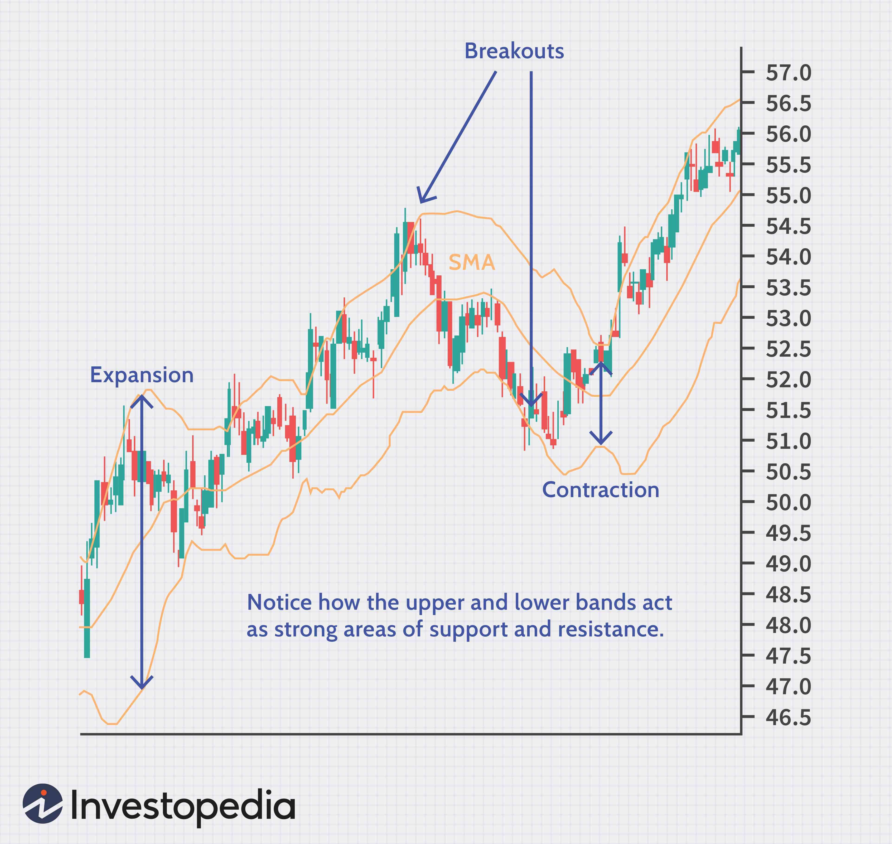

Algorithmic trading, often abbreviated as algo trading, has become a fundamental element in the financial markets, offering traders the ability to execute orders with speed and precision based on pre-defined criteria. This technology leverages complex algorithms, which can analyze market data and execute trades at speeds far beyond human capability. A crucial component of algorithmic trading is the use of technical indicators, which are mathematical calculations that assist traders in understanding market behavior and predicting future price movements.

Technical indicators play a pivotal role in developing automated trading strategies. They derive from historical price data, volume, and other market variables, providing a quantitative basis for analysis and decision-making. These indicators help to distill large volumes of data into actionable insights, enabling traders and automated systems to gauge market trends and potential price shifts efficiently.



The relevance of technical indicators extends beyond mere data crunching; they serve as vital tools in algorithmic trading by providing signals that guide trading decisions. Traders rely on these signals to identify entry and exit points, manage risks, and optimize their strategies in response to market dynamics. This article provides an exploration of various technical indicators, examining their utility, relevance, and integral role in contemporary algorithmic trading practices, ensuring that traders can navigate the markets with enhanced accuracy and confidence.

## Table of Contents

## Understanding Technical Indicators

Technical indicators are crucial tools in financial markets, representing mathematical calculations derived from historical data such as price, [volume](/wiki/volume-trading-strategy), and open interest. These indicators assist traders in deciphering ongoing market trends and making informed trading decisions. By analyzing patterns within these statistical data points, traders can forecast potential price movements and thus enhance their decision-making process.

One of the primary types of technical indicators is Moving Averages. This tool helps in smoothing out price data to identify the direction of a trend. There are several forms of moving averages, with the Simple Moving Average (SMA) and Exponential Moving Average (EMA) being the most prevalent. SMA is calculated by averaging a select number of past data points, which represents the average price over a particular period. In contrast, EMA gives more weight to recent data, making it more responsive to new information.

Another essential indicator is the Relative Strength Index (RSI), which measures the speed and change of price movements. It is used to identify overbought or oversold conditions in a security, assisting traders in recognizing potential reversal points. RSI is typically measured on a scale of 0 to 100, with levels above 70 indicating a possible overbought condition and levels below 30 pointing to a potential oversold condition.

Bollinger Bands constitute another popular technical indicator. They consist of a Simple Moving Average (SMA) and two bands at a specified number of standard deviations above and below the SMA. Bollinger Bands are employed to measure market [volatility](/wiki/volatility-trading-strategies), with wider bands denoting increased volatility and narrower bands indicating decreased volatility.

These indicators, among others, are integral to the [algorithmic trading](/wiki/algorithmic-trading) landscape, enabling traders to extract meaningful insights and craft strategies that are data-driven and objective in nature. Understanding these tools can significantly enhance a trader's ability to navigate the complexities of the financial markets.

## Why Use Technical Indicators in Algo Trading?

Technical indicators are critical in algorithmic trading due to their ability to provide objective, data-driven insights, reducing reliance on subjective interpretations. They transform historical price and volume data into quantifiable metrics, enabling traders to identify patterns and trends. For instance, using moving averages smooths out price fluctuations, offering clearer visualizations of market directions, thus facilitating informed decisions.

In algorithmic trading strategies, technical indicators play a pivotal role by generating buy or sell signals. For example, a Relative Strength Index (RSI) below 30 might trigger a buy signal, while an RSI above 70 could suggest a sell opportunity. These signals form the foundation for automated systems, allowing them to execute trades without human intervention, increasing efficiency and speed.

Risk management is another essential aspect where technical indicators prove indispensable. By setting stop-loss levels and defining profit targets, indicators like Bollinger Bands and the Moving Average Convergence Divergence (MACD) assist traders in limiting potential losses and securing gains. For example, Bollinger Bands, which incorporate a simple moving average and two standard deviations, help traders understand volatility and define [exit](/wiki/exit-strategy) strategies effectively.

Ultimately, technical indicators not only streamline the decision-making process through objective criteria but also enhance the overall efficiency of trading strategies by integrating automated mechanisms and robust risk management techniques.

## Popular Technical Indicators in Algorithmic Trading

Moving Averages are a fundamental tool in algorithmic trading, utilized to smooth out price data and indicate trends over time. Two primary types are the Simple Moving Average (SMA) and the Exponential Moving Average (EMA). The SMA is calculated by taking the arithmetic mean of a given set of prices over a specific number of days in the past. Conversely, the EMA places greater weight on more recent prices, making it more responsive to new information.

The Relative Strength Index (RSI) is a [momentum](/wiki/momentum) oscillator that measures the speed and change of price movements, functioning to identify overbought or oversold conditions in a trading instrument. The RSI oscillates between 0 and 100, with levels above 70 typically indicating overbought conditions and levels below 30 suggesting oversold conditions. This can help traders anticipate possible reversal points.

The Moving Average Convergence Divergence (MACD) is used to assess the relationship between two moving averages of a security's price. It is calculated by subtracting the 26-period EMA from the 12-period EMA. A nine-day EMA of the MACD, known as the "signal line," is then plotted on top of the MACD line, which can function as a trigger for buy and sell signals. MACD is adept at indicating both momentum and trend strength.

Bollinger Bands are a volatility indicator consisting of a SMA with upper and lower bands calculated at a set standard deviation away from the SMA. The bands expand and contract based on market volatility. When prices consistently touch the upper band, they are considered overbought, while touches on the lower band suggest oversold conditions. Traders often use Bollinger Bands to predict market movements and reversals based on volatility levels.

The Stochastic Oscillator compares a security's closing price to its price range over a specific period, typically 14 days. It generates values between 0 and 100. A reading above 80 indicates potential overbought conditions, while a reading below 20 suggests oversold conditions. The Stochastic Oscillator is particularly useful for predicting reversals when used in conjunction with other technical analysis tools.

```python
# Example of calculating Simple Moving Average (SMA) in Python
def calculate_sma(prices, period):
    if len(prices) < period:
        return None
    return sum(prices[-period:]) / period

# Example of calculating Exponential Moving Average (EMA) in Python
def calculate_ema(prices, period):
    if len(prices) < period:
        return None
    k = 2 / (period + 1) # smoothing factor
    ema = prices[0] # start with the first price
    for price in prices[1:]:
        ema = price * k + ema * (1 - k)
    return ema
```

These indicators are crucial tools in algorithmic trading, assisting traders in making informed decisions based on historical data patterns and market behavior.

## Challenges and Considerations

In algorithmic trading, while technical indicators are fundamental tools, they are not without their limitations and challenges. Traders and developers must be vigilant about over-reliance, false signals, lagging tendencies, and optimization biases associated with these indicators.

Firstly, over-reliance on technical indicators can skew trading strategies, leading traders to overlook broader market dynamics. When traders depend solely on these metrics, they risk ignoring qualitative factors such as macroeconomic changes, geopolitical events, or company-specific news that could significantly impact asset prices.

False signals are another prominent challenge. In highly volatile or range-bound markets, indicators may generate buy or sell signals that do not correspond to genuine shifts in market sentiment or direction. For example, the Moving Average Convergence Divergence (MACD) might indicate a bullish crossover in a volatile market, only to have the trend reverse shortly after. This can lead to losses if trades are executed based on these misleading signals.

Lagging indicators present additional concerns, as most indicators rely on historical data, reflecting past market behavior rather than forecasting future movements. For example, a simple moving average (SMA) computes the average price over a specified period:

$$
\text{SMA} = \frac{P_1 + P_2 + \ldots + P_n}{n}
$$

where $P$ represents price data points over $n$ periods. Such calculations can result in delayed responses to current market conditions, potentially causing traders to miss optimal entry or exit points.

Optimization bias is a further pitfall. Traders may over-tune their strategies to fit historical data, a process known as overfitting. This customization might yield impressive backtest results but often performs poorly in live trading environments where market conditions differ from the historical dataset. For example, if a strategy has been optimized to perform under specific conditions present in a past bull market, it may fail to deliver similar results in a bearish environment.

To mitigate these challenges, traders should integrate technical indicators with other analysis techniques and remain adaptive to market changes. Employing a diverse set of tools and maintaining a comprehensive understanding of market context is crucial for achieving robust trading performance.

## When are Technical Indicators Red Flags?

Technical indicators become red flags when traders excessively rely on them without accounting for the broader market context. Indicators, while useful, do not always correlate significantly with future returns. This mismatch can lead to misguided trading strategies and poor investment decisions. For instance, a trader may observe a bullish signal from an indicator like the Relative Strength Index (RSI) without considering macroeconomic factors or upcoming geopolitical events that could impact market conditions. This tunnel vision can result in erroneous trades.

Moreover, technical indicators may require substantial computing resources, rendering them impractical for real-time application. High-frequency trading environments demand quick data processing, and if an indicator is computationally heavy, it may not offer the speed required for timely decision-making. For instance, calculating a complex indicator on a dataset with large time intervals could delay trade executions, potentially missing market opportunities. Traders might use Python libraries such as NumPy or pandas to optimize calculations, yet the inherent computational demand remains a challenge:

```python
import numpy as np
import pandas as pd

# Sample code to calculate a moving average
def moving_average(data, window_size):
    return data.rolling(window=window_size).mean()

data = pd.Series(np.random.randn(1000))
ma = moving_average(data, 20)
```

Furthermore, certain indicators generate numerous false signals, particularly in volatile or range-bound markets. Consequently, traders might respond to incorrect signals, entering or exiting positions prematurely. Recognizing these potential pitfalls, traders need to implement robust risk management strategies and integrate technical indicators with other analytical tools and market knowledge to enhance decision-making processes.

## When are Technical Indicators Necessary?

Technical indicators play a crucial role in certain algorithmic trading scenarios, particularly when technical and computational efficiency is paramount. In environments with low bandwidth, transferring large volumes of raw data for processing can be impractical. Instead, conducting computations at the source using technical indicators is advantageous. This approach reduces data transfer requirements, allowing only distilled, relevant information to be communicated, which optimizes bandwidth utilization and accelerates decision-making processes.

Moreover, technical indicators serve as a foundational entry point for traders who are new to automated strategies. These indicators provide common metrics and standardized formats that simplify the initiation steps in automated trading, thus lowering the learning curve. They encapsulate complex market movements into comprehensible metrics such as trends, momentum, and volatility, thereby allowing traders to quickly grasp fundamental market conditions.

In certain situations, technical indicators are indispensable due to their efficient computational properties. They often provide insights that are not readily achievable through other methods. For instance, the Moving Average Convergence Divergence (MACD) and Relative Strength Index (RSI) can efficiently indicate momentum changes and potential reversal points without requiring exhaustive data processing. This computational efficiency is vital for high-frequency trading, where rapid analysis and real-time decision-making are critical.

The blend of computational efficiency and valuable insight offered by technical indicators makes them not only useful but sometimes necessary in specific trading contexts, particularly those demanding real-time responses and efficient data processing.

## Conclusion

Technical indicators remain a vital component of algorithmic trading, providing essential insights and data-driven trading signals. These mathematical tools enable traders to interpret market dynamics and make informed decisions by analyzing historical price, volume, and volatility data. Despite their utility, it is crucial for traders to recognize the limitations of technical indicators, such as the propensity for false signals or lagging data. Therefore, a comprehensive analysis that includes market trends, economic indicators, and other relevant data should complement the use of these indicators to formulate robust trading strategies.

To effectively incorporate technical indicators into trading strategies, several platforms and resources offer valuable support. UltraAlgo provides traders with pre-built algorithms and customizable options that simplify the integration of technical indicators into automated strategies. Similarly, Databento offers access to extensive datasets, enabling traders to backtest and refine their strategies with historical market data. By leveraging these tools, traders can enhance their ability to execute successful algo trading strategies, drawing on the strengths of technical indicators while mitigating their inherent weaknesses.

## References & Further Reading

[1]: Bergstra, J., Bardenet, R., Bengio, Y., & Kégl, B. (2011). ["Algorithms for Hyper-Parameter Optimization."](https://papers.nips.cc/paper/4443-algorithms-for-hyper-parameter-optimization) Advances in Neural Information Processing Systems 24.

[2]: ["Advances in Financial Machine Learning"](https://www.amazon.com/Advances-Financial-Machine-Learning-Marcos/dp/1119482089) by Marcos Lopez de Prado

[3]: ["Evidence-Based Technical Analysis: Applying the Scientific Method and Statistical Inference to Trading Signals"](https://www.amazon.com/Evidence-Based-Technical-Analysis-Scientific-Statistical/dp/0470008741) by David Aronson

[4]: ["Machine Learning for Algorithmic Trading"](https://github.com/stefan-jansen/machine-learning-for-trading) by Stefan Jansen

[5]: ["Quantitative Trading: How to Build Your Own Algorithmic Trading Business"](https://books.google.com/books/about/Quantitative_Trading.html?id=j70yEAAAQBAJ) by Ernest P. Chan