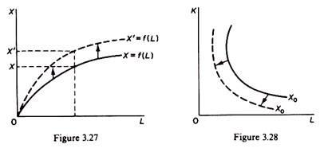

## Table of Contents

## What is a Technical Progress Function?

A Technical Progress Function is a way to measure how technology improves over time in an economy. It helps economists understand how new inventions and better ways of doing things can make a country's businesses more productive. Think of it like a recipe that shows how technology can help make more goods and services with the same amount of work.

This function is important because it can show how technology can lead to economic growth. By looking at the Technical Progress Function, experts can predict how fast an economy might grow in the future based on new technology. It's like a tool that helps plan for the future by understanding how technology can change the way we work and live.

## Why is the Technical Progress Function important in economic models?

The Technical Progress Function is important in economic models because it helps us understand how technology makes an economy grow. It shows how new inventions and better ways of doing things can help businesses produce more with the same amount of work. This is key because it lets economists see how technology can make a big difference in how much a country can produce and how rich it can become.

By using the Technical Progress Function, experts can predict how fast an economy might grow in the future. They can look at how quickly new technologies are being developed and used, and then guess how this will affect the economy. This helps governments and businesses plan for the future, making sure they can take advantage of new technology to improve their country's wealth and well-being.

## How does the Technical Progress Function differ from other growth functions?

The Technical Progress Function focuses on how technology helps an economy grow. It looks at new inventions and better ways of doing things to see how they can make businesses more productive. This is different from other growth functions that might look at things like how much people work or how much money they spend. The Technical Progress Function is special because it tries to measure something that's hard to see, like how a new machine can help a factory make more stuff.

Other growth functions, like the production function, might focus on how much labor and capital an economy uses. They look at things you can count, like the number of workers or the amount of money invested in machines. But the Technical Progress Function adds something new by trying to capture the effect of technology, which can be tricky because it's not as easy to measure as labor or capital. This makes it a useful tool for understanding how technology can change an economy in ways that other functions might miss.

## What are the key components of a Technical Progress Function?

The Technical Progress Function has a few important parts that help us understand how technology makes an economy grow. One key part is the rate of technological change. This looks at how fast new inventions and better ways of doing things are happening. It's like checking how quickly new gadgets or machines are being made that can help businesses do more work.

Another important part is the way technology spreads through the economy. This means how quickly new technology is used by different businesses and people. If new technology spreads fast, it can help the whole economy grow faster. It's like when a new smartphone comes out and lots of people start using it right away.

The last part is how technology affects how much can be produced. This is about how new technology can help make more goods and services with the same amount of work. It's like when a new machine helps a factory make more toys without needing more workers. All these parts together help us see how technology can make an economy bigger and better.

## Can you explain the mathematical representation of a Technical Progress Function?

The Technical Progress Function can be shown with a simple math formula. It usually looks something like this: Y = A(t) * F(L, K). Here, Y stands for how much stuff an economy makes, A(t) is the part that shows how technology is changing over time, and F(L, K) is a function that uses L for labor (workers) and K for capital (machines and buildings). The A(t) part is special because it grows over time, showing how technology helps make more stuff.

In this formula, A(t) can be written as A(t) = A_0 * e^(gt), where A_0 is the starting level of technology, e is a special number used in math (about 2.718), g is the rate at which technology grows, and t is time. This means that as time goes by, the A(t) part gets bigger, showing that technology is getting better and helping the economy make more things. By using this formula, economists can see how important technology is for making an economy grow.

## What are some common types of Technical Progress Functions used in economic analysis?

In economic analysis, one common type of Technical Progress Function is the "neutral" or "Hicks-neutral" progress function. This type assumes that technology improves in a way that affects all inputs equally. Imagine a new machine that helps workers do their jobs better but doesn't change how much they work or how many machines are used. This kind of function is easy to use because it keeps things simple, showing technology as a number that grows over time and makes everything more productive.

Another type is the "biased" or "non-neutral" progress function. This one says that technology can change how much we use labor or capital. For example, a new computer might mean we need fewer workers but more machines. This type of function is more complex because it shows that technology can make us use more of one thing and less of another. Economists use this to see how technology can shift the way an economy works, making it more focused on machines or people.

A third type is the "embodied" technical progress function. This one says that new technology is only useful when it's put into new machines or tools. Think of a new car model with better technology; you only get the benefit if you buy the new car. This function helps economists understand how quickly new technology spreads through an economy, as it depends on how fast people and businesses buy new stuff.

## How do changes in technology affect the Technical Progress Function?

Changes in technology directly affect the Technical Progress Function by changing how much an economy can produce. When new inventions or better ways of doing things come along, they make businesses more productive. This means they can make more stuff with the same amount of work. In the Technical Progress Function, this shows up as the part that grows over time, making the whole economy bigger. If technology improves quickly, the function grows faster, showing that the economy can produce more and grow faster.

But technology doesn't just make everything better in the same way. Sometimes, new technology can change how much we use labor or capital. For example, a new robot might mean we need fewer workers but more machines. This can make the Technical Progress Function more complicated because it shows that technology can shift the way an economy works. It might make us use more machines or more people, depending on what the new technology does.

## What role does the Technical Progress Function play in predicting economic growth?

The Technical Progress Function helps economists predict how fast an economy will grow by showing how technology makes businesses more productive. It looks at how quickly new inventions and better ways of doing things are happening. If technology is improving fast, the Technical Progress Function grows quickly, which means the economy can make more stuff and grow faster. This helps experts guess how big the economy will be in the future.

But it's not just about making more stuff. The Technical Progress Function also shows how technology can change the way an economy works. For example, if new technology means we need fewer workers but more machines, this changes how we use labor and capital. By understanding these changes, economists can better predict not just how much the economy will grow, but also how it will grow, helping governments and businesses plan for the future.

## How can the Technical Progress Function be empirically estimated?

To figure out the Technical Progress Function in the real world, economists look at data on how much an economy produces, how many people are working, and how much money is spent on machines and buildings. They use this information to see how technology has helped businesses make more stuff over time. They might use special math methods, like regression analysis, to find out how fast technology is growing. This helps them understand how much of the economy's growth comes from new inventions and better ways of doing things.

Sometimes, economists also look at specific examples of new technology, like new machines or software, to see how they change the way businesses work. They might study how quickly these new technologies spread through the economy and how they affect how much can be produced. By putting all this information together, economists can get a good idea of how technology is making the economy grow and use this to make better predictions about the future.

## What are the limitations and criticisms of the Technical Progress Function?

The Technical Progress Function has some problems that make it hard to use perfectly. One big issue is that it's tough to measure technology. Unlike workers or machines, which you can count easily, technology is trickier because it's always changing and not always easy to see. This means economists might guess wrong about how fast technology is growing, which can mess up their predictions about the economy. Also, the function assumes that technology helps everyone in the same way, but in real life, some businesses might use new technology better than others, making the function less accurate.

Another problem is that the Technical Progress Function doesn't always show how technology can change the way an economy works. For example, if a new machine means fewer workers are needed, the function might not capture this change well. Critics also say that the function can be too simple, missing out on other important things that affect growth, like education or government policies. Because of these issues, while the Technical Progress Function is useful, economists need to be careful about how they use it and remember its limits when making predictions about the economy.

## How has the concept of the Technical Progress Function evolved over time?

The idea of the Technical Progress Function started a long time ago when economists first noticed that technology could help economies grow. At first, they thought of it as a simple way to show how new inventions and better ways of doing things could make businesses more productive. Early versions of the function were pretty basic, focusing mainly on how technology could help make more stuff with the same amount of work. Over time, as economists learned more about how economies work, they started to see that technology could affect different parts of the economy in different ways.

As our understanding grew, the Technical Progress Function became more complex. Economists began to see that technology could change how much labor or capital an economy used. They started to use different types of functions, like the "neutral" and "biased" versions, to show these changes better. They also realized that technology might only be useful when it's put into new machines or tools, leading to the idea of "embodied" technical progress. Today, the Technical Progress Function is a key tool for understanding how technology drives economic growth, but economists know it's not perfect and keep working to make it better.

## What are the advanced applications of the Technical Progress Function in modern economic theory?

In modern economic theory, the Technical Progress Function is used in more advanced ways to understand how technology changes economies. Economists use it to study how new technology can affect different parts of the economy in different ways. For example, they look at how new inventions might make some businesses more productive than others, or how they can change the way we use workers and machines. By using detailed data and complex math, economists can see how technology spreads through the economy and how quickly it happens. This helps them predict not just how much the economy will grow, but also how it will grow, which is important for planning and policy-making.

Another advanced use of the Technical Progress Function is in studying how technology can create new industries or change old ones. Economists use it to understand how new technology can lead to new jobs and new ways of making things. They also look at how technology can make some jobs disappear or change, which is important for understanding how people's lives are affected by new inventions. By looking at these big changes, economists can help governments and businesses plan for the future, making sure that everyone can benefit from new technology.

## What is the Understanding of the Technical Progress Function?

The technical progress function (TPF) is a fundamental concept that elucidates how technological advancements can significantly impact economic output. It integrates into macroeconomic models to quantify how these advancements correlate with improvements in productivity. The TPF is vital in distinguishing between two forms of technological progress: embodied and disembodied.

Embodied technical progress refers to technological improvements that are integrated into new equipment or capital goods. When firms invest in new machinery or tools that incorporate the latest technology, they experience an increase in productivity as these technologies enhance the efficiency and effectiveness of production processes. This form of progress accounts for the advancements seen in sectors where physical capital plays a crucial role, such as manufacturing. For example, the introduction of more efficient engines in automobiles or the integration of advanced computer chips in electronics are instances where embodied technical progress is evident. 

Disembodied technical progress, on the other hand, involves improvements in productivity that occur without new investment in physical capital. This can arise from factors such as better organizational methods, enhanced human capital, or more effective use of existing resources. Disembodied technical progress is often more challenging to measure since it does not involve tangible assets but rather improvements in processes or skills that enhance output independently of capital investment. 

The TPF can be represented in economic models to separate these effects from other factors influencing productivity. A common approach is to use a production function model such as the Cobb-Douglas production function, which can be expressed as:

$$
Y = A \cdot K^\alpha \cdot L^\beta
$$

Where:
- $Y$ is the total production output.
- $A$ represents the level of technology, incorporating disembodied technical progress.
- $K$ is the input of capital, capturing embodied technical progress.
- $L$ is the input of labor.
- $\alpha$ and $\beta$ are the output elasticities of capital and labor, respectively, reflecting their contribution to production.

In this context, growth in $A$ would signify disembodied technical progress, improving output without additional capital inputs. Conversely, enhancements in $K$ due to state-of-the-art technology in machinery reflect embodied progress.

The TPF highlights the dual impact of technological change, enabling a more nuanced understanding of how advancements drive productivity improvements both directly through new capital goods and indirectly through better methods and skills. This understanding is pivotal in shaping policies and strategies that aim to harness technological development for sustained economic growth.

## What is the role of production function in economic growth?

Production functions serve as essential tools in economics, modeling the relationship between inputs, such as labor and capital, and the resulting output. By providing a mathematical framework, production functions allow economists to analyze how changes in input combinations affect production levels. A typical production function can be represented as $Q = f(K, L)$, where $Q$ is the quantity of output, $K$ stands for capital, and $L$ represents labor. This function highlights the purposeful allocation of resources to maximize productivity.

The integration of technological progress within production functions marks a significant advancement in the study of economic growth. Technology acts as a pivotal [factor](/wiki/factor-investing), capable of shifting the production function upwards, indicating an increase in output without additional inputs. This shift reflects augmented productivity driven by innovative techniques, more efficient machinery, or improved processes. Technological advances thus lead to higher output levels, enhancing economic growth without the necessity for proportionate increases in labor or capital.

Robert Solow's groundbreaking work in the 1950s expanded the conceptual horizon by introducing the Solow Growth Model, which incorporates technology as an exogenous factor in growth analysis. The Solow Residual, often referred to as total factor productivity (TFP), measures the portion of output not explained by the quantity of inputs used in production. It is calculated as the difference between measured output growth and the growth attributable to capital and labor inputs. Mathematically, it can be represented as:

$$
TFP = \frac{Y}{K^\alpha L^{1-\alpha}}
$$

where $Y$ is the output, $K$ represents capital, $L$ denotes labor, and $\alpha$ is the share of capital in output. The Solow Residual effectively captures the impact of technological innovation, managerial expertise, and other factors that contribute to higher productivity.

The inclusion of technological progress in production functions has revolutionized economists' understanding of growth, challenging the traditional view that growth solely depends on capital accumulation and labor expansion. It underscores the pivotal role that innovation and technical expertise play in enhancing production efficiency and fostering sustained economic growth. This perspective aligns with empirical observations that countries investing in technological development often experience faster economic growth and increased competitiveness in the global market.

Overall, the incorporation of technological progress into production functions underscores the dynamic interplay between technological advancements and economic output, shaping how modern economies evolve and adapt in an increasingly technology-driven world.

## References & Further Reading

[1]: Solow, R. M. (1956). ["A Contribution to the Theory of Economic Growth."](https://pages.nyu.edu/debraj/Courses/Readings/Solow.pdf) The Quarterly Journal of Economics, 70(1), 65-94.

[2]: Jorgenson, D. W. (1966). ["The Embodiment Hypothesis."](https://dash.lib.harvard.edu/bitstream/handle/1/3403063/Jorgenson_EmbodimentHypothesis.pdf?sequence=2) Journal of Political Economy, 74(1), 1-17.

[3]: Brynjolfsson, E., & McAfee, A. (2014). ["The Second Machine Age: Work, Progress, and Prosperity in a Time of Brilliant Technologies."](https://psycnet.apa.org/record/2014-07087-000) W. W. Norton & Company.

[4]: Susskind, R., & Susskind, D. (2015). ["The Future of the Professions: How Technology Will Transform the Work of Human Experts."](https://academic.oup.com/book/40589) Oxford University Press.

[5]: Lopez de Prado, M. (2018). ["Advances in Financial Machine Learning."](https://www.amazon.com/Advances-Financial-Machine-Learning-Marcos/dp/1119482089) Wiley.

[6]: Chan, E. P. (2009). ["Quantitative Trading: How to Build Your Own Algorithmic Trading Business."](https://github.com/ftvision/quant_trading_echan_book) Wiley Trading.