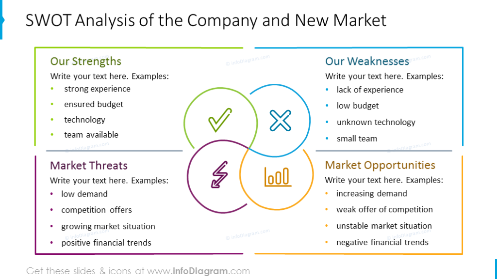

## Table of Contents

## What is technical strength in market analysis?

Technical strength in market analysis refers to how strong a stock or market is, based on looking at charts and numbers rather than news or company reports. It involves using tools like moving averages, relative strength index (RSI), and other indicators to see if a stock is likely to go up or down. Traders and investors use these tools to make decisions about buying or selling, hoping to predict future price movements based on past patterns.

When a stock shows technical strength, it means that the price is moving in a positive direction with good volume and other signs that suggest it might keep going up. This can be seen when a stock breaks through resistance levels or when the RSI shows that the stock is not overbought. On the other hand, if a stock is showing technical weakness, it might be a sign to sell or avoid buying, as the indicators suggest the price could go down. Understanding technical strength helps traders make more informed choices in the fast-paced world of trading.

## How does technical strength differ from fundamental analysis?

Technical strength and fundamental analysis are two different ways to look at investments, like stocks. Technical strength focuses on the price movements and patterns of a stock, using charts and indicators to predict where the price might go next. It's all about the numbers and patterns you see on a chart, not about the company itself. Traders who use technical analysis believe that all the information they need is already shown in the price movements, so they don't need to look at the company's financials or news.

On the other hand, fundamental analysis looks at the actual business behind the stock. It involves studying the company's financial statements, like its earnings, debts, and profits, to figure out if the stock is a good buy. People who use fundamental analysis want to know if the company is healthy and growing, and if its stock price makes sense based on its financial health. They might look at things like the company's earnings per share, its price-to-earnings ratio, and other financial metrics to decide if the stock is undervalued or overvalued.

In short, technical strength is about predicting future price movements based on past patterns and chart indicators, while fundamental analysis is about understanding the company's financial health and value. Both methods can be useful, and some investors use a mix of both to make their investment decisions.

## What are the key indicators used to assess technical strength?

Key indicators used to assess technical strength include moving averages, the Relative Strength Index (RSI), and volume. Moving averages help smooth out price data to identify trends over time. For example, a stock price moving above its 50-day moving average might suggest it's gaining strength. The RSI measures how fast and how much a stock's price has changed, showing if it's overbought or oversold. A high RSI might mean the stock is overbought and could soon drop, while a low RSI might mean it's oversold and could rise. Volume is also important because it shows how many shares are being traded. High volume during a price increase can confirm that the stock is strong.

Another useful indicator is the Moving Average Convergence Divergence (MACD), which helps spot changes in a stock's trend. It does this by comparing two moving averages. When the MACD line crosses above the signal line, it's a sign that the stock might keep going up. On the other hand, if it crosses below, it might be a sign that the stock could go down. Lastly, support and resistance levels are also key. Support is a price level where a stock often stops falling, and resistance is where it often stops rising. If a stock breaks through resistance, it's a sign of strength, and if it falls below support, it's a sign of weakness.

## Can you explain the role of moving averages in determining technical strength?

Moving averages are really important when we want to figure out how strong a stock is. They help us see the big picture by smoothing out the ups and downs of a stock's price over time. Imagine you're looking at a stock's price every day. It can jump around a lot, making it hard to tell if it's going up or down overall. But if you take the average price over a certain number of days, like 50 or 200 days, you get a smoother line that shows the trend more clearly. When a stock's current price goes above its moving average, it's a sign that the stock might be getting stronger and could keep going up. On the other hand, if the price drops below the moving average, it might mean the stock is getting weaker and could go down.

There are different kinds of moving averages that traders use, like the simple moving average (SMA) and the exponential moving average (EMA). The SMA just takes the average price over a set period, while the EMA gives more weight to recent prices, making it more responsive to new changes. Traders often look at how a shorter-term moving average, like the 50-day, interacts with a longer-term one, like the 200-day. When the shorter-term average crosses above the longer-term one, it's called a "golden cross," and it's a strong sign of growing technical strength. If the shorter-term average goes below the longer-term one, it's called a "death cross," and it can signal that the stock is losing strength. By watching these moving averages, traders can make better guesses about where a stock's price might be headed next.

## How do volume indicators contribute to understanding technical strength?

Volume indicators are really helpful when we want to understand how strong a stock is. They show us how many shares of a stock are being bought and sold. When a stock's price goes up and the volume is high, it means a lot of people are buying it, which is a good sign that the stock is strong. It's like a lot of people agreeing that the stock is worth more now. On the other hand, if the price goes up but the volume is low, it might mean that not many people are really interested, and the price might not keep going up.

Volume can also tell us if a stock is getting weaker. If the price starts to go down and the volume is high, it means a lot of people are selling, which can be a sign that the stock is losing strength. It's like a lot of people agreeing that the stock is worth less now. But if the price goes down and the volume is low, it might not be a big deal because not many people are selling. So, by looking at volume along with price changes, we can get a better idea of whether a stock is really strong or just having a temporary change.

## What is the significance of support and resistance levels in technical analysis?

Support and resistance levels are really important in technical analysis because they help us see where a stock's price might stop going down or up. Support is like a floor for the stock price. It's a level where the price often stops falling because a lot of people think the stock is a good buy at that price, so they start buying and push the price back up. On the other hand, resistance is like a ceiling for the stock price. It's a level where the price often stops rising because people think the stock is too expensive at that price, so they start selling and push the price back down.

When a stock's price breaks through a resistance level, it's a strong sign that the stock might keep going up. It means that the stock has enough strength to push past where it usually stops, and more people are willing to buy it at higher prices. If a stock breaks through a support level, it's a sign that the stock might keep going down. It means the stock has lost enough strength that it can't stay above the level where it usually stops falling, and more people are willing to sell it at lower prices. By watching these levels, traders can make better guesses about where the stock's price might go next.

## How can traders use technical strength to identify market trends?

Traders can use technical strength to spot market trends by looking at charts and using tools like moving averages, volume, and support and resistance levels. When a stock's price moves above its moving average, like the 50-day or 200-day average, it's a sign that the stock might be getting stronger and could keep going up. If a lot of people are buying the stock, shown by high volume, it adds to the idea that the stock is strong and the trend might continue. Also, if the stock breaks through a resistance level, it's a big hint that the price might keep rising, showing a strong upward trend.

On the flip side, if a stock's price falls below its moving average, it might mean the stock is getting weaker and could go down. If a lot of people are selling the stock, shown by high volume, it supports the idea that the stock is losing strength and the trend might keep going down. When a stock falls below a support level, it's a sign that the price might keep dropping, showing a strong downward trend. By watching these signs of technical strength, traders can make better guesses about whether the market is going up or down and make their trading decisions based on that.

## What are some common chart patterns that indicate strong technical performance?

Some common chart patterns that show strong technical performance are the "cup and handle" and the "bullish flag." The cup and handle pattern looks like a cup with a small handle on the right side. It starts with a rounded bottom that looks like a cup, then a small dip and rise that forms the handle. When the price breaks out above the handle, it's a sign that the stock might keep going up strongly. The bullish flag pattern looks like a flag on a pole. It starts with a sharp rise in price, which is the pole, followed by a small dip that forms the flag. When the price breaks out above the flag, it's a sign that the stock might keep going up with a lot of strength.

Another pattern that shows strong technical performance is the "ascending triangle." This pattern forms when the stock's price makes higher lows while hitting the same high over and over. It looks like a triangle with a flat top and a rising bottom. When the price finally breaks out above the flat top, it's a strong sign that the stock might keep going up. These patterns help traders see when a stock is likely to keep getting stronger and go up in price. By watching for these patterns, traders can make better guesses about where the stock's price might go next.

## How does the Relative Strength Index (RSI) help in assessing technical strength?

The Relative Strength Index (RSI) is a tool that helps traders see if a stock is getting too strong or too weak. It measures how fast and how much the stock's price has been changing. The RSI is shown as a number between 0 and 100. If the RSI is above 70, it means the stock might be overbought, which means it's been going up a lot and might be due for a drop. If the RSI is below 30, it means the stock might be oversold, which means it's been going down a lot and might be due for a rise.

Traders use the RSI to figure out if a stock has enough strength to keep going up or if it's losing strength and might go down. When the RSI moves from below 30 to above 30, it's a sign that the stock might be getting stronger and could keep going up. When the RSI moves from above 70 to below 70, it's a sign that the stock might be losing strength and could start going down. By watching the RSI, traders can make better guesses about whether a stock is strong or weak and make their trading decisions based on that.

## What advanced techniques can be used to enhance the analysis of technical strength?

To enhance the analysis of technical strength, traders can use advanced techniques like combining multiple indicators to get a clearer picture. For example, they might use moving averages along with the RSI and volume to confirm a trend. If the stock's price is above its moving average, the RSI is not overbought, and the volume is high, it's a strong sign that the stock has good technical strength and might keep going up. This method helps traders avoid false signals that can happen when using just one indicator. By looking at different pieces of information together, traders can make more confident decisions about when to buy or sell a stock.

Another advanced technique is using Fibonacci retracement levels to find key support and resistance points. Traders draw lines on the chart to show where the price might stop falling or rising based on the Fibonacci sequence. If the stock's price bounces off a Fibonacci level, it can be a sign of strong technical performance. Traders can also use more complex chart patterns like the head and shoulders or the inverse head and shoulders to predict big price moves. These patterns can show when a stock is about to change direction, helping traders spot when a stock might be getting stronger or weaker. By using these advanced techniques, traders can get a deeper understanding of a stock's technical strength and make better trading choices.

## How can technical strength be integrated with other forms of analysis for better decision-making?

Technical strength can be mixed with other ways of looking at stocks, like fundamental analysis, to help traders make better choices. Fundamental analysis looks at things like a company's earnings, debts, and how much it's growing. By using both technical strength and fundamental analysis, traders can get a fuller picture of a stock. For example, if a stock looks strong on the charts but the company's earnings are not good, a trader might decide to wait before buying. On the other hand, if the stock is strong on the charts and the company's earnings are growing, it might be a good time to buy.

Another way to mix technical strength with other analysis is by using sentiment analysis. This looks at what people are saying and feeling about a stock, often using social media and news. If a stock looks strong on the charts and people are also talking positively about it, it can add confidence to a trader's decision to buy. By combining technical strength with fundamental and sentiment analysis, traders can make more informed decisions, reducing the risk of making a bad trade.

## What are the limitations and potential pitfalls of relying solely on technical strength for market analysis?

Relying only on technical strength for market analysis can be tricky because it doesn't tell you everything about a stock. Technical strength looks at charts and numbers to guess where a stock's price might go next, but it doesn't look at the company's earnings, debts, or how well it's doing overall. If a stock looks strong on the charts but the company is struggling, the stock price might not keep going up. Also, technical strength can sometimes give false signals. For example, a stock might look like it's going to keep going up, but then it suddenly drops. This can happen because technical strength doesn't consider things like news or big changes in the market.

Another problem with relying only on technical strength is that it can be hard to predict big changes. Sometimes, a stock's price can be affected by things that technical analysis can't see, like new laws, changes in the economy, or big news about the company. If traders only look at technical strength, they might miss these important factors. It's also important to remember that technical strength works best when used with other types of analysis, like looking at the company's financials or what people are saying about the stock. By using all these together, traders can make better guesses about where a stock's price might go next.

## What are the technical strengths and key indicators?

Technical strength is evaluated through various indicators that assist traders in identifying market trends and potential reversals. Among these, moving averages, the Relative Strength Index (RSI), and Bollinger Bands are commonly utilized tools that analyze price data and provide insights into market behavior.

**Moving Averages**

Moving averages are trend-following indicators that smooth out price data by creating a constantly updated average price. They can highlight the direction of the current trend by filtering out the noise from random price fluctuations. There are different types of moving averages, with the simple moving average (SMA) and the exponential moving average (EMA) being the most popular.

The formula for a simple moving average over a period $n$ is:

$$
SMA = \frac{P_1 + P_2 + \cdots + P_n}{n}
$$

where $P$ represents the price at a specific time point.

EMAs give more weight to recent prices, making them more responsive to new information. This responsiveness can be advantageous for short- to medium-term trading, allowing traders to react quickly to potential changes in the trend.

**Relative Strength Index (RSI)**

The RSI is a [momentum](/wiki/momentum) oscillator that measures the speed and change of price movements, oscillating between 0 and 100. Traditionally, an RSI reading above 70 indicates an overbought condition, implying a possible reversal or pullback, while a reading below 30 suggests an oversold condition, indicating a potential upward reversal.

The RSI is calculated using the formula:

$$
RSI = 100 - \frac{100}{1 + RS}
$$

where $RS = \frac{\text{average gain over } n \text{ periods}}{\text{average loss over } n \text{ periods}}$.

This indicator is useful for identifying potential entry and [exit](/wiki/exit-strategy) points in a trading strategy, especially when integrated into algorithmic systems that can quickly compute RSI values across multiple assets.

**Bollinger Bands**

Bollinger Bands consist of a moving average and two standard deviation lines plotted above and below it. The bands contract and expand based on market volatility. When prices touch the upper band, the market may be considered overbought, while touching the lower band may signify an oversold market.

The typical setup involves a 20-day SMA and bands at two standard deviations away, calculated as:

$$
\text{Upper Band} = \text{SMA}_{20} + (2 \times \sigma)
$$

$$
\text{Lower Band} = \text{SMA}_{20} - (2 \times \sigma)
$$

where $\sigma$ is the standard deviation of the price over the same period.

The application of these indicators in [algorithmic trading](/wiki/algorithmic-trading) is significant. Algorithms leverage the quantitative nature of moving averages, RSI, and Bollinger Bands to make real-time trading decisions based on predefined criteria. By understanding the strengths and limitations of each indicator, traders can better forecast market movements and adapt their strategies. For instance, moving averages are effective at identifying trends but may lag during sudden market shifts, while RSI can be more responsive but sometimes generates false signals during strong trends.

The compatibility of technical strength analysis with algorithmic trading stems from its reliance on data and pattern recognition. Algorithms excel at processing large datasets and identifying patterns that human traders might overlook, thereby enhancing the predictive accuracy and execution efficiency of trading strategies.

## References & Further Reading

[1]: Bergstra, J., Bardenet, R., Bengio, Y., & Kégl, B. (2011). ["Algorithms for Hyper-Parameter Optimization."](https://dl.acm.org/doi/10.5555/2986459.2986743) Advances in Neural Information Processing Systems 24.

[2]: ["Advances in Financial Machine Learning"](https://www.amazon.com/Advances-Financial-Machine-Learning-Marcos/dp/1119482089) by Marcos Lopez de Prado

[3]: ["Evidence-Based Technical Analysis: Applying the Scientific Method and Statistical Inference to Trading Signals"](https://www.amazon.com/Evidence-Based-Technical-Analysis-Scientific-Statistical/dp/0470008741) by David Aronson

[4]: ["Machine Learning for Algorithmic Trading"](https://github.com/stefan-jansen/machine-learning-for-trading) by Stefan Jansen

[5]: ["Quantitative Trading: How to Build Your Own Algorithmic Trading Business"](https://www.amazon.com/Quantitative-Trading-Build-Algorithmic-Business/dp/1119800064) by Ernest P. Chan