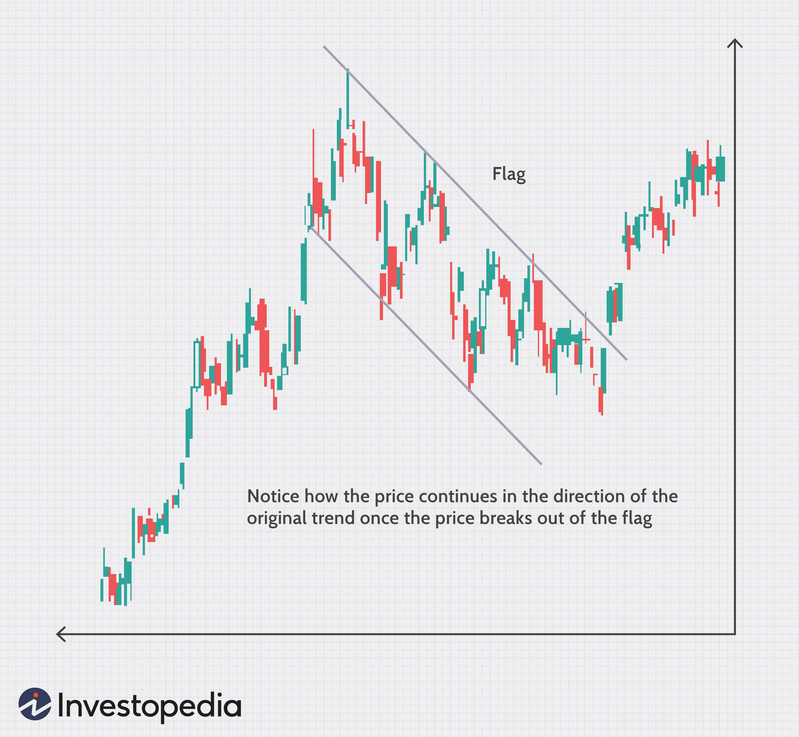

In the rapidly evolving world of financial markets, algorithmic trading has become a significant component, capitalizing on the strengths of economic assessment and technical analysis. Algorithmic trading, often referred to as automated trading, involves using computer programs to execute trades based on predefined criteria, often encompassing both economic indicators and technical analysis metrics.

Economic assessment provides a macroeconomic perspective, evaluating indicators such as GDP growth, unemployment rates, inflation, and interest rates, which critically influence market behavior. These assessments allow traders and investors to gauge the broader economic environment, predicting long-term trends and potential market shifts. By integrating these assessments into trading strategies, traders can make informed decisions, reflecting a deeper understanding of the market’s economic landscape.



Concurrently, technical analysis serves as a tool for evaluating past market data to forecast future movements. Through the use of technical strength indicators such as moving averages, the Relative Strength Index (RSI), and Bollinger Bands, traders can identify market trends and potential reversals. This analysis is particularly pertinent for short- to medium-term trading strategies, where understanding technical metrics can guide decisions on entry and exit points in trades.

Algorithmic trading merges these two analysis approaches to form robust trading strategies. By incorporating both economic assessments and real-time data from technical indicators, algorithmic systems optimize and execute trades in milliseconds, capitalizing on even the smallest market inefficiencies. These systems are designed to leverage computational power to process vast amounts of data, resulting in strategies that are both adaptive and efficient.

This article explores the intersection of economic assessments and technical analysis within algorithmic trading. It aims to provide traders and investors with the tools to develop and optimize their own trading strategies, ensuring their approaches are not only methodical but responsive to an ever-changing market environment. Understanding these components' interactions provides a foundation for harnessing their combined potential, ultimately leading to more strategic and profitable trading outcomes.

## Table of Contents

## Understanding Economic Assessment in Market Analysis

Economic assessments serve as critical tools in evaluating the health and direction of financial markets. By analyzing key economic indicators and fiscal policies, traders can gain insights into current and future market dynamics. Among the most influential economic indicators are Gross Domestic Product (GDP) growth, unemployment rates, inflation, and interest rates, all of which play pivotal roles in shaping market movements.

GDP growth signifies the overall economic health of a nation, reflecting the value of all goods and services produced over a specific period. A robust GDP growth rate often correlates with strong market performance, as it suggests increased corporate earnings and consumer spending. Conversely, a slowdown in GDP growth can indicate potential market contractions, guiding traders to adjust their strategies accordingly.

Unemployment rates provide another crucial insight, as they reflect the labor market's health. High unemployment often leads to reduced consumer spending, thereby negatively impacting economic growth and market performance. Monitoring changes in unemployment rates can assist traders in anticipating shifts in market sentiment and demand.

Inflation, the rate at which the general level of prices for goods and services rises, can erode purchasing power and affect interest rates. Moderate inflation is typically associated with economic growth, but excessive inflation may warrant higher interest rates, impacting borrowing costs and consumer spending. Traders often use inflation data to predict central bank monetary policies, influencing bond yields and equity prices.

Interest rates, set by central banks, are pivotal in determining the cost of borrowing and the return on savings. Lower interest rates generally encourage borrowing and investment, while higher rates tend to have the opposite effect. Changes in interest rates can lead to shifts in market sectors, with implications for asset prices and market [volatility](/wiki/volatility-trading-strategies).

Integrating these economic assessments into trading algorithms enables traders to enhance their predictive accuracy and inform strategic positioning. Algorithms can be programmed to respond to fluctuations in these indicators, improving the timing and precision of trade executions. For instance, an algorithm programmed with Python might use historical data to forecast GDP trends and adjust investment strategies accordingly:

```python
import pandas as pd
from sklearn.linear_model import LinearRegression

# Example GDP data
data = {'Year': [2010, 2011, 2012, 2013, 2014],
        'GDP_Growth': [2.5, 1.8, 2.2, 3.0, 2.4]}
df = pd.DataFrame(data)

# Linear regression model
X = df[['Year']]
y = df['GDP_Growth']
model = LinearRegression().fit(X, y)

# Predicting future GDP growth
future_years = pd.DataFrame({'Year': [2015, 2016, 2017]})
predictions = model.predict(future_years)

print("Predicted GDP Growth:", predictions)
```

By leveraging such models, traders can anticipate economic shifts and adjust their portfolios, thereby gaining a competitive edge in the market. Ultimately, economic assessments contribute significantly to the development of robust trading algorithms, enabling more informed and strategic decision-making.

## Technical Strength and Key Indicators

Technical strength is evaluated through various indicators that assist traders in identifying market trends and potential reversals. Among these, moving averages, the Relative Strength Index (RSI), and Bollinger Bands are commonly utilized tools that analyze price data and provide insights into market behavior.

**Moving Averages**

Moving averages are trend-following indicators that smooth out price data by creating a constantly updated average price. They can highlight the direction of the current trend by filtering out the noise from random price fluctuations. There are different types of moving averages, with the simple moving average (SMA) and the exponential moving average (EMA) being the most popular.

The formula for a simple moving average over a period $n$ is:

$$
SMA = \frac{P_1 + P_2 + \cdots + P_n}{n}
$$

where $P$ represents the price at a specific time point.

EMAs give more weight to recent prices, making them more responsive to new information. This responsiveness can be advantageous for short- to medium-term trading, allowing traders to react quickly to potential changes in the trend.

**Relative Strength Index (RSI)**

The RSI is a [momentum](/wiki/momentum) oscillator that measures the speed and change of price movements, oscillating between 0 and 100. Traditionally, an RSI reading above 70 indicates an overbought condition, implying a possible reversal or pullback, while a reading below 30 suggests an oversold condition, indicating a potential upward reversal.

The RSI is calculated using the formula:

$$
RSI = 100 - \frac{100}{1 + RS}
$$

where $RS = \frac{\text{average gain over } n \text{ periods}}{\text{average loss over } n \text{ periods}}$.

This indicator is useful for identifying potential entry and [exit](/wiki/exit-strategy) points in a trading strategy, especially when integrated into algorithmic systems that can quickly compute RSI values across multiple assets.

**Bollinger Bands**

Bollinger Bands consist of a moving average and two standard deviation lines plotted above and below it. The bands contract and expand based on market volatility. When prices touch the upper band, the market may be considered overbought, while touching the lower band may signify an oversold market.

The typical setup involves a 20-day SMA and bands at two standard deviations away, calculated as:

$$
\text{Upper Band} = \text{SMA}_{20} + (2 \times \sigma)
$$

$$
\text{Lower Band} = \text{SMA}_{20} - (2 \times \sigma)
$$

where $\sigma$ is the standard deviation of the price over the same period.

The application of these indicators in [algorithmic trading](/wiki/algorithmic-trading) is significant. Algorithms leverage the quantitative nature of moving averages, RSI, and Bollinger Bands to make real-time trading decisions based on predefined criteria. By understanding the strengths and limitations of each indicator, traders can better forecast market movements and adapt their strategies. For instance, moving averages are effective at identifying trends but may lag during sudden market shifts, while RSI can be more responsive but sometimes generates false signals during strong trends.

The compatibility of technical strength analysis with algorithmic trading stems from its reliance on data and pattern recognition. Algorithms excel at processing large datasets and identifying patterns that human traders might overlook, thereby enhancing the predictive accuracy and execution efficiency of trading strategies.

## Algorithmic Trading: Leveraging Market Analysis

Algorithmic trading represents a sophisticated method of executing trades using automated systems based on predetermined criteria, which often encompass both economic assessments and technical indicators. These automated systems are designed to process information rapidly, allowing traders to optimize their strategies for more timely responses to real-time market conditions.

The architecture of algorithmic trading systems is centered on utilizing complex algorithms capable of parsing vast datasets. These algorithms can efficiently identify opportunities for profitable trades by integrating both economic and technical analyses. Economic assessments typically involve macroeconomic indicators such as GDP growth rates, unemployment figures, and inflation trends. On the other hand, technical indicators might include statistical tools like moving averages and the Relative Strength Index (RSI), which help in identifying market trends and potential reversals.

The integration of market analysis in algorithmic trading is facilitated by advanced data analytics and [machine learning](/wiki/machine-learning) techniques. For instance, a typical algorithmic trading strategy might involve a machine learning model trained on historical data to predict short-term stock movements based on economic announcements. This approach allows the algorithm to formulate a predictive model that efficiently processes new data and adapts to evolving market conditions.

Python, widely favored for its extensive libraries and frameworks, is frequently used in developing these trading algorithms. An example of a simple algorithm can be illustrated as follows:

```python
import numpy as np
import pandas as pd
import talib

# Load market data
data = pd.read_csv('market_data.csv')
close_prices = data['Close'].values

# Calculate technical indicators
sma = talib.SMA(close_prices, timeperiod=30)
rsi = talib.RSI(close_prices, timeperiod=14)

# Define trading signal based on indicators
buy_signal = (close_prices > sma) & (rsi < 30)
sell_signal = (close_prices < sma) & (rsi > 70)

data['Signal'] = np.where(buy_signal, 1, np.where(sell_signal, -1, 0))
```

This code illustrates a simple strategy where a buy signal is triggered if the closing price is above the Simple Moving Average (SMA) and the RSI indicates the asset is oversold. Conversely, a sell signal is generated if the closing price is below the SMA and the RSI indicates the asset is overbought.

Algorithmic trading presents several advantages over traditional trading methods. Firstly, it significantly reduces the potential for human error, as trades are executed based on pre-established criteria without the need for human intervention. Moreover, algorithms can operate on a 24/7 basis and react instantaneously to market movements, enhancing execution speeds and enabling traders to capitalize on fleeting trading opportunities.

In summary, algorithmic trading harnesses the power of market analysis, combining economic assessments with technical criteria to form data-driven strategies. This integration allows for efficient processing of large datasets, swift decision-making, and the minimization of errors, providing a competitive edge in today's dynamic financial markets.

## Case Studies and Strategy Optimization

To illustrate the successful application of algorithmic trading strategies, we examine case studies where market analysis has played a pivotal role in achieving superior trading results. These case studies highlight the effectiveness of integrating both economic assessment and technical analysis into algorithmic trading systems.

One notable example involves a strategy that utilized moving averages and economic data to exploit medium-term trend movements in foreign exchange markets. The algorithm employed a combination of the 50-day and 200-day moving averages to identify key trend reversals, aligning these technical signals with economic indicators such as [interest rate](/wiki/interest-rate-trading-strategies) announcements and GDP reports. By synchronizing technical signals and economic forecasts, the strategy achieved a higher win rate and improved risk-adjusted returns compared to traditional methods. Such integration enabled the algorithm to adapt its trading positions ahead of significant market shifts, optimizing entry and exit points.

The process of [backtesting](/wiki/backtesting) such strategies is essential in assessing their historical effectiveness. Backtesting involves simulating the algorithm's performance using historical market data, allowing traders to evaluate how the strategy would have performed in the past. This process helps in identifying potential weaknesses and adjusting the strategy parameters accordingly. For instance, Python is commonly used for backtesting due to its versatile libraries such as Pandas for data manipulation and Backtrader for strategy evaluation. Going through historical data, traders can refine their algorithms to enhance predictive accuracy and minimize drawdowns.

In Python, a basic framework for backtesting could look like this:

```python
import pandas as pd
import backtrader as bt

class MovingAverageStrategy(bt.SignalStrategy):
    def __init__(self):
        self.sma_short = bt.indicators.SimpleMovingAverage(self.data.close, period=50)
        self.sma_long = bt.indicators.SimpleMovingAverage(self.data.close, period=200)

        self.signal_add(bt.SIGNAL_LONG, (self.sma_short > self.sma_long))
        self.signal_add(bt.SIGNAL_SHORT, (self.sma_short < self.sma_long))

data = bt.feeds.PandasData(dataname=pd.read_csv('historical_data.csv'))
cerebro = bt.Cerebro()
cerebro.addstrategy(MovingAverageStrategy)
cerebro.adddata(data)
cerebro.run()
cerebro.plot()
```

Continuous optimization is crucial for maintaining and enhancing the performance of algorithmic strategies. As markets evolve, previously successful strategies might underperform due to changing market dynamics. Therefore, it's essential to frequently re-evaluate and adjust the strategy based on the latest market conditions and performance metrics. Machine learning techniques can also be employed to optimize strategies by continuously learning from new data and adapting to novel patterns.

Moreover, it is important to learn from both successful and unsuccessful trades. This iterative process of testing, learning, and refining enables traders to improve their systems continuously. By evaluating past trades, traders can identify patterns and gain insights into what strategies perform best under specific conditions. This knowledge facilitates strategic adjustments, leading to better risk management and enhanced profitability over time.

In summary, successful algorithmic trading strategies often result from a careful blend of market analysis and continuous optimization. Through diligent backtesting and strategic refinement, traders can develop robust systems capable of adapting to varying market conditions, ultimately contributing to their long-term success.

## Conclusion

The synergy between economic assessment, technical strength analysis, and algorithmic trading creates a comprehensive framework that empowers market participants. By effectively incorporating these elements, traders can develop trading strategies that adapt to both macroeconomic shifts and specific market dynamics. This adaptability is crucial as it allows for the anticipation and response to varying conditions, leading to potentially enhanced profitability.

As technology and data analytics evolve, algorithmic trading will increasingly influence how trading is conducted. The rise of machine learning and [artificial intelligence](/wiki/ai-artificial-intelligence) is augmenting data analysis capabilities, enabling more sophisticated algorithms that can process complex datasets at unprecedented speeds. This progression offers numerous opportunities for innovation, yet it also presents challenges that necessitate ongoing refinement of trading algorithms to maintain their effectiveness.

The foundation of success in this domain hinges on a thorough understanding of the principles underlying economic assessments, technical indicators, and algorithmic mechanisms. Traders must remain vigilant, continuously analyzing performance outcomes and making necessary adjustments to align with the evolving market landscape. This process of continuous adaptation is critical as it allows traders to refine strategies, incorporating lessons learned from both successful and unsuccessful trades.

Exploring these areas extensively can unlock significant potential in shaping the future of trading. As market environments become increasingly complex, those who adeptly integrate economic assessments, technical analysis, and algorithmic execution will be well-positioned to navigate and benefit from the dynamic financial markets.

## References & Further Reading

[1]: Bergstra, J., Bardenet, R., Bengio, Y., & Kégl, B. (2011). ["Algorithms for Hyper-Parameter Optimization."](https://dl.acm.org/doi/10.5555/2986459.2986743) Advances in Neural Information Processing Systems 24.

[2]: ["Advances in Financial Machine Learning"](https://www.amazon.com/Advances-Financial-Machine-Learning-Marcos/dp/1119482089) by Marcos Lopez de Prado

[3]: ["Evidence-Based Technical Analysis: Applying the Scientific Method and Statistical Inference to Trading Signals"](https://www.amazon.com/Evidence-Based-Technical-Analysis-Scientific-Statistical/dp/0470008741) by David Aronson

[4]: ["Machine Learning for Algorithmic Trading"](https://github.com/stefan-jansen/machine-learning-for-trading) by Stefan Jansen

[5]: ["Quantitative Trading: How to Build Your Own Algorithmic Trading Business"](https://www.amazon.com/Quantitative-Trading-Build-Algorithmic-Business/dp/1119800064) by Ernest P. Chan