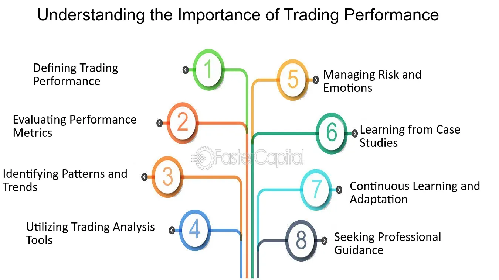

## Table of Contents

## What are the basic technical tools a beginner should start with for trading?

For a beginner starting out in trading, the first and most essential tool is a reliable trading platform. This is the software you'll use to buy and sell stocks, cryptocurrencies, or other financial instruments. Popular platforms include Robinhood, eToro, and MetaTrader 4. These platforms are user-friendly and often come with educational resources to help you learn the ropes. Make sure to choose a platform that fits your needs and offers a good balance of features and ease of use.

Another important tool is a charting software. Charts help you understand market trends and make informed decisions. Many trading platforms come with built-in charting tools, but you can also use standalone software like TradingView. These tools allow you to see price movements over time and apply technical indicators, which are mathematical calculations that can signal potential trading opportunities. As a beginner, start with simple charts and gradually learn more advanced analysis techniques.

Lastly, a good news and analysis service is crucial. Staying updated with market news and expert analysis can help you make better trading decisions. Websites like Bloomberg, Reuters, and even social media platforms like Twitter can provide real-time information. Some trading platforms also offer news feeds and analysis within their software. As a beginner, it's important to develop a habit of regularly checking these sources to stay informed about what's happening in the markets.

## How can moving averages help improve trading decisions for beginners?

Moving averages are a simple yet powerful tool that can help beginners make better trading decisions. They work by smoothing out price data over a specific period, making it easier to spot trends. For example, a 50-day moving average shows the average price of a stock over the last 50 days. When the price of a stock is above its moving average, it might be a good time to buy because the stock is trending upwards. On the other hand, if the price is below the moving average, it might be a signal to sell or avoid buying because the stock could be trending downwards.

Using moving averages can also help beginners avoid making impulsive decisions based on short-term price movements. By focusing on the bigger picture, you can see if a stock is in a long-term uptrend or downtrend. For instance, if a stock's price keeps bouncing off its 200-day moving average and then going up, it might be a strong sign that the stock is in a good long-term trend. This can give beginners more confidence in their trading decisions and help them stick to a strategy rather than reacting to every little price change.

## What is the role of volume in trading analysis and how can beginners use it?

Volume is the number of shares or contracts traded in a security or market during a given period. It's a key piece of information in trading analysis because it can show how strong a price move is. If a stock's price goes up and the volume is high, it means a lot of people are buying the stock, which can make the price move stronger. On the other hand, if the price goes up but the volume is low, it might mean the price move isn't very strong and could change direction soon.

Beginners can use volume to confirm trends and spot potential reversals. For example, if a stock is in an uptrend and the volume starts to increase as the price goes up, it can confirm that the uptrend is strong and might continue. If the volume starts to drop while the price is still going up, it might be a warning sign that the uptrend is losing steam and could reverse. By paying attention to volume, beginners can make more informed decisions about when to buy or sell a stock.

## How can intermediate traders use technical indicators like RSI and MACD to enhance their trading performance?

Intermediate traders can use technical indicators like the Relative Strength Index (RSI) and the Moving Average Convergence Divergence (MACD) to enhance their trading performance by providing more detailed insights into market trends and potential reversals. The RSI is a momentum oscillator that measures the speed and change of price movements on a scale from 0 to 100. When the RSI is above 70, it suggests that a stock might be overbought and due for a price drop. Conversely, an RSI below 30 indicates that a stock might be oversold and could be ready for a price increase. By watching these levels, intermediate traders can make better decisions about when to enter or exit trades.

The MACD is another powerful tool that helps traders identify trend changes and momentum. It consists of two lines: the MACD line and the signal line. When the MACD line crosses above the signal line, it generates a bullish signal, suggesting it might be a good time to buy. When the MACD line crosses below the signal line, it generates a bearish signal, indicating a possible time to sell. Additionally, traders can look at the MACD histogram, which shows the difference between the MACD line and the signal line. A widening histogram indicates increasing momentum, while a narrowing histogram can signal that momentum is slowing down. By combining the insights from both RSI and MACD, intermediate traders can refine their strategies and improve their chances of making profitable trades.

## What are candlestick patterns and how can they be used by intermediate traders to predict market movements?

Candlestick patterns are visual representations of price movements in a specific time frame, used by traders to predict future market movements. Each candlestick shows the opening, closing, high, and low prices for that period. The body of the candlestick is the area between the opening and closing prices, and it's usually colored differently depending on whether the price went up or down. For example, a green or white body means the closing price was higher than the opening price, while a red or black body means it was lower. The lines above and below the body, called wicks or shadows, show the highest and lowest prices during the time frame.

Intermediate traders can use candlestick patterns to spot potential reversals or continuations in the market. For example, a "doji" pattern, where the opening and closing prices are very close, can signal that the market is unsure and might reverse. Another common pattern is the "hammer," which looks like a hammer with a long lower wick and a small body at the top. This can indicate that the market might be ready to go up after a downtrend. By recognizing these and other patterns, like the "engulfing" or "morning star," intermediate traders can make more informed decisions about when to buy or sell, helping them to better predict market movements and improve their trading performance.

## How can support and resistance levels be identified and used effectively by intermediate traders?

Support and resistance levels are important lines on a price chart that traders use to understand where the price of a stock or other asset might go next. Support is the price level where a stock often stops falling and starts going up again. It's like a floor that the price bounces off of. Resistance, on the other hand, is where the price often stops rising and starts to fall again. It's like a ceiling that the price hits and then turns back down. Intermediate traders can find these levels by looking at past price charts and seeing where the price has turned around many times before. They can also use tools like trend lines and moving averages to help spot these levels.

Once identified, intermediate traders can use support and resistance levels to make better trading decisions. For example, if a stock is near a strong support level, a trader might see it as a good time to buy because the price is likely to go up from there. If the stock is near a resistance level, it might be a good time to sell or avoid buying because the price is likely to go down. Traders can also watch for "breakouts," where the price moves strongly past a support or resistance level. This can signal a big move in the price, and traders can use it to decide whether to buy or sell. By understanding and using these levels, intermediate traders can improve their chances of making profitable trades.

## What advanced charting tools are available for expert traders and how do they contribute to trading performance?

Expert traders use advanced charting tools like Fibonacci retracement, Bollinger Bands, and Ichimoku Clouds to get a deeper understanding of the market. Fibonacci retracement helps traders find key levels where the price might turn around. It uses numbers to draw lines on the chart that show where these levels are. Bollinger Bands are lines that show how much the price is moving around. When the price gets close to the top or bottom band, it might mean the price is going to change direction. Ichimoku Clouds are a bit more complicated but show where the price might go next by drawing different lines and areas on the chart. These tools help expert traders see things that simpler charts might miss, which can lead to better trading decisions.

Using these advanced tools can really help expert traders do better in the market. For example, if a trader sees that the price is at a key Fibonacci level and also near the edge of a Bollinger Band, they might decide it's a good time to buy or sell. These tools also help traders understand the overall trend and where the price might go in the future. By combining different advanced charting tools, expert traders can get a more complete picture of what's happening in the market. This can help them make smarter trades and possibly make more money.

## How can expert traders use algorithmic trading tools to automate and optimize their trading strategies?

Expert traders can use algorithmic trading tools to automate their trading strategies by writing computer programs that follow specific rules to buy and sell assets. These programs can analyze large amounts of data quickly and make trades based on the trader's strategy without needing them to watch the market all the time. For example, a trader might set up an algorithm to buy a stock when its price goes above a certain level and sell it when it goes below another level. This can help traders make decisions faster and more consistently than they could by themselves.

Algorithmic trading tools can also help expert traders optimize their strategies by testing them on past data, a process called backtesting. This allows traders to see how their strategy would have worked in the past and make changes to improve it. Additionally, these tools can run many different versions of a strategy at the same time to find the best one. By using algorithmic trading, expert traders can save time, reduce the chance of making mistakes, and potentially make more money by sticking to a well-tested strategy.

## What are the benefits and risks of using high-frequency trading tools for expert traders?

High-frequency trading tools let expert traders make a lot of trades very quickly. These tools use powerful computers to buy and sell stocks or other things in just a few seconds. This can help traders make money by taking advantage of small price changes that happen all the time. Because the trades happen so fast, traders can make a lot of small profits that add up. High-frequency trading can also help traders react to news or other events faster than other people, which can be a big advantage.

But there are also risks with high-frequency trading. One big risk is that the market can change very quickly, and if the computer makes a mistake, it can lose a lot of money in a short time. Also, high-frequency trading can make the market more unpredictable because so many trades are happening so fast. This can make it harder for traders to know what will happen next. Plus, these tools need a lot of money to set up and keep running, so it's not something every trader can do.

## How can expert traders integrate fundamental analysis with technical tools for better trading outcomes?

Expert traders can use both fundamental analysis and technical tools to make better trading decisions. Fundamental analysis looks at things like a company's earnings, how much it's growing, and what's happening in the economy. This helps traders understand if a stock is a good buy based on the company's real value. By using fundamental analysis, traders can find stocks that are undervalued and might go up in price over time. When they combine this with technical tools, like charts and indicators, they can see when might be a good time to buy or sell. For example, if a stock is undervalued and its price is near a strong support level, it could be a great time to buy.

Technical tools help traders see patterns and trends in the stock's price movements. Things like moving averages, RSI, and MACD can show if a stock is trending up or down and when it might change direction. By using these tools alongside fundamental analysis, expert traders can get a complete picture of what's happening with a stock. They can use fundamental analysis to pick stocks with strong long-term potential and then use technical tools to time their trades better. This way, they can make more informed decisions and hopefully make more money from their trades.

## What role do machine learning and AI play in enhancing trading performance for expert traders?

Machine learning and AI help expert traders make better decisions by looking at a lot of data very quickly. These tools can find patterns in the data that humans might miss. For example, they can look at how stock prices have moved in the past and use that to predict what might happen next. They can also read news articles and social media to see how people feel about a company, which can affect its stock price. By using machine learning and AI, traders can get a better understanding of the market and make smarter trades.

But there are also some things to be careful about when using machine learning and AI in trading. These tools can be really good at finding patterns, but sometimes those patterns might not happen again in the future. Also, if a lot of traders start using the same AI tools, it can make the market move in ways that are hard to predict. So, while machine learning and AI can help traders a lot, it's important to use them along with other methods and always keep an eye on how well they're working.

## How can expert traders use backtesting tools to refine and validate their trading strategies?

Expert traders can use backtesting tools to check how well their trading strategies would have worked in the past. They do this by running their strategy on old market data to see if it would have made money. This helps them find out if their strategy is good or if it needs to be changed. Backtesting lets traders try different versions of their strategy to see which one works best. By doing this, they can make their strategy better and more likely to succeed in the future.

However, backtesting has its limits. Just because a strategy worked well in the past doesn't mean it will work the same way in the future. Markets change, and what worked before might not work again. Also, backtesting can sometimes make a strategy look better than it really is because it doesn't account for things like trading costs and how the market might react to a lot of people using the same strategy. So, while backtesting is a great tool for refining and validating strategies, expert traders need to be careful and use it along with other methods to make sure their strategies are solid.

## What are the key technical analysis tools?

Technical analysis tools are essential for traders aiming to predict market movements and identify potential trading opportunities. Some of the most widely used technical analysis tools include Moving Averages, Relative Strength Index (RSI), and the Moving Average Convergence Divergence (MACD). These tools allow traders to derive insights from historical price data and make informed decisions.

**Moving Averages**

Moving averages are a fundamental tool in technical analysis used to smooth out price data to identify the direction of a trend. There are different types of moving averages, but the most common ones are the Simple Moving Average (SMA) and the Exponential Moving Average (EMA). The formula for a simple moving average over $n$ periods is:

$$
\text{SMA}_t = \frac{P_t + P_{t-1} + \ldots + P_{t-n+1}}{n}
$$

where $P$ represents the closing price and $t$ is the current day.

Moving averages help signal potential market entries and exits by identifying trend reversals or confirmations. For example, a common strategy involves using a short-term and a long-term moving average. When the short-term average crosses above the long-term average (a bullish crossover), it may signal a buy opportunity. Conversely, a bearish crossover might indicate a sell signal.

**Relative Strength Index (RSI)**

The RSI is a [momentum](/wiki/momentum) oscillator that measures the speed and change of price movements. It ranges from 0 to 100 and is typically used to identify overbought or oversold conditions in a market. The RSI is calculated using the formula:

$$
\text{RSI} = 100 - \frac{100}{1 + \frac{\text{average gain}}{\text{average loss}}}
$$

An RSI value above 70 may indicate that a security is overbought, signaling a potential sell opportunity, while an RSI below 30 might suggest that it is oversold, indicating a possible buy opportunity.

**Moving Average Convergence Divergence (MACD)**

The MACD is a versatile tool that reveals changes in the strength, direction, momentum, and duration of a trend in a security’s price. It is calculated by subtracting the 26-period EMA from the 12-period EMA. A nine-day EMA of the MACD called the "signal line," is then plotted on top of the MACD to signal buy and sell decisions. Signal line crossovers are a common application of the MACD. A bullish crossover occurs when the MACD line crosses above the signal line, indicating a potential buy opportunity, whereas a bearish crossover presents a potential sell signal.

**Volume Analysis**

Volume analysis examines the quantity of a security traded over a specific period. It plays a significant role in strengthening the signals generated by indicators like those mentioned above. For instance, if a [breakout](/wiki/breakout-trading) occurs on low volume, it may not be as convincing a signal as a breakout confirmed by high volume, indicating strong trader interest and potential for a more sustained movement. By integrating volume analysis in conjunction with tools like Moving Averages, RSI, and MACD, traders can attain a more comprehensive view of the market dynamics and enhance the reliability of their signals.

## References & Further Reading

[1]: Bergstra, J., Bardenet, R., Bengio, Y., & Kégl, B. (2011). ["Algorithms for Hyper-Parameter Optimization."](https://dl.acm.org/doi/10.5555/2986459.2986743) Advances in Neural Information Processing Systems 24.

[2]: ["Advances in Financial Machine Learning"](https://www.amazon.com/Advances-Financial-Machine-Learning-Marcos/dp/1119482089) by Marcos Lopez de Prado

[3]: ["Evidence-Based Technical Analysis: Applying the Scientific Method and Statistical Inference to Trading Signals"](https://www.amazon.com/Evidence-Based-Technical-Analysis-Scientific-Statistical/dp/0470008741) by David Aronson

[4]: ["Machine Learning for Algorithmic Trading"](https://github.com/stefan-jansen/machine-learning-for-trading) by Stefan Jansen

[5]: ["Quantitative Trading: How to Build Your Own Algorithmic Trading Business"](https://www.amazon.com/Quantitative-Trading-Build-Algorithmic-Business/dp/1119800064) by Ernest P. Chan