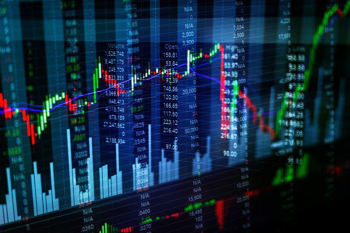

In modern financial markets, trading tools have become indispensable for both individual and institutional traders. These tools are vital in navigating the complexities of today's fast-paced financial environments, where the ability to swiftly adapt to market changes can mean the difference between profit and loss.

Trading tools encompass various software and platforms designed to enhance trading efficiency and decision-making. These include tools for technical analysis, which is the study of historical price movements and patterns to forecast future market trends. Technical analysis relies heavily on charts, indicators, and patterns, providing traders with insights into potential market behavior. It operates on the assumption that all current market information is reflected in price movements, making past patterns a reliable indicator of future activity.



Algorithmic trading, another pinnacle of modern trading tools, uses algorithms to automate trading decisions based on predefined criteria. These algorithms often integrate with technical analysis, utilizing its indicators to inform algorithmic strategies. The integration allows traders to execute trades with speed and precision that manual trading cannot achieve. Additionally, algorithmic trading removes emotional decision-making, a critical advantage in volatile markets where quick reactions are necessary.

The objective of this article is to explore the myriad ways these trading tools can enhance strategic trading approaches. By employing the appropriate tools, traders can develop more refined strategies, thereby increasing their probability of achieving favorable outcomes in the financial markets. This exploration will reveal how technical analysis tools, when combined with algorithmic trading, can lead to optimized trading strategies and improved market performance.

## Table of Contents

## The Role of Trading Tools in Technical Analysis

Technical analysis is a method used to evaluate and forecast the future price movements of financial assets based on historical price and volume data. It plays an essential role in trading by providing a framework for analyzing market trends and making informed decisions. Unlike fundamental analysis, which focuses on a company's financial statements and economic indicators, technical analysis is primarily concerned with price action and market sentiment.

Several trading tools are integral to technical analysis, including charts that graphically represent price movements over different time frames. Charts come in various forms, such as line charts, bar charts, and candlestick charts, each offering unique insights into market behavior. For example, candlestick charts provide detailed visual information about open, high, low, and closing prices, highlighting potential reversals or continuations in trends.

Indicators are mathematical calculations based on price and [volume](/wiki/volume-trading-strategy) data that provide insights into market dynamics. Some popular indicators include Moving Averages, the Relative Strength Index (RSI), and the Moving Average Convergence Divergence (MACD). Moving Averages smooth out price data to identify trends more clearly, while the RSI measures the strength and speed of a price movement to indicate overbought or oversold conditions. MACD helps traders understand the relationship between two moving averages to identify potential buy or sell signals.

Patterns are another crucial component of technical analysis. They are formations created by the price movements on a chart and are used to predict future price movements. Common patterns include Head and Shoulders, Double Tops and Bottoms, and Triangles. These patterns help traders anticipate potential price breakouts or reversals by highlighting recurring market behaviors.

Trading tools in technical analysis aid traders in making informed decisions by providing insights into past price movements and predicting future trends. By analyzing charts, indicators, and patterns, traders can identify potential entry and [exit](/wiki/exit-strategy) points, assess the strength of the current market trend, and manage risks effectively. For instance, if a trader observes a bullish pattern supported by high trading volume, it may signal a good opportunity to enter a long position. Conversely, if indicators reveal overbought conditions, a trader might decide to exit or avoid entering a position to mitigate potential losses.

In conclusion, trading tools are vital for technical analysis, enabling traders to interpret market data efficiently and execute strategies with greater precision. Understanding how to utilize these tools effectively can significantly enhance a trader's ability to navigate and capitalize on the complexities of modern financial markets.

## Key Technical Analysis Tools

Technical analysis tools are essential for traders aiming to predict market movements and identify potential trading opportunities. Some of the most widely used technical analysis tools include Moving Averages, Relative Strength Index (RSI), and the Moving Average Convergence Divergence (MACD). These tools allow traders to derive insights from historical price data and make informed decisions.

**Moving Averages**

Moving averages are a fundamental tool in technical analysis used to smooth out price data to identify the direction of a trend. There are different types of moving averages, but the most common ones are the Simple Moving Average (SMA) and the Exponential Moving Average (EMA). The formula for a simple moving average over $n$ periods is:

$$
\text{SMA}_t = \frac{P_t + P_{t-1} + \ldots + P_{t-n+1}}{n}
$$

where $P$ represents the closing price and $t$ is the current day.

Moving averages help signal potential market entries and exits by identifying trend reversals or confirmations. For example, a common strategy involves using a short-term and a long-term moving average. When the short-term average crosses above the long-term average (a bullish crossover), it may signal a buy opportunity. Conversely, a bearish crossover might indicate a sell signal.

**Relative Strength Index (RSI)**

The RSI is a [momentum](/wiki/momentum) oscillator that measures the speed and change of price movements. It ranges from 0 to 100 and is typically used to identify overbought or oversold conditions in a market. The RSI is calculated using the formula:

$$
\text{RSI} = 100 - \frac{100}{1 + \frac{\text{average gain}}{\text{average loss}}}
$$

An RSI value above 70 may indicate that a security is overbought, signaling a potential sell opportunity, while an RSI below 30 might suggest that it is oversold, indicating a possible buy opportunity.

**Moving Average Convergence Divergence (MACD)**

The MACD is a versatile tool that reveals changes in the strength, direction, momentum, and duration of a trend in a security’s price. It is calculated by subtracting the 26-period EMA from the 12-period EMA. A nine-day EMA of the MACD called the "signal line," is then plotted on top of the MACD to signal buy and sell decisions. Signal line crossovers are a common application of the MACD. A bullish crossover occurs when the MACD line crosses above the signal line, indicating a potential buy opportunity, whereas a bearish crossover presents a potential sell signal.

**Volume Analysis**

Volume analysis examines the quantity of a security traded over a specific period. It plays a significant role in strengthening the signals generated by indicators like those mentioned above. For instance, if a [breakout](/wiki/breakout-trading) occurs on low volume, it may not be as convincing a signal as a breakout confirmed by high volume, indicating strong trader interest and potential for a more sustained movement. By integrating volume analysis in conjunction with tools like Moving Averages, RSI, and MACD, traders can attain a more comprehensive view of the market dynamics and enhance the reliability of their signals.

## Enhancing Trading with Algorithmic Trading Tools

Algorithmic trading represents a significant evolution in financial markets, leveraging computer algorithms to automate the decision-making process in buying and selling securities. This technique uses complex mathematical models and leverages historical data to decide future trading moves, often in conjunction with technical analysis. Technical analysis, which relies on historical price and volume data to forecast future price movements, is inherently suited to be integrated with [algorithmic trading](/wiki/algorithmic-trading).

The core benefits of algorithmic trading can be encapsulated in its speed, precision, and emotion-free nature. Computers are capable of executing trades within microseconds, far quicker than a human trader. This allows traders to take advantage of fleeting market opportunities that would otherwise be missed. Additionally, algorithmic trading enables precision unattainable in manual trading; algorithms can be finely tuned to execute trades at the optimal time and price, minimizing the impact of slippage. Furthermore, by removing human emotion from the trading process, algorithmic trading ensures that logic and strategy prevail, reducing impulsive decisions that can arise from fear or greed.

Several platforms cater to algorithmic trading, offering varied features to accommodate different trading needs. Popular platforms include MetaTrader 5, QuantConnect, and NinjaTrader. These platforms are renowned for their robust [backtesting](/wiki/backtesting) capabilities, allowing traders to test their algorithms against historical data to evaluate performance before deploying them in live markets. Real-time data feeds are another crucial feature, ensuring that the algorithms operate on the most current market information, which is vital for maintaining their effectiveness. User-friendly interfaces are designed to allow traders of varying technological competencies to create, test, and execute their trading algorithms.

Furthermore, many platforms support multi-asset trading, enabling traders to diversify and manage risk across different asset classes such as stocks, commodities, and [forex](/wiki/forex-system). Advanced risk management tools are integrated, allowing traders to set limits on positions and automate risk assessments, which are integral to safeguarding their investments.

As the field of algorithmic trading continues to evolve, its integration with technical analysis remains a powerful combination for optimizing trading strategies. Through the use of cutting-edge tools and platforms, traders can achieve greater market efficiencies and capitalize on opportunities with unparalleled effectiveness.

## Popular Algorithmic Trading Platforms

Algorithmic trading platforms have become indispensable for traders seeking to capitalize on the speed and efficiency of algorithm-driven strategies. These platforms provide a suite of tools that enhance decision-making and trading execution by integrating features such as backtesting capabilities, real-time data feeds, and intuitive interfaces. Below is an overview of some of the leading algorithmic trading platforms and their key attributes.

### MetaTrader 4 (MT4) and MetaTrader 5 (MT5)
MetaTrader platforms, particularly MT4 and its successor MT5, are among the most widely used in the trading community. Their appeal lies in their comprehensive features, which include:
- **Backtesting Capabilities**: Both MT4 and MT5 offer robust strategy tester functionalities that allow traders to simulate trading strategies against historical data. This feature assists in optimizing algorithms before live deployment.
- **Real-Time Data Feeds**: They provide access to real-time price feeds and market updates essential for executing trades based on real-time market conditions.
- **User-Friendly Interface**: Known for their intuitive interfaces, these platforms cater to both novice and advanced traders. They also offer customization options through scripts and expert advisors (EAs), particularly for MT4.

### NinjaTrader
NinjaTrader is highly regarded for its advanced charting tools and flexible trading functionalities. Key features include:
- **Advanced Backtesting and Simulation**: Offers comprehensive backtesting tools with a focus on system optimization and performance analysis.
- **Multi-Asset Trading Support**: Supports futures, forex, stocks, and other asset classes, providing an all-in-one solution for diversified trading.
- **Risk Management**: The platform includes features such as dynamic trade management strategies and market replay functionality to develop risk-adjusted strategies.

### Interactive Brokers’ Trader Workstation (TWS)
[Interactive Brokers](/wiki/interactive-brokers-api)’ TWS is notable for its extensive market access and customization options:
- **Real-Time Data and Alerts**: Provides streaming market data and customizable alerts that help traders react promptly to market changes.
- **Algorithmic Trading Features**: Offers a range of pre-programmed algorithms and the flexibility to develop proprietary algorithms using its open API.
- **Risk Management Tools**: TWS includes comprehensive risk management features, such as margin monitoring and risk algorithms that help traders manage exposure effectively.

### QuantConnect
QuantConnect stands out for its focus on [quantitative trading](/wiki/quantitative-trading) and algorithm development:
- **Open-Source Algorithms**: It provides access to a library of pre-written algorithms and the opportunity to contribute to its community of quants.
- **Cloud-Based Backtesting**: Offers powerful cloud-based backtesting capabilities that enable the testing of strategies on a wide range of historical data.
- **Multi-Language Support**: Supports multiple programming languages such as Python and C#, making it accessible to a broad developer base.

### cTrader
cTrader is designed to meet the needs of retail traders with an emphasis on a seamless user experience and advanced trading tools:
- **Depth of Market (DOM) Display**: Allows traders to see the liquidity levels at various price points, which is crucial for executing large orders with minimal slippage.
- **Automatable Trading**: Supports algorithmic trading through its inbuilt cTrader Automate, which allows the development and deployment of automated trading systems.
- **Risk Management**: It includes features such as advanced stop-loss orders and take profit strategies to help traders manage their trades effectively.

In summary, these algorithmic trading platforms offer a diverse set of features catering to different trading strategies and preferences. Their capabilities in backtesting, real-time data provision, and risk management are essential components that enhance the effectiveness of algorithmic trading strategies. As financial markets continue to evolve, these platforms will play a crucial role in shaping the future of trading.

## Case Study: Integrating Technical Analysis and Algo Trading

A notable case study that illustrates the successful integration of technical analysis tools with algorithmic trading is the use of Moving Average Convergence Divergence (MACD) and Reinforcement Learning algorithms to enhance trading performance. This approach combines the predictive power of technical indicators with the adaptive nature of [machine learning](/wiki/machine-learning) algorithms, resulting in a robust trading strategy.

The MACD indicator is a momentum oscillator that helps identify potential market entries and exits by comparing two moving averages of a security's price. In this case, a MACD strategy was used in tandem with a Reinforcement Learning algorithm, specifically a Q-learning model, to dynamically optimize trading decisions based on historical data patterns.

### Combating Overfitting and Bias

One of the major challenges of integrating technical analysis tools with algorithmic trading is the risk of overfitting—crafting a model that performs well on historical data but poorly on unseen data. To mitigate this, the Reinforcement Learning model was trained over an extended historical period and validated on multiple out-of-sample datasets. Cross-validation techniques were also employed to ensure the model's robustness and to minimize any potential bias inherent in the data.

### Adaptive Strategy Development

The use of a Reinforcement Learning framework enabled the trading system to adapt over time. The algorithm was configured to balance exploration (trying new strategies) and exploitation (capitalizing on known strategies) to gradually refine trading decisions. By consistently updating its learned policy from live data, the system demonstrated improved adaptability to changing market conditions, achieving higher consistency in returns.

### Algorithm Structure and Code Example

Below is a simplified example of how a MACD indicator could be combined with a Q-learning algorithm in Python:

```python
import numpy as np
import pandas as pd
from sklearn.preprocessing import StandardScaler

# Sample data setup
prices = pd.Series([/* historical price data */])
short_window = 12
long_window = 26
signal_window = 9

# Calculate MACD
exp1 = prices.ewm(span=short_window, adjust=False).mean()
exp2 = prices.ewm(span=long_window, adjust=False).mean()
macd = exp1 - exp2
signal = macd.ewm(span=signal_window, adjust=False).mean()
macd_diff = macd - signal

# Normalize features
scaler = StandardScaler()
features = scaler.fit_transform(pd.DataFrame(macd_diff))

# Define Q-learning parameters and initialize Q-table
q_table = np.zeros((len(features), 2)) # Buy, Sell actions
alpha = 0.1 # Learning rate
gamma = 0.9 # Discount factor
epsilon = 0.2 # Exploration factor

# Implement Q-learning algorithm
for episode in range(1000): # Training episodes
    state = 0
    while state < len(features) - 1:
        if np.random.random() < epsilon: # Exploration: choose random action
            action = np.random.choice([0, 1]) # 0: Buy, 1: Sell
        else: # Exploitation: choose action with highest Q-value
            action = np.argmax(q_table[state])

        # Take action, observe reward and next state
        next_state = state + 1
        reward = features[next_state] * (1 if action == 0 else -1)

        # Update Q-value
        q_value_update = alpha * (reward + gamma * np.max(q_table[next_state]) - q_table[state, action])
        q_table[state, action] += q_value_update

        state = next_state
```

### Lessons Learned and Best Practices

1. **Data Quality and Preprocessing**: The success of any algorithmic trading strategy is heavily dependent on the quality of the input data. Ensuring data is clean and preprocessed suitably is vital.

2. **Continuous Learning and Adaptation**: A balance between exploration and exploitation ensures the model adapts to new market environments without being solely reliant on historical data.

3. **Risk Management**: Implementing rigorous risk management protocols within the trading algorithm is essential to minimize potential drawdowns and manage volatility.

4. **Combining Human Insight with Algorithmic Precision**: Integration of trader intuition with algorithmic precision can provide a competitive edge, allowing for discretionary decision-making in complex market scenarios.

This case demonstrates that the combination of technical analysis tools and advanced algorithmic models holds significant promise for developing sophisticated trading systems. The ongoing evolution of these methods offers exciting prospects for future trading strategies.

## Challenges and Considerations

Traders leveraging technical and algorithmic tools face several challenges that can significantly impact their trading performance. Understanding these challenges and devising strategies to overcome them is crucial for maximizing the effectiveness of trading tools.

### Data Quality
One of the primary challenges is ensuring high-quality data. Technical and algorithmic trading heavily depends on accurate and comprehensive market data. Poor data quality can lead to incorrect analyses and suboptimal trading decisions. Issues like delayed data feeds, data discrepancies, or incomplete data can misguide trading algorithms, potentially leading to financial loss.

**Tip:** Traders should utilize reputable data providers known for reliability and accuracy. Regular audits and cross-verification with multiple data sources can mitigate risks associated with data quality. Employing data cleaning techniques and using redundancy checks can also help ensure data integrity.

### System Reliability
System reliability is another significant concern. Trading systems must operate without interruption, as any downtime can lead to missed trading opportunities or loss. System crashes, network failures, or software bugs can prevent the execution of trades as planned.

**Tip:** To enhance system reliability, traders should invest in robust infrastructure with failover systems and redundancy. Regular system checks and updates are essential to maintain optimal performance. Utilizing cloud services for scalability and reliability can also be advantageous, given their robust infrastructure and ability to handle large volumes of data and transactions efficiently.

### Ongoing Strategy Refinement
Market conditions are continuously evolving, necessitating an ongoing refinement of trading strategies. A strategy that works well under one market condition may not perform as expected when the conditions change. Traders need to adapt to new patterns and market dynamics to maintain profitability.

**Tip:** Employ machine learning models that can adapt and learn from new data inputs dynamically. Backtesting strategies using historical data can help traders understand the potential performance of their strategies in different conditions. Python libraries like `backtrader` can be utilized for this purpose:

```python
import backtrader as bt

class TestStrategy(bt.Strategy):
    def __init__(self):
        self.sma = bt.indicators.SimpleMovingAverage(
            self.data.close, period=15)

    def next(self):
        if not self.position:
            if self.data.close[0] > self.sma[0]:
                self.buy()
        elif self.data.close[0] < self.sma[0]:
            self.sell()

cerebro = bt.Cerebro()
cerebro.addstrategy(TestStrategy)
cerebro.run()
cerebro.plot()
```

This code snippet demonstrates a simple moving average crossover strategy, highlighting how traders can backtest strategies before executing them in live markets.

Addressing these challenges involves a blend of technological solutions and strategic insights. By focusing on data integrity, maintaining system reliability, and continuously refining strategies, traders can enhance their use of technical and algorithmic tools for more effective trading outcomes.

## Future Trends in Trading Tools and Technologies

The landscape of trading tools and technologies is rapidly evolving, driven by advancements in [artificial intelligence](/wiki/ai-artificial-intelligence) (AI) and machine learning (ML). These technologies are transforming trading analysis and decision-making processes, offering traders enhanced capabilities to manage and optimize their strategies.

AI and machine learning are pivotal in analyzing large datasets to identify patterns and make predictions. These technologies enable traders to execute decisions that are not only faster but also more accurate and based on a comprehensive analysis of data. Machine learning algorithms can process historical and real-time data to identify trends that may not be discernible through traditional analytic methods. For instance, algorithms such as support vector machines (SVM) or neural networks can be trained to predict market movements by recognizing complex patterns within the data.

Python, with its robust libraries like TensorFlow and PyTorch, has become an essential tool for implementing AI algorithms in trading. Here's an example of a simple Python snippet using a [neural network](/wiki/neural-network) to predict stock prices:

```python
import numpy as np
import pandas as pd
from sklearn.model_selection import train_test_split
from sklearn.preprocessing import MinMaxScaler
from tensorflow.keras.models import Sequential
from tensorflow.keras.layers import Dense, LSTM

# Load data
data = pd.read_csv('stock_prices.csv')
data = data['Close'].values.reshape(-1, 1)

# Preprocess data
scaler = MinMaxScaler(feature_range=(0, 1))
scaled_data = scaler.fit_transform(data)
X, y = [], []

for i in range(60, len(scaled_data)):
    X.append(scaled_data[i-60:i, 0])
    y.append(scaled_data[i, 0])

X, y = np.array(X), np.array(y)
X = np.reshape(X, (X.shape[0], X.shape[1], 1))

# Split data
X_train, X_test, y_train, y_test = train_test_split(X, y, test_size=0.2, random_state=42)

# Build LSTM model
model = Sequential()
model.add(LSTM(units=50, return_sequences=True, input_shape=(X_train.shape[1], 1)))
model.add(LSTM(units=50))
model.add(Dense(1))

model.compile(optimizer='adam', loss='mean_squared_error')
model.fit(X_train, y_train, epochs=100, batch_size=32)

# Make predictions
predicted_stock_price = model.predict(X_test)
predicted_stock_price = scaler.inverse_transform(predicted_stock_price)
```

This implementation demonstrates how traders can create predictive models to forecast future price movements, adding a layer of sophistication to their strategies.

Beyond AI, technologies such as blockchain are starting to influence trading, particularly through the emergence of decentralized finance (DeFi) platforms. These platforms offer traders new opportunities for transaction transparency and [liquidity](/wiki/liquidity-risk-premium) without relying on traditional financial intermediaries.

The application's potential extends further with high-frequency trading ([HFT](/wiki/high-frequency-trading-strategies)), where algorithmic strategies exploit minor price discrepancies at lightning speeds. However, the successful execution of HFT requires cutting-edge computing power and infrastructure, emphasizing the importance of technology in modern finance.

In addition to these advancements, quantum computing holds promise for solving complex mathematical problems at unprecedented speeds, potentially leading to breakthroughs in trade optimization and risk management.

AI and machine learning will continue to revolutionize trading, optimizing efficiency and offering competitive advantages. As these technologies evolve, traders must remain adaptable, continually updating their tools and strategies to leverage the benefits of cutting-edge technological advancements.

## Conclusion

In conclusion, the integration of trading tools within modern financial markets has significantly elevated trading strategies. Understanding and employing the right tools is paramount for traders seeking to enhance their decision-making capabilities and achieve successful outcomes. Technical analysis tools such as charts, indicators, and patterns serve as the foundation for informed trading by providing insights into market trends and potential price movements. Algorithmic trading further complements this by offering benefits like speed, precision, and emotionless execution, which are crucial in today's fast-paced markets.

Moreover, algorithmic trading platforms, with their features like backtesting and real-time data feeds, facilitate the seamless implementation of both technical analysis and algorithmic strategies. The synergy between technical analysis and algorithmic trading fosters a robust trading framework that can be adapted and optimized for diverse market conditions.

Despite the numerous advantages, traders must be cognizant of challenges such as data quality and system reliability. It is essential for traders to continuously refine their strategies and remain open to adopting new tools and technologies. As advancements in AI and machine learning continue to reshape the landscape, staying informed and adaptive will be key to maintaining a competitive edge. Through diligent learning and adaptation, traders can harness the full potential of trading tools to navigate the complexities of financial markets effectively.

## References & Further Reading

[1]: Bergstra, J., Bardenet, R., Bengio, Y., & Kégl, B. (2011). ["Algorithms for Hyper-Parameter Optimization."](https://dl.acm.org/doi/10.5555/2986459.2986743) Advances in Neural Information Processing Systems 24.

[2]: ["Advances in Financial Machine Learning"](https://www.amazon.com/Advances-Financial-Machine-Learning-Marcos/dp/1119482089) by Marcos Lopez de Prado

[3]: ["Evidence-Based Technical Analysis: Applying the Scientific Method and Statistical Inference to Trading Signals"](https://www.amazon.com/Evidence-Based-Technical-Analysis-Scientific-Statistical/dp/0470008741) by David Aronson

[4]: ["Machine Learning for Algorithmic Trading"](https://github.com/stefan-jansen/machine-learning-for-trading) by Stefan Jansen

[5]: ["Quantitative Trading: How to Build Your Own Algorithmic Trading Business"](https://www.amazon.com/Quantitative-Trading-Build-Algorithmic-Business/dp/1119800064) by Ernest P. Chan