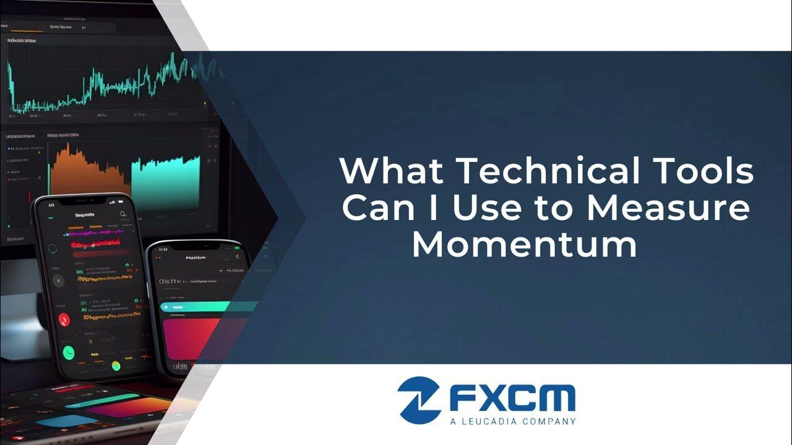

## Table of Contents

## What is momentum in the context of technical analysis?

Momentum in technical analysis is a way to measure how fast a stock's price is moving. It helps traders see if a stock is gaining or losing strength. Think of it like a car on the highway. If the car is speeding up, it has positive momentum. If it's slowing down, it has negative momentum. Traders use momentum to decide when to buy or sell a stock.

To calculate momentum, traders often use a simple formula. They take the current price of a stock and subtract its price from a certain number of days ago. If the result is positive, the stock has positive momentum. If it's negative, the stock has negative momentum. This helps traders spot trends and make better decisions. For example, if a stock's momentum is increasing, it might be a good time to buy because the price could keep going up.

## Why is measuring momentum important for traders and investors?

Measuring momentum is important for traders and investors because it helps them understand if a stock's price is getting stronger or weaker. Imagine you're watching a soccer game. If a team keeps moving the ball forward, they have good momentum and are likely to score. Similarly, if a stock's price keeps going up, it has positive momentum, which might mean it will keep rising. This helps traders decide when to buy a stock, hoping to profit from the upward trend.

On the other hand, if a stock's momentum is negative, it means the price is falling and might keep falling. This can signal to investors that it might be a good time to sell the stock to avoid further losses. By keeping an eye on momentum, traders and investors can make better decisions about when to buy or sell, helping them manage their investments more effectively.

## What are the basic indicators used to measure momentum?

One of the main indicators used to measure momentum is the Relative Strength Index (RSI). The RSI looks at how fast and how much a stock's price is changing. It gives a number between 0 and 100. If the RSI is above 70, it means the stock might be overbought, which means it could be due for a price drop soon. If it's below 30, the stock might be oversold, suggesting it could be a good time to buy because the price might go up soon.

Another common indicator is the Moving Average Convergence Divergence (MACD). The MACD shows the difference between two moving averages of a stock's price. It helps traders see if the stock's momentum is getting stronger or weaker. When the MACD line crosses above the signal line, it's a sign that the stock's momentum is increasing, which might be a good time to buy. If the MACD line crosses below the signal line, it suggests the momentum is decreasing, and it might be time to sell.

The Momentum Indicator itself is also used. This is calculated by taking the current price of a stock and subtracting its price from a certain number of days ago. If the result is positive, the stock has positive momentum, which means its price is going up. If it's negative, the stock has negative momentum, indicating its price is going down. This simple calculation helps traders quickly see if a stock's price is gaining or losing strength.

## How does the Moving Average Convergence Divergence (MACD) indicator work to measure momentum?

The Moving Average Convergence Divergence (MACD) indicator helps traders see if a stock's momentum is getting stronger or weaker. It does this by looking at the difference between two moving averages of the stock's price. One is a fast moving average, which is usually calculated over 12 days, and the other is a slow moving average, usually calculated over 26 days. When the fast moving average moves away from the slow moving average, it creates the MACD line. If the MACD line is above zero, it means the fast moving average is higher than the slow moving average, which suggests the stock's momentum is positive.

To make the MACD more useful, traders also use a signal line, which is a 9-day moving average of the MACD line. When the MACD line crosses above the signal line, it's a sign that the stock's momentum is increasing, and it might be a good time to buy. On the other hand, when the MACD line crosses below the signal line, it suggests the momentum is decreasing, which could be a signal to sell. By watching these crossovers, traders can get a clearer picture of whether a stock's price is likely to keep going up or start going down.

## What is the Relative Strength Index (RSI) and how is it used to identify momentum?

The Relative Strength Index (RSI) is a tool that helps traders see if a stock is getting too expensive or too cheap. It does this by looking at how fast and how much a stock's price is changing. The RSI gives a number between 0 and 100. If the RSI number is above 70, it means the stock might be overbought, which is like saying it's too expensive and might drop in price soon. If the RSI is below 30, the stock might be oversold, meaning it's too cheap and might go up in price soon.

Traders use the RSI to spot changes in a stock's momentum. If the RSI starts going up from a low number, it can show that the stock's momentum is getting stronger, and the price might keep going up. If the RSI starts going down from a high number, it can mean the stock's momentum is getting weaker, and the price might start to fall. By watching the RSI, traders can make better decisions about when to buy or sell a stock based on its momentum.

## Can you explain the Stochastic Oscillator and its role in momentum analysis?

The Stochastic Oscillator is a tool that helps traders see if a stock's price is about to change direction. It does this by comparing a stock's closing price to its price range over a certain number of days, usually 14 days. The Stochastic Oscillator gives a number between 0 and 100. If the number is above 80, it means the stock might be overbought, which means it could be too expensive and might go down soon. If the number is below 20, the stock might be oversold, meaning it's too cheap and might go up soon.

Traders use the Stochastic Oscillator to spot changes in a stock's momentum. If the Stochastic line starts going up from a low number, it can show that the stock's momentum is getting stronger, and the price might keep going up. If the Stochastic line starts going down from a high number, it can mean the stock's momentum is getting weaker, and the price might start to fall. By watching the Stochastic Oscillator, traders can make better decisions about when to buy or sell a stock based on its momentum.

## How do momentum indicators help in identifying overbought and oversold conditions?

Momentum indicators like the Relative Strength Index (RSI) and the Stochastic Oscillator help traders see if a stock is overbought or oversold. Overbought means the stock's price might be too high and could go down soon. Oversold means the price might be too low and could go up soon. The RSI gives a number between 0 and 100. If the RSI is above 70, it means the stock is overbought. If it's below 30, the stock is oversold. Traders watch these numbers to decide when to buy or sell a stock.

The Stochastic Oscillator also helps identify overbought and oversold conditions. It compares a stock's closing price to its price range over a certain time, usually 14 days, and gives a number between 0 and 100. If the Stochastic number is above 80, the stock is overbought, suggesting it might be time to sell. If it's below 20, the stock is oversold, suggesting it might be time to buy. By keeping an eye on these indicators, traders can make better decisions about when to trade based on whether a stock's price is likely to change direction soon.

## What are some advanced momentum indicators and how do they differ from basic ones?

Advanced momentum indicators, like the Rate of Change (ROC) and the Momentum Indicator, give traders a deeper look into how fast a stock's price is moving. The ROC measures how much a stock's price has changed over a certain number of days. If the ROC line goes up, it means the stock's price is rising faster, showing strong positive momentum. If it goes down, the price is falling faster, showing strong negative momentum. The Momentum Indicator is similar but simpler. It's just the current price minus the price from a set number of days ago. Both of these indicators help traders see not just if the price is changing, but how quickly it's changing.

These advanced indicators differ from basic ones like the RSI and Stochastic Oscillator in a few ways. The RSI and Stochastic Oscillator mainly focus on whether a stock is overbought or oversold, which helps traders spot when a price might change direction. They give numbers between 0 and 100 to show this. On the other hand, advanced indicators like the ROC and Momentum Indicator focus more on the speed of price changes. They help traders understand the strength of a trend, which can be useful for deciding when to enter or [exit](/wiki/exit-strategy) a trade based on how fast the price is moving.

## How can momentum indicators be combined with other technical analysis tools for better results?

Momentum indicators can be combined with other technical analysis tools to help traders make better decisions. For example, traders often use momentum indicators like the RSI or MACD along with moving averages. A moving average is a line that shows the average price of a stock over a certain time. If the RSI shows a stock is overbought and the price is also above a long-term moving average, it might be a good time to sell. On the other hand, if the RSI shows a stock is oversold and the price is below a long-term moving average, it might be a good time to buy. By using both tools together, traders can get a clearer picture of whether a stock's price is likely to go up or down.

Another way to combine momentum indicators with other tools is by using trend lines and support and resistance levels. Trend lines are lines drawn on a chart to show the direction of a stock's price. Support and resistance levels are price points where the stock tends to stop and reverse. If a momentum indicator like the Stochastic Oscillator shows a stock is overbought and the price is also hitting a resistance level, it might be a strong signal to sell. If the Stochastic Oscillator shows a stock is oversold and the price is at a support level, it might be a strong signal to buy. By looking at momentum indicators along with these other tools, traders can make more informed decisions about when to trade.

## What are the limitations and potential pitfalls of using momentum indicators?

Using momentum indicators can help traders, but they also have some problems. One big problem is that these indicators can give false signals. For example, the RSI might show a stock is overbought, but the price could keep going up for a while before it drops. This can trick traders into selling too early. Also, momentum indicators often work best in markets that are moving in a clear direction. If the market is moving sideways, without a strong up or down trend, these indicators can be less useful and might lead to bad trades.

Another issue is that momentum indicators can be slow to react. By the time an indicator like the MACD shows a change in momentum, the price might have already moved a lot. This delay can make traders miss out on the best times to buy or sell. Also, relying too much on just one type of indicator can be risky. Traders need to use other tools and look at the bigger picture to make the best decisions. If they only use momentum indicators, they might miss important signs from other parts of the market.

## How can algorithmic trading strategies incorporate momentum indicators?

Algorithmic trading strategies can use momentum indicators to make smart trading decisions. These strategies often use computers to watch the market and trade based on rules set by the indicators. For example, a strategy might use the RSI to decide when to buy or sell a stock. If the RSI goes above 70, showing the stock is overbought, the algorithm might sell the stock. If the RSI drops below 30, showing the stock is oversold, the algorithm might buy the stock. By using these signals, the algorithm can quickly take advantage of changes in a stock's momentum.

Another way to use momentum indicators in [algorithmic trading](/wiki/algorithmic-trading) is by combining them with other tools. For example, an algorithm might use the MACD along with moving averages to make better decisions. If the MACD shows a stock's momentum is increasing and the price is above a long-term moving average, the algorithm might decide to buy the stock. If the MACD shows the momentum is decreasing and the price is below a long-term moving average, the algorithm might decide to sell. By using multiple indicators, the algorithm can make more accurate trades and reduce the chance of making mistakes.

## What are the latest developments and tools in momentum measurement for expert traders?

Expert traders are now using more advanced tools to measure momentum, like [machine learning](/wiki/machine-learning) and [artificial intelligence](/wiki/ai-artificial-intelligence). These tools can look at a lot of data very quickly and find patterns that might be hard for people to see. For example, some traders use AI to create custom momentum indicators that can change based on what's happening in the market. This can help traders make better decisions because the indicators are always learning and getting better. Also, some new tools can look at social media and news to see how people feel about a stock, which can affect its momentum.

Another new development is the use of high-frequency trading algorithms that use momentum indicators. These algorithms can trade very quickly, often in just a few seconds, to take advantage of small changes in a stock's momentum. They use tools like the Rate of Change (ROC) and the Momentum Indicator to spot these changes. This can help traders make money from very short-term movements in the market. But it's important for traders to be careful because these fast trades can also be risky if the market moves in a way they don't expect.

## What are Momentum Indicators and How Do They Work?

Momentum indicators are crucial technical analysis tools that assess the rate of change in a security’s price over a designated period. By measuring this price momentum, these indicators help traders identify the strength or weakness of a current market trend, which in turn, provides actionable buy and sell signals. Understanding these signals can greatly enhance a trader's ability to time market entries and exits, especially in dynamic trading environments.

### Key Momentum Indicators

1. **Relative Strength Index (RSI):**  
   RSI is an oscillator that measures the speed and change of price movements. Developed by J. Welles Wilder, it oscillates between 0 and 100 and is primarily used to identify overbought or oversold conditions in a trading asset. A reading above 70 typically suggests that a security is overbought, while a reading below 30 indicates it is oversold. The calculation of RSI involves the following formula:
$$
   RSI = 100 - \frac{100}{1 + RS}

$$

   where $RS$ is the average of "N" days' up closes divided by the average of "N" days' down closes.

2. **Moving Average Convergence Divergence (MACD):**  
   The MACD indicator, created by Gerald Appel, is designed to reveal changes in the strength, direction, [momentum](/wiki/momentum), and duration of a trend. It consists of two moving averages converging, diverging, and crossing over a 'signal line'. The MACD line is the difference between the 12-day EMA (Exponential Moving Average) and the 26-day EMA, while the signal line is often a 9-day EMA of the MACD line. The histogram illustrates the difference between MACD and the signal line, providing visual cues for buy or sell signals when the lines cross.

3. **Stochastic Oscillator:**  
   This momentum indicator, introduced by George Lane, compares a particular closing price of a security to a range of its prices over a specified time period. The oscillator moves between 0 and 100. Traditional settings use thresholds of 80 to indicate overbought conditions and 20 for oversold conditions. The formula for the stochastic oscillator is:
$$
   \%K = \frac{{(Current\:Close - Lowest\:Low)}}{{(Highest\:High - Lowest\:Low)}} \times 100

$$

   \%D is the 3-day simple moving average of \%K.

Each of these indicators brings unique insights into market dynamics, providing valuable information for traders to make informed decisions. By utilizing momentum indicators like RSI, MACD, and the Stochastic Oscillator, investors can better grasp the momentum at which a security's price is changing, which is essential for identifying potential opportunities in the market.

## What are the key momentum indicators?

Relative Strength Index (RSI): The Relative Strength Index (RSI) is a momentum oscillator that measures the speed and change of price movements by comparing the magnitude of recent gains to recent losses over a specified time period. The RSI is typically used to identify overbought or oversold conditions in a trading asset. The indicator is expressed as a percentage and ranges from 0 to 100, where levels above 70 may signal that an asset is overbought, while levels below 30 may indicate that it is oversold. The RSI is calculated using the following formula:

$$
\text{RSI} = 100 - \left(\frac{100}{1 + \text{RS}}\right)
$$

where RS (Relative Strength) is the average of 'n' days' up closes divided by the average of 'n' days' down closes. The standard number of periods used to calculate the RSI is 14.

Moving Average Convergence Divergence (MACD): The Moving Average Convergence Divergence (MACD) is a trend-following momentum indicator that reveals changes in the strength, direction, momentum, and duration of a trend in a stock's price. The MACD is derived from the difference between two exponential moving averages (EMAs) of different periods, commonly the 12-day EMA and the 26-day EMA. This difference is known as the MACD line. A signal line, typically a 9-day EMA of the MACD line, is plotted on top of the MACD to act as a trigger for buy or sell signals. The MACD histogram represents the difference between the MACD line and the signal line. When the MACD crosses above the signal line, it may signal a buying opportunity, and conversely, a cross below may indicate a selling opportunity.

Stochastic Oscillator: The Stochastic Oscillator is a momentum indicator that compares a specific closing price of a security to a range of its prices over a particular period, typically 14 periods. The oscillator ranges from 0 to 100 and is used to identify potential overbought or oversold conditions. It consists of two lines: %K and %D. %K represents the current closing price in relation to the range of prices over a selected period of time, while %D is a moving average of %K, acting as a signal line. A reading above 80 may indicate that the asset is overbought, whereas a reading below 20 may suggest it is oversold. The calculation of the Stochastic Oscillator is as follows:

$$
\%K = \frac{\text{Current Close} - \text{Lowest Low}}{\text{Highest High} - \text{Lowest Low}} \times 100
$$

where the Lowest Low and Highest High are the lowest and highest prices over the observation period, respectively. This indicator helps traders assess price momentum and predict potential reversals.

## References & Further Reading

[1]: Wilder, J. W. (1978). ["New Concepts in Technical Trading Systems."](https://archive.org/details/newconceptsintec00wild) Trend Research.

[2]: Appel, G. (2005). ["Technical Analysis: Power Tools for Active Investors"](https://www.amazon.com/Technical-Analysis-Power-Active-Investors/dp/0132930048). FT Press.

[3]: Pring, M. J. (2002). ["Technical Analysis Explained: The Successful Investor's Guide to Spotting Investment Trends and Turning Points"](https://www.amazon.com/Technical-Analysis-Explained-Fifth-Successful/dp/0071825177). McGraw-Hill Education.

[4]: Murphy, J. J. (1999). ["Technical Analysis of the Financial Markets: A Comprehensive Guide to Trading Methods and Applications"](https://archive.org/details/technicalanalysi0000murp). New York Institute of Finance.

[5]: Chan, E. P. (2009). ["Quantitative Trading: How to Build Your Own Algorithmic Trading Business"](https://github.com/ftvision/quant_trading_echan_book). Wiley.

[6]: Lopez de Prado, M. (2018). ["Advances in Financial Machine Learning"](https://www.amazon.com/Advances-Financial-Machine-Learning-Marcos/dp/1119482089). Wiley.

[7]: Jansen, S. (2018). ["Machine Learning for Algorithmic Trading: Predictive Models to Extract Signals from Market and Alternative Data for Systematic Trading Strategies"](https://github.com/stefan-jansen/machine-learning-for-trading). Packt Publishing.