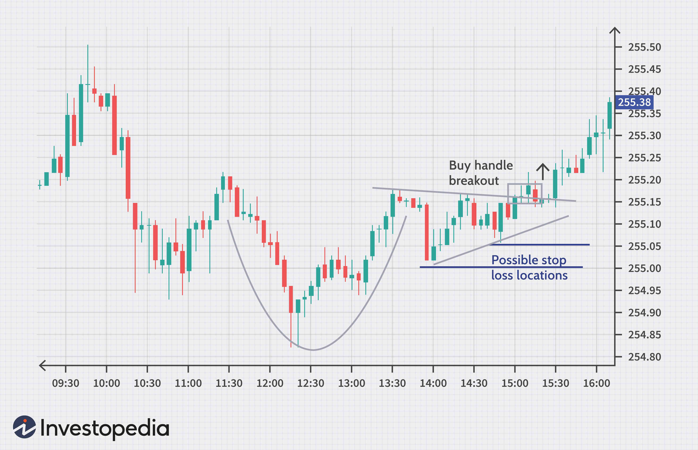

The landscape of stock market trading has witnessed profound transformations with the advent of technology, enabling more precise and efficient trading strategies. Traditional methods focused largely on fundamental analysis, evaluating company performance, and market conditions. However, the influx of data and advanced computing capabilities has led to the emergence of technical trading and algorithmic trading.

Technical trading involves the analysis of price charts and patterns to predict future market movements. This method relies on technical indicators such as moving averages, the Relative Strength Index (RSI), and the Moving Average Convergence Divergence (MACD). These tools help traders identify potential trends and inform buy or sell decisions based on historical price data.



On the other hand, algorithmic trading leverages sophisticated mathematical models and algorithms to automate trading decisions. This approach provides high speed and accuracy, processing large volumes of data far more quickly than humanly possible. Algorithmic systems can execute trades based on predefined criteria, eliminating emotional bias and enhancing the precision of trade executions.

This article examines the application of these advanced trading strategies in today's stock market landscape. We will uncover the principles underlying technical analysis and algorithmic trading, their respective tools, and the powerful synergy that arises when they are integrated. Through this exploration, we seek to illuminate how traders can utilize both methodologies to achieve more consistent and reliable outcomes in the stock market.

## Table of Contents

## Understanding Stock Market Trading Strategies

Trading strategies are essential blueprints that guide investors in making informed decisions within the stock market. These strategies are categorized into various types, each with its approach and methodology. Understanding these distinct strategies can equip traders with the necessary tools to navigate the stock market with greater efficiency and precision.

One of the foundational trading strategies is fundamental trading. This strategy focuses on evaluating a company’s intrinsic value through financial statements, industry trends, and economic indicators. Traders using this strategy analyze metrics such as earnings per share (EPS), price-to-earnings ratio (P/E), and dividend yield to assess whether a stock is undervalued or overvalued.

Technical trading, on the other hand, relies on historical price data and technical indicators to forecast future stock movements. This strategy assumes that past trading activity and price changes are valuable indicators of future price action. Technical traders often use tools like moving averages, relative strength index (RSI), and candlestick patterns to identify trading opportunities.

Algorithmic trading represents a more technologically advanced strategy. It employs sophisticated mathematical models and algorithms to execute trades at high speed and [volume](/wiki/volume-trading-strategy), often without direct human intervention. This strategy can encompass various sub-strategies such as trend-following, [arbitrage](/wiki/arbitrage), and statistical analysis to exploit market inefficiencies.

Each of these strategies involves varying degrees of analysis and implementation. Fundamental trading requires a comprehensive understanding of financial reporting and economic conditions. Technical trading demands the ability to interpret charts and market signals, while [algorithmic trading](/wiki/algorithmic-trading) necessitates proficiency in programming and quantitative analysis.

By familiarizing themselves with these strategies, traders are better equipped to construct a trading plan that aligns with their financial goals, risk tolerance, and market insights. This strategic understanding can provide an edge in the competitive landscape of stock trading, helping traders make more informed and timely investment decisions.

## Exploring Technical Trading

Technical trading is a systematic approach to stock market analysis that relies on chart patterns and technical indicators to anticipate future price movements. It is grounded on the assumption that historical trading activity and price changes can guide forecasts of future market behavior. This strategy emphasizes the timing of market entry and [exit](/wiki/exit-strategy), aiming primarily at short-term profit opportunities.

One of the core tools of technical trading is the use of technical indicators which are mathematical calculations based on the price, volume, or open interest of a security or contract. These indicators help traders evaluate market trends and potential price reversals.

**Common Technical Indicators:**

1. **Moving Averages (MA):**
   Moving averages smooth past price data to identify the direction of a trend. The two most common types are the simple moving average (SMA) and the exponential moving average (EMA). The SMA is the arithmetic mean of a given set of prices over a defined number of periods, while the EMA gives more weight to recent prices, making it more responsive to new information.
$$
   \text{SMA} = \frac{\sum_{i=1}^{n} P_i}{n}

$$
$$
   \text{EMA}_t = \left( \frac{P_t - \text{EMA}_{t-1}}{k} \right) + \text{EMA}_{t-1}

$$

   Where $P_t$ is the price at time $t$, and $k$ is the smoothing constant.

2. **Relative Strength Index (RSI):**
   The RSI measures the speed and change of price movements and is used to identify overbought or oversold conditions in a market. RSI values range from 0 to 100, with levels above 70 indicating overbought conditions, and levels below 30 indicating oversold conditions.
$$
   \text{RSI} = 100 - \left( \frac{100}{1 + \frac{\text{Average Gain}}{\text{Average Loss}}} \right)

$$

3. **Moving Average Convergence Divergence (MACD):**
   The MACD is a trend-following [momentum](/wiki/momentum) indicator that shows the relationship between two moving averages of a security’s price. It is calculated by subtracting the 26-period EMA from the 12-period EMA. The result of this calculation is the MACD line. A nine-day EMA of the MACD called the "signal line," is then plotted on top of the MACD line.
$$
   \text{MACD} = \text{EMA}_{12}(P) - \text{EMA}_{26}(P)

$$

These indicators are essential for traders who engage in technical trading as they offer insight into market trends and potential turning points. The goal is to identify opportunities to buy at low prices in anticipation of selling at higher prices, or to sell high with the expectation of repurchasing at lower prices.

By effectively analyzing chart patterns and integrating these indicators into their strategies, traders can identify potential buy and sell points with higher precision. However, technical trading requires continuous practice and analysis to refine trading decisions and enhance timing, making it a demanding but potentially rewarding approach to stock market trading.

## Diving into Algorithmic Trading

Algorithmic trading utilizes advanced mathematical models and algorithms to automate the execution of trades, optimizing the process and enabling traders to operate at high speeds. This trading method processes significant volumes of data with efficiency far exceeding manual trading, enabling quick decision-making based on predefined criteria.

The efficiency of algorithmic trading is largely due to its reliance on algorithmic systems that eliminate human emotion from trading decisions. This potentially reduces errors caused by emotional biases, leading to more rational and systematic trading. Algorithms are designed to execute trades when certain market conditions are met, ensuring precision and consistency.

Several strategies are commonly employed in algorithmic trading:

1. **Trend-Following**: This approach involves algorithms that identify and capitalize on trends in stock prices. A common tool in this strategy is the Moving Average, which helps detect momentum and allows the algorithm to follow a trend until a predetermined criterion indicates a trend reversal.

2. **Arbitrage**: Arbitrage strategies in algorithmic trading identify price discrepancies between different markets or securities. Algo trading systems can quickly execute orders to exploit these discrepancies, buying low in one market and selling high in another, often achieving risk-free profits. 

3. **Statistical Arbitrage**: This involves complex statistical models to forecast price movements and identify tradable opportunities. Algorithms analyze historical data and apply statistical measures to detect and act on anomalies. 

The Python programming language is often used for implementing algorithmic trading strategies due to its simplicity and the comprehensive suite of financial libraries it offers. Here’s a basic example of a moving average crossover strategy using Python:

```python
import pandas as pd
import numpy as np

# Sample stock price data
data = pd.DataFrame({'Date': pd.date_range(start='2020-01-01', periods=100),
                     'Close': np.random.randn(100).cumsum()})

# Calculate short-term and long-term moving averages
short_window = 40
long_window = 100

data['short_mavg'] = data['Close'].rolling(window=short_window, min_periods=1).mean()
data['long_mavg'] = data['Close'].rolling(window=long_window, min_periods=1).mean()

# Generate trade signals
data['signal'] = 0.0
data['signal'][short_window:] = np.where(data['short_mavg'][short_window:] > data['long_mavg'][short_window:], 1.0, 0.0)
data['positions'] = data['signal'].diff()

# Output the signal and positions
print(data[['Date', 'Close', 'short_mavg', 'long_mavg', 'signal', 'positions']])
```

Algorithmic trading delivers distinct advantages, notably in terms of accuracy and timing, by automating the trading process. The speed at which these algorithms operate allows traders to capitalize on even fleeting market opportunities. Consequently, algorithmic trading can enhance the probability of profitable outcomes while mitigating the risks associated with emotional decision-making in trading.

## Technical Indicators in Trading Strategies

Technical indicators play a vital role in the strategies of traders focused on market forecasting through technical analysis. These tools help traders make informed decisions by providing insights into potential future price movements and market conditions. Three of the most widely used technical indicators are the Relative Strength Index (RSI), moving averages, and Bollinger Bands.

The Relative Strength Index (RSI) is a momentum oscillator that measures the speed and change of price movements. It ranges from 0 to 100 and is typically used to identify overbought or oversold conditions in a security. An RSI above 70 may indicate that a stock is overbought, while an RSI below 30 might suggest it is oversold. Calculating RSI involves the formula:

$$
RSI = 100 - \left( \frac{100}{1 + RS} \right)
$$

where $RS$ is the average of $x$ days' up closes divided by the average of $x$ days' down closes.

Moving averages are another essential technical indicator used to smooth out price data over a specified period, creating a single flowing line that makes it easier to see the direction of the trend. The two most common types are the simple moving average (SMA) and the exponential moving average (EMA), with EMA giving more weight to recent prices. The SMA is calculated by averaging the closing prices over a set period, while the EMA uses a more complex calculation to give greater weight to more recent observations.

Finally, Bollinger Bands consist of a middle band being an N-period simple moving average (SMA) and an upper and a lower band. The upper and lower bands are typically 2 standard deviations away from the SMA. Bollinger Bands are particularly useful for identifying [volatility](/wiki/volatility-trading-strategies). When the bands squeeze together, it usually indicates a period of low volatility and may be followed by a significant price shift. Conversely, when the bands move apart, it suggests high volatility.

Incorporating these indicators into a trading strategy requires a keen understanding of market conditions and the specific characteristics of the asset being traded. They should not be used in isolation but combined with other indicators and market analysis techniques to enhance decision-making. For example, a trader may use RSI in conjunction with moving averages to confirm trading signals and refine entry and exit points. This multifaceted approach enables traders to better time their trades and potentially improve their performance in the stock market.

## Integrating Technical and Algo Trading Strategies

Integrating technical analysis with algorithmic trading strategies offers an advanced approach that combines the precision of mathematical modeling with the insights derived from historical price patterns and market data. This synthesis allows for the creation of trading systems capable of executing complex strategies swiftly and with minimal human intervention.

Algorithmic systems are designed to recognize specific technical indicators, such as moving averages, relative strength index (RSI), and Bollinger Bands, among others. By coding these indicators into an algorithm, traders can automate their strategies to buy or sell stocks when certain conditions are met. For example, an algorithm may be programmed to execute a trade when a short-term moving average crosses a long-term moving average, indicating a potential change in trend. This method, often called a moving average crossover strategy, is a simple yet effective way to exploit market inefficiencies.

In addition to timing the market, the integration of technical analysis and algorithmic trading can optimize trade execution by reducing slippage and transaction costs. Algorithms can assess market [liquidity](/wiki/liquidity-risk-premium) and adjust their trading speed accordingly, thereby preserving the trader's intended profit margins. For instance, an algorithm can spread large orders over time to prevent significant impacts on market prices.

Furthermore, the combination of these strategies assists in risk management by providing real-time monitoring and adjustment capabilities. Algorithms can continuously reevaluate their positions based on updated market information and predefined risk parameters, thereby minimizing potential losses. For example, employing a trailing stop-loss mechanism through an algorithm allows traders to lock in profits while protecting against sharp market reversals.

The use of algorithmic systems offers considerable scalability benefits, enabling traders to apply their strategies across multiple markets and asset classes simultaneously. This diversification can improve overall portfolio performance by capturing various market opportunities and distributing risk.

In conclusion, the integration of technical and algorithmic trading strategies enhances the trading process by combining data-driven decision-making with automated execution. Traders who leverage these advanced techniques can navigate market complexities more effectively, optimizing their returns and managing risks with greater precision.

## Common Mistakes and Pitfalls

Overfitting to historical data is a critical error that can mislead trading strategies when applied to real market conditions. When a model is overfitted, it means that it has been tailored too closely to the nuances of the past data set, capturing noise along with the signal. As a result, while the model may perform exceptionally on historical data, its effectiveness in predicting future market movements is significantly diminished. Mathematical rigor, such as cross-validation techniques and ensuring out-of-sample testing, can mitigate the risk of overfitting. 

Another common pitfall involves ignoring transaction costs and slippage. Transaction costs include broker fees, taxes, and other costs involved in buying or selling securities. Slippage refers to the difference between the expected price of a trade and the actual price at which the trade is executed, often due to market volatility. If a trading strategy assumes an ideal world with no costs or slippage, the perceived profitability will likely be inflated. Incorporating these factors into the profitability model is essential for a realistic assessment. An example of consideration in Python can include:

```python
def calculate_actual_profit(expected_profit, transaction_costs, slippage):
    return expected_profit - (transaction_costs + slippage)

expected_profit = 1000  # Example expected profit
transaction_costs = 50  # Example transaction costs
slippage = 20  # Example slippage

actual_profit = calculate_actual_profit(expected_profit, transaction_costs, slippage)
print(f"Actual Profit: {actual_profit}")
```

Failing to adapt to changing market conditions can render a previously robust strategy ineffective. Markets are influenced by a multitude of dynamic factors including economic indicators, geopolitical events, and market sentiment. Sticking rigidly to a static trading strategy without adjustments for evolving conditions may lead to suboptimal outcomes. Successful traders often employ strategies such as periodic reviews and updates to their models, integrate adaptive algorithms, and diversify their approaches to mitigate this risk.

Finally, a successful trader continuously monitors and refines their strategies. This ongoing process involves evaluating current strategies against recent performance data and market changes. By doing so, traders can identify areas for improvement, renew their understanding of market dynamics, and maintain alignment with their investment goals and risk tolerance. Using automated monitoring tools and data analytics can significantly enhance this iterative process, providing timely insights into strategy performance.

## Conclusion

Technical and algorithmic trading strategies provide crucial mechanisms for adeptly navigating the complexities of the stock market. These methods harness data analysis and cutting-edge technology to empower traders to make informed decisions and potentially achieve consistent, reliable outcomes. The precision afforded by algorithmic trading, combined with the insights from technical analysis, enables traders to respond swiftly to market signals and execute trades that might elude manual strategies. 

However, the effectiveness of any trading strategy hinges on its alignment with the trader's specific goals, risk tolerance, and comprehensive understanding of the market. For instance, a risk-averse investor may prefer strategies that emphasize stability and minimal drawdowns, whereas an aggressive trader might pursue methods prioritizing high returns despite increased volatility.

One fundamental requirement for success in the ever-evolving stock market is the commitment to continuous learning and adaptation. Market conditions, financial instruments, and technology are in constant flux, demanding that traders remain vigilant and responsive to changes. This dynamic environment necessitates the regular refinement of strategies, incorporating the latest insights, data, and analytical tools available.

In conclusion, while technical and algorithmic strategies offer robust frameworks for stock market trading, their successful implementation requires a strategic alignment with individual trading profiles and a commitment to ongoing development. This balanced approach helps traders effectively manage risk, capitalize on opportunities, and thrive in a dynamic market landscape.

## References & Further Reading

[1]: ["Advances in Financial Machine Learning"](https://www.amazon.com/Advances-Financial-Machine-Learning-Marcos/dp/1119482089) by Marcos Lopez de Prado

[2]: ["Evidence-Based Technical Analysis: Applying the Scientific Method and Statistical Inference to Trading Signals"](https://www.amazon.com/Evidence-Based-Technical-Analysis-Scientific-Statistical/dp/0470008741) by David Aronson

[3]: ["Machine Learning for Algorithmic Trading"](https://github.com/stefan-jansen/machine-learning-for-trading) by Stefan Jansen

[4]: ["Quantitative Trading: How to Build Your Own Algorithmic Trading Business"](https://www.amazon.com/Quantitative-Trading-Build-Algorithmic-Business/dp/1119800064) by Ernest P. Chan

[5]: ["Technical Analysis of the Financial Markets: A Comprehensive Guide to Trading Methods and Applications"](https://archive.org/details/technicalanalysi0000murp) by John J. Murphy

[6]: ["Algorithmic Trading: Winning Strategies and Their Rationale"](https://www.amazon.com/Algorithmic-Trading-Winning-Strategies-Rationale-ebook/dp/B00CY5HC0U) by Ernest P. Chan

[7]: Park, C.-H., & Irwin, S. H. (2007). ["What do we know about the profitability of technical analysis?"](https://onlinelibrary.wiley.com/doi/abs/10.1111/j.1467-6419.2007.00519.x) Journal of Economic Surveys, 21(4), 786-826.

[8]: Fama, E. F., & French, K. R. (1992). ["The Cross-Section of Expected Stock Returns."](https://onlinelibrary.wiley.com/doi/full/10.1111/j.1540-6261.1992.tb04398.x) The Journal of Finance, 47(2), 427-465.