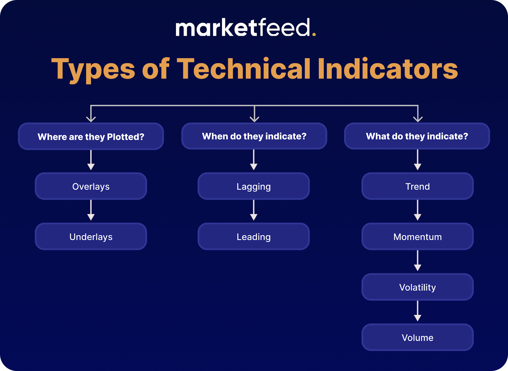

## Table of Contents

## What is technical trading?

Technical trading is a method where traders use past price data and chart patterns to make decisions about buying and selling stocks, currencies, or other financial instruments. Instead of focusing on a company's fundamentals like earnings or management, technical traders look at charts and use various tools to predict future price movements. They believe that all known information is already reflected in the price, so they study the price action to find patterns that can signal when to enter or exit a trade.

One common tool used in technical trading is the moving average, which smooths out price data to create a single flowing line. This helps traders see the overall direction of the market more clearly. Another tool is the Relative Strength Index (RSI), which measures the speed and change of price movements to determine if a stock is overbought or oversold. By using these and other indicators, technical traders aim to time their trades to maximize profits and minimize losses.

## What are the basic principles of technical analysis?

Technical analysis is based on the idea that history tends to repeat itself in the markets. Traders who use technical analysis believe that by studying past price movements and chart patterns, they can predict what will happen next. They look at things like trends, support and resistance levels, and various chart patterns to make their decisions. The main principle here is that all known information about a stock or market is already reflected in its price, so there's no need to look at other factors like a company's earnings or news events.

Another key principle of technical analysis is that prices move in trends. These trends can be upward, downward, or sideways, and technical analysts try to identify these trends early to make profitable trades. They use tools like moving averages to smooth out price data and see the overall direction more clearly. By understanding and following these trends, technical traders aim to buy low and sell high, or sell high and buy back lower if they're betting on a price drop.

Lastly, technical analysis relies heavily on the concept of support and resistance. Support is a price level where a stock or market tends to find buying interest and bounce back up, while resistance is a level where selling interest tends to push the price back down. By identifying these levels, technical traders can make better decisions about when to enter or exit a trade. They believe that these levels are important because they show where the market has reacted strongly in the past, and it's likely to react similarly in the future.

## How does technical trading differ from fundamental trading?

Technical trading and fundamental trading are two different ways to make decisions about buying and selling stocks or other financial instruments. Technical trading focuses on looking at past price data and chart patterns to predict future price movements. People who use this method believe that all important information is already shown in the price, so they don't need to look at other things like a company's earnings or news. They use tools like moving averages and the Relative Strength Index (RSI) to help them see trends and decide when to buy or sell.

On the other hand, fundamental trading looks at the actual value of a company based on its financial health and other factors. Fundamental traders study things like earnings reports, the company's management, and the overall economy to decide if a stock is a good buy. They believe that if a company is doing well and has strong fundamentals, its stock price will eventually go up, even if it's not doing well right now. So, while technical traders focus on the price action and charts, fundamental traders focus on the company's underlying value.

## What are the most common types of technical trading strategies?

Technical trading strategies come in many forms, but some of the most common ones include [trend following](/wiki/trend-following), [breakout](/wiki/breakout-trading) trading, and mean reversion. Trend following is a strategy where traders look for stocks or markets that are moving in a clear direction, either up or down. They use tools like moving averages to spot these trends early and then buy or sell based on the direction of the trend. The idea is to ride the trend until it shows signs of reversing. Breakout trading is another popular strategy where traders watch for prices to move beyond certain levels, called support or resistance. When the price breaks through these levels, it's seen as a signal that the price might keep moving in that direction, so traders will buy or sell based on the breakout.

Mean reversion is a strategy based on the idea that prices will eventually return to their average levels after moving too far in one direction. Traders using this strategy look for stocks that have moved a lot and then bet on them coming back to their average price. They might use indicators like the Relative Strength Index (RSI) to see if a stock is overbought or oversold, which can signal a good time to buy or sell. Each of these strategies has its own set of tools and indicators, but they all rely on the same basic idea of using past price data to predict future movements.

## Can you explain trend following in technical trading?

Trend following in technical trading is a strategy where traders look for stocks or markets that are moving in a clear direction, either up or down. They use tools like moving averages to spot these trends early. A moving average is a line on a chart that shows the average price over a certain time. When the price is above the moving average, it might be a good time to buy because the trend is up. When the price is below the moving average, it might be a good time to sell because the trend is down. The goal is to get into a trade at the start of a trend and stay in it until the trend changes.

Once a trend is spotted, trend followers will keep their trades open as long as the trend continues. They do this by watching the moving averages or other indicators to see if the trend is still going strong. If the trend starts to reverse, they will close their trade to lock in their profits. This strategy is based on the idea that trends can last for a long time, so by following them, traders can make money even if they don't know exactly when the trend will end. It's all about riding the wave until it's over.

## What is meant by 'support and resistance' in technical trading?

In technical trading, 'support' and 'resistance' are important ideas that help traders make decisions. Support is a price level where a stock or market tends to stop falling and start going back up. It's like a floor that the price bounces off of. Traders think this happens because a lot of people want to buy at that price, so there's enough buying interest to push the price up again. When traders see the price getting close to the support level, they might decide it's a good time to buy because they think the price will go up from there.

Resistance is the opposite of support. It's a price level where a stock or market tends to stop going up and start going back down. It's like a ceiling that the price hits and then falls from. Traders believe this happens because a lot of people want to sell at that price, so there's enough selling interest to push the price down again. When traders see the price getting close to the resistance level, they might decide it's a good time to sell because they think the price will go down from there. By watching these levels, traders can try to guess where the price might go next and make better trading decisions.

## How do technical traders use chart patterns?

Technical traders use chart patterns to try and predict where the price of a stock or market might go next. They look at the shapes that prices make on a chart over time. Some common patterns they watch for are things like 'head and shoulders,' 'double tops,' and 'triangles.' These patterns can tell traders if the price might keep going up, start going down, or stay the same for a while. By spotting these patterns early, traders can decide when to buy or sell to make a profit.

For example, if a trader sees a 'head and shoulders' pattern, it might mean the price is going to start going down soon. This pattern looks like a head with two shoulders on either side. When the price breaks below the 'neckline' of the pattern, it's a signal to sell. On the other hand, if a trader sees an 'ascending triangle,' it might mean the price is going to keep going up. This pattern looks like a triangle with a flat top and a rising bottom. When the price breaks above the top of the triangle, it's a signal to buy. By using these patterns, traders can make better guesses about what the price will do next.

## What are technical indicators and how are they used in trading?

Technical indicators are tools that traders use to help them understand what the price of a stock or market might do next. These indicators are based on math and look at past price data to give traders signals about buying or selling. Some common technical indicators include moving averages, the Relative Strength Index (RSI), and the Moving Average Convergence Divergence (MACD). Each of these indicators helps traders in a different way, but they all use the same idea of looking at past prices to guess future movements.

Traders use these indicators to make better decisions about when to buy or sell. For example, a moving average can help a trader see the overall direction of the price. If the price is above the moving average, it might be a good time to buy because the trend is up. If the price is below the moving average, it might be a good time to sell because the trend is down. The RSI can tell a trader if a stock is overbought or oversold, which can be a signal to buy or sell. By using these indicators, traders can try to time their trades better and make more money.

## What is the role of volume in technical trading?

Volume is an important part of technical trading. It tells traders how many shares or contracts of a stock or market are being bought and sold. When the [volume](/wiki/volume-trading-strategy) is high, it means a lot of people are trading, which can show that the price movement is strong and likely to keep going. On the other hand, if the volume is low, it means fewer people are trading, and the price movement might not be as strong or reliable.

Traders use volume to confirm what they see in the price. For example, if the price of a stock goes up and the volume is high, it's a good sign that the price increase is real and might keep going. But if the price goes up and the volume is low, it might mean the price increase is weak and could go back down soon. By looking at both the price and the volume, traders can make better guesses about what will happen next and decide when to buy or sell.

## How can technical traders use moving averages effectively?

Technical traders use moving averages to spot trends and make decisions about when to buy or sell. A moving average is a line on a chart that shows the average price of a stock or market over a certain time. When traders see the price of a stock go above the moving average, they might think it's a good time to buy because the trend is going up. If the price goes below the moving average, they might think it's a good time to sell because the trend is going down. By using moving averages, traders can see the big picture of where the price is heading and make better guesses about what to do next.

Another way traders use moving averages is by looking at two different moving averages at the same time. For example, they might use a short-term moving average, like one that looks at the last 50 days, and a long-term moving average, like one that looks at the last 200 days. When the short-term moving average crosses above the long-term moving average, it's called a "golden cross," and it can be a signal to buy because it means the trend might be starting to go up. When the short-term moving average crosses below the long-term moving average, it's called a "death cross," and it can be a signal to sell because it means the trend might be starting to go down. By watching these crosses, traders can try to get into trades at the start of a trend and make more money.

## What advanced technical trading strategies should an expert trader know?

Expert traders often use advanced strategies like Fibonacci retracement and Elliott Wave Theory to make better guesses about where the price will go next. Fibonacci retracement uses special numbers to find levels where the price might stop going down and start going up again. Traders draw lines on the chart at these levels and watch to see if the price bounces off them. If it does, it can be a good time to buy. Elliott Wave Theory is another advanced strategy that says prices move in waves. Traders look for these waves on the chart and try to guess where the next wave will go. By understanding these waves, traders can make better decisions about when to buy or sell.

Another advanced strategy is using multiple time frame analysis. This means looking at the same stock or market on different time frames, like daily, hourly, and 15-minute charts. By doing this, traders can see the big picture and the small details at the same time. For example, if the daily chart shows a strong uptrend, but the hourly chart shows the price is going down, a trader might wait for the hourly chart to start going up again before buying. This can help traders make better decisions and avoid getting into bad trades. By using these advanced strategies, expert traders can try to make more money and be more successful in the markets.

## How can technical trading be integrated with algorithmic trading systems?

Technical trading can be integrated with [algorithmic trading](/wiki/algorithmic-trading) systems by using computer programs to automatically buy and sell based on technical indicators and chart patterns. Traders set up rules in the algorithm that tell it when to make a trade. For example, if a moving average crossover happens, the algorithm can be programmed to buy or sell a stock without the trader having to do it manually. This makes trading faster and can help traders take advantage of opportunities in the market that they might miss if they were doing everything by hand.

These algorithms can also use more advanced technical strategies like Fibonacci retracement and Elliott Wave Theory. The computer can quickly analyze lots of data and find patterns that would take a human trader a long time to see. By setting up the algorithm to follow these strategies, traders can make more informed decisions and possibly make more money. Plus, because the algorithm follows the rules exactly, it can help traders stick to their trading plan without letting emotions get in the way.

## What is Exploring Technical Trading?

Technical trading is a systematic approach to stock market analysis that relies on chart patterns and technical indicators to anticipate future price movements. It is grounded on the assumption that historical trading activity and price changes can guide forecasts of future market behavior. This strategy emphasizes the timing of market entry and [exit](/wiki/exit-strategy), aiming primarily at short-term profit opportunities.

One of the core tools of technical trading is the use of technical indicators which are mathematical calculations based on the price, volume, or open interest of a security or contract. These indicators help traders evaluate market trends and potential price reversals.

**Common Technical Indicators:**

1. **Moving Averages (MA):**
   Moving averages smooth past price data to identify the direction of a trend. The two most common types are the simple moving average (SMA) and the exponential moving average (EMA). The SMA is the arithmetic mean of a given set of prices over a defined number of periods, while the EMA gives more weight to recent prices, making it more responsive to new information.
$$
   \text{SMA} = \frac{\sum_{i=1}^{n} P_i}{n}

$$
$$
   \text{EMA}_t = \left( \frac{P_t - \text{EMA}_{t-1}}{k} \right) + \text{EMA}_{t-1}

$$

   Where $P_t$ is the price at time $t$, and $k$ is the smoothing constant.

2. **Relative Strength Index (RSI):**
   The RSI measures the speed and change of price movements and is used to identify overbought or oversold conditions in a market. RSI values range from 0 to 100, with levels above 70 indicating overbought conditions, and levels below 30 indicating oversold conditions.
$$
   \text{RSI} = 100 - \left( \frac{100}{1 + \frac{\text{Average Gain}}{\text{Average Loss}}} \right)

$$

3. **Moving Average Convergence Divergence (MACD):**
   The MACD is a trend-following [momentum](/wiki/momentum) indicator that shows the relationship between two moving averages of a security’s price. It is calculated by subtracting the 26-period EMA from the 12-period EMA. The result of this calculation is the MACD line. A nine-day EMA of the MACD called the "signal line," is then plotted on top of the MACD line.
$$
   \text{MACD} = \text{EMA}_{12}(P) - \text{EMA}_{26}(P)

$$

These indicators are essential for traders who engage in technical trading as they offer insight into market trends and potential turning points. The goal is to identify opportunities to buy at low prices in anticipation of selling at higher prices, or to sell high with the expectation of repurchasing at lower prices.

By effectively analyzing chart patterns and integrating these indicators into their strategies, traders can identify potential buy and sell points with higher precision. However, technical trading requires continuous practice and analysis to refine trading decisions and enhance timing, making it a demanding but potentially rewarding approach to stock market trading.

## What are Technical Indicators in Trading Strategies?

Technical indicators play a vital role in the strategies of traders focused on market forecasting through technical analysis. These tools help traders make informed decisions by providing insights into potential future price movements and market conditions. Three of the most widely used technical indicators are the Relative Strength Index (RSI), moving averages, and Bollinger Bands.

The Relative Strength Index (RSI) is a momentum oscillator that measures the speed and change of price movements. It ranges from 0 to 100 and is typically used to identify overbought or oversold conditions in a security. An RSI above 70 may indicate that a stock is overbought, while an RSI below 30 might suggest it is oversold. Calculating RSI involves the formula:

$$
RSI = 100 - \left( \frac{100}{1 + RS} \right)
$$

where $RS$ is the average of $x$ days' up closes divided by the average of $x$ days' down closes.

Moving averages are another essential technical indicator used to smooth out price data over a specified period, creating a single flowing line that makes it easier to see the direction of the trend. The two most common types are the simple moving average (SMA) and the exponential moving average (EMA), with EMA giving more weight to recent prices. The SMA is calculated by averaging the closing prices over a set period, while the EMA uses a more complex calculation to give greater weight to more recent observations.

Finally, Bollinger Bands consist of a middle band being an N-period simple moving average (SMA) and an upper and a lower band. The upper and lower bands are typically 2 standard deviations away from the SMA. Bollinger Bands are particularly useful for identifying [volatility](/wiki/volatility-trading-strategies). When the bands squeeze together, it usually indicates a period of low volatility and may be followed by a significant price shift. Conversely, when the bands move apart, it suggests high volatility.

Incorporating these indicators into a trading strategy requires a keen understanding of market conditions and the specific characteristics of the asset being traded. They should not be used in isolation but combined with other indicators and market analysis techniques to enhance decision-making. For example, a trader may use RSI in conjunction with moving averages to confirm trading signals and refine entry and exit points. This multifaceted approach enables traders to better time their trades and potentially improve their performance in the stock market.

## References & Further Reading

[1]: ["Advances in Financial Machine Learning"](https://www.amazon.com/Advances-Financial-Machine-Learning-Marcos/dp/1119482089) by Marcos Lopez de Prado

[2]: ["Evidence-Based Technical Analysis: Applying the Scientific Method and Statistical Inference to Trading Signals"](https://www.amazon.com/Evidence-Based-Technical-Analysis-Scientific-Statistical/dp/0470008741) by David Aronson

[3]: ["Machine Learning for Algorithmic Trading"](https://github.com/stefan-jansen/machine-learning-for-trading) by Stefan Jansen

[4]: ["Quantitative Trading: How to Build Your Own Algorithmic Trading Business"](https://www.amazon.com/Quantitative-Trading-Build-Algorithmic-Business/dp/1119800064) by Ernest P. Chan

[5]: ["Technical Analysis of the Financial Markets: A Comprehensive Guide to Trading Methods and Applications"](https://archive.org/details/technicalanalysi0000murp) by John J. Murphy

[6]: ["Algorithmic Trading: Winning Strategies and Their Rationale"](https://www.amazon.com/Algorithmic-Trading-Winning-Strategies-Rationale-ebook/dp/B00CY5HC0U) by Ernest P. Chan

[7]: Park, C.-H., & Irwin, S. H. (2007). ["What do we know about the profitability of technical analysis?"](https://onlinelibrary.wiley.com/doi/abs/10.1111/j.1467-6419.2007.00519.x) Journal of Economic Surveys, 21(4), 786-826.

[8]: Fama, E. F., & French, K. R. (1992). ["The Cross-Section of Expected Stock Returns."](https://onlinelibrary.wiley.com/doi/full/10.1111/j.1540-6261.1992.tb04398.x) The Journal of Finance, 47(2), 427-465.