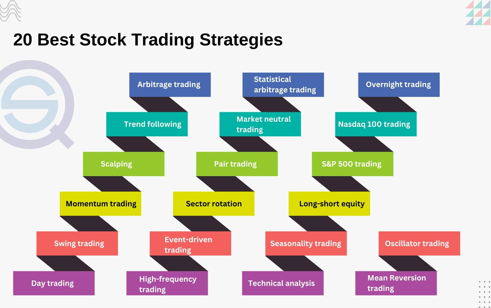

## Table of Contents

## What is a high-stakes stock market investor?

A high-stakes stock market investor is someone who puts a lot of money into the stock market, hoping to make big profits. These investors often take bigger risks than others because they believe they can earn more money that way. They might buy stocks that are very expensive or invest in new companies that could either grow a lot or fail completely.

These investors need to be very careful and smart about their choices. They spend a lot of time studying the market and trying to predict what will happen next. Because they are dealing with large amounts of money, even small mistakes can lead to big losses. But if they make the right choices, they can also see big rewards.

## Why might someone want to emulate high-stakes investors?

Someone might want to emulate high-stakes investors because they see the big profits these investors can make. High-stakes investors often get a lot of attention when they succeed, and this can make their success look very appealing. People might think that if they copy what these investors do, they could also make a lot of money.

However, it's important to understand that high-stakes investing is risky. It's not just about the big wins; there can also be big losses. People might want to learn from high-stakes investors to understand how to manage risk better and make smarter investment choices. But they should be careful and not just copy without understanding the risks involved.

## What are the basic principles of stock market investing?

The first basic principle of stock market investing is understanding that you are buying a small piece of a company when you buy its stock. This means you own a part of the business and can make money if the company does well. The value of the stock goes up and down based on how people think the company is doing. If more people want to buy the stock, its price goes up. If more people want to sell, the price goes down. This is called supply and demand.

Another important principle is diversification. This means not putting all your money into one stock or one type of investment. By spreading your money across different companies and types of investments, you reduce the risk of losing a lot of money if one investment does badly. It's like not putting all your eggs in one basket. Diversification helps you balance the risk and potential reward of your investments.

Lastly, it's crucial to have a long-term perspective. The stock market can go up and down a lot in the short term, but over many years, it tends to grow. Trying to make quick money by buying and selling stocks often can be risky. Instead, many successful investors focus on holding onto their investments for a long time. This way, they can ride out the ups and downs and benefit from the overall growth of the market.

## How can beginners start to analyze stocks like high-stakes investors?

Beginners can start analyzing stocks like high-stakes investors by first learning how to read financial statements. These statements show how much money a company is making, how much it's spending, and how much it owes. By looking at these numbers, beginners can see if a company is healthy and growing. High-stakes investors often look at these numbers to decide if a stock is a good buy. Beginners can use websites and apps that explain these statements in simple terms to get started.

Another important step is to learn about a company's industry and competitors. High-stakes investors don't just look at numbers; they also think about what's happening in the world that could affect the company. For example, if a company makes cars, they'll look at how many cars people are buying, what new technology is coming out, and what other car companies are doing. Beginners can read news articles and industry reports to understand these things better. This helps them see the bigger picture and make smarter choices about which stocks to buy.

Lastly, beginners should practice using stock analysis tools and software. Many of these tools are available online and can help beginners understand how stocks might perform in the future. High-stakes investors use these tools to look at trends and patterns in stock prices. By playing around with these tools, beginners can get a feel for how stocks move and learn to spot good investment opportunities. It's like learning a new game – the more you practice, the better you get.

## What are some common strategies used by high-stakes investors?

High-stakes investors often use a strategy called value investing. This means they look for companies that they think are worth more than their current stock price. They do a lot of research to find these companies, looking at things like how much money the company makes and how much it owes. They believe that if they buy stocks in these undervalued companies and hold onto them for a long time, the stock price will eventually go up as more people realize the company's true value. This can lead to big profits, but it requires patience and a lot of research.

Another common strategy is growth investing. High-stakes investors who use this approach focus on companies that are growing fast. They look for businesses that are getting bigger and making more money each year. These investors are willing to pay more for stocks in these growing companies because they believe the companies will keep growing and the stock price will go up a lot. This strategy can be riskier because if the company stops growing, the stock price can drop quickly. But if the company keeps growing, the rewards can be huge.

Some high-stakes investors also use a strategy called momentum investing. This means they buy stocks that have been going up in price and sell them when they think the price is about to drop. They believe that stocks that are going up will keep going up for a while, and they want to ride that wave. This strategy can be very exciting but also very risky because it's hard to know when the price will stop going up. High-stakes investors who use this approach need to watch the market closely and be ready to make quick decisions.

## How important is risk management in high-stakes investing?

Risk management is very important in high-stakes investing. When you put a lot of money into the stock market, you can lose a lot if things go wrong. High-stakes investors know this, so they spend a lot of time thinking about how to protect their money. They use different ways to manage risk, like not putting all their money into one stock and always having a plan for what to do if the market goes down. This helps them feel more safe and makes it less likely that they will lose everything.

Even though high-stakes investors take big risks, they also try to be smart about it. They look at all the things that could go wrong and try to be ready for them. For example, they might use something called "stop-loss orders" to sell a stock if it drops too much. This way, they can limit how much money they lose on one investment. By managing risk well, high-stakes investors can keep playing the game even if they have some losses along the way.

## What role does market research play in emulating high-stakes investors?

Market research is very important if you want to invest like high-stakes investors. These investors spend a lot of time looking at information about companies and the economy. They read reports, watch the news, and use special tools to understand what is happening in the market. By doing this, they can find good companies to invest in and know when to buy or sell stocks. If you want to be like them, you need to do the same kind of research. This means learning about different industries, understanding financial statements, and keeping up with what is happening in the world that could affect the stock market.

Doing good market research helps you make smarter choices about where to put your money. High-stakes investors use this information to find stocks that are undervalued or companies that are growing fast. They also use it to manage risk, figuring out what could go wrong and how to protect their investments. As a beginner, you can start by reading simple articles and using free online tools to learn about the market. The more you know, the better you can copy the strategies of high-stakes investors and maybe even do as well as they do.

## Can you explain the concept of portfolio diversification from a high-stakes perspective?

Portfolio diversification is really important for high-stakes investors. It means spreading your money across different types of investments instead of putting it all in one place. High-stakes investors know that if they put all their money into one stock or one industry, they could lose a lot if that stock or industry does badly. So, they invest in many different companies and types of investments. This way, if one investment goes down, the others might go up and help balance things out. It's like not putting all your eggs in one basket.

Even though high-stakes investors take big risks, they still use diversification to manage those risks. They might invest in stocks, bonds, real estate, and even things like gold. By having a mix of investments, they can protect their money better. If the stock market goes down, their bonds or real estate might still be doing well. This helps them keep their overall investment safe, even when they're trying to make big profits. Diversification is a key part of their strategy to balance risk and reward.

## How do high-stakes investors use leverage and what are the risks involved?

High-stakes investors use leverage to try to make more money. Leverage means borrowing money to buy more stocks than they could with just their own money. For example, if they have $100,000, they might borrow another $100,000 to buy $200,000 worth of stocks. If the stocks go up, they can make a lot more money because they have more stocks. But if the stocks go down, they still have to pay back the money they borrowed, which can be a big problem.

Using leverage is very risky. If the stocks they buy with borrowed money go down in price, high-stakes investors can lose more than just their own money. They might have to sell their stocks at a loss to pay back the loan, and that can make their losses even bigger. High-stakes investors know this, so they try to be very careful about when and how they use leverage. They study the market a lot and try to make sure they are making smart choices, but there is always a chance that things can go wrong.

## What advanced analytical tools do high-stakes investors typically use?

High-stakes investors often use advanced analytical tools to help them make better decisions. One common tool is called technical analysis software. This software helps them look at charts and patterns in stock prices to figure out when to buy or sell. They can see things like moving averages and trend lines, which show them if a stock is going up or down. Another tool they use is fundamental analysis software. This helps them look at a company's financial statements and other important information to see if the company is a good investment. By using these tools, high-stakes investors can get a lot of information quickly and make smarter choices about their investments.

Another important tool for high-stakes investors is risk management software. This helps them keep track of how much risk they are taking with their investments. They can see how their different investments are doing and make sure they are not too heavily invested in one stock or one type of investment. High-stakes investors also use portfolio management tools to help them keep their investments organized and balanced. These tools can show them how their whole portfolio is doing and help them decide when to buy or sell different stocks. By using these advanced tools, high-stakes investors can manage their money better and try to make the most profit while keeping their risks under control.

## How do high-stakes investors adapt to market volatility?

High-stakes investors know that the stock market can go up and down a lot, and they have ways to deal with this. They watch the market closely and use tools to see what is happening. When the market gets very volatile, they might change their investments to be safer. For example, they might sell some stocks that are going down a lot and buy ones that are more stable. They also use something called "stop-loss orders" to sell a stock if it drops too much, so they don't lose too much money. By doing these things, they can protect their money even when the market is moving a lot.

Another way high-stakes investors handle market volatility is by having a long-term plan. They know that the market can be unpredictable in the short term, but over many years, it tends to grow. So, they focus on holding onto their investments for a long time. They might also spread their money across different types of investments, like stocks, bonds, and real estate. This way, if one type of investment goes down, the others might go up and help balance things out. By staying calm and sticking to their plan, high-stakes investors can ride out the ups and downs of the market and still make money in the long run.

## What are some case studies of successful high-stakes investment strategies?

One famous example of a high-stakes investment strategy is Warren Buffett's investment in Coca-Cola. In the late 1980s, Buffett bought a lot of Coca-Cola stock when it was not doing so well. He believed that the company was worth more than its stock price showed. Over time, Coca-Cola grew and became very successful, and Buffett made a lot of money. He used a strategy called value investing, where he looked for companies that were undervalued and held onto them for a long time. This shows how patience and good research can lead to big profits.

Another example is Peter Lynch's investment in The Limited, a clothing company. In the early 1980s, Lynch saw that The Limited was growing fast and making a lot of money. He decided to buy a lot of its stock, even though it was expensive. This is called growth investing, where you pay more for stocks in companies that are growing quickly. The Limited kept growing, and Lynch made a lot of money from his investment. This case shows how focusing on fast-growing companies can be a successful strategy if you pick the right ones.

A third example is George Soros's famous bet against the British pound in 1992. Soros believed that the British pound was overvalued and would have to drop in value. He borrowed a lot of pounds and sold them, betting that he could buy them back later at a lower price. When the pound did drop, Soros made over a billion dollars. This is an example of using leverage and making a big, risky bet on a currency. It shows how high-stakes investors can make huge profits by taking big risks and being right about their predictions.

## What are Risk Management and Mitigation Strategies?

Effective risk management is a cornerstone of high-stakes investing. Investors must employ a variety of strategies to navigate market volatilities and protect their portfolios from significant losses. Three primary techniques—hedging, the use of stop-loss orders, and diversification—are essential tools for managing risk in this environment.

### Hedging
Hedging involves taking an offsetting position in a related security to mitigate potential losses. This strategy aims to reduce the volatility of an investor’s portfolio, thereby minimizing the impact of adverse market movements. Common hedging instruments include options, futures, and derivatives.

**Options and futures**: These are contracts that provide the investor with the ability—though not the obligation—to buy or sell an asset at a predetermined price. For example, purchasing a put option can protect against potential declines in a stock's price. 

Here's a simple Python example for calculating the payoff of a put option:

```python
def put_option_payoff(stock_price, strike_price, premium):
    return max(strike_price - stock_price, 0) - premium

# Example usage:
stock_price = 95
strike_price = 100
premium = 5
payoff = put_option_payoff(stock_price, strike_price, premium)
print("Put Option Payoff: $", payoff)
```

### Stop-Loss Orders
Stop-loss orders are a critical component of risk management that automatically sell a stock when its price falls to a predetermined level. This technique helps limit losses and takes emotion out of the decision-making process. By setting appropriate stop-loss levels, investors effectively establish a maximum loss threshold they are willing to accept.

### Diversification
Diversification involves spreading investments across various assets to reduce exposure to any single asset or risk. This strategy is based on the principle that not all investments will perform poorly simultaneously. By diversifying across different sectors, industries, and geographic regions, investors reduce the likelihood of significant portfolio losses.

**Mathematical basis**: The concept of diversification is captured through the correlation coefficient ($\rho$) between asset returns. By investing in assets with low or negative correlation, investors can achieve lower overall portfolio risk. The formula for portfolio variance ($\sigma^2_p$) when two assets are involved is given by:

$$
\sigma^2_p = w_1^2 \sigma_1^2 + w_2^2 \sigma_2^2 + 2w_1w_2\rho\sigma_1\sigma_2
$$

where $w_1$ and $w_2$ are the weights of the assets in the portfolio, and $\sigma_1$ and $\sigma_2$ are their respective standard deviations.

In summary, hedging, stop-loss orders, and diversification are indispensable techniques for risk management in high-stakes investing. By effectively implementing these strategies, investors can navigate volatile markets and safeguard their portfolios against substantial losses.

## References & Further Reading

[1]: Bergstra, J., Bardenet, R., Bengio, Y., & Kégl, B. (2011). ["Algorithms for Hyper-Parameter Optimization."](https://dl.acm.org/doi/10.5555/2986459.2986743) Advances in Neural Information Processing Systems 24.

[2]: ["Advances in Financial Machine Learning"](https://www.amazon.com/Advances-Financial-Machine-Learning-Marcos/dp/1119482089) by Marcos Lopez de Prado

[3]: ["Evidence-Based Technical Analysis: Applying the Scientific Method and Statistical Inference to Trading Signals"](https://www.amazon.com/Evidence-Based-Technical-Analysis-Scientific-Statistical/dp/0470008741) by David Aronson

[4]: ["Machine Learning for Algorithmic Trading"](https://github.com/stefan-jansen/machine-learning-for-trading) by Stefan Jansen

[5]: ["Quantitative Trading: How to Build Your Own Algorithmic Trading Business"](https://github.com/LucindaYa/quant-resources/blob/master/Quantitative%20Trading%20How%20to%20Build%20Your%20Own%20Algorithmic%20Trading%20Business.pdf) by Ernest P. Chan