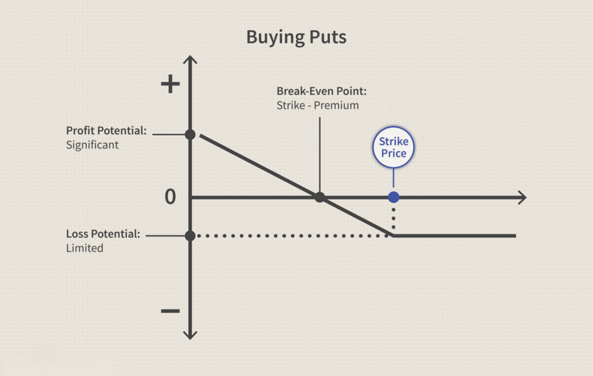

Options trading provides a versatile avenue for engaging with financial markets, enabling participants to speculate on asset price movements, hedge against potential risks, and pursue strategic investments tailored to their financial goals. Unlike traditional stock trading, options offer a unique set of tools that allow traders to construct complex investment strategies with limited capital exposure. The primary instruments in options trading are call and put options, which grant the right to buy or sell the underlying asset at a predetermined price within a specified time frame.

In recent years, the landscape of options trading has dramatically evolved with the advent of algorithmic trading. This technological innovation employs computer algorithms to automate the trading process, enhancing the speed and precision with which trades are executed. Algorithmic trading systems can process and analyze vast quantities of data in real-time, enabling traders to exploit market inefficiencies and capitalize on fleeting opportunities that manual trading methods might miss. This transformation has significantly impacted the efficiency of the options market, making it more accessible and appealing to a broader range of participants.



Algorithmic trading strategies in options markets leverage quantitative techniques and pre-defined parameters to guide decision-making processes. These algorithms can be programmed to respond to specific market conditions, such as volatility spikes or trend shifts, with minimal human intervention. As a result, traders can maintain a consistent and disciplined approach to trading while mitigating the emotional biases that often plague manual trading efforts. With the integration of algorithmic systems, the options trading landscape continues to expand, offering new possibilities for both individual and institutional investors seeking to optimize their market participation.

## Table of Contents

## Understanding Stock Options

Options are financial instruments essential to modern trading, granting the holder specific rights without imposing obligatory actions. These derivatives are fundamentally categorized into two varieties: call options and put options.

A call option offers the holder the right, though not the obligation, to purchase a particular stock at a predetermined price within a specific time frame. This predetermined price is termed the strike price. For instance, if an investor holds a call option with a strike price of $50 on a stock currently trading at $60, exercising the option would allow purchasing the stock at the favorable price of $50.

Conversely, a put option provides the right to sell a stock at a designated strike price before the option's expiration. Utilizing the previous example, if an investor owns a put option with a strike price of $50 on a stock currently valued at $40, executing the option would enable selling the stock at $50, above its current market value.

Both call and put options constitute essential components of options contracts, defined by several parameters, including strike price, expiration date, and premium. The premium represents the price paid by the option buyer to the option seller for the rights conferred by the option.

Understanding the intrinsic and extrinsic values of options is crucial. The intrinsic value of a call option is the difference between the current stock price and the strike price ($\text{max}(0, S - K)$), while for a put option, it's the strike price minus the stock price ($\text{max}(0, K - S)$), where $S$ is the stock price, and $K$ is the strike price. Extrinsic value, or time value, accounts for the remaining value of an option beyond its intrinsic value, influenced by the time left until expiration and the stock's [volatility](/wiki/volatility-trading-strategies).

In sum, stock options offer flexibility and strategic opportunities for investors to engage in either bullish or bearish market perspectives. Comprehension of how call and put options function is fundamental to employing them effectively in investment strategies.

## Basic Options Trading Strategies

Options trading involves various strategies, each tailored to different market conditions and investor objectives. Basic strategies often serve as the building blocks for more complex trades. Understanding these strategies is crucial for maximizing profitability and managing risk in options trading. 

Buying call options is a fundamental strategy used by traders anticipating a rise in the price of the underlying asset. A call option grants the buyer the right, but not the obligation, to purchase the underlying asset at a specified price, known as the strike price, before the option's expiration. Investors capitalize on the leverage provided by options, where a smaller initial capital outlay can lead to significant gains if the market moves favorably. Conversely, if the asset's price does not reach the strike price before expiration, the trader risks losing the premium paid for the option.

Similarly, buying put options allows the trader to profit from a decline in the underlying asset's price. A put option gives the trader the right to sell the asset at the predetermined strike price within a specified period. This strategy is often used as a hedge against potential losses in an investment portfolio. If the asset's market value falls below the strike price, the trader can either sell the option at a profit or exercise it to sell the underlying asset at a more favorable price.

Covered calls are a popular strategy among investors looking to generate additional income from their portfolios. This involves holding a long position in an asset while simultaneously selling call options on the same asset. The premium received from selling the call options provides income, which can offset potential downsides. However, if the asset price rises significantly, the seller may have to part with the stock at a lower price than the current market value, capping the upside potential.

Protective puts serve as a form of insurance for investors. This strategy requires buying put options for assets already owned. Should the asset's price drop, the losses incurred from the price decrease can be mitigated by the gains from the put options. This strategy is beneficial in volatile markets, providing a safety net while retaining the potential for profits if the market turns favorable.

Each of these basic options trading strategies can be adapted and combined to align with specific market expectations and risk appetites. By mastering these foundational techniques, traders position themselves to better navigate the complexities of options trading.

## Advanced Options Strategies

Advanced options strategies are employed by traders to navigate complex market conditions, often characterized by uncertainty or volatility. These strategies typically involve taking multiple options positions simultaneously, allowing traders to hedge against risks or seek enhanced returns.

### Long Straddles

A long straddle strategy involves purchasing both a call option and a put option on the same underlying asset, with identical strike prices and expiration dates. This strategy is typically used when a trader anticipates significant price movement in the underlying asset but is uncertain about the direction of the movement.

The formula for the payoff of a long straddle at expiration is:

$$
\text{Payoff} = \max(0, S_t - K) + \max(0, K - S_t) - C - P
$$

where:
- $S_t$ is the stock price at expiration,
- $K$ is the strike price,
- $C$ is the cost of the call option,
- $P$ is the cost of the put option.

### Strangles

Similar to straddles, strangles involve purchasing both a call and a put option, but with different strike prices. The call option has a higher strike price than the put option. This strategy requires less premium than a straddle and is profitable when the underlying asset exhibits large price movements. The trade-off is a narrower profitable range of movement compared to a straddle.

The formula for the payoff of a long strangle at expiration is:

$$
\text{Payoff} = \max(0, S_t - K_1) + \max(0, K_2 - S_t) - C - P
$$

where:
- $K_1$ is the strike price of the call option,
- $K_2$ is the strike price of the put option.

### Spreads

Option spreads involve taking multiple positions to achieve specific risk-reward profiles. There are various types of spreads:

#### Bull Call Spread

A bull call spread is created by buying a call option with a lower strike price while selling another call option on the same asset with a higher strike price. This strategy minimizes risk and cost but also limits potential profits.

#### Bear Put Spread

Conversely, a bear put spread involves buying a put option with a higher strike price and selling another put option with a lower strike price. This strategy benefits from a decline in the underlying asset’s price, with reduced risk and premium expense compared to outright put purchases.

#### Iron Condor

An iron condor combines a bull put spread and a bear call spread, effectively making four transactions: selling one call at a lower strike, buying one call at a higher strike, selling one put at a higher strike, and buying another put at a lower strike. This strategy profits when the underlying asset remains within a particular price range.

Python code to visualize a basic long straddle payoff might look like this:

```python
import numpy as np
import matplotlib.pyplot as plt

# Parameters
strike_price = 100
premium_call = 10
premium_put = 10
price_range = np.arange(50, 150, 1)

# Payoff calculation
payoff_call = np.maximum(price_range - strike_price, 0) - premium_call
payoff_put = np.maximum(strike_price - price_range, 0) - premium_put
payoff_straddle = payoff_call + payoff_put

# Plotting
plt.figure(figsize=(8, 5))
plt.plot(price_range, payoff_call, '--', label='Call Payoff')
plt.plot(price_range, payoff_put, '--', label='Put Payoff')
plt.plot(price_range, payoff_straddle, label='Straddle Payoff')
plt.axhline(0, color='black', lw=1)
plt.title('Long Straddle Payoff Diagram')
plt.xlabel('Stock Price at Expiration')
plt.ylabel('Profit / Loss')
plt.legend()
plt.grid(True)
plt.show()
```

Incorporating advanced strategies like these allows traders to tailor their approaches to market forecasts, risk appetite, and financial goals. They demand a refined understanding of options pricing and market dynamics but offer numerous opportunities to exploit sophisticated market conditions effectively.

## The Rise of Algorithmic Trading in Options

Algorithmic trading has significantly changed options trading, driven by the need for speed, efficiency, and precision in executing trades. This method relies on sophisticated computer algorithms to perform transactions based on specific predefined rules and criteria. Unlike traditional trading methods that heavily depend on human judgment, [algorithmic trading](/wiki/algorithmic-trading) effectively minimizes emotional biases, which can often lead to impulsive and irrational decision-making.

A key advantage of algorithmic trading is its ability to execute trades at unparalleled speeds, a critical [factor](/wiki/factor-investing) in the fast-paced options market where price movements happen in milliseconds. The algorithms can quickly process vast amounts of market data, scanning for and executing trades almost instantaneously upon identifying opportunities. This rapid execution ability allows traders to capitalize on even the smallest price discrepancies, which is often impossible with manual trading.

Moreover, algorithmic trading facilitates extensive [backtesting](/wiki/backtesting). This process involves the simulation of trading strategies using historical data to evaluate their potential effectiveness before actual implementation. Through backtesting, traders can assess the performance of their strategies under various market conditions and modify them accordingly, reducing risk and improving potential profitability.

The application of precise algorithms in options trading often includes strategies like market-making and [arbitrage](/wiki/arbitrage). In market-making, algorithms help provide [liquidity](/wiki/liquidity-risk-premium) by quoting both buy and sell prices, thereby smoothing market operations. Arbitrage algorithms exploit price differentials between different markets or instruments, ensuring consistency in pricing across markets and contributing to market efficiency.

Python has become one of the preferred languages for developing algorithmic trading strategies due to its extensive libraries and simplicity. Libraries such as NumPy and pandas facilitate numerical computations and data analysis, respectively. The following is a basic example of a Python algorithm that could be used to backtest a trading strategy:

```python
import pandas as pd

# Load historical data
data = pd.read_csv('options_data.csv')

# Define a simple moving average strategy
def moving_average_strategy(data, short_window, long_window):
    data['Short_MA'] = data['Close'].rolling(window=short_window, min_periods=1).mean()
    data['Long_MA'] = data['Close'].rolling(window=long_window, min_periods=1).mean()

    data['Signal'] = 0
    data['Signal'][short_window:] = np.where(data['Short_MA'][short_window:] > data['Long_MA'][short_window:], 1, 0)
    data['Position'] = data['Signal'].diff()

    return data

# Apply the strategy
strategy_data = moving_average_strategy(data, short_window=5, long_window=20)
```

This example demonstrates how traders can use Python to develop and test strategies efficiently before deploying them in real trading scenarios.

The rise of algorithmic trading in options is a testament to the ongoing evolution of financial markets. It represents a shift towards more data-driven decision-making processes, where technology not only augments human capability but also acts autonomously to optimize trade execution and outcomes.

## Popular Algorithmic Trading Strategies

Algorithmic trading strategies leverage sophisticated algorithms to automate the investment process, offering a systematic approach to trading that can optimize decision-making and execution. Among the many strategies employed in algorithmic trading, several stand out due to their effectiveness in capitalizing on market opportunities. These include trend-following, arbitrage opportunities, mean reversion, and the time-weighted average price (TWAP) strategy.

### Trend-Following Strategy

The trend-following strategy seeks to capitalize on an asset's [momentum](/wiki/momentum) by buying when prices are rising and selling when they are falling. This strategy is based on the principle that prices are more likely to continue in the same direction than to reverse. Trend-following can be implemented using simple moving averages (SMA) or exponential moving averages (EMA) to identify the direction of the trend.

For a simple moving average crossover, a buy signal may be generated when a short-term SMA crosses above a long-term SMA, indicating an upward trend. Conversely, a sell signal occurs when the short-term SMA crosses below the long-term SMA.

```python
import pandas as pd
import numpy as np

def moving_average_strategy(prices, short_window=40, long_window=100):
    signals = pd.DataFrame(index=prices.index)
    signals['price'] = prices
    signals['short_mavg'] = prices.rolling(window=short_window, min_periods=1, center=False).mean()
    signals['long_mavg'] = prices.rolling(window=long_window, min_periods=1, center=False).mean()
    signals['signal'] = 0.0
    signals['signal'][short_window:] = np.where(signals['short_mavg'][short_window:] > signals['long_mavg'][short_window:], 1.0, 0.0)
    signals['positions'] = signals['signal'].diff()
    return signals
```

### Arbitrage Opportunities

Arbitrage strategies exploit price discrepancies between markets or instruments to secure risk-free profits. In options trading, this may involve identifying mispriced options relative to the underlying assets or other options. A classic example is the "put-call parity" in options, which posits that the price of a call option implies a certain fair price for the corresponding put option or vice versa.

Arbitrage requires real-time data and quick execution as these opportunities are typically short-lived and can be swiftly corrected by the market.

### Mean Reversion Strategy

Mean reversion strategies are based on the idea that asset prices and their returns tend to move back towards the mean or average. This strategy assumes that if the price deviates significantly from the historical average, it will eventually revert to its mean.

Identifying mean reversion opportunities often involves statistical metrics such as the z-score or Bollinger Bands. The z-score measures how many standard deviations an element is from the mean, while Bollinger Bands use moving averages and standard deviations to define upper and lower price levels.

```python
def mean_reversion_strategy(prices, window=20, num_std_dev=2):
    signals = pd.DataFrame(index=prices.index)
    signals['price'] = prices
    signals['mean'] = prices.rolling(window=window).mean()
    signals['std_dev'] = prices.rolling(window=window).std()
    signals['upper_band'] = signals['mean'] + num_std_dev * signals['std_dev']
    signals['lower_band'] = signals['mean'] - num_std_dev * signals['std_dev']
    signals['signal'] = 0.0
    signals['signal'][prices > signals['upper_band']] = -1.0  # Sell signal
    signals['signal'][prices < signals['lower_band']] = 1.0   # Buy signal
    signals['positions'] = signals['signal'].diff()
    return signals
```

### Time-Weighted Average Price (TWAP) Strategy

The TWAP strategy seeks to execute a trade in smaller portions over a specified period at a price close to the average of all prices during that period. This strategy incurs minimal market impact and is used by large institutional investors to manage the execution risk of large orders.

TWAP minimizes the price impact on the market by spreading the order execution uniformly throughout a specified period. It assumes a more predictable asset price movement, especially in less volatile markets.

Each of these strategies presents opportunities to exploit different facets of market behavior, offering traders a diversified toolkit to optimize their trading performance. By automating these strategies, traders can enhance speed, reduce emotional decision-making, and maintain disciplined trade execution.

## Developing an Options Trading Algo

Creating a successful algorithmic trading strategy for options involves several critical steps: defining investment goals, selecting appropriate options strategies, analyzing market data, and establishing robust risk management techniques. This structured approach ensures that traders can harness the benefits of algorithmic systems effectively while maintaining control over potential pitfalls.

### Defining Investment Goals

The first step is to clearly define investment goals, which guide the development process. These goals can range from maximizing returns, reducing risks, achieving steady income, or even benefitting from market volatility. Each goal will influence the choice of options strategies and trading algorithms.

### Choosing Suitable Options Strategies

Options strategies must align with the defined investment goals. Commonly used strategies include:

1. **Covered Calls**: Writing call options against owned stocks to generate additional income.
2. **Protective Puts**: Purchasing puts to hedge against potential losses in a stock portfolio.
3. **Straddles and Strangles**: Used to profit from significant price changes irrespective of direction. 

Each strategy requires specific algorithmic considerations tailored to exploit particular market scenarios.

### Analyzing Market Data

Accurate and timely market data analysis is crucial for the success of an algorithmic trading strategy. This analysis involves:

- **Data Collection**: Gathering historical and real-time data on stock prices, volatility indices, and options prices from reliable sources.
- **Pattern Recognition**: Utilizing statistical methods or machine learning models to identify patterns and predict future price movements.

Python, with its rich set of libraries like `pandas` for data manipulation, `numpy` for numerical analysis, and `scikit-learn` for [machine learning](/wiki/machine-learning), provides a robust ecosystem for market data analysis:

```python
import pandas as pd
import numpy as np
from sklearn.linear_model import LinearRegression

# Example: Simple Linear Regression for forecasting prices
data = pd.read_csv('market_data.csv')
X = data['Time'].values.reshape(-1, 1)
y = data['Price'].values

model = LinearRegression()
model.fit(X, y)
prediction = model.predict(np.array([[future_time]]))
```

### Implementing Robust Risk Management Techniques

Risk management is paramount in options trading due to inherent market volatility. Effective risk management techniques include:

- **Diversification**: Spreading investment across different assets or option types to minimize exposure to any single asset.
- **Position Sizing**: Calculating the appropriate amount to invest based on risk appetite and market conditions, often using algorithms to adjust sizes dynamically.
- **Stop Loss and Take Profit Levels**: Automating the process to exit trades at predetermined levels to protect profits and limit losses.

The use of algorithms in trading provides a means to automate these techniques, ensuring consistency and precision unattainable through manual trading. For instance, setting automated triggers for stop loss and take profit via a trading platform's API can ensure disciplined adherence to the strategy.

In conclusion, developing an options trading algo is a meticulous process that combines the strategic choice of options strategies with rigorous data analysis and disciplined risk management. This holistic approach allows traders to navigate the complexities of the options market effectively, leveraging the speed and efficiency of algorithmic systems.

## Risks and Challenges in Algo Options Trading

Algorithmic options trading, while advantageous, presents several challenges that traders must navigate to ensure effective and profitable operations. One of the foremost challenges is the requirement for substantial programming skills. Traders need to possess proficiency in programming languages such as Python or C++ to design, implement, and maintain sophisticated trading algorithms. These skills are essential for developing and debugging code that can manage complex trading strategies.

Access to high-quality, real-time data is another critical challenge in algorithmic options trading. Successful algorithmic strategies rely on the ability to process vast and precise datasets promptly. Latency in data access can lead to suboptimal trading decisions and missed opportunities. Thus, investing in robust data infrastructure and fast data feeds is crucial for maintaining a competitive edge.

Market events that are unforeseen or extreme, often referred to as "black swan" events, pose significant risks to algorithmic systems. These events can lead to rapid and unpredictable market movements that exceed the parameters defined in a trading algorithm. Strategies that rely heavily on historical data for predictions may falter in such conditions, leading to substantial financial loss. Therefore, incorporating contingency measures within algorithms, such as stop-loss orders or volatility adjustments, is vital for risk mitigation.

Risk management is a key component of algo trading to safeguard against these vulnerabilities. Implementing robust risk management techniques involves setting appropriate leverage levels, diversifying trading strategies, and continuously monitoring market conditions. Algorithmic traders must regularly backtest strategies in varied historical conditions to ensure their resilience in unpredictable environments.

In summary, while algorithmic options trading offers speed and efficiency, traders must commit to continual learning and adaptation. By developing strong programming skills, ensuring data integrity, and preparing for market anomalies, traders can effectively manage the inherent risks and capitalize on the opportunities presented by algorithmic systems.

## Future of Options Trading with AI and Machine Learning

The incorporation of [artificial intelligence](/wiki/ai-artificial-intelligence) (AI) and machine learning into options trading algorithms has sparked a transformation in the financial markets by enabling more sophisticated and adaptive trading strategies. Unlike traditional algorithmic trading, which relies on predefined rules, AI-based systems have the ability to learn from historical data, adapt to new information, and optimize decision-making processes in real-time market conditions.

AI and machine learning algorithms can process vast amounts of data far beyond human capabilities. This enables these systems to identify patterns and trends that may be indicative of future market movements, thereby enhancing predictive accuracy. Machine learning models such as neural networks, decision trees, and [reinforcement learning](/wiki/reinforcement-learning) are particularly suited for this task. Neural networks, for instance, are designed to mimic the human brain's interconnected neuron architecture and excel at recognizing complex patterns within datasets, making them ideal for analyzing financial data.

One crucial advantage of using AI in options trading is its ability to implement reinforcement learning, where algorithms learn to make decisions by being rewarded for correct predictions or penalized for poor ones. This iterative learning process allows the algorithm to continuously improve its trading strategies based on past performance. Python's 'TensorFlow' and 'PyTorch' libraries offer powerful tools for developing such reinforcement learning models.

The potential for AI to optimize hedging strategies is also significant. For example, by simulating countless scenarios, AI can construct hedging tactics that minimize risk while maintaining the potential for profit. AI-driven models can dynamically adjust hedging positions to respond to market volatility, thus providing more reliable risk management for options portfolios.

Moreover, the application of AI in natural language processing (NLP) offers additional insights by analyzing news articles, reports, and social media, to gauge market sentiment and predict its impact on options pricing. By integrating sentiment analysis, traders can anticipate potential market changes affecting underlying assets and options contracts.

As AI and machine learning technology advance, their integration with options trading algorithms is likely to further enhance their capability to operate in real-time, capturing fleeting arbitrage opportunities and adjusting strategies in milliseconds to capitalize on volatile market conditions. However, these developments also necessitate robust safeguards against algorithmic bias and market manipulation risks, ensuring that AI-driven trading systems operate both effectively and ethically.

The expansion of cloud computing and the availability of large-scale data sets make the future of AI in options trading promising, paving the way for increased accessibility and democratization of high-frequency trading strategies. Meanwhile, regulatory frameworks will need to evolve to address the complexities and ensure fair play in an AI-dominated trading ecosystem. As AI continues to grow more sophisticated, it holds immense potential to redefine how options trading strategies are developed and executed, steering toward a future where intelligent systems play a central role in financial decision-making.

## Conclusion

Options trading, when combined with algorithmic systems, offers a potent mechanism for traders aiming to manage risk and seize market opportunities efficiently. The synergy between options trading and algorithmic technology allows for more sophisticated and precise trading strategies that adapt to fluctuating market conditions. By automating decision-making processes, traders can enhance execution speed, reduce human errors, and apply rigorous data analysis to their strategies. 

As technology in the financial sector continues to evolve, the interdependence between options trading and algorithmic tools is expected to deepen. Advances in computing power, data availability, and analytical capabilities will further empower traders to uncover insights and capitalize on favorable trading conditions with greater agility. With the increasing adoption of AI and machine learning, trading systems are progressively becoming more intelligent, offering features that facilitate continuous learning and optimization of performance in real-time environments.

Traders and investors who embrace these technological advancements stand to benefit from enhanced decision-making capabilities and the ability to leverage sophisticated models that account for complex market dynamics. This confluence of finance and technology heralds a future where algorithmic systems are not just auxiliary tools but essential components of a trader's strategy, shaping the landscape of options trading and financial markets at large.

## References & Further Reading

[1]: Engle, R. F. (1982). ["Autoregressive Conditional Heteroscedasticity with Estimates of the Variance of United Kingdom Inflation."](https://www.semanticscholar.org/paper/Autoregressive-conditional-heteroscedasticity-with-Engle/2ee6cb87fc81ecd78d161c4a92c9dfce00c8961c) Econometrica, 50(4), 987–1007.

[2]: Corsi, F. (2009). ["A simple approximate long-memory model of realized volatility."](https://academic.oup.com/jfec/article-abstract/7/2/174/856522) The Review of Financial Studies, 22(6), 2421-2456.

[3]: Black, F., & Scholes, M. (1973). ["The Pricing of Options and Corporate Liabilities."](https://www.cs.princeton.edu/courses/archive/fall09/cos323/papers/black_scholes73.pdf) The Journal of Political Economy, 81(3), 637-654.

[4]: "Algorithmic Trading and DMA: An introduction to direct access trading strategies" by Barry Johnson

[5]: "Options, Futures, and Other Derivatives" by John C. Hull

[6]: Chan, E. P. (2013). ["Algorithmic Trading: Winning Strategies and Their Rationale."](https://github.com/ftvision/quant_trading_echan_book) 

[7]: Bodie, Z., Kane, A., & Marcus, A. J. (2018). "Investments" (11th edition). McGraw-Hill Education.