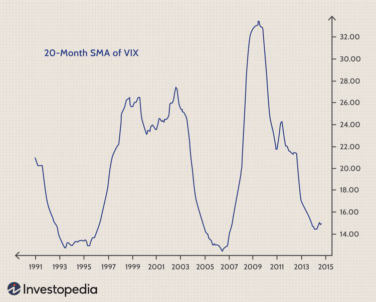

## Table of Contents

## What is the VIX Index and how does it measure market volatility?

The VIX Index, also known as the "fear gauge," is a tool used to measure the expected volatility of the stock market over the next 30 days. It is calculated by the Chicago Board Options Exchange (CBOE) and looks at the prices of options on the S&P 500, which are contracts that give investors the right to buy or sell the index at a specific price. The VIX essentially reflects how much investors are willing to pay for protection against future market swings. A higher VIX number means people expect bigger swings in the market, indicating more fear or uncertainty.

When the VIX is high, it often means that investors are worried about the future and expect the market to move a lot, either up or down. This can happen during times of economic uncertainty, like during a financial crisis or when there are big political events. On the other hand, when the VIX is low, it suggests that investors are feeling more calm and expect the market to stay pretty stable. So, the VIX helps investors understand the mood of the market and make decisions about their investments based on how much risk they think there will be in the near future.

## Why is the VIX Index important for traders and investors?

The VIX Index is important for traders and investors because it gives them a way to see how scared or calm the market is. It tells them if people are expecting big changes in the stock market soon. If the VIX is high, it means people are worried and expect the market to move a lot. This can help traders and investors decide if they should be careful with their money or if they should take more risks. For example, if the VIX is high, they might want to protect their investments by buying options or other safety measures.

Also, the VIX can help investors understand what other people in the market are thinking. If the VIX goes up suddenly, it might mean something big is happening that could affect the stock market. This can be useful information for making smart choices about buying or selling stocks. By keeping an eye on the VIX, investors can get a better sense of the overall mood of the market and adjust their strategies accordingly.

## How can beginners use the VIX to gauge market sentiment?

For beginners, the VIX can be a helpful tool to understand how nervous or calm the stock market is feeling. The VIX is a number that shows how much people expect the market to move in the next 30 days. If the VIX is high, it means people are worried and expect big changes in the market. If it's low, it means people are feeling more relaxed and expect the market to stay pretty steady. By looking at the VIX, beginners can get a sense of whether the market is scared or not, which can help them decide if it's a good time to buy or sell stocks.

Beginners can also use the VIX to see if something big is happening in the market. If the VIX suddenly jumps up, it might mean there's some big news or event that's making people worried. This can be a signal for beginners to be careful with their investments or maybe even take some steps to protect their money. By keeping an eye on the VIX, beginners can start to understand the overall mood of the market and make better decisions about their investments.

## What are the basic trading strategies that involve the VIX?

One basic trading strategy that involves the VIX is to use it as a signal for buying or selling stocks. If the VIX is high, it means people are scared and expect big changes in the market. This might be a good time to buy stocks because when the market calms down, stock prices could go up. On the other hand, if the VIX is low, it means people are feeling calm and expect the market to stay steady. This might be a good time to sell some stocks and take profits before the market gets too calm.

Another strategy is to use VIX-related products, like VIX futures or options, to protect your investments. If you think the market is going to get more volatile, you can buy VIX futures or options. These can help you make money if the VIX goes up, which can offset losses in your stock portfolio. This is like buying insurance for your investments. It's a way to feel safer when the market is acting crazy.

Lastly, some traders use the VIX to do something called "mean reversion" trading. This means they bet that if the VIX is really high, it will eventually come back down to a more normal level. So, they might sell VIX futures or options when the VIX is high, expecting to buy them back later at a lower price. This can be a way to make money from the VIX going back to normal after a big spike.

## How can the VIX be used to hedge a portfolio against market downturns?

The VIX can be used to hedge a portfolio against market downturns by buying VIX-related products like futures or options. When the market gets really scared and the VIX goes up, these products can go up in value too. So, if your stocks start to lose money because the market is going down, the money you make from the VIX products can help make up for those losses. It's like having insurance for your investments. If you think the market might get more volatile soon, you can buy these VIX products to protect your portfolio.

For example, if you own a bunch of stocks and you're worried about a big drop in the market, you can buy VIX call options. These options will increase in value if the VIX goes up, which usually happens when the market is falling. So, even if your stocks go down, the VIX options can go up and help balance out your losses. This way, you can feel safer knowing that you have a way to protect your money when things get rough in the market.

## What are the differences between trading VIX futures and options?

Trading VIX futures and trading VIX options are two different ways to bet on how scared or calm the stock market will be. VIX futures are contracts where you agree to buy or sell the VIX at a certain price on a specific date in the future. If you think the market will get more scared and the VIX will go up, you can buy VIX futures. If you think the market will calm down and the VIX will go down, you can sell VIX futures. The big thing about futures is that they can move a lot, so they can be riskier but also give you a chance to make more money.

VIX options, on the other hand, give you the right, but not the obligation, to buy or sell the VIX at a certain price before a certain date. There are two types of VIX options: calls and puts. Call options let you buy the VIX if it goes up, and put options let you sell the VIX if it goes down. Options can be less risky than futures because you don't have to buy or sell if the VIX doesn't move the way you thought it would. But, options can also be more complicated because you have to think about things like the price of the option itself and how much time is left before it expires.

## How do seasoned traders interpret VIX spikes and troughs for trading decisions?

Seasoned traders pay close attention to VIX spikes and troughs because they can tell them a lot about what might happen in the stock market. When the VIX spikes suddenly and gets really high, it means people are getting scared and expect big changes in the market soon. Traders might see this as a sign that it's time to be careful. They might decide to sell some of their stocks to avoid losing money if the market goes down. Or, if they think the market will calm down after the scare, they might buy stocks because they could go up in value when things settle down.

On the other hand, when the VIX goes down and stays low for a while, it means people are feeling calm and expect the market to stay pretty steady. Traders might see this as a good time to take some risks. They might buy more stocks or other investments because they think the market will keep going up. But, if the VIX stays too low for too long, some traders might get worried that the market is too calm and could be due for a big move. They might decide to protect their investments by buying VIX options or futures, just in case the market gets scared again.

## What technical indicators complement VIX analysis for more advanced trading strategies?

Seasoned traders often use technical indicators like the Moving Average Convergence Divergence (MACD) and the Relative Strength Index (RSI) to complement their VIX analysis. The MACD helps traders see if the market is getting stronger or weaker by looking at the difference between two moving averages. When the MACD line crosses above the signal line, it might be a good time to buy because the market could be getting stronger. When it crosses below, it might be a good time to sell because the market could be getting weaker. This can help traders decide when to act based on the VIX, especially if they see big changes in the VIX and the MACD is moving in the same direction.

Another useful indicator is the RSI, which measures how fast and how much a stock or the market is moving. The RSI ranges from 0 to 100, and when it's over 70, it means the market might be overbought and could go down soon. When it's under 30, it means the market might be oversold and could go up soon. Traders can use the RSI to see if the market is ready for a big change, which can be especially helpful when the VIX is showing signs of fear or calm. By combining the RSI with VIX analysis, traders can get a better sense of when to buy or sell to make the most of their investments.

## How can one use the VIX in conjunction with other volatility indices for a comprehensive market view?

Using the VIX along with other [volatility](/wiki/volatility-trading-strategies) indices can give traders and investors a fuller picture of what's happening in the market. The VIX focuses on the expected volatility of the S&P 500 over the next 30 days. But there are other indices, like the VXN which looks at the Nasdaq-100, or the VXD which focuses on the Dow Jones Industrial Average. By looking at these different indices, you can see how volatility is spread across different parts of the market. For example, if the VIX is high but the VXN is low, it might mean that people are more worried about big companies in the S&P 500 than tech companies in the Nasdaq-100.

Combining these indices can help you understand the overall mood of the market better. If all the volatility indices are high at the same time, it's a strong sign that the whole market is feeling scared and expecting big changes. On the other hand, if they're all low, it means the market is feeling calm and expecting things to stay pretty steady. By keeping an eye on these different indices, you can make smarter decisions about when to buy or sell, and how to protect your investments from big swings in the market.

## What are the risks associated with trading VIX-related products, and how can they be mitigated?

Trading VIX-related products like futures and options can be risky because they can move a lot and be hard to predict. The VIX itself is based on how scared people are about the market, and that can change really fast. If you're not careful, you could lose a lot of money if the VIX doesn't move the way you thought it would. Also, VIX products can be complicated, and if you don't understand them well, you might make mistakes that cost you money.

To lower these risks, it's important to learn as much as you can about how VIX products work. Start with small amounts of money so you don't lose too much if things go wrong. It's also a good idea to use stop-loss orders, which automatically sell your VIX products if they start to lose too much value. This can help you limit your losses. And remember, don't put all your money into VIX products. Spread your investments around so that if one thing goes bad, you still have other investments to fall back on.

## How do institutional investors utilize the VIX for complex trading strategies?

Institutional investors use the VIX to create complex trading strategies that help them manage risk and make money. They often use VIX futures and options to hedge their big portfolios. For example, if they think the market might get more volatile, they can buy VIX futures or call options. This can help them make money if the VIX goes up, which can balance out any losses they might have in their stock investments. They also use VIX products to take advantage of big changes in the market. If they see the VIX spiking, they might sell VIX futures, expecting to buy them back later at a lower price when things calm down.

Another way institutional investors use the VIX is by creating strategies that involve multiple volatility indices. They look at the VIX, VXN, and VXD together to get a full picture of market volatility across different sectors. If they see that the VIX and VXN are both high but the VXD is low, they might decide to adjust their investments in tech stocks differently than in big industrial companies. They also use advanced technical indicators like MACD and RSI along with the VIX to make more informed trading decisions. By combining all this information, they can create complex strategies that help them manage risk and find opportunities in the market.

## What are the latest academic and practical developments in using the VIX for trading volatility?

Academics and traders have been looking at new ways to use the VIX to understand and trade market volatility. One big development is the use of [machine learning](/wiki/machine-learning) and [artificial intelligence](/wiki/ai-artificial-intelligence) to predict VIX movements. These new tools can look at a lot of data really fast, including the VIX, other volatility indices, and even news and social media. By finding patterns that people might miss, these AI systems can help traders make better guesses about where the VIX is going next. This can help them decide when to buy or sell VIX-related products to make money or protect their investments.

In practice, traders are also using the VIX in more complex ways to create new trading strategies. One popular approach is to use the VIX along with other volatility indices like the VXN and VXD to get a fuller picture of the market. By comparing these indices, traders can see if different parts of the market are expecting different levels of volatility. This can help them adjust their investments more carefully. Another practical development is the use of VIX options and futures for more than just hedging. Traders are using these products to make bets on how the VIX will move, trying to make money from both big spikes and drops in the VIX.

## References & Further Reading

[1]: Whaley, R. E. (2000). ["The Investor Fear Gauge."](https://www.semanticscholar.org/paper/The-Investor-Fear-Gauge-Whaley/37ea262fb99beb8bf9dcb8406400d491aab40a0b) Journal of Portfolio Management, 26(3), 12-17.

[2]: ["The Volatility Surface: A Practitioner's Guide"](https://www.amazon.com/Volatility-Surface-Practitioners-Guide/dp/0471792519) by Jim Gatheral

[3]: Black, F., & Scholes, M. (1973). ["The Pricing of Options and Corporate Liabilities."](https://www.cs.princeton.edu/courses/archive/fall09/cos323/papers/black_scholes73.pdf) The Journal of Political Economy, 81(3), 637-654.

[4]: CBOE VIX White Paper. ["The CBOE Volatility Index - VIX."](https://cdn.cboe.com/api/global/us_indices/governance/Volatility_Index_Methodology_Cboe_Volatility_Index.pdf) Chicago Board Options Exchange.

[5]: Sinclair, E. (2013). ["Volatility Trading, Second Edition."](https://onlinelibrary.wiley.com/doi/book/10.1002/9781118662724) Wiley Trading.